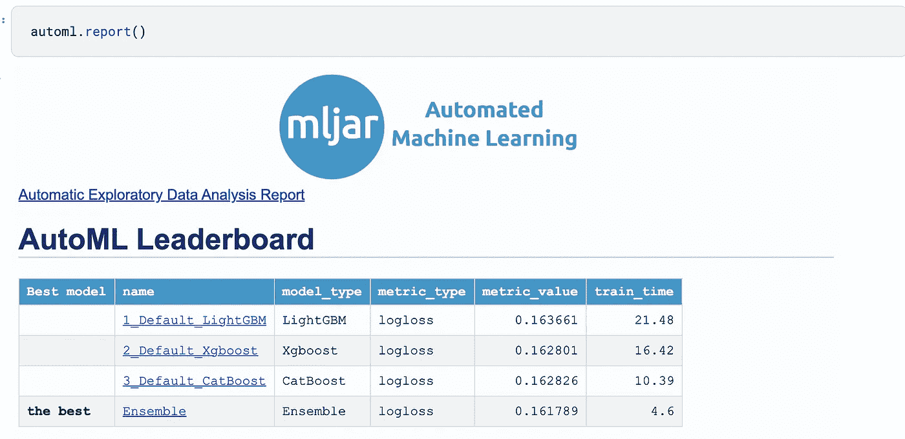
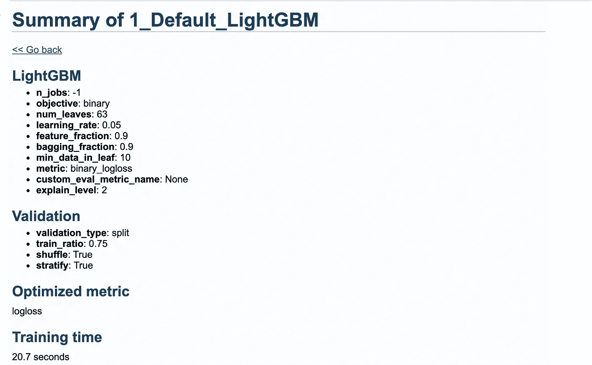
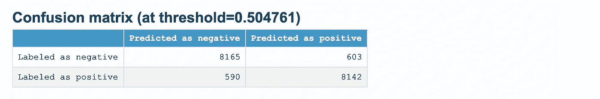
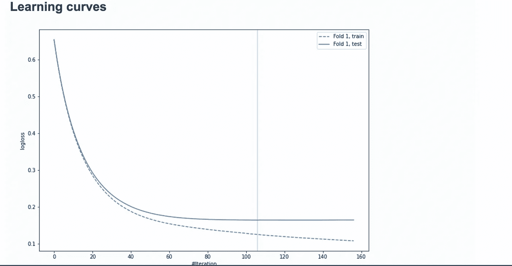
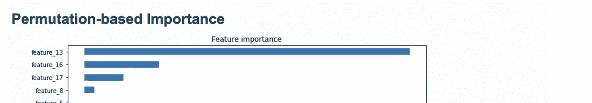
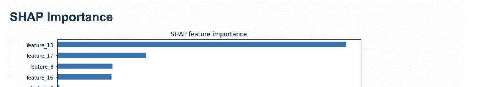
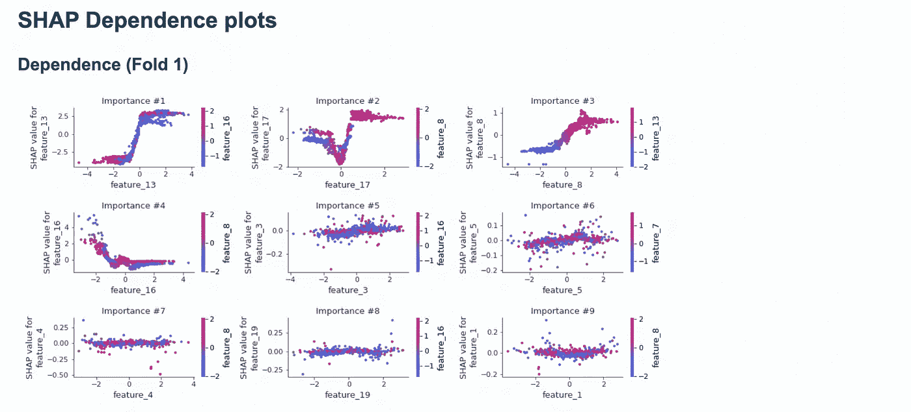

# 基于自动机器学习的二元分类

> 原文：<https://towardsdatascience.com/binary-classification-with-automated-machine-learning-1a36e78ba50f?source=collection_archive---------26----------------------->

## 使用开源的 MLJAR auto-ML 更快地构建精确的模型

自动化[机器学习](https://www.machinelearningnuggets.com/)工具的兴起让开发者能够更快地建立准确的机器学习模型。这些工具通过执行特征工程、算法选择、调整以及记录模型来减少工程师的工作。一个这样的库是开源的 [MLJAR](https://github.com/mljar/mljar-supervised) 包。在本文中，让我们看看如何使用这个包进行二进制分类。

## 入门指南

MLJAR 包可以用来建立一个完整的机器学习管道，具有特征工程和超参数调整功能。该软件包还支持流行的机器学习算法，包括:

*   [神经网络](https://heartbeat.fritz.ai/introduction-to-deep-learning-with-keras-c7c3d14e1527)
*   [XGBoost](https://heartbeat.fritz.ai/boosting-your-machine-learning-models-using-xgboost-d2cabb3e948f)
*   [Catboost](https://heartbeat.fritz.ai/fast-gradient-boosting-with-catboost-38779b0d5d9a)
*   [LightGBM](https://heartbeat.fritz.ai/lightgbm-a-highly-efficient-gradient-boosting-decision-tree-53f62276de50) 等等。

[MLJAR](https://supervised.mljar.com/) 根据选择的算法建立几个模型，并通过集合或堆叠模型获得最终预测。一旦训练完成，该软件包还提供可视化，可用于解释模型。其中包括功能重要性以及显示各种型号性能的排行榜。

为了开始使用这个包，你需要通过`pip`安装它。

```
pip install mljar-supervised
```

## 获取数据

对于这个示例，让我们使用 [Scikit-learn](https://scikit-learn.org/stable/modules/generated/sklearn.datasets.make_classification.html) 来创建一个分类数据集。这可以使用数据集模块中的`make_classification`函数来完成。

下一步是将这个数据集分成训练集和测试集。

## 使用 MLJAR 进行二元分类

令人惊讶的是，使用 MLJAR 进行二进制分类只需要几行代码。MLJAR 在幕后负责所有的机器学习魔法。这里的第一步是导入`AutoML`类。

下一步是创建该类的一个实例，同时指定您希望用于解决该问题的算法。可以设置的其他参数包括:

*   **模式** —该套件配有四种内置模式。`Explain`模式是解释和理解数据的理想模式。它产生了特征重要性的可视化以及树的可视化。在为生产建立 ML 模型时使用`Perform`。`Compete`是为了建立用于机器学习竞赛的模型。`Optuna`模式用于搜索高度调谐的 ML 模型。
*   **算法** —指定您想要使用的算法。它们通常作为列表传入。
*   **结果路径—** 存储结果的路径
*   **total_time_limit** —训练模型的总时间(秒)
*   **train_ensemble —** 指示是否在训练过程结束时创建一个集合
*   **stack_models** —决定是否创建模型堆栈
*   **eval_metric** —将被优化的度量。如果`auto``logloss`用于分类问题，而`rmse`用于回归问题

下一步是使算法适合训练和测试集。


## MLJAR 解释

模型拟合后，您可以使用`report`功能获得各种模型解释。例如，您可以看到符合此二元分类问题的模型的排行榜。



当您单击单个模型时，您还会看到几个可视化效果和模型摘要。



例如，你会看到混淆矩阵。



MLJAR 还会默认显示训练过程的学习曲线。为验证集和训练集绘制学习曲线。垂直线显示最佳迭代次数，用于进行预测。



你也可以从报告中发现特性的重要性。这是排列重要性的例子。使用 Sckit-learn 的[排列重要性](https://scikit-learn.org/stable/modules/generated/sklearn.inspection.permutation_importance.html)进行计算。



MLJAR 还绘制了 [SHAP 重要性](https://www.kaggle.com/wrosinski/shap-feature-importance-with-feature-engineering)。



它还显示了 SHAP 重要依赖图。



## 姆加魔法

当用 MLJAR 训练一个模型时，在幕后会发生一些事情。机器学习模型的训练分几个步骤进行。这些步骤需要:

*   训练简单的算法，如决策树，以获得快速的洞察力。
*   使用默认超参数训练模型。这里每个算法都有一个模型。
*   在给定的超参数上执行随机搜索。
*   从原始数据中构建新的特征，使模型具有更强的预测能力。MLJAR 将这些特性称为黄金特性。这些特性可以在结果路径中的一个名为`golden_features.json`的文件中找到。这些特征被添加到数据中，并且使用 Xgboost、CatBoost 和 LightGBM 算法来训练新的模型。
*   为每个算法获得的最佳模型被选择，并且其超参数被用于基于一组选择的特征来训练新的模型。
*   模型被进一步调整，然后被集合。

## 为什么要使用 MLJAR

人们为什么会考虑在机器学习工作流中使用 MLJAR 有几个原因:

*   它执行特征预处理，例如缺失值的插补和类别的转换
*   执行高级特征工程
*   能够转换时间和日期
*   执行超参数调谐
*   提供广泛的模型解释和可视化
*   为您运行的每个实验创建降价报告

## 最后的想法

在本文中，您已经看到了如何构建二进制分类模型 MLJAR auto-ML。您已经看到这个过程只需要几个步骤。您还看到了 MLJAR auto-ML 使用多种算法为分类问题构建多种模型。下一步是在您自己的二元分类数据集上使用该包。

[](https://github.com/mljar/mljar-supervised/) [## ml jar/ml jar-受监督

### 文档:https://supervised.mljar.com/源代码:https://github.com/mljar/mljar-supervised…

github.com](https://github.com/mljar/mljar-supervised/)