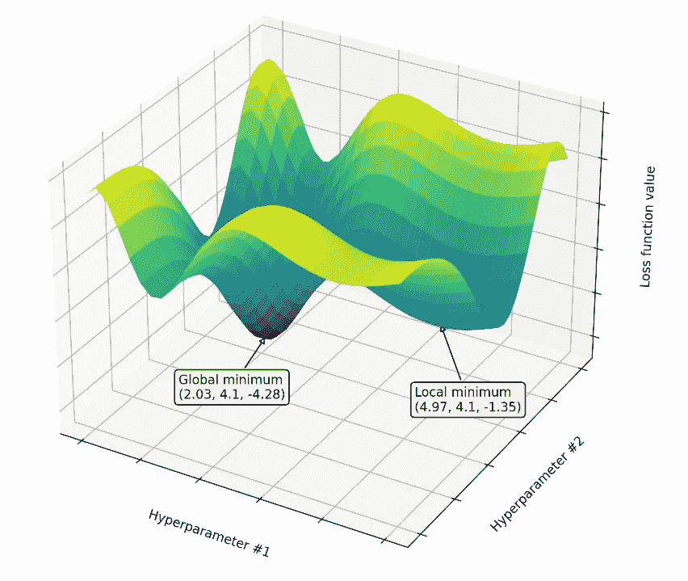
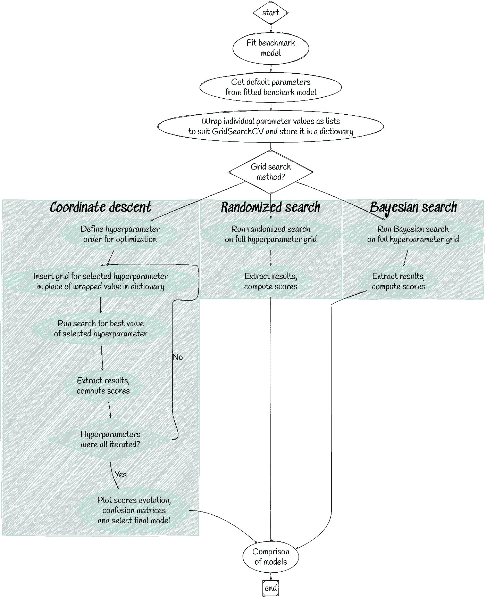

# 二元分类:通过非穷举网格搜索和交叉验证的 XGBoost 超参数调整场景

> 原文：<https://towardsdatascience.com/binary-classification-xgboost-hyperparameter-tuning-scenarios-by-non-exhaustive-grid-search-and-c261f4ce098d?source=collection_archive---------0----------------------->

## *平衡模型性能和计算资源限制的实际例子——代码和可视化*

由[d . kah](https://unsplash.com/@d_kah?utm_source=medium&utm_medium=referral)在 [Unsplash](https://unsplash.com?utm_source=medium&utm_medium=referral) 上拍摄

# **简介**

XGBoost 或极端梯度提升是当今使用最广泛的机器学习算法之一。众所周知，它在赢得卡格尔比赛方面效率很高。许多文章称赞它，并指出它优于替代算法的优势，因此它是练习机器学习的必备技能。

虽然 XGBoost 相对较快，但在标准笔记本电脑上运行脚本仍然具有挑战性:当拟合机器学习模型时，它通常会附带超参数调整和交叉验证(尽管不是必需的)。如果考虑到超参数的所有组合，调整可能会指数地增加计算资源需求。因此，穷尽搜索最佳参数可能不是一个可行的选择。

本文介绍了超参数调优的替代方法，旨在找到模型性能和计算资源限制之间的良好平衡。**我自豪地拥有一个英特尔酷睿 i5–8250 u CPU**，根据 [CPUBenchmark](https://www.cpubenchmark.net/cpu.php?cpu=Intel+Core+i5-8250U+%40+1.60GHz&id=3042) 的数据，它的分数低于提交的中位数。对于有这些限制的人来说，我的代码可能会很有趣。

# **技术术语概述**

尽管我通过分享该过程的代码从实用的角度出发，但我想对所使用的术语和参数名称做一个概述。**如果您熟悉它们，请跳过这一点，进入数据集描述和代码结果**。

**自相关**

**决策树学习**目标变量可以取一组离散值的树模型称为 ***分类树****；在这些树结构中，树叶代表类别标签，树枝代表导致这些类别标签的特征的合取*

**梯度推进**
*梯度推进是一种用于回归、分类和其他任务的机器学习技术，它以弱预测模型的集合的形式产生预测模型，通常是决策树。当决策树是弱学习器时，产生的算法称为梯度提升树，它通常优于随机森林。它像其他 boosting 方法一样以分阶段的方式构建模型，并通过允许优化任意可微分损失函数来推广它们*【3】注:XGBoost 通过其正则化机制来防止过度拟合，从而区别于其他梯度 boosting 技术。

**交叉验证**
" *交叉验证通过“将数据样本划分为互补的子集，对一个子集(称为训练集)执行分析，并对另一个子集(称为验证集或测试集)的分析进行验证”来组合(平均)预测中的适合性度量，以获得更准确的模型预测性能估计值……使用不同的分区执行多轮交叉验证，并在各轮中组合(例如平均)验证结果，以给出模型预测性能的估计值*

**网格搜索**
*网格搜索是一个过程，它通过手动指定的目标算法超参数空间的子集进行彻底搜索…并基于生成的超参数集评估成本函数*【5】

**随机搜索**
" *随机搜索…使用概率分布为每个超参数独立选择一个值…并基于生成的超参数集评估成本函数*【5】

**贝叶斯搜索**

**Eta** (学习率，[0，1]，默认值= 0.3)
*步长收缩用于更新，以防止过拟合。*【7】
“类比于 GBM 中的学习率”[8]

**Gamma** ([0，∞]，默认值=0 ):
" *在树的一个叶节点上做进一步划分所需的最小损失减少量。*【7】
*仅当结果分裂给出损失函数的正减少时，节点才被分裂*【8】

**最大深度** ([0，∞]，默认= 6):
*一棵树的最大深度。增加这个值会使模型更加复杂，并且更有可能过度拟合*

**λ**(未提供界限，缺省值= 1):
*关于权重的 L2 正则化项。*【7】
*……类似于岭回归*【8】

**Alpha** (未提供界限，缺省值=0):
" *L1 正则化项关于权重。*【7】
*……类似于套索回归*【8】

**树方法**(`auto`、`exact`、`approx`、`hist`、`gpu_hist`、默认= `auto` ):
、`exact`——*精确贪婪算法。列举所有分割候选*
`approx` — *近似贪婪算法使用分位数草图*
`hist` — *更快的直方图优化近似贪婪算法*
`gpu_hist` — *GPU 实现* `hist` *算法*【7】

**增长策略** ([ `depthwise`，`lossguide`，默认= `depthwise` ):
" *控制新节点添加到树中的方式。*
`depthwise` — *在最接近根的节点处分割。*
`lossguide` — *在损耗变化最大的节点处分割*【7】

**准确性**
"*…正确预测的观测值与总观测值的比率* " [9]

**精度
"** *精度是正确预测的正观测值与总预测正观测值的比率* " [9]

**召回**
*召回是正确预测的正面观察与实际类中所有观察的比率*【9】

**F1 评分**
*F1 评分是准确率和召回率的加权平均值。因此，这个分数将假阳性和假阴性都考虑在内…如果假阳性和假阴性具有相似的成本，准确性效果最好。如果假阳性和假阴性的成本相差很大，那么最好同时考虑精确度和召回率*[9]

**混淆矩阵**
"*…一个表格，通常用于描述一个分类模型对一组真实值已知的测试数据的性能* " [9]

**ROC AUC**
****ROC****曲线(接收器操作特性曲线)是显示分类模型在所有分类阈值的性能的图表。该曲线绘制了两个参数:真阳性率和假阳性率…****AUC****代表“ROC 曲线下面积”也就是说，AUC 测量从(0，0)到(1，1)的整个 ROC 曲线下的整个二维面积(考虑积分)…AUC 提供了对所有可能的分类阈值的综合性能测量。解释 AUC 的一种方法是将模型对随机正面例子的排序高于随机负面例子的概率*【10】*

# ***问题陈述阐述***

*机器学习模型带有默认参数:如果你没有为可选参数分配特定的值或字符串，算法会通过预设值或字符串自动完成。然而，最佳参数可能因数据集而异，因此默认参数通常不是最佳的。需要通过网格搜索找到最优参数，其中网格代表每个参数的实验值(*n*-维空间)。*

*如上所述，计算能力需求的指数增长问题通过应用蛮力方法和穷尽搜索每个组合而出现。考虑到损失函数，穷举搜索产生全局最小值，因此每次尝试都是有吸引力的。存在替代的、更快的方法——应用的方法在上面列出——以产生对应于局部最小值的一组参数值的概率为代价。*

**

**全局和局部损失函数最小值的简化表示(来源:作者)**

*供考虑的备选方案:*

1.  *逐步搜索又称坐标下降——一次优化一个参数。可能导致局部最小值。在几个超参数的情况下，可能存在许多局部最小值。它取决于超参数的阶数，达到哪个最小值。也可能有这样的情况，当两个或多个超参数的组合修改会产生更好的分数，但修改其中一个不会[11]*
2.  *随机搜索-从搜索空间中随机选择超参数值。搜索空间中的随机点:可能不是最小值，但可能是全局最小值*
3.  *贝叶斯搜索——当函数的数学形式未知或计算成本很高时，这是一种极其强大的技术。背后的主要思想是根据数据计算目标函数的后验分布(使用著名的贝叶斯定理)，然后选择好的点来尝试这个分布【12】*

*我的研究目标是提供一种方法，通过检查模型得分和运行时间来比较上述方法，并在资源有限的情况下选择最合适的方法。**值得注意的是，每个数据集可能需要使用有限的子样本进行单独调查，然后在考虑最佳结果时，将最合适的方法应用于整个数据集**。*

# ***数据集***

*选择用于演示的数据是 CERN 希格斯玻色子挑战的子样本，并已在 Kaggle 上发表为“希格斯玻色子和背景过程”[13]。*

*CERN ATLAS 团队已经发表了原始出版物，著名的希格斯玻色子已经通过对这些数据的分析得到了证实。*

*简而言之，该数据包含 ATLAS 测量的 21 个特征(运动学特性)、从低级别特征导出的 7 个(高级别)特征和一个表明该过程是希格斯过程还是背景噪声的结果的二进制特征。*

# ***代码和结果***

*既然一张图抵得上千言万语，请让我来评估一下下面的流程图中的代码，随便用 Paint 做的(开个玩笑，用 [Sketchviz](https://sketchviz.com/new) 做的)。请在我的 Jovian 简介[这里](https://jovian.ai/danielandthelions/higgs-bosons-and-a-background-process-final-reduced-code)看完整的代码。*

**

*流程图(作者用 [Sketchviz](https://sketchviz.com/new) 制作)*

**注意:在每种方法的情况下，存储墙壁时间，并且测试用例的数量都相等，以便进行有意义的比较。**

*导入了几个评估函数以及标准库:*

*从 CSV 格式加载数据，检查列车数据。id 被丢弃，因为它作为每个过程的唯一值对分类没有贡献:*

*检查测试数据帧发现，一些列包含不适当的字符，因为它们被格式化为对象。原来一些缺失的值用“？”来表示，因此是对象格式。问号被替换为 0，作为代表缺失值的标准值:*

*作为一个标准的过程，自相关和偏相关已被评估。*

*因为自相关不存在于任何特征中，所以可以肯定地说我们不是在处理时间序列数据。因此，随机化数据帧不会造成差异，但是，出于比较目的(与已公布的子样本分析结果)，它在训练/测试分割期间应用，除了在分割(分层)后特别注意保持类别频率比率相同。*

*在执行网格搜索算法之前，必须拟合一个基准模型。通过调用`fit()`方法，默认参数被获取并存储以备后用。由于`GridSearchCV`在列表中接受输入，单个参数值也必须被包装。通过在`GridSearchCV`实例上调用`fit()`，执行交叉验证，提取结果，计算分数并存储在字典中。*

**重要提示:除了搜索最佳网格搜索算法之外，可能还会设置一些速度参数。此类参数为* `*tree_method*` *，设置为* `*hist*` *，将连续特征组织在桶(箱)中，读取列车数据变得明显更快【14】。请阅读参考资料，了解 XGBoost 情况下的更多技巧。**

*迭代整个参数网格需要很多时间，因此将详细度设置为 1 有助于监控该过程。但是，墙壁时间不等于打印的安装时间，因此循环时间也被跟踪和打印。*

*坐标下降是一种特殊情况，在这种情况下，后续迭代的性能被跟踪，并且可以被可视化以选择最佳参数设置。情节如下:*

1.  *所选超参数网格每次试验的评估分数，以及最佳超参数值的混淆矩阵*
2.  *后续迭代的最佳参数值的评估分数的演变*

**重要提示:由于交叉验证是在训练数据上进行的，而手动 AUC 分数是使用测试数据计算的，因此测试分数不一定在每次后续迭代中增加。因此，最终的模型参数是手动选取的。**

*随机搜索和贝叶斯搜索以相似的方式执行，在相同的结果字典中捕获结果。*

*最后，比较 AUC 分数和搜索时间。所有的方法都做了同样多的工作，最终，贝叶斯搜索胜出。随机和贝叶斯搜索的执行时间都比 CD 短。*

**重要提示:执行多次搜索，例如嵌入循环中，执行时间和分数可能会有所不同。测试分数差异的显著性超出了我的文章范围。然而，我重新运行笔记本几次，贝叶斯搜索总是获胜，尽管执行时间也有所不同，并在 45 分钟左右达到峰值。**

# ***总结***

*有趣的是，对于所有三种方法，一些超参数值是相似的还是不同的。例如，对于 CD 和贝叶斯搜索，最大树深度被设置在顶部网格值，但是 lambda 参数对于每一个都是完全不同的。在每种情况下，学习率都保持在低水平。当然，在可能的组合中已经进行了 68 次试验(631 800)，但是模型已经得到了改进，同时在预计的 256 478 分钟的强力网格搜索中节省了至少 256 448 分钟。*

*可以尝试扩展作业的数量，使其与总搜索空间更具可比性，并可能进一步增加 AUC 分数。*

*值得注意的是，原始论文分别使用超参数调节的 NN(浅层神经网络)和 d NN(深层神经网络)报道了 0.841 和 0.883 的 AUC 分数。表现最差的 CD 算法在看不见的数据上得到了 0.8033/0.7241(AUC/准确度)的分数，而数据集的发布者使用决策树分类器获得了 0.6831 的准确度分数，使用支持向量机(SVM)获得了 0.6429 的准确度分数。考虑到所使用的硬件，这将 XGBoost 算法和结果放在上下文中。*

# ***参考文献***

*[1]
【2】[【https://en.wikipedia.org/wiki/Decision_tree_learning】](https://en.wikipedia.org/wiki/Decision_tree_learning)
【3】
【4】[https://en . Wikipedia . org/wiki/Cross-validation _(Statistics)](https://en.wikipedia.org/wiki/Cross-validation_(statistics))
【5】Simon Chan，Philip Treleaven，第 5 章——大规模推荐系统的连续模型选择，主编:Venu Govindaraju，Vijay V. Raghavan，C.R. Rao，Handbook of Statistics，Elsevier，taskId = 3370
【14】[https://towards data science . com/do-you-use-xgboost-heres-how-to-make-it-200 x-faster-16cb 6039 a16e](/do-you-use-xgboost-heres-how-to-make-it-200x-faster-16cb6039a16e)*