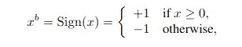
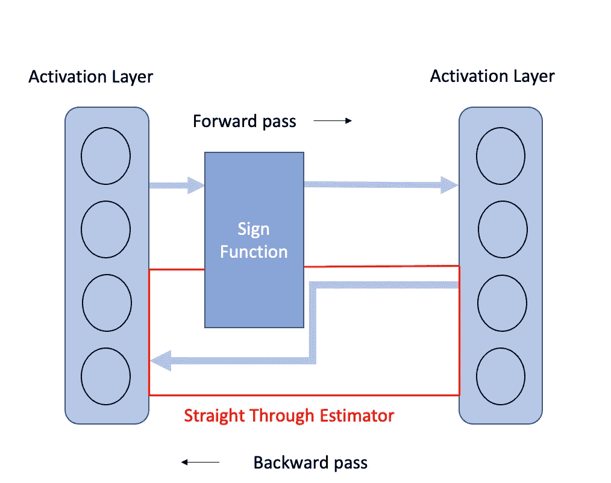
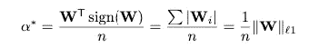
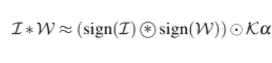
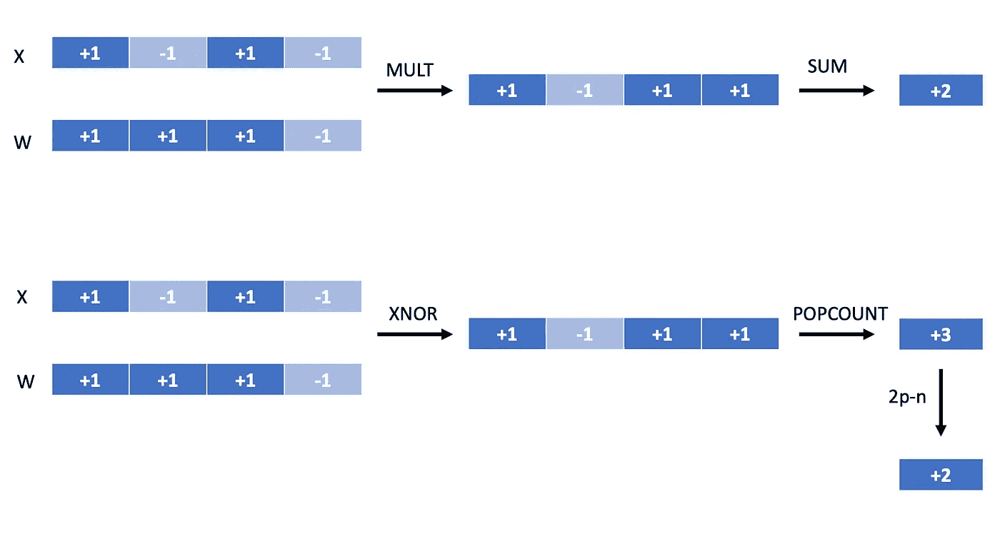

# 二元神经网络——低成本神经网络的未来？

> 原文：<https://towardsdatascience.com/binary-neural-networks-future-of-low-cost-neural-networks-bcc926888f3f?source=collection_archive---------15----------------------->

## 二元神经网络能代替全精度网络吗？

亚历山大·辛恩在 [Unsplash](https://unsplash.com?utm_source=medium&utm_medium=referral) 上的照片

E 每年都有更深入的模型被开发出来执行各种任务，比如对象检测、图像分割等。它总是能打败最先进的模型。但是，人们越来越关注让模型更轻、更高效，以便它们可以在边缘设备和移动设备上运行。这对于弥合机器学习的研究价值和生产价值之间的差距极其重要。

一种减少深度神经网络的存储和计算成本的方法是二进制神经网络的概念。二进制神经网络的概念非常简单，其中权重和激活张量的每个值使用+1 和-1 来表示，使得它们可以以 1 位而不是全精度来存储(-1 在 1 位整数中表示为 0)。浮点值到二进制值的转换使用如下所示的符号函数—

符号阈值函数

现在，使用上述阈值函数的一个主要问题是函数的梯度趋于零。一个解决方案是使用一个直通估计器。直通估计器是这样一种估计器，它在反向传播期间完全按照原样传递梯度，而没有任何变化。这简化了二进制神经网络中阈值函数的反向传播机制，并且显示出非常好的效果。

直通估计器解释(图片由作者提供)

在梯度累积阶段，使用二进制权重和激活来累积每一层的梯度。但是权重更新是在实值原始权重上进行的。为什么会这样呢？我举个例子解释一下。

1.  我们有一个神经网络中的节点(**原始参数**)，值为 0.05。
2.  在将该值通过阈值函数时，我们获得值 1 ( **二进制参数**)。
3.  让我们假设在二进制参数处累积的梯度为 3。我们使用直通估计器的概念将其传递给原始参数。
4.  现在，一旦梯度累积，我们就可以更新值。
    如果我们使用二进制值来获得新的参数值，那么参数的新值将是 1–0.1 * 3(其中 0.1 是学习率)，即 **0.7** 。
    如果我们使用原始参数值获得新参数，那么新值将是 0.05–0.1 * 3，即 **-0.25** 。
5.  这就是可以注意到差异的地方。当我们执行下一次迭代时，我们将再次通过二进制阈值函数传递新的参数值，这将给出不同的结果。如果我们继续使用参数的二进制值，我们可能永远无法改变该位，因为损失总是从 1 或-1 开始计算。

当参数值被更新时，这些值被裁剪为介于-1 和 1 之间。主要原因是这些值只是增加/减少，否则对网络没有任何影响。需要注意的一点是，最后一个激活层中的值没有被二进制化，而是直接用于分类/回归。这些是二进制神经网络的基本概念。

可以添加到权重和激活层二进制化的另一个改进是使用比例因子来表示权重和激活。这里，比例因子只是权重向量中所有值的平均值的绝对值。如果我们有一个值为[[0.2，0.2]，[-0.6，-0.6]]的 2*2 矩阵，那么比例因子α将为 0.2，二进制矩阵表示为[[1，1]，[-1，-1]]。

重量的α(比例因子)计算

因此，一旦权重和激活以二进制形式表示，以及它们各自的比例因子，它们就可以使用下面的等式来表示。这里，I 和 W 分别代表激活层和权重层，而激活和权重的比例因子分别用κ和α表示。

重量和激活层的 XNOR 操作

现在，作为卷积运算基础的乘累加( **MAC** )函数是一种非常昂贵的运算。这现在可以用一个 **XNOR+popcount** 操作来代替。受益？几乎每一个 CPU 都固有地实现了按位操作，并且实现起来明显更快更便宜。popcount 操作只是检查设置的位。下面的例子说明了 MAC 操作可以被 XNOR+popcount 操作所取代。

XNOR + POPCOUNT 运算取代 MAC 运算，其中 **n** 是原始位数(图片由作者提供)

二进制神经网络的主要缺点是它们不能达到与全精度深层网络一样好的精度。但这种情况一直在慢慢改变，每年(更像是每个月都有论文发表)，随着差距的缩小，都有很多进步。由于人们越来越关注在计算资源有限的设备上实现机器学习模型，未来几年该领域的研究工作将会增加。

**参考文献**

[1]对 PyTorch 实现的直通估计器的直观解释。(2020 年 9 月 19 日)。检索于 2021 年 1 月 28 日，来自[https://www . hassanaskary . com/python/py torch/deep % 20 learning/2020/09/19/intuitive-explain-of-straight-through-estimators . html](https://www.hassanaskary.com/python/pytorch/deep%20learning/2020/09/19/intuitive-explanation-of-straight-through-estimators.html)

[2] Courbariaux，Matthieu 等人，“二值化神经网络:训练深度神经网络，其权重和激活被限制为+ 1 或-1。” *arXiv 预印本 arXiv:1602.02830* (2016)。

[3] Rastegari，Mohammad 等，“Xnor-net:使用二进制卷积神经网络的图像网络分类”欧洲计算机视觉会议。施普林格，查姆，2016。

[4] Sush16。(2017 年 10 月 02 日)。理解二元神经网络。检索于 2021 年 1 月 28 日，来自[https://sush science . WordPress . com/2017/10/01/understanding-binary-neural-networks/](https://sushscience.wordpress.com/2017/10/01/understanding-binary-neural-networks/)