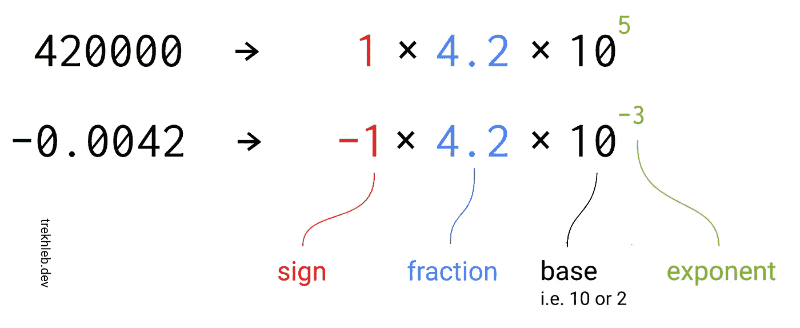
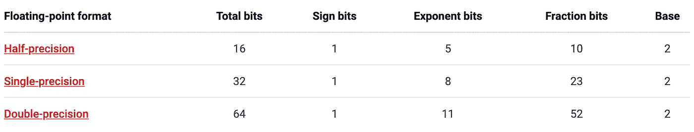
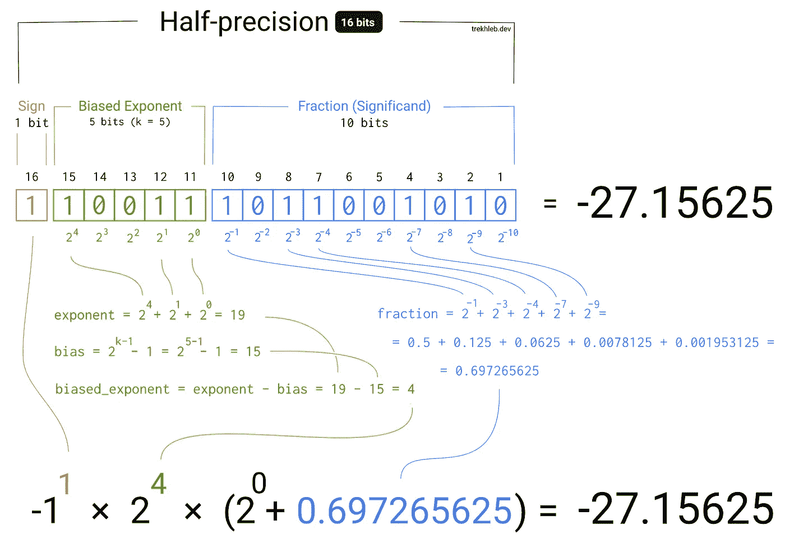
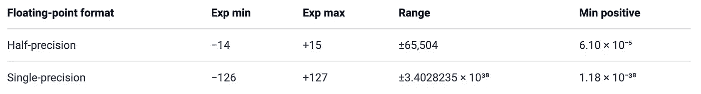

# 浮点数的二进制表示形式

> 原文：<https://towardsdatascience.com/binary-representation-of-the-floating-point-numbers-77d7364723f1?source=collection_archive---------1----------------------->


照片由[米卡鲍梅斯特](https://unsplash.com/@mbaumi?utm_source=unsplash&utm_medium=referral&utm_content=creditCopyText)

你有没有想过计算机如何在内存中存储浮点数，比如`3.1415` (𝝿)或`9.109 × 10⁻³¹`(以千克为单位的电子质量)，而内存是由有限数量的 1 和 0(也就是比特)组成的？

对于整数来说似乎很简单(例如`17`)。假设我们有 16 位(2 字节)来存储这个数字。在 16 位中，我们可以存储范围为`[0, 65535]`的整数:

```
(0000000000000000)₂ = (0)₁₀(0000000000010001)₂ =
    (1 × 2⁴) +
    (0 × 2³) +
    (0 × 2²) +
    (0 × 2¹) +
    (1 × 2⁰) = (17)₁₀(1111111111111111)₂ =
    (1 × 2¹⁵) +
    (1 × 2¹⁴) +
    (1 × 2¹³) +
    (1 × 2¹²) +
    (1 × 2¹¹) +
    (1 × 2¹⁰) +
    (1 × 2⁹) +
    (1 × 2⁸) +
    (1 × 2⁷) +
    (1 × 2⁶) +
    (1 × 2⁵) +
    (1 × 2⁴) +
    (1 × 2³) +
    (1 × 2²) +
    (1 × 2¹) +
    (1 × 2⁰) = (65535)₁₀
```

如果我们需要一个有符号的整数，我们可以使用[二进制补码](https://en.wikipedia.org/wiki/Two%27s_complement)并将`[0, 65535]`的范围移向负数。在这种情况下，我们的 16 位将代表`[-32768, +32767]`范围内的数字。

您可能已经注意到，这种方法不允许您表示像`-27.15625`这样的数字(小数点后的数字将被忽略)。

虽然我们不是第一个注意到这个问题的人。大约 36 年前，一些聪明人通过引入浮点运算的 IEEE 754 标准克服了这个限制。

IEEE 754 标准描述了使用这些 16 位(或 32 位或 64 位)来存储更大范围的数字的方式(框架)，包括小浮点数(小于 1 且更接近 0)。

为了理解标准背后的思想，我们可以回忆一下[科学符号](https://en.wikipedia.org/wiki/Scientific_notation)——一种表示过大或过小的数字(通常会产生一长串数字)的方式，以便于用十进制形式书写。



插图由 [trekhleb](https://trekhleb.dev/) 绘制

正如您在图中看到的，数字表示可能被分成三部分:

*   符号
*   分数(也称为有效数)—数字的有价值的位数(含义、有效载荷)
*   指数-控制分数中小数点移动的距离和方向

我们可以省略基础部分，只要同意它等于什么。在我们的例子中，我们将使用`2`作为基础。

我们可以共享这些位，同时存储符号、指数和分数，而不是使用所有 16 位(或 32 位或 64 位)来存储数字的分数。根据我们要用来存储数字的位数，我们最终得到以下分割:



使用这种方法，分数的位数已经减少(即，对于 16 位数，它从 16 位减少到 10 位)。这意味着分数现在可能取更窄的值范围(失去一些精度)。然而，由于我们也有一个指数部分，它实际上会增加最终的数字范围，也允许我们描述 0 和 1 之间的数字(如果指数是负的)。

> 例如，带符号的 32 位整数变量的最大值为 1 = 2，147，483，647，而 IEEE 754 32 位二进制浮点变量的最大值约为 3.4028235 × 1⁰ ⁸.

为了使负指数成为可能，IEEE 754 标准使用了[偏置指数](https://en.wikipedia.org/wiki/Exponent_bias)。想法很简单——从指数值中减去偏差，使其为负。例如，如果指数有 5 位，它可能从范围`[0, 31]`中取值(这里所有值都是正的)。但是如果我们从中减去`15`的值，范围就是`[-15, 16]`。数字`15`称为偏差，通过以下公式计算:

```
exponent_bias = 2 ^ (k−1) − 1k - number of exponent bits
```

我试图在下图中描述浮点数从二进制格式转换回十进制格式的逻辑。希望它能让你更好地理解 IEEE 754 标准是如何工作的。为了简单起见，这里使用 16 位数字，但是同样的方法也适用于 32 位和 64 位数字。



插图由 [trekhleb](https://trekhleb.dev/) 绘制

> 检查此图 的 [**交互版本，通过设置位的开和关来进行试验，并观察它将如何影响最终结果**](https://trekhleb.dev/blog/2021/binary-floating-point/)

为简单起见，上述示例中省略了几个极限情况(即`-0`、`-∞`、`+∞`和`NaN`(非数字)值)

以下是不同浮点格式支持的数字范围:



# 代码示例

在 [javascript 算法库](https://github.com/trekhleb/javascript-algorithms/tree/master/src/algorithms/math/binary-floating-point)中，我添加了一个二进制到十进制转换器的源代码，它在上面的交互示例中使用过。

下面是一个例子，说明如何在 JavaScript 中获得浮点数的二进制表示。JavaScript 是一种相当高级的语言，这个例子可能太冗长，不像低级语言那样简单，但仍然可以在浏览器中直接进行实验:

```
const singlePrecisionBytesLength = 4; // 32 bits
const doublePrecisionBytesLength = 8; // 64 bits
const bitsInByte = 8;function floatAsBinaryString(floatNumber, byteLength) {
  let numberAsBinaryString = ''; const arrayBuffer = new ArrayBuffer(byteLength);
  const dataView = new DataView(arrayBuffer); const byteOffset = 0;
  const littleEndian = false; if (byteLength === singlePrecisionBytesLength) {
    dataView.setFloat32(byteOffset, floatNumber, littleEndian);
  } else {
    dataView.setFloat64(byteOffset, floatNumber, littleEndian);
  } for (let byteIndex = 0; byteIndex < byteLength; byteIndex += 1) {
    let bits = dataView.getUint8(byteIndex).toString(2);
    if (bits.length < bitsInByte) {
      bits = new Array(bitsInByte - bits.length).fill('0').join('') + bits;
    }
    numberAsBinaryString += bits;
  } return numberAsBinaryString;
}function floatAs64BinaryString(floatNumber) {
  return floatAsBinaryString(floatNumber, doublePrecisionBytesLength);
}function floatAs32BinaryString(floatNumber) {
  return floatAsBinaryString(floatNumber, singlePrecisionBytesLength);
}// Usage example
floatAs32BinaryString(1.875); // -> "00111111111100000000000000000000"
```

# 参考

您可能还想查阅以下资源，以更深入地了解浮点数的二进制表示:

*   [这里是你需要知道的关于 JavaScript 的数字类型](https://indepth.dev/posts/1139/here-is-what-you-need-to-know-about-javascripts-number-type)
*   [浮球暴露](https://float.exposed/)
*   [IEEE754 可视化](https://bartaz.github.io/ieee754-visualization/)