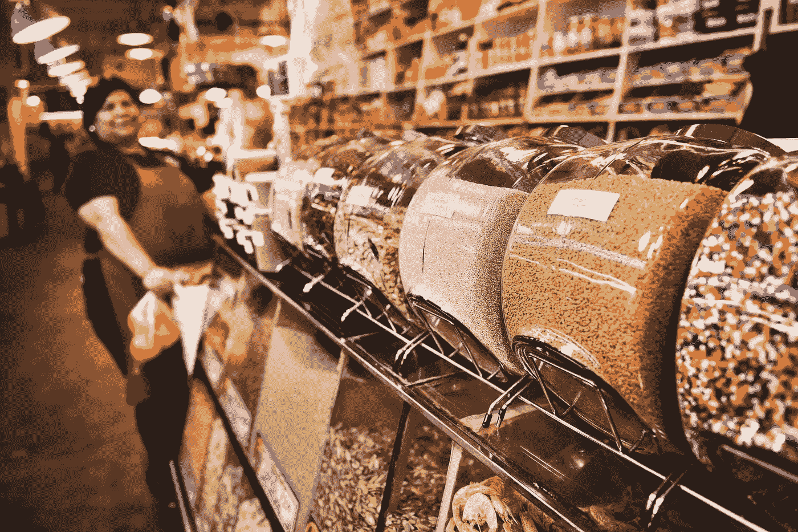
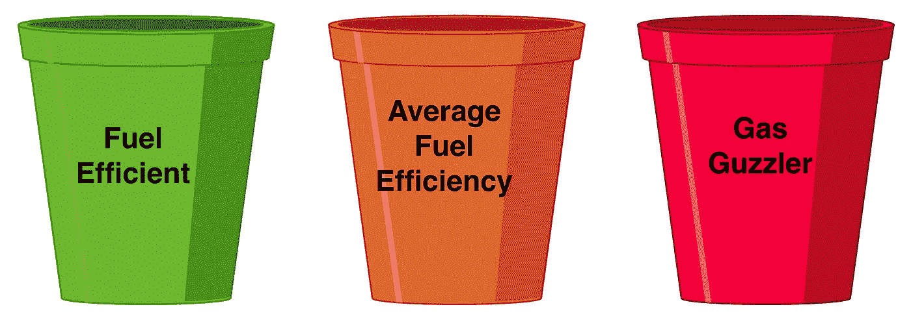
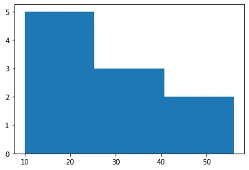
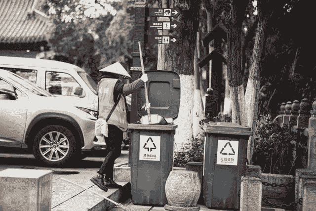
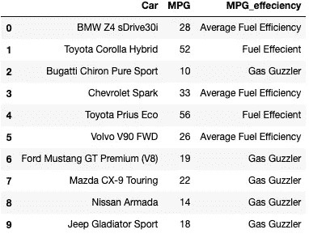
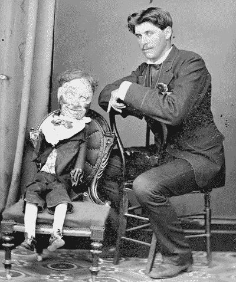
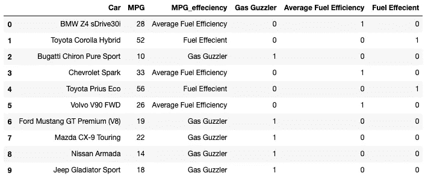

# 宁滨机器学习特征工程奖

> 原文：<https://towardsdatascience.com/binning-for-feature-engineering-in-machine-learning-d3b3d76f364a?source=collection_archive---------16----------------------->

## 使用宁滨作为一种技术来快速轻松地创建用于机器学习的新特征。



蒂姆·莫斯霍尔德在 [Unsplash](https://unsplash.com/s/photos/bins?utm_source=unsplash&utm_medium=referral&utm_content=creditCopyText) 上的照片

如果您已经训练了您的模型，并且仍然认为准确性可以提高，那么可能是时候进行特征工程了。特征工程是使用现有数据创建新特征的实践。这篇文章将关注一种叫做“宁滨”的特征工程技术。

*这篇文章假设读者对 Python、Pandas、NumPy 和 matplotlib 有基本的了解。大多数情况下，提供链接是为了更深入地了解正在使用的内容。如果有什么说不通的地方，请留言评论，我会尽力阐述。*

# 什么是宁滨？

宁滨是一种技术，它实现了听起来的效果。它将采用一列连续的数字，并根据我们确定的范围将这些数字放入“箱”中。这将给我们一个新的分类变量特征。

例如，假设我们有一个汽车的数据框架。


汽车样本数据框架

我们将重点放在 MPG 栏，并制作 3 个箱子，燃油效率，平均燃油效率，和耗油量大。

# **制作垃圾桶**



[brgfx-www.freepik.com 创建的背景向量](https://www.freepik.com/vectors/background)

我们的第一步将是确定这些箱的范围。这可能很棘手，因为它可以通过几种不同的方式来完成。

一种方法是根据值的分布均匀划分容器。基本上，我们将经历相同的过程，就好像我们正在创建一个[直方图](https://en.wikipedia.org/wiki/Histogram)。

由于 Python 使用 [matplotlib](https://matplotlib.org/3.3.3/api/_as_gen/matplotlib.pyplot.hist.html) 简化了直方图的生成，所以让我们在直方图中可视化这些数据，并将 bin 参数设置为 3。

```
import import matplotlib.pyplot as plt
mpgs = cars['MPG']
plt.hist(mpgs, bins=3)
plt.show()
```



mpg 直方图

看起来我们的 3 个箱子大约是 10–25，25–40 和 40–56。

让我们通过返回一个显示箱子宽度的数组来确认我们是正确的。

```
plt.hist(mpgs, bins=3)[1]
\\array([10\.        , 25.33333333, 40.66666667, 56\.        ])
```

我们还可以对燃油效率进行一些研究，看看是否有更好的方法来创建我们的 bin 范围。用谷歌快速搜索，很明显，燃料效率是相对的。这是由许多因素决定的，通常与车龄和车型/级别有关。为了使这个例子简单，我们将坚持使用直方图方法。但是，请记住，理解数据是宁滨的一个重要组成部分，一点点研究可以走很长的路。

# 将 MPG 放入正确的箱子



[李浩](https://unsplash.com/@coderlihao?utm_source=unsplash&utm_medium=referral&utm_content=creditCopyText)在 [Unsplash](https://unsplash.com/s/photos/bins?utm_source=unsplash&utm_medium=referral&utm_content=creditCopyText) 上拍照

现在我们知道了箱子的范围，我们可以创建一个简单的函数，利用熊猫超酷的[剪切函数](https://pandas.pydata.org/pandas-docs/stable/reference/api/pandas.cut.html)。Cut 将使用我们提供的标签名称和范围拆分我们的列。*请注意，要包含 10 个，我们必须在 9 点开始第一次切割。*

```
def make_bins(df):
   label_names = ["Gas Guzzler", "Average Fuel Efficiency","Fuel Effecient" ]
   cut_points = [9, 25.333, 40.667, 56]
   df["MPG_effeciency"] = pd.cut(df["MPG"], cut_points, labels=label_names)
   return df
```

我们现在要做的就是将原始数据帧作为参数传递给函数。

```
new_cars_df = make_bins(cars)
```

这会给我们…..请敲鼓。带有 MPG 类别列的新数据框！



# 假装一下



洛伊·赫尔曼先生和他的口技木偶。威廉·詹姆斯·哈丁(1826–1899):旺格努伊区的底片。参考文献:1/4–006817-g .亚历山大·特恩布尔图书馆，新西兰惠灵顿。[/记录/22322062](http://natlib.govt.nz/records/22322062)

最后一步是得到一些[虚拟模型](https://pandas.pydata.org/pandas-docs/stable/reference/api/pandas.get_dummies.html)，因为我们的模型很可能只能接受整数。

```
dummies = pd.get_dummies(new_cars_df["MPG_effeciency"])
new_cars_df = pd.concat([new_cars_df, dummies], axis=1)
```

瞧，我们已经快速生成了新的特征用于训练，并有望提高我们模型的准确性。



在您使用这些新设计的功能进行训练之前，请确保删除 MPG 列，因为重复数据可能会导致一些不良结果。

仅此而已。几分钟之内，我们已经设计了新的功能！