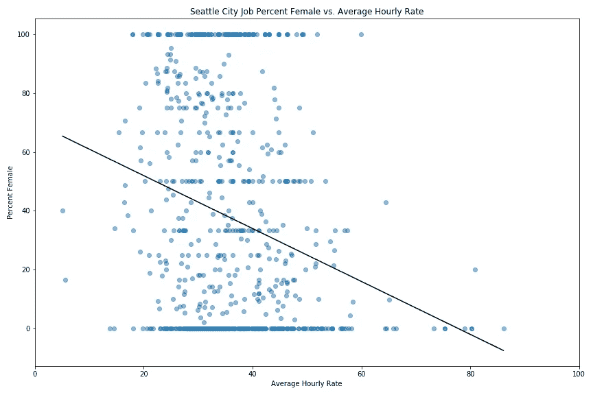
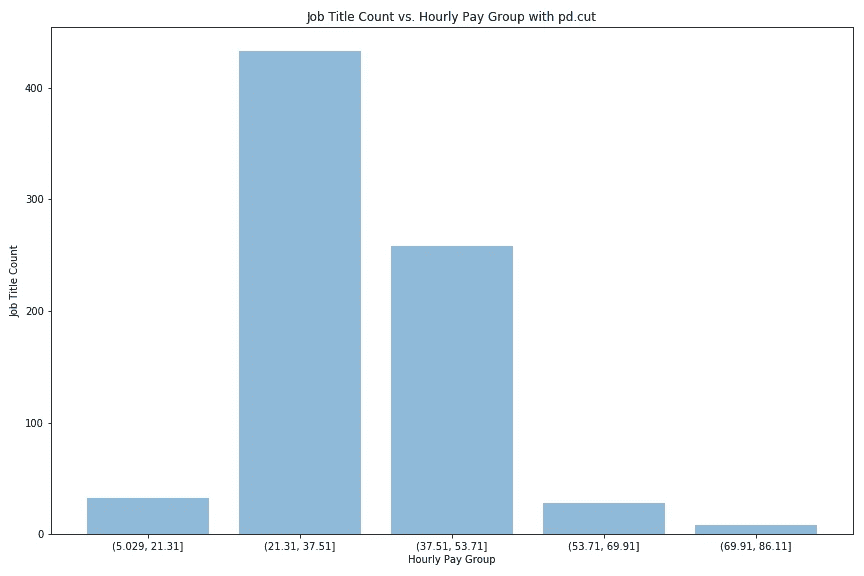
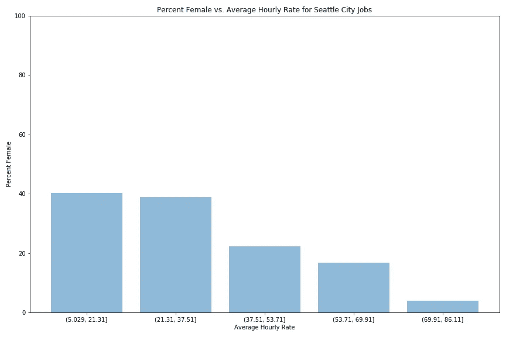
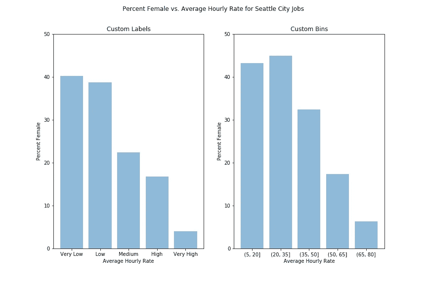
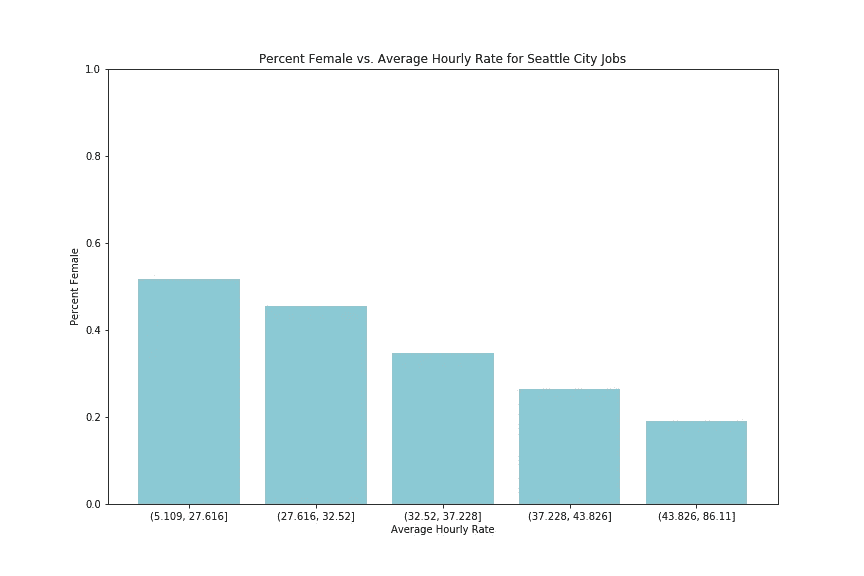
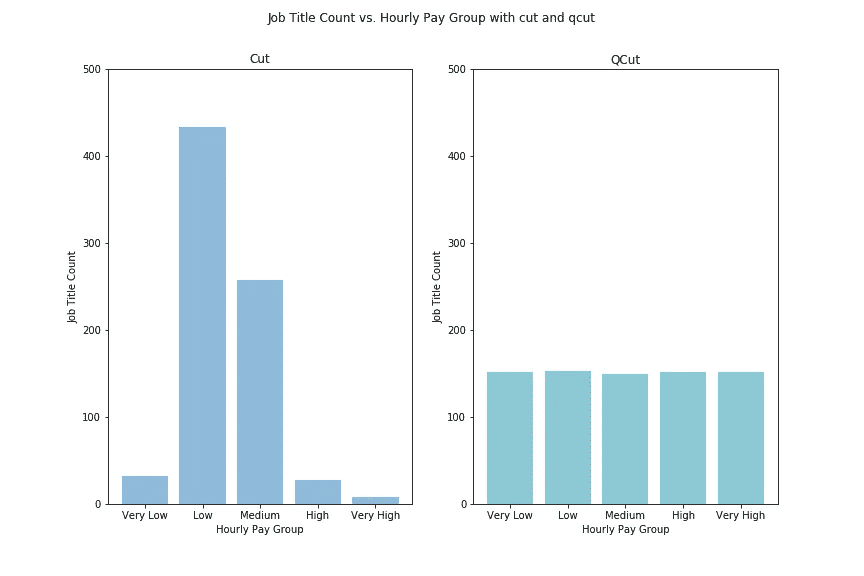

# 宁滨用熊猫切和 QCut 记录了一个连续变量

> 原文：<https://towardsdatascience.com/binning-records-on-a-continuous-variable-with-pandas-cut-and-qcut-5d7c8e11d7b0?source=collection_archive---------11----------------------->

## [入门](https://towardsdatascience.com/tagged/getting-started)

## 何时、为何以及如何将数字特征转换为分类特征

今天，我将使用“西雅图市工资:按性别比较-工资增长职位”数据集来探索宁滨-也称为分组记录-以及单个数字变量。在西雅图开放数据门户的这里找到数据[。](https://data.seattle.gov/City-Business/City-of-Seattle-Wages-Comparison-by-Gender-Wage-Pr/k9m8-nhz3)

给 binners 一个警告:宁滨降低了粒度，并不总是有用的。宁滨通常不用于机器学习模型。

对分箱数据消费者的一个警告:分箱边缘的选择会有很大的影响，特别是在小样本中。当心有人利用宁滨来欺骗或误导你。就推理和其他宁滨选项的结果提问。

# 何时以及为什么要装箱

我使用宁滨将连续数据分组进行比较。例如，我可以把人们分成不同的年龄组。这允许统计比较和流线型视觉的创造。

同时，这种划分可能有些武断:如果我们以 10 岁为增量分组，30 岁的人可能比 21 岁的人更接近 31 岁的人。

我喜欢在两种情况下绑定:

1.  当存在现实生活或商业门槛时。例如，在航空里程方面，当你达到某个阈值时，福利和激励就会改变，从而形成逻辑分组。对于联合航空公司:MileagePlus、卓越银牌、卓越金牌、卓越白金、卓越 1k。
2.  确定模式后，当创建适合我的观众的可视化效果时。在今天的例子中，我绘制了每种工作的女性百分比(在城市报告中，具有该职位的员工中有多少百分比被确定为女性)与该职位的平均时薪(在该职位级别的所有员工中):



西雅图市女性工作百分比与平均时薪散点图。趋势线随着平均时薪的增加而减小。

通过最佳拟合线，我们可以看到，随着平均时薪的增加，女性的比例通常会以平均时薪每增加 1 美元女性减少 0.9%的速度下降。我们有一个 3.6 倍 10^-11 的 p 值，因此这种趋势不太可能是由于抽样。这对一些观众来说太难了。

此外，如此多的职位只有很少的雇员，我们得到的这些水平线分别是 0%、50%和 100%的女性。这些突出的方式分散了外卖的注意力。我想把这个有点抽象的散点图转化成一个快速可消化的可视化。我决定去垃圾箱。

# 如何装箱

有三个主要的宁滨决策:垃圾箱的数量、垃圾箱的类型和标签。我将逐一介绍这些决策的一些考虑因素:

垃圾箱数量:在网上快速搜索可以找到各种各样的经验法则，帮助你决定垃圾箱的数量。(试试这篇维基百科[的文章](https://en.wikipedia.org/wiki/Histogram#Number_of_bins_and_width)。)

**箱柜类型:**

1.  您的数据有自然的、有意义的间断吗？例如，您可能想要调查在设定的航空里程范围内不同常旅客类别的行为差异。也许你想用联邦退休年龄和典型的高中毕业来将人们分为“青年”、“工作年龄”、“符合退休条件”。
2.  您是否希望根据记录的相对定位来拆分记录？例如，你可能想比较收入最高的 1%的人和收入最低的 10%或 50%的人，而不是考虑特定的收入水平。

标签:还是由你决定——你想给你的小组起什么名字？您也可以给它们加上范围标签或整数标签。

一旦你决定了这三件事(或者把这些决定记在心里)，你就可以使用 cut(如果你想根据你的自变量进行分割的话)或者 qcut(qcut)进行样本百分比分割。

## 对连续变量进行拆分，然后用 cut 对记录进行分类

要根据小时工资率将职称分成五组，并使用相等的 x 轴大小的框:

```
df['pay_grp_cut_n'] = pd.cut(df['total_avg_hrly_rate'], 5)
```

这将向 df 添加一个列“pay_grp_cut_n ”,其中每个值都是一个记录所在的 bin 范围。

在 y 轴上显示职称数量会创建一个直方图:



我们可以看到时薪组分为五个 16 美元/小时的区间，从最低平均时薪(5 美元)到最高平均时薪(86 美元)。这种划分导致绝大多数的职位都属于中心和中心以下的群体。

我可以画出这些群体中女性的平均百分比，来说明不同时薪群体中女性百分比的变化:



```
# get sums within group - esp for employee counts
grouped = df.groupby(df['pay_grp_cut_n'], as_index=False).sum()# set x and y
x = grouped['pay_grp_cut_n'].astype(str)
y = grouped['no_female_empl'] / grouped['total_no_empl'] *100# create visual
fig, ax = plt.subplots(figsize=(12,8))
plt.xlabel('Average Hourly Rate')
plt.ylabel('Percent Female')
plt.title('Percent Female vs. Average Hourly Rate for Seattle City Jobs')
plt.ylim(0,100)
plt.bar(x, y, alpha=.5)
```

这种形象化将观众的注意力集中在女性代表人数的下降上，因为职称工资增加了。我可以使用这些分类来确定每个分组的统计显著性和/或根据上下文添加误差线。

根据您的需求优化 cut 的一些其他选项(一如既往，在[文档](https://pandas.pydata.org/pandas-docs/stable/reference/api/pandas.cut.html)中了解更多):



*   调整标签

```
df[‘pay_grp_cut_l’] = pd.cut(df[‘total_avg_hrly_rate’]
                             ,5
                             ,labels=[‘Very Low’, ‘Low’, ‘Medium’
                                       ,‘High’, ‘Very High’])
```

*   设置容器边界。你可以这样做，为航空公司奖励水平，或获得整数斌休息。

```
df['pay_grp_cut_set_boundaries'] = pd.cut(df['total_avg_hrly_rate']
                                          ,[5,20,35,50,65,80])
```

## 使用 qcut 将记录分组到基于卷的组中

`QCut`或“分位数切割”不是基于标量值进行分割，而是基于落入每个桶中的样本数进行分割。

如果你想要五个大小相等的组，按小时工资排序，你可以使用类似于`cut`的`qcut` 。

```
df['pay_grp_qcut_n'] = pd.qcut(df['total_avg_hrly_rate'], 5)
```



使用`qcut`偶数大小的分组，您会看到现在我们的 bin 大小从大约 5 变化到大约 43。每个框代表大致相同数量的职位。

比较`cut` 和`qcut` 在每个时段中的职位数量可以看出这一差异:



使用`qcut`，您可以像设置`cut`一样设置标签。`df[‘pay_grp_qcut_l’] = pd.qcut(df[‘total_avg_hrly_rate’], 5, labels=[‘Very Low’, ‘Low’, ‘Medium’, ‘High’, ‘Very High’])`

您可以设置每个桶中的体积百分比来创建不同大小的分组，而不是显式设置边界。例如，如果你在一条曲线上打分，那么你可能想把学生分成(对我来说，任意的):10% F，20% D，20% C，40% B，10% A。你可以使用 qcut 给学生打分:

```
df['letter_grade'] = pd.qcut(df, 
                             [.1, .2, .2, .4, .1], 
                             labels=['F', 'D', 'C', 'B', 'A']) 
```

## 何时使用 Cut 与 QCut

这个选择真的取决于你的用例。你有没有很强的商业逻辑或者现有的分类是你想要匹配的或者是你的受众习惯思考的？这将是一个主要的原因削减！其他时候，考虑类似规模的分组或客户的百分比可能更有意义。

无论您决定在您的环境中哪一个有意义，您都可能想要考虑未选择的路径的影响。使用 cut 时，小组规模可能会有很大不同——强调这种变化的幅度(为您自己和/或您的观众)。使用 qcut，铲斗大小可能会有很大的变化——忘记这一点，后果自负。

## 确定容器边界的另一种方法

Fisher-Jenks 算法在一维数据中找到自然边界，像 k-means，但是 1D。查看`jenkspy`获得一个不错的实现。您仍然需要仔细考虑要寻找的条柱/间隔的数量，但是可能会得到更多的逻辑分组，尤其是当您的数据集具有不同的间隔时。例如，在一个 4 岁孩子的生日聚会上，身高可以自然地分为“成年人”、“4 岁儿童”、“6 岁儿童”、“2 岁儿童”，尽管偶数或 qcuts 的划分可能与这些分组相去甚远。

编码快乐！你可以在这里找到回购[。](https://github.com/allisoncstafford/cut_qcut_blog)


照片由 [Luca Upper](https://unsplash.com/@lucistan?utm_source=medium&utm_medium=referral) 在 [Unsplash](https://unsplash.com?utm_source=medium&utm_medium=referral) 上拍摄