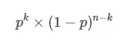
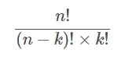
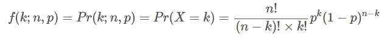
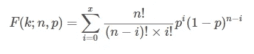
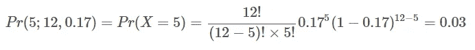
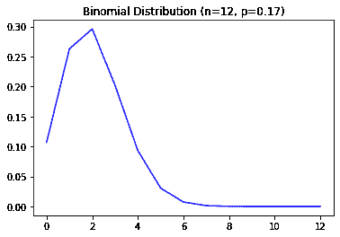
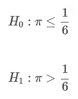
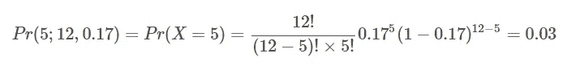

# Python 中的二项式分布和二项式检验—统计学

> 原文：<https://towardsdatascience.com/binomial-distribution-and-binomial-test-in-python-statistics-pyshark-91aa6403d674?source=collection_archive---------20----------------------->

## 在本文中，我们将探讨 Python 中的二项分布和二项测试。


由 [Unsplash](https://unsplash.com/s/photos/dice?utm_source=unsplash&utm_medium=referral&utm_content=creditCopyText) 上的 [Edge2Edge 媒体](https://unsplash.com/@edge2edgemedia?utm_source=unsplash&utm_medium=referral&utm_content=creditCopyText)拍摄

**目录**

*   介绍
*   什么是二项分布
*   在 Python 中创建和绘制二项式分布
*   什么是二项式检验(举例)
*   Python 中的二项式测试(示例)
*   结论

# 介绍

为了继续学习本教程，我们需要以下 Python 库:scipy、numpy 和 matplotlib。

如果您没有安装它，请打开“命令提示符”(在 Windows 上)并使用以下代码安装它:

```
pip install scipy
pip install numpy
pip install matplotlib
```

# 什么是二项分布

二项式分布和正态分布是统计学中最流行的分布之一。二项式分布是一系列独立实验( **n** )中若干成功的离散概率分布( **X** )。每个实验都有两种可能的结果:成功和失败。成功结局有概率( **p** )，失败有概率( **1-p** )。

注意:一个单独的实验也叫做伯努利试验，一个只有两种可能结果的实验。并且一个实验的二项式分布( **n** =1)也是伯努利分布。

换句话说，二项式分布模拟了在重复多次的独立实验中观察到成功或失败结果的概率。

假设成功的概率等于: **p**

那么故障概率等于: **q=1-p**

所以获得( **k** )成功和( **n-k** )失败的概率等于:



作者图片

获得( **k** )成功的方法数量计算如下:



作者图片

使用上面的符号，我们可以求解概率质量函数(在( **n** 个)实验中获得( **k** 个)成功的总概率):



作者图片

注:概率质量函数(PMF)-给出离散随机变量恰好等于某个值的概率的函数。

二项式累积概率函数的公式为:



作者图片

**例如:**

你正在掷出一个 6 面骰子 12 次，你想找出 5 次结果为 3 的概率。在这里，得到 3 是一个成功的结果，而得到任何其他(1，2，4，5，6)是一个失败的结果。显然，在每一次掷骰子中，你得到 3 的概率是(1/6)。根据我们这里的数据，掷骰子 12 次，结果应该是 3(12 *(1/6))。

现在，我们实际上如何计算 5 次观察到结果 3 的概率？

使用上面的公式，我们可以很容易地解决它。我们有一个实验，它发生了 12 次( **n** = 12)，有问题的结果数是 5 ( **k** = 5)，概率是(1/6)或四舍五入后的 0.17(**p**= 0.17)。

代入上述等式，我们得到:



作者图片

这个实验的二项式分布看起来像这样:



作者图片

你可以清楚地看到，观察 3 作为结果，在 2 次的概率最高，观察 5 次的概率小于 0.05。

# 在 Python 中创建和绘制二项式分布

现在让我们探索如何创建二项式分布值并使用 Python 绘制它。在本节中，我们将使用三个 Python 库:numpy、matplotlib 和 scipy。

我们将首先导入所需的模块:

对于数据，我们将继续上一节的示例，我们掷骰子 12 次( **n** = 12)，其中观察到从 1 到 6 的任何数字的概率是(1/6)或 0.17 ( **p** = 0.17)。

现在我们将在 Python 中为它们创建值:

其中 **x** 是一个从 0 到 12 的数字数组，代表任何数字可以被观察到的次数。

使用这些数据，我们现在可以计算二项式概率质量函数。概率质量函数(PMF)是给出二项式离散随机变量恰好等于某个值的概率的函数。

在我们的示例中，它将显示从 12 次掷骰子中，您可以观察到任何概率为 0.17 的数字的次数。

构建 PMF:

你应该得到一个有 13 个值的数组(这是我们的 **x** 值的概率):

```
[1.06890008e-01 2.62717609e-01 2.95952970e-01 2.02056244e-01 9.31162813e-02 3.05152151e-02 7.29178834e-03 1.28014184e-03 1.63873579e-04 1.49175414e-05 9.16620011e-07 3.41348087e-08 5.82622237e-10]
```

现在我们有了二项式概率质量函数，我们可以很容易地将其可视化:

您应该得到:


作者图片

现在，试着解释我们看到的东西怎么样？

该图显示，如果我们从 1 到 6(骰子面)中选择任意一个数字，并掷骰子 12 次，观察到这些数字的最高概率是 2 次。

换句话说，如果我选择数字 1，掷骰子 12 次，很可能 1 会出现 2 次。

如果你问，1 出现 6 次的概率是多少？通过查看上面的图表，你可以看到它略高于 0.02%或 2%。

# 什么是二项式检验

二项式检验是一种单样本统计检验，用于确定二分分数是否来自二项式概率分布。

利用上一节的例子，让我们以一种可以做一些假设检验的方式来重新表述这个问题。以下是情况:

你怀疑骰子偏向数字 3(三个点)，你决定掷骰子 12 次( **n** = 12)，观察到数值 3(三个点)5 次( **k** = 5)。您想了解骰子是否偏向数字 3(回想一下，观察到 3 的预期概率是(1/6)或 0.17)。

制定假设我们会有:



作者图片

现在计算概率:



作者图片

这里的概率是显著性检验的 **p** 值。由于 0.03 < 0.05，我们拒绝零假设，接受骰子偏向数字 3 的替代假设。

# Python 中的二项式测试(示例)

现在让我们使用 Python 对上面的例子进行二项式测试。

这是一个非常简单的 scipy 库函数的几行实现。

**第一步:**

导入函数。

**第二步:**

定义成功次数( **k** )，定义尝试次数( **n** )，定义预期成功概率( **p** )。

**第三步:**

在 Python 中执行二项式测试。

我们应该得到:

```
0.03926688770369119
```

这是用于显著性检验的**p**-值(类似于我们通过求解上一节中的公式得到的数值)。

注意:默认情况下，计算的测试是双尾测试。如果您正在处理单尾测试情况，请参考此[函数](https://docs.scipy.org/doc/scipy/reference/generated/scipy.stats.binomtest.html#scipy.stats.binomtest)的 scipy 文档。

# 结论

在本文中，我们探讨了二项式分布和二项式测试，以及如何在 Python 中创建和绘制二项式分布，并在 Python 中执行二项式测试。

如果你有任何问题或对一些编辑有建议，请随时在下面留下评论，并查看更多我的[统计](https://pyshark.com/category/python-programming/)文章。

*最初发表于 2021 年 10 月 1 日*[*https://pyshark.com*](https://pyshark.com/binomial-distribution-and-binomial-test-in-python/)*。*