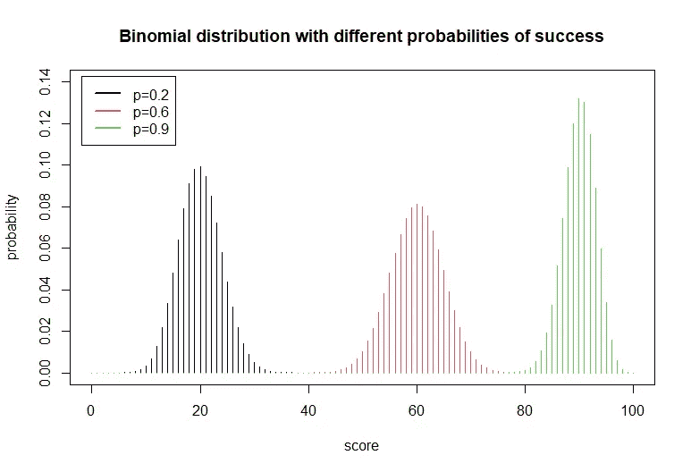
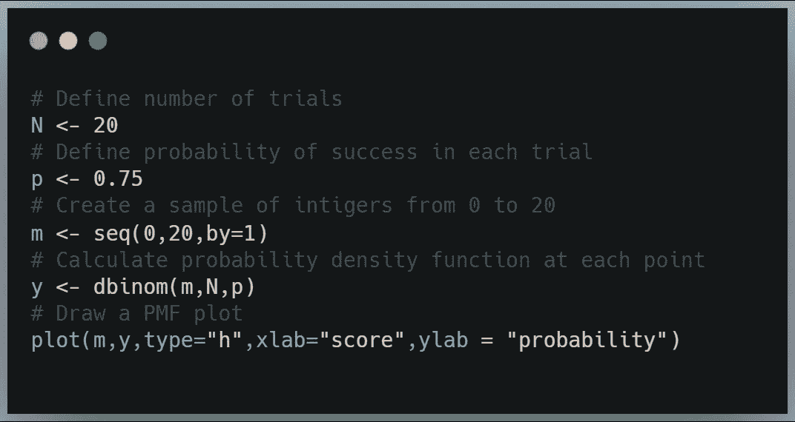
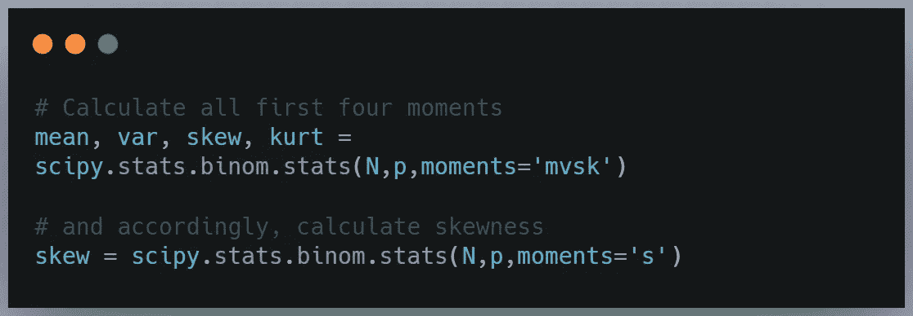

# 实践中的二项式分布

> 原文：<https://towardsdatascience.com/binomial-distribution-ec76d74952c4?source=collection_archive---------5----------------------->

## 数据科学家的数学复习

## 用 R 和 Python 语言清晰地解释了理论和方便的函数

你知道概率分布很重要，二项分布是基本分布。但是你仍然对此有些怀疑。我应该什么时候使用它？如何理解概率质量函数和累积密度函数的方程？R 和 Python 中有哪些得心应手的函数？最后，从理论和实践的角度来看，你会觉得使用二项式分布很舒服。让我们开始吧！

我们将在本文中讨论以下主题:

1.  伯努利试验
2.  二项分布
    2.1 二项系数
    2.2 二项密度函数(PMF)
    2.3 累积密度函数(CDF)
3.  二项分布的行为
4.  R 和 Python 中的二项式分布函数
    4.1 R
    4.2 Python
5.  实践中的二项分布

# 1.伯努利试验

**伯努利试验**是一个随机实验，它有两种可能的结果，通常表示为“成功”(1)和“失败”(0)。“成功”符合给定的标准，例如，大于 7 的数字、女性、年龄小于 10 岁、负回报等。它并不意味着这个结果在这个词的伦理意义上是“好”的。

如果 *q* 是成功的概率，而 *p* 是失败的概率，那么:

由于除了 0 或 1 没有其他选择，所以成功和失败的概率之和总是等于 1。

# 2.二项分布

让我们先看看定义。**二项式分布**描述了 N 次独立伯努利试验中成功次数的分布，其中成功概率为常数，*p*【1】。简单地说，它的意思是:

*   我们重复同一个实验很多次。比如抛硬币 N=1000 次。
*   在每次试验中，恰好有两种结果是可能的:头和尾(*成功*和*失败*，伯努利试验)。因此，这个定义中的*伯努利试验*将二项分布缩小为离散分布，其中实验结果只能取 0 或 1。任何介于之间的，比如 0.3，0.01，或者既不成功也不失败，都是不可能的。
*   在每次试验中，获得正面的概率是相同的(p=0.5)。它不依赖于任何先前的结果，所以它是*独立的。*

## 2.1.二项式系数

为了表达二项式密度函数，我们首先需要定义*二项式系数*:

我们可以理解为“N 选 m”。它描述了 *X* 可以取给定值 *m* 的方式的数量。当选择的顺序无关紧要时，它从集合中选择 m 个项目。如果集合有 N 个元素，m 个组合的数目等于二项式系数[2]。

让我们看看这个例子。在抽签中，从 20 个球中选出 5 个球。需要购买多少张彩票才能确保中奖？一开始我们有 20 个球可供选择，第二选择有 19 个，第三选择有 18 个，依此类推。所以，我们有

二十个球中选择五个球的不同方法。但是我们并不关心彩票的顺序，重要的是有相同的号码。这意味着{A，B，C，D，E}顺序的球和{B，E，A，C，D}对我们来说是同一套球。

所以我们需要减少 1.860.480 种按重复选择的方式(所选球的排序方式数)。既然我们有五个球，我们可以在五分钟内完成！=120 种不同的方式。最后，我们将 1.860.480 种选择方式除以 120 个订购选项，得到 15.504 张票可以购买！

值得吗？

让我们回到二项式系数。在分子中，我们可以看到我们可以用多少种方法来排列 20 个球！(N！).在分母中，我们通过排序选项来减少结果:

*   订购方式 5！选定的球(m！)，以及
*   对池中剩余的球进行排序的可能性(N-m)！，这里 15！

像被选中的球的顺序一样，我们不关心未被选中的球的顺序。最后，我们得到:

和我们上面得到的完全一样，但是方式更简单。

“！”符号是阶乘。正如你可能看到的，对于非负整数 *x* ，它被计算为所有数字的乘积，直到 *x* ，例如:

## 2.2.二项式密度函数(PMF)

现在，我们准备将二项式密度函数定义为在 *N* 伯努利试验中获得 *m* 次成功的概率:

因此，二项式分布是一系列给定实验的 *N* 次独立重复中成功次数( *m* )的离散概率分布，该实验询问是-否(成功-失败，1–0)问题，成功的概率是 *p，*而失败的概率是 *q=1-p* 。

让我们考虑一个例子。篮球训练的时候你在练罚球。从赛季统计中，我们知道你得一分的概率是 75%。你的教练告诉你，如果你在 20 次尝试中得到 17 分，你将开始下一场比赛。你正好得 17 分的概率是多少？

我们需要假设罚球成功的概率与之前的结果无关(这里心理力量不发挥作用)。我们也不关心得分的顺序，所以不管你是第一次、第三次还是最后一次失败都没关系。因此，这是一个二项式分布。我们可以使用上面给出的二项式密度函数，得到:

我们可以为其他分数重复这个练习。结果，我们得到了二项分布图(PDF):

给定 20 次伯努利试验中的分数，获得*的概率给定成功试验的概率为 75%。作者的情节。*

但是你至少要拿 17 分，不是正好 17 分。那么你在下一场比赛中首发的可能性有多大？

## 2.3.累积密度函数

这里，一个二项分布的累积分布函数将有助于回答这个问题。如果你想知道为什么，请先看看这篇文章:

</quantiles-key-to-probability-distributions-ce1786d479a9>  

累积分布函数(CDF)描述了 *X* 取值等于或小于 *k* 的概率(机会)。二项式分布的 CDF 函数如下:

其中*【k】*为 *k* 下的“下限”，即等于或小于*k*的最大整数

因此，我们需要将你获得 17 次、18 次、19 次或 20 次罚球的概率相加，在 PMF 图上用红色标出:

在 20 次尝试中获得 *a* 分数的概率，假设成功概率为 75%。作者的情节。

由于概率总和为 1，我们也可以采取相反的方法——从 1 中减去最高得分 16 分(17 分的剩余部分)的累积概率:

这显示在 CDF 图中:

20 次尝试的累积概率，假设成功概率为 75%。作者的情节。

这两种方法的结果是一致的。你的教练给你的任务很有挑战性，但是考虑到概率还是可行的，所以试一试吧！

# 3.二项分布的行为

如果你从教练那里得到更多的尝试，机会会有怎样的变化？你仍然需要达到 85%的成功投掷，但是你接受了 20、50 或 100 次尝试。让我们看下一个情节。

考虑不同样本量的二项分布的概率密度函数。作者的情节。

样本量越大，分布越广。获得至少 85%罚球成功率的概率如下:

鉴于成功概率为 75%，获得 85%的试验次数的概率。表作者。

考虑到表格中的结果，你不应该强迫你的教练给你额外的试验。尝试的次数越多，获得比你长期成功概率更好的分数的可能性就越小。

接下来，让我们看看艰苦的训练是否增加了你的机会。我们考虑三种成功的可能性:20%、50%和 90%。轨迹的数量保持不变(100)。

考虑不同成功概率的二项分布的 PDF。作者的情节。

下表总结了 85%成功投掷的概率，给出了 75%的长期成功概率。

努力训练比和教练争着跑更多的路更有意义！

# 4.R 和 Python 中的二项式分布函数

让我们仔细看看 R 和 Python 中有助于处理二项分布的函数。

## 4.1.稀有

在 r 中至少那四个函数是值得知道的，下面的例子中， *m* 是成功尝试的次数， *N* 是样本的大小(所有尝试的次数)， *p* 是成功的概率。

*   **dbinom(m，N，p):** 该函数计算在成功概率为 *p* 的 *N* 次随机试验中恰好有 *m* 次成功的概率。例如，20 次投掷中的 17 次得分给出 dbinom(17，20，0.75)。如果我们为每个可用的分数计算 dbinom，我们可以绘制一个 PMF 图(如上例所示)。

图片作者在 [@carbon_app](https://twitter.com/carbon_app)

*   **pbinom(m，N，p):** 该函数计算累积概率函数，使得成功次数等于或小于 *m* 。对于至少有 17 个分数的示例，它是 1-pbinom(16，20，0.75)或 pbinom(16，20，0.75，lower.tail=FALSE)。如果我们加上 lower.tail=FALSE，我们考虑获得至少 *m* 次成功的概率。默认值较低。tail=TRUE。

图片作者在 [@carbon_app](https://twitter.com/carbon_app)

*   **qbinom(probability P，N，p)** 返回逆累积密度函数的值。它找出二项分布的第 p 个分位数。对于给定的概率，你需要多少成功的分数？qbinom(0.55，size=20，prob = 0.75)给出 15。这意味着有 55%的几率你最高可以得 15 分。

*   **rbinom (m，N，p)** 是生成一个二项分布随机变量的向量。这对于训练目的是有用的。

## 4.2.计算机编程语言

Python 中那些来自***scipy . stats . binom***库的函数值得了解。在下面的例子中， *m* 是成功尝试的次数， *N* 是样本的大小(所有尝试的次数)， *p* 是成功的概率。

*   **pmf(m，N，p):** 这个函数计算概率质量函数，所以在 *N* 随机试验中有精确 *m* 成功的概率，有 *p* 成功的概率。比如 20 投 17 分给 scipy.stats.binom.pmf(17，20，0.75)。如果我们计算每个可用分数的 dbinom，我们就可以绘制 PMF。

图片作者在 [@carbon_app](https://twitter.com/carbon_app)

作者图片

*   **cdf(m，N，p)** 允许计算累积分布函数，使得成功次数等于或低于 *m* 。对于我们这个至少有 17 个分数的例子，就是:1-scipy.stats.binom.cdf(16，20，0.75)。

图片作者在 [@carbon_app](https://twitter.com/carbon_app)

作者图片

*   **ppf(m，N，p)** 此函数给出了百分点函数，因此它返回了反累积密度函数的值。它找出二项分布的第 p 个分位数。对于给定的概率，你需要多少成功的分数？scipy.stats.binom.ppf(0.55，size=20，prob = 0.75)给出 15。这意味着有 55%的几率你最高可以得 15 分。我们还可以检查 PFM 和 CDF 的准确性:

图片作者在 [@carbon_app](https://twitter.com/carbon_app)

*   **stats(N，p，moments='mvsk')** 允许计算前四个矩，即均值(' m ')、方差(' v ')、偏斜(' s ')、峰度(' k ')。如果你需要重温统计时刻，这篇文章可能适合你:

</statistical-moments-in-data-science-interviews-bfecd207843d>  

图片作者在 [@carbon_app](https://twitter.com/carbon_app)

*   **rvs (n，p，size=)** 是生成一个二项分布随机变量的向量。这对于训练目的是有用的。

# 5.实践中的二项分布

二项式分布是统计显著性二项式检验的基础。它旨在检查只有两种可能结果的实验结果是否与预期的结果有统计学差异。
例如，你期望你的投资回报在 95%的时间里都在-100 美元以上。然后，您检查上个月(22 个交易日)的实际回报，您会得到以下结果:

我们能说结果与我们的期望不同吗？首先，我们需要假设每天的收益是独立的。然后，我们将测试的零假设定义为*实验结果与预期结果没有显著差异*。我们想检查真实数据是否支持另一种选择，即*成功的真实概率(这里的回报低于-100 美元)大于 0.05* 。假设每天只有成功(低于-100 美元)和失败(高于或等于-100 美元)选项，我们可以使用上面给出的 CDF 等式:

考虑到 5%的阿尔法水平，我们不能拒绝零假设，即结果没有明显不同于预期。因此，即使例外情况的数量高于预期，保持冷静，不要对市场走势反应过度也是一个好策略。

# 感谢阅读！

我很高兴你看到了这篇文章的结尾。我们讨论了与二项分布相关的最重要的主题。我希望这对你来说是一次激动人心的旅行！

我很乐意在下面的评论区听到你的想法和问题，你可以直接通过我的 LinkedIn 或者 akujawska@yahoo.com 的 T2 联系我。后会有期！

您可能还喜欢:

</quantiles-key-to-probability-distributions-ce1786d479a9>  </statistical-moments-in-data-science-interviews-bfecd207843d>  </math-refresher-for-data-scientist-part-1-matrices-88620a92d046>  </set-path-automatically-r-python-4dbc4963321e>  

# 参考

[1] C .亚历山大(2008):《市场风险分析》。第一卷:金融中的定量方法”，约翰·威利父子有限公司，ISBN 978-0-470-99800-7

[2]维基百科中的组合:【https://en.wikipedia.org/wiki/Combination】T4

【3】a . b .唐尼:[“想统计。Python 中的探索性数据分析"](https://greenteapress.com/thinkstats/)