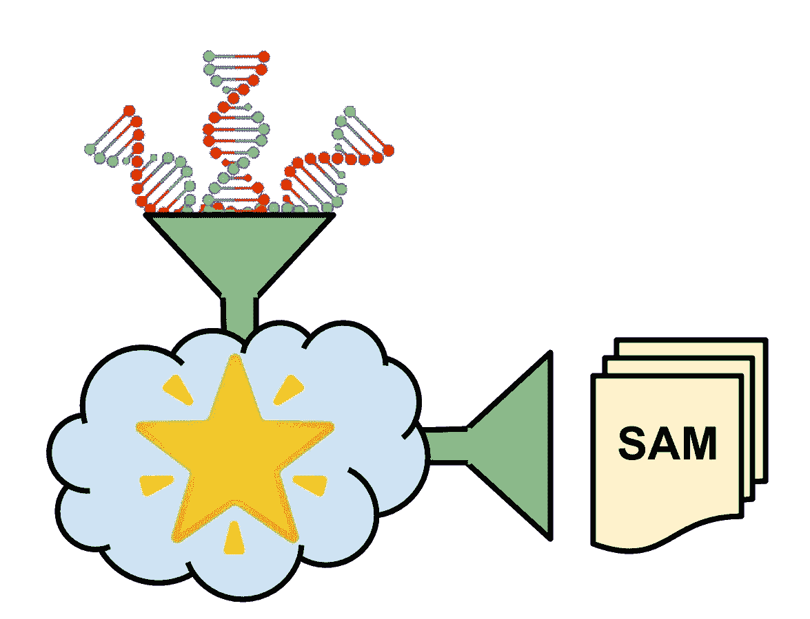
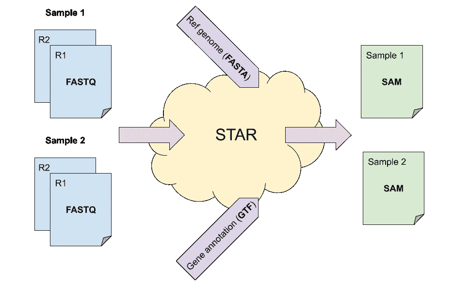
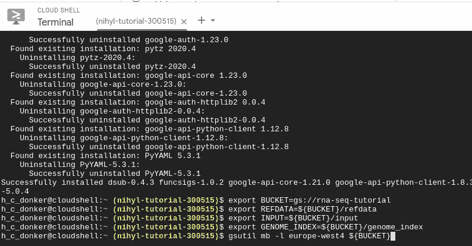

# 云上的生物信息学

> 原文：<https://towardsdatascience.com/bioinformatics-on-the-cloud-144c4e7b60d1?source=collection_archive---------27----------------------->

## 将 RNAseq 与 Google 云平台上的 STAR 对齐



云中的运行之星。图片作者。

# 关联

分析一个人的 DNA 及其转录指令(RNA)的价格正在迅速变得便宜。因此，不仅在科学实验室，而且在日常医疗保健中，测序技术的应用正在增长。但是，为单个个人生成的数据的大小很容易超过几个 GB。因此，这确实是一个*大数据*问题！由于云是专门为解决大规模问题而设计的，我们可以利用它的工具和基础设施来促进我们的生物信息学分析。通过在云上运行您的生物信息学工具，您可以在很短的时间内完成分析。

# 范围



图 1:校准程序的示意图。STAR 使用参考基因组和基因注释将 FASTQs 转换为 SAM 文件。图片作者。

本教程将带你完成在谷歌云平台(GCP)上比对人类 RNA 测序数据(简称 RNAseq)的步骤。

**目标**:

*   在云上存储基因组数据。
*   使用 STAR 比对 RNA 测序数据。

# 背景

从一条链上读出核苷酸碱基的测序机器只能读出片段的一小部分。因此，机器会产生大量的小块碱基，称为*读作*。通常，读取有两种方式:左读和右读。这些读数由[成对末端测序](https://www.illumina.com/science/technology/next-generation-sequencing/plan-experiments/paired-end-vs-single-read.html)机器生成，是机器开始读取碱基的片段的两边。完成测量后，测序仪通常会生成两个文件(每种口味一个)，其中包含所有这些碱基块以及相应的质量评估，格式为[FASTQ](https://en.wikipedia.org/wiki/FASTQ_format#:~:text=FASTQ%20format%20is%20a%20text,single%20ASCII%20character%20for%20brevity.)。所有这些小拼图，现在都是 FASTQ 格式，必须重新组合在一起。这是与参考基因组比对的过程，其中读数被分配到基因组上的一个位置。当成功时，这将产生一个指示读取的基因组位置的 [SAM 文件](https://en.wikipedia.org/wiki/SAM_(file_format))。我们今天的任务是对来自 RNA 材料的碱基进行比对。或者换句话说，将 FASTQ 文件合并并转换为 SAM 文件。

# 初步步骤

打开[谷歌云平台仪表盘](https://console.cloud.google.com/)，点击右上角的云壳图标(图 2)启动终端。


图 2:谷歌云平台中的云壳图标。图片作者。

我们将利用 [dsub](https://github.com/DataBiosphere/dsub) 在 Google 云平台上分配我们的生物信息学工作量。要安装`dsub`，请执行:

```
**sudo pip3** install dsub
```

在您的云 shell 中，或者在您的本地机器上，如果您已经在本地安装并配置了`gcloud`的话。



图 3:在 Google 云平台的云壳中执行 shell 命令。作者截屏。

接下来，选择存储数据的名称，例如`gs://rna-seq-tutorial`，并创建一个存储桶(`mb`):

```
export BUCKET=gs://rna-seq-tutorial
export REFDATA=${BUCKET}/refdata
export INPUT=${BUCKET}/input
export GENOME_INDEX=${BUCKET}/genome_index
**gsutil mb** -l europe-west4 ${BUCKET}
```

并将注释文件下载到新创建的存储桶中:

```
**wget** -O - \
    ftp://ftp.ebi.ac.uk/pub/databases/gencode/Gencode_human/release_36/gencode.v36.chr_patch_hapl_scaff.annotation.gff3.gz \
    | **zcat** \
    | **gsutil cp** - ${REFDATA}/gencode.v36.chr_patch_hapl_scaff.annotation.gff3
```

该命令下载文件(`wget`)、解包(`zcat`)并将数据复制到 bucket ( `gsutil cp`)。接下来，复制要与 bucket 对齐的 FASTQ 文件(原始格式的 RNAseq 数据)。如果您没有使用自己的文件，请使用以下[示例文件](https://github.com/griffithlab/rnaseq_tutorial/wiki/Alignment) [1]:

```
**wget** [http://genomedata.org/rnaseq-tutorial/practical.tar](http://genomedata.org/rnaseq-tutorial/practical.tar)
**tar** -xf practical.tar*# Sample 1.*
**gsutil cp** \
    hcc1395_normal_rep1_r1.fastq.gz \
    ${INPUT}/sample1_R1.fastq.gz
**gsutil cp**\
   hcc1395_normal_rep1_r2.fastq.gz \
   ${INPUT}/sample1_R2.fastq.gz
*# Sample 2.*
**gsutil cp** \
    hcc1395_tumor_rep1_r1.fastq.gz \
    ${INPUT}/sample2_R1.fastq.gz
**gsutil cp**\
   hcc1395_tumor_rep1_r2.fastq.gz \
   ${INPUT}/sample2_R2.fastq.gz
```

最后，启用[云生命科学 API](https://console.cloud.google.com/apis/library/lifesciences.googleapis.com?q=cloudlife%20science) ，以使用`dsub`。

# 将表达式数据与星号对齐

为了将 RNA 转录物与参考基因组进行比对，我们将利用[STAR](https://github.com/alexdobin/STAR)【2】。与 STAR 的比对是一个两步过程:

1.  使用基因组参考信息生成基因组索引。
2.  使用基因组索引比对测序数据。

# 生成基因组索引

STAR 使用参考基因组和注释文件来生成索引文件。创建一个名为`step1.sh`的 bash 脚本，内容如下:

```
#!/bin/bash
**STAR** --runThreadN 8 \
    --runMode genomeGenerate \
    --sjdbOverhang 100 \
    --genomeFastaFiles ${FASTA_FILE} \
    --sjdbGTFfile ${GTF_FILE} \
    --genomeDir ${GENOME_INDEX}
```

这将使用 8 个内核来生成索引文件，并将它们写入`$GENOME_INDEX`(位置将在下面指定)。我们使用`--genomeFastaFiles`标志传递参考基因组，而基因注释文件可以用`--sjdbGTFfile`指定。关于命令行参数的更多细节，请参考 [STAR 手册](https://github.com/alexdobin/STAR/blob/master/doc/STARmanual.pdf)。接下来，使用`dsub`在一个具有 8 个虚拟内核(`--min-cores 8`)和 48gb 内存(`--min-ram 48`)的工作线程上执行工作负载，因为 STAR 在这一步需要大量内存:

```
**dsub** \
    --provider google-cls-v2 \
    --project <my-project> \
    --location europe-west4 \
    --zones europe-west4-a \
    --preemptible \
    --min-ram 48 \
    --min-cores 8 \
    --logging "${BUCKET}/logging/" \
    --input FASTA_FILE=gs://gcp-public-data--broad-references/hg38/v0/GRCh38.primary_assembly.genome.fa \
    --input GTF_FILE=${REFDATA}/gencode.v36.chr_patch_hapl_scaff.annotation.gff3 \
    --output-recursive GENOME_INDEX=${GENOME_INDEX} \
    --image registry.gitlab.com/hylkedonker/rna-seq \
    --script step1.sh
```

决定你是否要冒着工作终止的风险去寻找更便宜的先占计算(`--preemptible`)，并用你的谷歌云平台项目 ID 替换`<my-project>`。您可以根据需要调整位置，但建议您相应地调整铲斗位置。请注意，不需要启动虚拟机，也不需要安装我们的生物信息学工具。相反，我们使用了一个 Docker 映像(`--image registry.gitlab.com/hylkedonker/rna-seq`)，它包含了我们需要的所有东西，而`dsub`负责处理剩下的事情。当我们的工作负载在云上执行时，我们可以为下一步做准备。

# 参考基因组比对

为了进行实际校准，创建一个包含以下内容的文件`step2.sh`:

```
#!/bin/bash
**STAR** \
    --runThreadN 4 \
    --readFilesCommand zcat \
    --genomeDir ${GENOME_INDEX} \
    --readFilesIn ${R1} ${R2} \
    --outFileNamePrefix "${OUTPUT}/"
```

该脚本调用 STAR，使用上一步(`--genomeDir ${GENOME_INDEX}`)中生成的索引在四个内核(`--runThreadN 4`)上进行实际对齐。注意，每个样本的对齐(在计算上)是一个独立的问题。这意味着所有样品可以平行对齐！使用`dsub`执行任务数组很容易。简单地创建一个制表符分隔的文件(一个`.tsv`文件)，其中的参数将被传递给`dsub`。对于本教程，创建一个名为`job2.tsv`的文件，其内容如下:

```
--input R1 --input R2 --output-recursive OUTPUT
gs://rna-seq-tutorial/input/sample1_R1.fastq.gz gs://rna-seq-tutorial/input/sample1_R2.fastq.gz gs://rna-seq-tutorial/output/step2/sample1
gs://rna-seq-tutorial/input/sample2_R1.fastq.gz gs://rna-seq-tutorial/input/sample2_R2.fastq.gz gs://rna-seq-tutorial/output/step2/sample2
```

用适当的值替换`<my-bucket>`。另外，请注意，这些列是用制表符分隔的(没有空格)。在执行比对工作负载之前，确保`STAR`完成了基因组索引的生成。可以使用`dstat`查询状态。验证作业已成功执行后，使用以下方法将调整工作负载提交到云:

```
**dsub** \
    --provider google-cls-v2 \
    --project <my-project> \
    --location europe-west4 \
    --zones europe-west4-a \
    --preemptible \
    --min-ram 32 \
    --min-cores 4 \
    --logging "${BUCKET}/logging/" \
    --input-recursive GENOME_INDEX=${GENOME_INDEX} \
    --image registry.gitlab.com/hylkedonker/rna-seq \
    --tasks ./job2.tsv \
    --script step2.sh
```

这里，我们使用`--tasks ./job2.tsv`来指代输入和输出参数，每个样本一行。最后，等待工作人员完成(使用`dstat`来轮询状态)，并且不要忘记在完成计算后删除您的资源，以防止额外的存储成本。

```
**gsutil rm** -r ${BUCKET}
```

# 结论

就这样，您已经使用 STAR 在云上对齐了您的第一个 RNAseq 数据！请注意扩展我们的分析是多么容易:对齐 1000 个而不是 2 个样本只是扩展制表符分隔的文件。

当然，比对本身通常是下游分析所需的预处理步骤。在[第二部分](/bioinformatics-on-the-cloud-part-ii-a99ccfea913a)中，我们将继续我们的云冒险，从我们比对的 RNAseq 中计算基因表达。

如果您有有用的`STAR`技巧或有趣的云技巧要分享，或者对代码有任何改进，请发表评论。

# 参考文献

[1]:玛拉基·格里菲斯*、杰森·r·沃克、尼古拉斯·c·斯皮斯、本杰明·j·安斯考、奥比·l·格里菲斯*。2015.[*RNA-seq 信息学:云上分析的网络资源*。](http://dx.doi.org/10.1371/journal.pcbi.1004393)公共科学图书馆比较生物学。11(8):e1004393。

[2]: Dobin，Alexander，等. [STAR:超快通用 RNA-seq 比对仪。](https://pubmed.ncbi.nlm.nih.gov/23104886/)《生物信息学》29.1(2013):15–21。