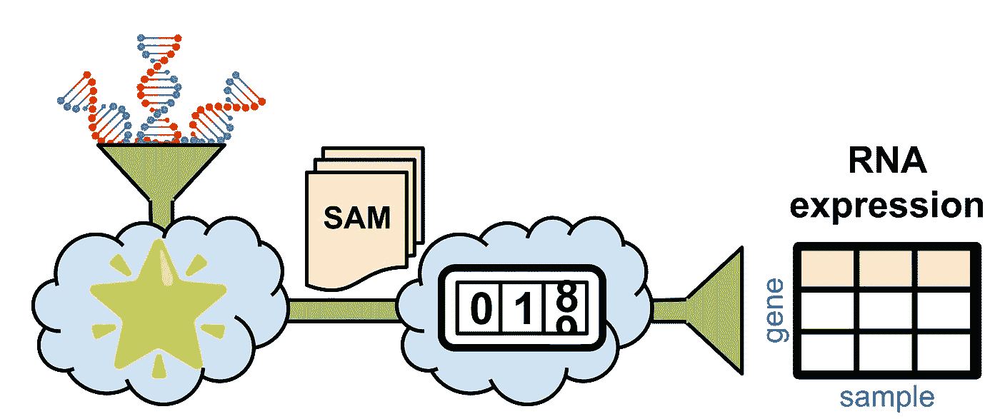
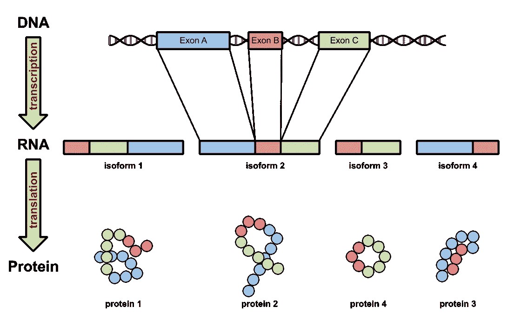
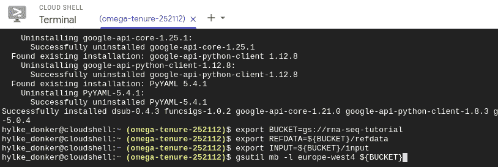
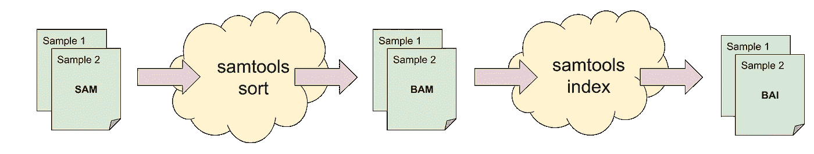
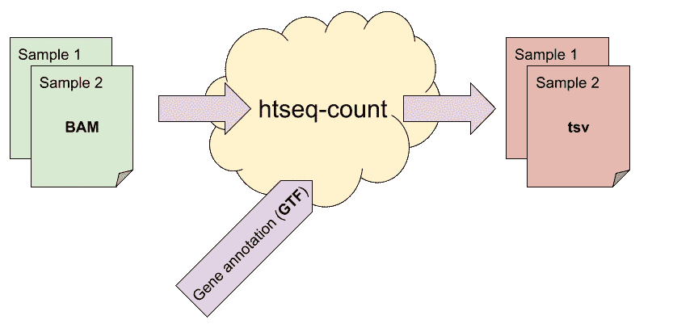

# 云上的生物信息学第二部分

> 原文：<https://towardsdatascience.com/bioinformatics-on-the-cloud-part-ii-a99ccfea913a?source=collection_archive---------29----------------------->

## [理解大数据](https://towardsdatascience.com/tagged/making-sense-of-big-data)

## 在 Google 云平台上使用 HTSeq 计算 RNAseq 表达式



使用 STAR 和 HTSeq-count 的云上的 RNAseq 分析管道。图片作者。

# 关联

仅在医疗保健领域，估计到 2025 年将有 6000 万患者的基因组编码被测序[1]。测序成本的下降和医学的进步推动了这一增长。重要的是，细胞水平上的信息可以用来帮助指导患者治疗。但是如何分析这些海量数据呢？我们需要的是能够根据问题的规模进行扩展的工具和基础设施。

进入云技术！

# 范围

本教程将带你通过谷歌云平台上的 RNAseq 计算*基因表达*(即每个基因的 RNA 物质数量)的步骤。

## 目标

*   了解什么是基因表达。
*   使用`samtools`为下游分析预处理 SAM 文件。
*   用`htseq-count`计算基因表达。

# 背景



图 1:电池装配线的示意图。DNA 指令通过 RNA 转化成蛋白质。图片作者。

细胞的大部分艰苦工作都是由蛋白质完成的。为了构建它们，细胞表达指令，这些指令被编码在被称为*基因的 DNA 中的特定区域。*细胞在级联过程中合成蛋白质，其中基因的 DNA 首先作为*前体信使-RNA 被读出(*转录*)。*这种前体随后被转化为*信使 RNA —* 或简称为*mRNA。*最后，细胞*在*转移 RNA* 的帮助下将*mRNA 翻译成蛋白质。通过分析 RNAseq 数据，我们可以推断出样本中表达了哪种类型的 RNA 物质，以及有多少。因此，RNAseq 数据向我们展示了细胞装配线中途的快照。虽然这些快照不能给出细胞状态的完整图像，但它们无疑是细胞下游发生的实际过程的有用替代物。通过这种方式，RNAseq 可以帮助了解细胞机制的基础，例如，特定的疾病。

就我们的目的而言，重要的是要认识到 DNA 中的指令并没有一对一地映射到最终产品(蛋白质)上。在转录阶段，只有 DNA 的编码区(基因的*外显子*)被保留下来，在一个称为*剪接*的过程中形成*转录本*。去除非编码区(内含子*)后，剩余的外显子可以以各种方式组合。如图 1 所示，单个 DNA 片段因此可以产生组合数量的相关转录物，称为*同种型*。反过来，由于控制蛋白质折叠过程的竞争性偶极相互作用，每个同种型翻译成独特的三维结构。*

## *概括*

*[在之前的](/bioinformatics-on-the-cloud-144c4e7b60d1)中，我们讨论了如何理解在*测序仪*上生成的大量小碱基阵列(`A`、`C`、`T`、&、`G`)，称为*读数*。我们讨论了如何在一个称为参照基因组比对的过程中把拼图(参照基因组)的碎片(阅读)放在一起。使用 [STAR](https://github.com/alexdobin/STAR) ，我们能够将测序机的原始数据以 [FASTQ](https://en.wikipedia.org/wiki/FASTQ_format#:~:text=FASTQ%20format%20is%20a%20text,single%20ASCII%20character%20for%20brevity.) 格式转换成一组 [SAM](https://en.wikipedia.org/wiki/SAM_(file_format)) 文件。本教程将会更进一步。我们将使用 SAM 文件，使用 [HTSeq-count](https://htseq.readthedocs.io/en/release_0.11.1/count.html) [2]计算每个基因产生了多少 RNA，这是一种使用谷歌云平台的可扩展方式。*

## *基因表达*

*量化 RNAseq 从计数开始:我们跟踪所有可能的转录物，并计算出现的次数。在其最基本的形式中，这正是*基因表达*的含义:每个基因的 RNA 计数表。这听起来很简单，但请记住，我们的转录本在测序前就被粉碎成小片段。因此，为了将一段 RNA 分配给一个转录本，我们需要一个转录本目录——一个*转录组—* 来选择。与排列好的 RNA 碎片(SAM 格式)一起，`htseq-count`将汇总数据，建立一个计数表。*

# *初步步骤*

*说够了，该编码了！打开[谷歌云平台仪表盘](https://console.cloud.google.com/)，点击右上角的云壳图标(图 2)启动终端。*

**

*图 2:谷歌云平台中的云壳图标。图片作者。*

*我们将利用 [dsub](https://github.com/DataBiosphere/dsub) 在 Google 云平台上分配我们的生物信息学工作量。要安装`dsub`，请执行:*

```
***sudo pip3** install dsub*
```

*在你的云壳里。*

**

*图 3:在 Google 云平台上的云壳中创建一个存储桶。图片作者。*

*接下来，我们将需要一个位置，一个*桶*，来在云上存储我们的文件。选择一个唯一的名称，例如`gs://rna-seq-tutorial`，并创建存储桶(`mb`):*

```
***export** BUCKET=gs://rna-seq-tutorial
**export** REFDATA=${BUCKET}/refdata
**export** INPUT=${BUCKET}/input
**gsutil mb** -l europe-west4 ${BUCKET}*
```

*如果你已经成功地完成了之前的教程，在那里我们使用 STAR 对齐了 FASTQ 文件，你应该已经生成了两个文件:`sample1.sam`和`sample2.sam`。如果没有，下载并复制样本文件到*输入*目录:*

```
***wget** -O - [https://tinyurl.com/jnetj2u3](https://tinyurl.com/jnetj2u3) \
    | **gsutil cp** - *"${INPUT}/sample1.sam"*
**wget** -O - [https://tinyurl.com/7exr8jsn](https://tinyurl.com/7exr8jsn) \
    | **gsutil cp** - *"${INPUT}/sample2.sam"**
```

*我们还需要人类基因组的基因转录本目录(*转录组)*，通常是`gff3`或`gtf`格式。如果你愿意，你可以直接从头构建一个转录组——这被称为*转录组组装——*但为了简单起见，我们将依赖于 Gencode 之前策划的[人类基因组注释](https://www.gencodegenes.org/human/)。*

*将转录组文件下载到新创建的 bucket 的 *refdata* 目录中，如下所示:*

```
***wget** -O - [https://tinyurl.com/vteb57e2](https://tinyurl.com/vteb57e2) \
    | **zcat** \
    | **gsutil cp** - *"${REFDATA}/gencode.v36.chr_patch_hapl_scaff.annotation.gff3"**
```

*最后，启用[云生命科学 API](https://console.cloud.google.com/apis/library/lifesciences.googleapis.com?q=cloudlife%20science) 开始使用`dsub`。*

# *预处理校准文件*

**

*图 4:使用`samtools`的预处理步骤概述。图片作者。*

*在我们可以通过计算 RNA 转录物来量化基因表达之前，我们需要预处理我们的 SAM 文件。HTSeq-count 要求 SAM 文件按照染色体位置分类，并附带索引文件，以便快速访问特定位置的读数。这两者都可以通过一个叫做 [samtools](https://github.com/samtools/samtools) 的小工具来完成。用以下内容创建一个名为`step1.sh`的文件(见图 4):*

```
*#!/bin/bash
*# a) Sort SAM file on genomic position.*
**samtools** **sort** \
    --threads 2 \
    --output-fmt BAM \
    -o ${BAM} \
    ${SAM}*# b) Create index of sorted BAM file.*
**samtools** **index** \
    -@ 2 \
    ${BAM} \
    ${BAI}*
```

*顾名思义，第一个命令对 SAM 文件进行排序，并将其压缩成(更小的)二进制 [BAM](https://en.wikipedia.org/wiki/SAM_(file_format)) 格式(`--output-fmt BAM`)。然后在两个线程上使用`samtools index`对生成的 BAM 文件进行索引(`-@ 2`)。注意，在这一点上，Bash 变量`${SAM}`、`${BAM}`和`${BAI}`还没有定义。当我们将工作负载(`step1.sh`)提交给云时，这些将由`dsub`提供。为此，首先创建一个[制表符分隔的值文件](https://en.wikipedia.org/wiki/Tab-separated_values) `step1.tsv`，包含以下字段*

```
*--input SAM	--output BAM	--output BAI
<my-bucket>/input/sample1.sam	<my-bucket>/output/step1/sample1_sorted.bam	<my-bucket>/output/step1/sample1_sorted.bam.bai
<my-bucket>/input/sample2.sam	<my-bucket>/output/step1/sample2_sorted.bam	<my-bucket>/output/step1/sample2_sorted.bam.bai*
```

*用您的 bucket 位置替换`<my-bucket>`(在我们的例子中是`gs://rna-seq-tutorial`)，并仔细检查这些值是否由制表符(而不是空格)分隔。正如您可以从标题中推断的那样，这些列指的是脚本中的变量`${SAM}`、`${BAM}`和`${BAI}`。创建这个`tsv`文件允许我们快速地将我们的计算扩展到任意大小，因为`dsub`将为`step1.tsv`文件中的每一行启动单独的工作线程。要启动实际的工作负载，请执行*

```
***dsub** \
    --provider google-cls-v2 \
    --project <my-project> \
    --location europe-west4 \
    --zones europe-west4-a \
    --preemptible \
    --min-ram 8 \
    --min-cores 2 \
    --logging "${BUCKET}/logging/step1/" \
    --image registry.gitlab.com/hylkedonker/rna-seq \
    --tasks step1.tsv \
    --script step1.sh*
```

*决定你是否要冒着工作终止的风险去寻找更便宜的先占计算(`--preemptible`)，并用你的谷歌云平台项目 ID 替换`<my-project>`。这将启动两个工作线程(`step1.tsv`中的每条线一个)，具有 8gb 的 RAM ( `--min-ram 8`)和两个虚拟内核(`--min-cores 2`)。每个工人运行一个 Docker 映像(`--image`)，其中包含运行`step1.sh`所需的生物信息学工具。Dsub 自动负责将文件从`step1.tsv`中的`--input SAM`列复制到`step1.tsv`中的`--output BAM`和`--output BAI`列。*

*当我们的工作负载在云上运行时，让我们为下一步做准备。*

# *计算基因表达*

**

*图 5:使用 htseq-count 估计 RNA 丰度的概述。图片作者。*

*计算 RNAseq 听起来似乎很简单。但是要知道，大多数现代测序机器并不能完全测量 RNAseq 片段。相反，他们产生仅测量片段两端的成对末端测序数据。更糟糕的是，如何统计一个跨越多个基因的片段？幸运的是，`htseq-count`用非常合理的缺省值解决了这些问题。*

*为此(如图 5 所示)，创建一个名为`step2.sh`的文件，其内容如下:*

```
*#!/bin/bash
# Compute expression
**htseq-count** \
    --stranded=reverse \
    --order pos \
    --format bam \
    --additional-attr=gene_name \
    --type gene \
    -n 2 \
    ${BAM} \
    ${GTF} \
    -c ${COUNTS}*
```

*这里，我们使用位置排序(`--order pos` ) BAM 文件(`--format bam`)和两个内核(`-n 2`)上的 Gencode 基因注释，运行`htseq-count`来合计每个基因的计数(`--type gene`)。需要注意的一个重要方面是，在样品制备过程中是否使用了链识别文库，该文库可以在处理过程中保留 RNA 的链。(如果您不确定， [RSeQC](http://rseqc.sourceforge.net/) 的`infer_experiment.py`工具可以帮助您识别样品的滞留情况。)在我们的例子中，[我们的数据](https://github.com/griffithlab/rnaseq_tutorial/wiki/RNAseq-Data)是使用 TruSeq，一个链特定的库[3]生成的，因此我们使用`--stranded=reverse`标志。类似于我们的预处理计算作业，我们创建一个制表符分隔的文件`step2.tsv`，它列出了输入 BAM +索引文件和相应的计数文件(以`tsv`格式)，每个样本一行:*

```
*--input BAM	--input BAI	--output COUNTS
gs://<my-bucket>/output/step1/sample1_sorted.bam	gs://<my-bucket>/output/step1/sample1_sorted.bam.bai	gs://<my-bucket>/output/step2/sample1.tsv
gs://<my-bucket>/output/step1/sample2_sorted.bam	gs://<my-bucket>/output/step1/sample2_sorted.bam.bai	gs://<my-bucket>/output/step2/sample2.tsv*
```

*不要忘记用您的存储位置替换`<my-bucket>`,并仔细检查您是否正确地复制了制表符(而不是空格)。在提交下一个工作负载之前，让我们通过查询它的状态来检查上一个作业是否成功完成*

```
***dstat** \
    --provider google-cls-v2 \
    --project <my-project> \
    --location europe-west4 \
    --status '*'*
```

*如果一切正常，我们准备提交下一个工作负载。*

```
***dsub** \
    --provider google-cls-v2 \
    --project <my-project> \
    --location europe-west4 \
    --zones europe-west4-a \
    --preemptible \
    --min-ram 8 \
    --min-cores 2 \
    --logging "${BUCKET}/logging/step2/" \
    --input GTF=${REFDATA}/gencode.v36.chr_patch_hapl_scaff.annotation.gff3 \
    --image registry.gitlab.com/hylkedonker/rna-seq \
    --tasks step2.tsv \
    --script step2.sh*
```

*与前面的提交命令唯一的细微差别是我们直接向`dsub`而不是`tsv`文件提供了`--input GTF`标志，因为它对于每个工作负载都是相同的。*

*成功完成工作量后(使用`dstat`查询状态)，您应该有一个每个样本的计数表(`sample<i>.tsv`)。您可以通过执行以下命令轻松验证这一点*

```
***gsutil ls** "${BUCKET}/output/step2/"*
```

*显示每个相应样本的`tsv`文件。(如果没有，您可能想看看日志`gsutil ls "${BUCKET}/logging/step2/`看看哪里出错了。).*

*瞧，您刚刚量化了样品的基因表达！*

# *讨论*

## *基因表达计数*

*在总结之前，我们应该提到，如果您想要比较单个样本，您的计数需要一个额外的标准化步骤。在每次实验运行中，测序仪将给出不同总数的*读数*。此外，因为 RNA 转录物在测序前被粉碎成片段，较长的转录物将产生更多的片段。因此，适当选择的变换有助于协调样本的表达估计。幸运的是，大多数下游分析包，如[修边机](http://bioconductor.org/packages/release/bioc/html/edgeR.html)、 [limma](https://bioconductor.org/packages/release/bioc/html/limma.html) 和 [DeSeq2](https://bioconductor.org/packages/release/bioc/html/DESeq2.html) 会为您完成这项工作，事实上，**需要**计数数据作为输入。*

## *`Dsub`和朋友*

*在本教程中，我们转向`dsub`将我们的计算分派给虚拟*工作者*。Dsub 非常适合在云上开始，尤其是当您想要做一次或几次特定的分析时。但它绝不是唯一的工具，尤其是如果你想以可重复、容错的方式一遍又一遍地运行相同的工具序列——所谓的*工作流*。 [Snakemake](https://snakemake.readthedocs.io/en/stable/) 和 [Nextflow](https://www.nextflow.io/) 是帮助您在云上运行生产工作流的工具的很好例子。然而，如果你喜欢工具不可知的方法，你可以考虑[通用工作流语言](https://www.commonwl.org/) (CWL)，它是一个以 YAML 格式表达工作流的开放标准。*

# *结束语*

*就这样，您已经成功地使用 HTSeq 计算了云上的基因表达！注意扩展我们的分析是多么容易:预处理和计数 1000 个样本的 RNAseq 而不是 2 个样本，只需扩展制表符分隔的文件。*

*如果你有有用的`htseq-count`技巧或有趣的云技巧要分享，或者对代码有任何改进，请发表评论。*

# *参考文献:*

*[1]: E. Birney、J. Vamathevan 和 P. Goodhand。医疗保健中的基因组学:GA4GH 展望 2022 年。“bior XIV(2017):203554。*

*[2]: Anders *等*[ht seq——一个处理高通量测序数据的 Python 框架。](https://academic.oup.com/bioinformatics/article/31/2/166/2366196?login=true)《生物信息学》31.2(2015):166–169。*

*[3]: M .格里菲斯*等*"[RNA 测序信息学:云上分析的网络资源。](https://journals.plos.org/ploscompbiol/article?id=10.1371/journal.pcbi.1004393)《PLoS Comput Biol 11.8(2015):e 1004393。*

**本教程是主要与 Bram van Es 合作的副产品，我们试图揭示免疫疗法(一种用于抗癌的药物)背后的生物模式。**