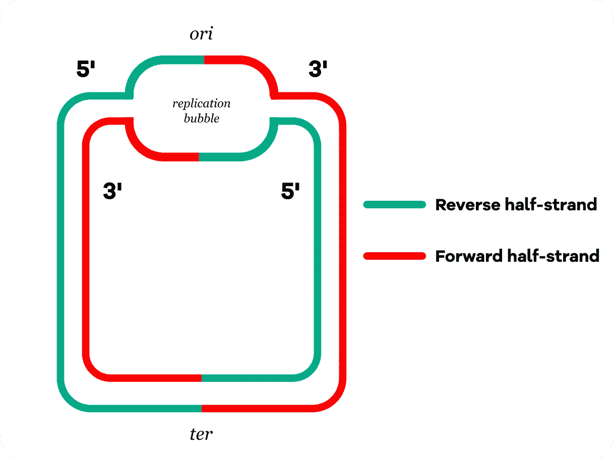
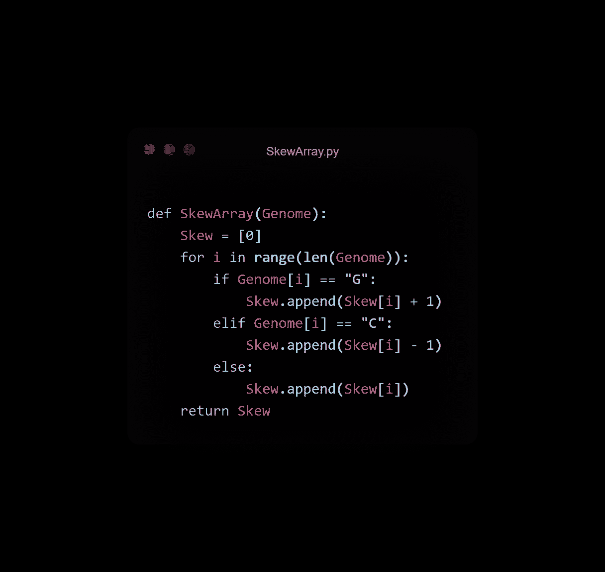
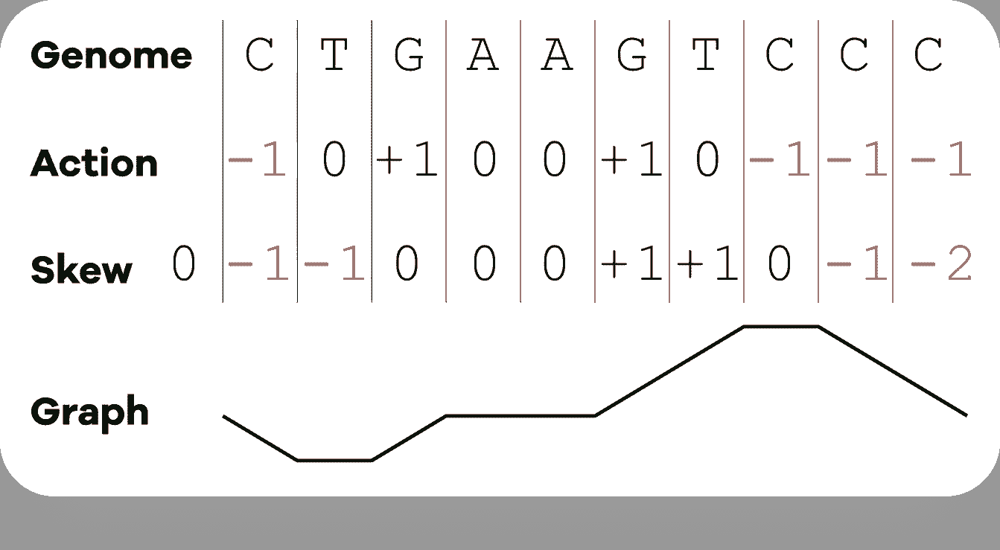
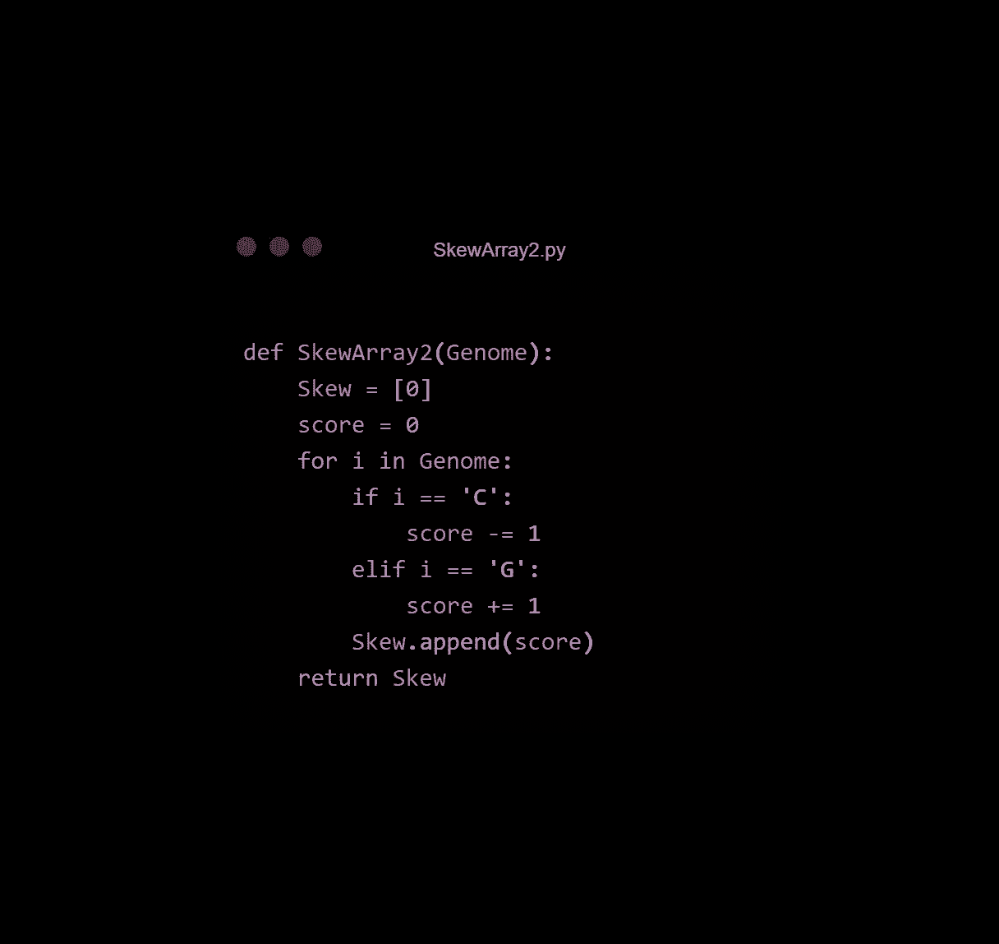
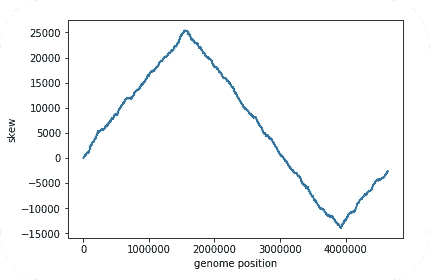
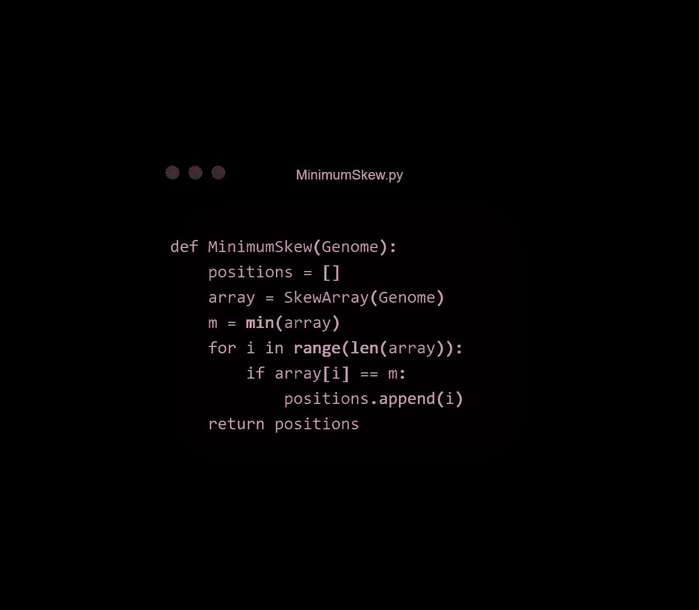
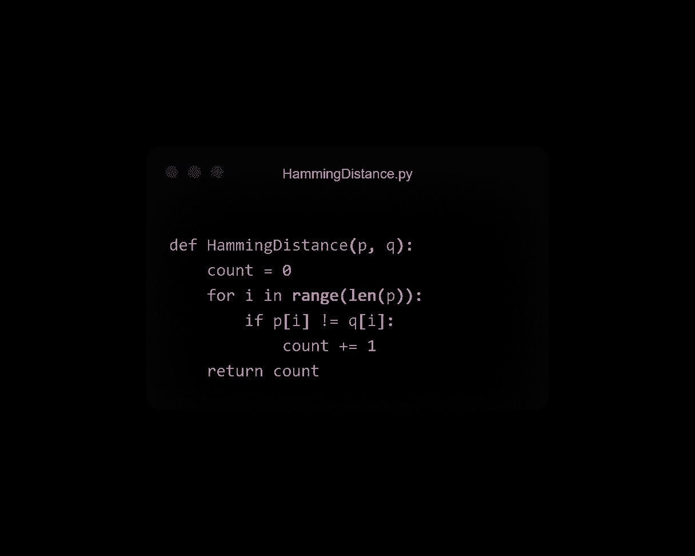
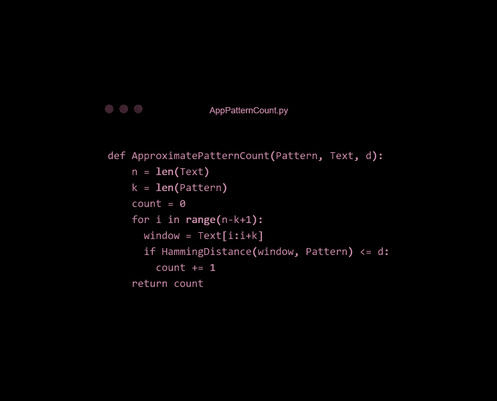
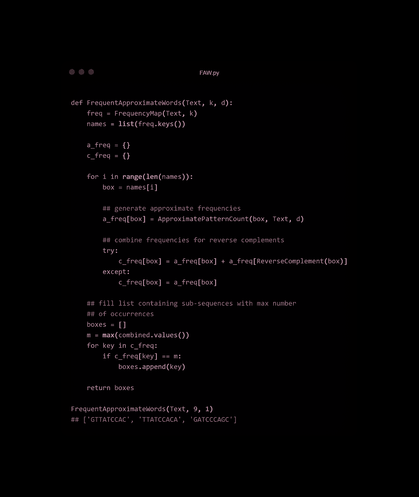

# 为什么生物学和代码是天作之合

> 原文：<https://towardsdatascience.com/biology-code-match-518202a71d8d?source=collection_archive---------20----------------------->

## 利用 Python 寻找大肠杆菌基因组的 ori 区域


来自[的图标 8 的插图哎哟！](https://icons8.com/illustrations/)

**你知道吗，在美国几乎一半的婚姻都以离婚告终。生物学和代码的结合不是那种婚姻，在本文结束时我会向你证明这一点。**

在早期的[文章](/tanks-bioinformatics-c233fb76787b)中，我在霍乱弧菌的 *ori* 区域寻找 DnaA 盒。但是如果我们不知道 ori 在基因组中的位置呢？

秘密在于将生物知识转化为基于代码的解决方案。

```
(This article assumes you have a comfortable grasp on Python and DNA replication.)
```

# "我们来谈谈 DNA 复制吧，小蜜蜂！"—佩帕盐沼，1990 年。

细菌不对称地复制它们的基因组。

*   **一半被连续复制:** DNA 聚合酶把核苷酸串在一起，没有任何间断。
*   **另一半不连续复制:**合成了许多 DNA 的短片段，然后缝合在一起，形成一条连续的链。

*更多信息* [*此处*](https://www.mun.ca/biology/scarr/Continuous_Discontinuous_DNA_synthesis.html) *。*

细菌染色体是圆形的，DNA 复制从*或*区域开始，因此我们可以将染色体分成 4 个半链:

*   **反向半股**:正向半股的*连续合成模板，从 *ori* 开始，往 3’到 5’方向走。*
*   **正向半股**:反向半股的*不连续合成模板，从 *ori* 开始，往 5’到 3’方向走。*



复制从复制泡的两侧进行，并终止于与 ori 区相对的 ter 区。|作者。

在视频中，你有没有注意到前面的半股通常是单股的？这增加了 **C 脱氨基(突变)成 T** 的机会。

我们可以从这些知识中得出三个结论:

*   脱氨作用在进化史中反复发生，因此**正向半链通常含有较少的胞嘧啶**。
*   当反向半链在突变的正向半链模板上合成时，DNA 聚合酶将收集 **A** (与 T 配对)**而不是 G** (与 C 配对)。**反向半链往往会有较少的鸟嘌呤。**

最重要的是…

*   沿着基因组的 5’到 3’方向，**反向半链在*或*区域与正向半链相遇。**

# “我是歪斜的哒-巴-迪-哒-巴-哒”——埃菲尔 65，1998。

让我们称 Gs 和 Cs 的数量之差为“偏斜”:

```
skew = #G - #C
```

*   在前半股上，#G > #C
*   在反向半链上，每个窗口中的# G< #C

If we window across the genome and see that skew is rising, we’re finding **Cs 更少—我们在正向半链上**。偏斜正在减少？更少的 g——我们在反向半链上。

# 代码

由于 *ori* 是在反向半股与正向半股相遇的地方发现的，所以我们可以通过观察偏斜何时从减小切换到增大来发现 *ori* 。也就是最小偏斜。



作者使用 [ray.so](http://ray.so)

取一个字符串`Genome`作为参数。我们首先创建一个列表`Skew`，其中第 0 个索引值为 0。`Skew`中的每个元素都是基因组中该点的`#G — #C`的连续计数。在第 0 个核苷酸处(第一个核苷酸之前)，`Skew = 0`。

接下来，我们搜索整个基因组，并将`Genome`中的第 *i* 个字符与“G”或“C”进行比较:

*   如果是前者，我们对偏斜的运行计数加 1，并将其添加到列表`Skew`。
*   如果是后者，我们-1 和做同样的事情。
*   如果都不是，偏斜保持不变。

下面是它如何发挥作用的示意图:



按作者

这个函数的另一个版本(归功于 Cristian Alejandro Fazio Belan)更加直观:



作者使用[雷.索](http://ray.so)

这里，我们更新运行总数`score`并将该值追加到列表中。

我们可以把这个列表画出来:



按作者

我们通过编写一个快速函数来返回偏斜最小的所有值，从而找到偏斜最小的点:



由作者使用 [ray.so](http://ray.so)

```
>>> positions = MinimumSkew(Genome)
>>> print(positions)[3923620, 3923621, 3923622, 3923623]**Alternatively, you can simply do the following:**>>> skew = SkewArray(Genome)
>>> print(skew.index(min(skew)))3923620
```

对于大肠杆菌，似乎*或*在第 3923620 个核苷酸附近。

# 所以我们知道 ori 在哪里。也许吧。我们如何证实这一点？

在早期的[文章](/tanks-bioinformatics-c233fb76787b)中，我们发现了如何在基因组序列中找到 DnaA 盒。它们通常是 9 个碱基的序列(9 聚体)，DnaA 蛋白与之结合以启动 DNA 复制。

如果我们在已经找到的点(平均长度为*或*)切割 500 个碱基，并应用上一篇文章中的 FrequencyMap 和 FrequentWords *函数…

```
>>>for i in range(3,10):
       print(i, ":", FrequentWords(Text, i))3 : ['GAT']
4 : ['GATC']
5 : ['GGATC']
6 : ['AGGATC']
7 : ['AAGGATC']
8 : ['AAAGGATC', 'AAGGATCC', 'AGGATCCG', 'GGATCCGG', 'CTGGGATC', 'GATCCTGG', 'GATCGCAC', 'TGGATAAC']
9 : ['AAGGATCCG', 'AGGATCCGG']
```

…我们找不到任何出现 3 次以上的 9 聚体/反向互补体。

```
*(FrequencyMap scans across a sequence and creates a dictionary that contains all possible k-mers in that sequence as keys, and the number of times they occur as values. FrequentWords returns the most frequents k-mers)
```

生物知识再一次拯救了我们。 DnaA 蛋白质也可以结合到*大致*相同的 DnaA 盒上。

**两个有少量错配的 9 聚体仍能结合 DnaA。**

不匹配的次数可以称为**汉明距离**。让我们写一个找到这个的函数:



作者使用[雷.索](http://ray.so)

将两个字符串`p`和`q`作为参数，并遍历两者的每个字符。如果不相等，增加`count`。

我们可以从频数图中提取 9 聚体，并将其用作更新的模式计数函数的输入:



由作者使用 [ray.so](http://ray.so)

这里，`Pattern`是我们的任何一个 9 聚体，`Text`是我们在 *ori* 取的 500 碱基切片，`d`是我们能容忍的最大错配数。

我们在假设的*或*区域范围内，将`window`与`Pattern`进行比较，T7 是我们通过频率图找到的任何一个 9 聚体/它们的反向互补体。如果它们有 1 个或更少的不匹配，我们增加计数。



这个函数不是非常高效，但是可以完成工作。|作者使用 [ray.so](http://ray.so) |注意:ReverseComplement 函数的代码可以在这里找到[。](/tanks-bioinformatics-c233fb76787b)

这样做，我们就找到了`TTATCCACA`。它和它的反向互补`TGTGGATAA` 就是实验确定的大肠杆菌的 DnaA 盒！

但如你所见，他们不是唯一的。其他九聚体同样频繁出现。那么，为什么这很重要呢？重点是什么？

通过收集一些可能的九聚体及其在基因组上的位置，我们可以给实验者指明方向，并帮助他们节省实验室时间。

代码清理干草，这样生物学家可以更快地找到针。

# 生物学和计算机科学的结合是不寻常的，因为它通常是成功的结合。

*哈！找到了。*

理解生物学有助于我们做出高效有用的算法。

使用生物数据代码有助于生物学家完善他们的实验。

如果你能驾驭生物和 CS 的联姻，你就拥有超能力。你可以积累特定的知识，很可能变得非常富有。最重要的是，你可以做重要的工作来帮助人们。

*感谢阅读！这篇文章是基于我在 Coursera 上参加的* [*初学者生物信息学*](https://www.coursera.org/learn/bioinformatics) *课程的一课。*