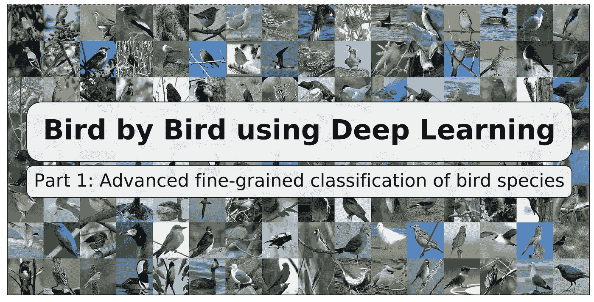
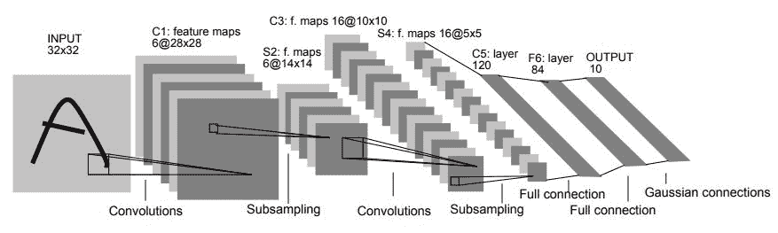
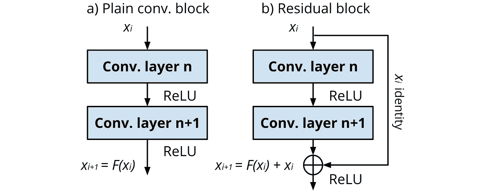
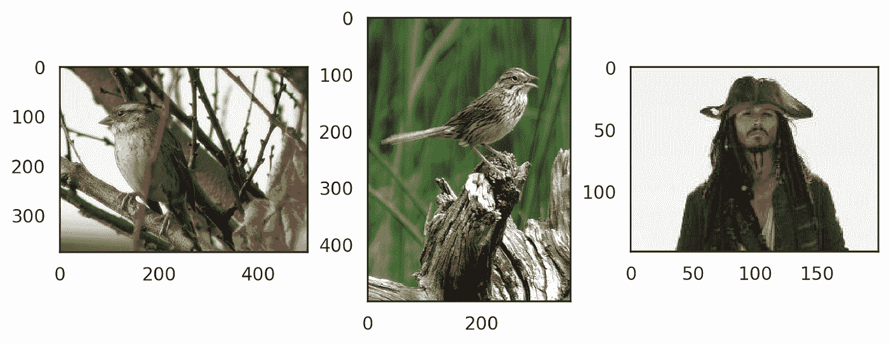
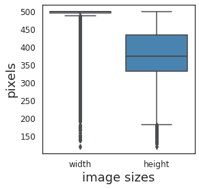
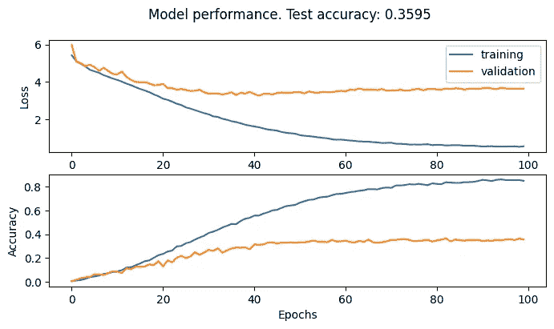
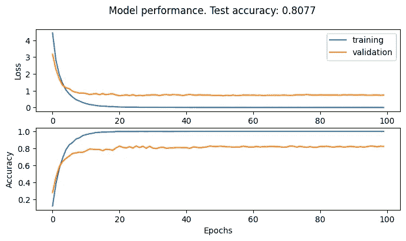
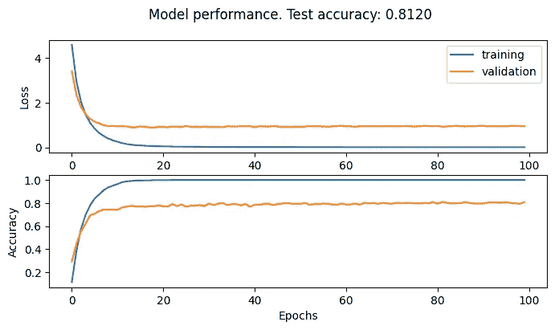
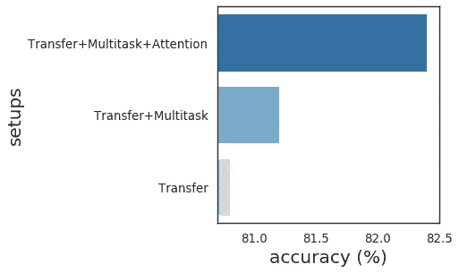

# 一只接一只地使用深度学习

> 原文：<https://towardsdatascience.com/bird-by-bird-using-deep-learning-4c0fa81365d7?source=collection_archive---------7----------------------->

## 第一部分。利用迁移学习、辅助任务和注意提出用于细粒度分类的 CNN 模型



作者图片

本文展示了如何改进用于图像相关任务的深度学习模型，以解决细粒度分类问题。为此，我们将完成以下两个部分。首先，您将熟悉计算机视觉和卷积神经网络的一些基本概念，而第二部分将演示如何使用 PyTorch 将这些知识应用于鸟类分类的实际问题。具体来说，您将学习如何构建自己的 CNN 模型-ResNet-50，以使用迁移学习、辅助任务和注意力增强架构，甚至更多来进一步提高其性能。

# 介绍相关工作

## 深度学习在计算机视觉中的应用

在处理数字时，计算机的表现非常出色。为了让人类登上月球而解无数方程？没问题。确定图像中出现的是猫还是狗？哎呀……这个对任何人来说天生容易的任务对第一台计算机来说似乎是不可能的。这些年来，算法和硬件一样进化(还记得摩尔定律吗？国际注册会计师协会)。计算机视觉领域的出现是对使用计算机解决图像分类任务的一种尝试。经过长时间的发展，许多复杂的方法被创造出来。然而，它们都缺乏可推广性:一个用来分类猫和狗的模型不能区分，例如，鸟。

## 卷积神经网络的设计原则

1989 年，Yann LeCun 和他的同事们已经提出了[【1】](https://www.mitpressjournals.org/doi/abs/10.1162/neco.1989.1.4.541)，并进一步发展了[【2】](http://yann.lecun.com/exdb/publis/pdf/lecun-01a.pdf)卷积神经网络(CNN)的概念。该模型本身受到人类视觉皮层的启发，在视觉皮层中，视觉神经元负责肉眼可见的一小部分图像——神经元的感受野。在结构上，它以单个卷积神经元(滤波器)逐步扫描输入图像的方式表达，多次应用于图像的不同部分，这涉及到权重共享的概念(图 1)。



图一。LeCun 的 LeNet-5，卷积神经网络模型，由卷积和子采样操作组成，后面是全连接层，处理前几层提取的数据以形成最终输出(改编自[2])

## 走向剩余网络

当然，从 LeCun 的 LeNet-5，开始，CNN 模型的最新水平已经有了很大的发展。Alex net[【3】](https://papers.nips.cc/paper/2012/file/c399862d3b9d6b76c8436e924a68c45b-Paper.pdf)第一个成功的大规模架构问世，赢得了 ILSVRC 2012 挑战赛，实现了 15.3%的前 5 名错误率。后来的发展给出了许多强大的模型，这些模型主要是在更大和更复杂的架构的使用过程中得到改进的。问题是，随着网络越来越深(深度在增加)，它的性能变得饱和并开始下降。为了解决这个问题，残差神经网络(ResNet)被开发出来[【4】](https://arxiv.org/abs/1512.03385)，以有效地将输入引导到某些层(也称为跳过或残差连接)。



图二。跳过 ResNets 的连接块

ResNet 架构的核心思想是将一部分信号传递到未经处理的卷积块的末端(仅通过复制值)，以扩大通过深层的梯度流(图 2)。因此，跳过连接保证了模型的性能不会降低，但可能会略有提高。

下一部分解释了讨论的理论如何实际应用于解决现实世界的问题。

# 利用 ResNet 进行鸟类分类

鸟类物种识别是一项挑战人类专家和计算机视觉能力的艰巨任务。与细粒度分类问题相关的一个有趣的数据集是 Caltech-UCSD Birds-200-2011(CUB-200-2011)[【5】](https://authors.library.caltech.edu/27452/1/CUB_200_2011.pdf)由属于 200 个物种的 11788 幅鸟类图像组成。为了解决这个问题，本教程的目标将是:(a)建立一个 CNN 模型，根据鸟类的种类对鸟类图像进行分类；(b)确定如何使用不同结构的 CNN 提高基线模型的预测精度。为此，我们将使用 PyTorch，这是最流行的深度学习开源框架之一。

本教程结束时，您将能够:

*   了解鸟类图像分类问题的基本知识。
*   确定数据驱动的图像预处理策略。
*   为图像分类创建自己的深度学习管道。
*   建立、训练和评估 ResNet-50 模型以预测鸟类。
*   通过使用不同的技术来提高模型性能。

首先，您需要下载包含数据集的归档文件，并将其存储到 *data* 目录中。可以通过下面的[链接](http://www.vision.caltech.edu/visipedia/CUB-200-2011.html)手动完成，或者使用下面的 GitHub 库中提供的 Python 代码:

<https://github.com/slipnitskaya/caltech-birds-advanced-classification>  

现在，让我们导入将在本教程中使用的包:

```
# import packages
import os
import csvimport numpy as np
import sklearn.model_selection as skmsimport torch
import torch.utils.data as td
import torch.nn.functional as Fimport torchvision as tv
import torchvision.transforms.functional as TF# define constants
DEVICE = 'cuda' if torch.cuda.is_available() else 'cpu'
RANDOM_SEED = 42IN_DIR_DATA = 'data/CUB_200_2011'
IN_DIR_IMG = os.path.join(IN_DIR_DATA, 'images')
```

## 发现最佳数据转换策略

在本教程中，我们计划使用 ImageNet 数据集预先训练一个基线模型。由于预先训练的模型通常希望输入图像以同样的方式进行规范化，因此高度和宽度至少应为 224 x 224 像素。可能有许多图像变换的方法可以用来满足上述规范，但什么可能是最佳的呢？

探索性数据分析是任何数据科学项目的基本起点，为进一步分析奠定基础。因为我们对定义最佳数据转换策略感兴趣，所以我们将研究鸟类图像，看看我们能抓住什么有用的东西。让我们来看看麻雀家族的一些鸟类例子(图 3)。似乎不同种类的鸟类之间有很高的相似性，这很难发现。那是白喉雀还是林肯雀？嗯，即使是专家也会感到困惑…



图 3。难以区分的同科鸟类:白喉麻雀 vs .林肯麻雀(CUB-2002011)，vs .杰克斯派洛船长([公共领域](https://en.wikipedia.org/wiki/Jack_Sparrow#/media/File:Jack_Sparrow_In_Pirates_of_the_Caribbean-_At_World's_End.JPG))

出于兴趣，我们将总结 Sparrow 家族的所有类，以了解我们的数据集中有多少类:

```
# calculate the number of sparrow species
cls_sparrows = [k for k in os.listdir(IN_DIR_IMG) if 'sparrow' in k.lower()]
print(len(cls_sparrows))
```

上面的代码给我们的值是 21，这意味着一个家族只能代表十几个不同的物种。现在我们看到了为什么 CUB-200-2011 是为细粒度分类而完美设计的。我们所拥有的是许多相似的鸟类，它们可能与不同的种类有关，实际上，我们计划在这里处理这个问题。

但是在进入真正的深度学习之前，我们想确定一个合适的数据预处理策略。为此，我们将通过可视化相应观察值的箱线图来分析宽度和高度的边际分布:



图 4。鸟类图像大小的可变分布。方框反映了图像大小分布(宽度和高度)的四分位范围，方框内的中间四分位线标记了数据的中点，触须分别代表 Q1 和 Q3 的较大和较小观察值，外侧点表示位于总体分布之外的数据

事实上，图像的大小变化很大。我们还看到大多数图像的高度和宽度分别等于 375 和 500 像素。那么，对于这种数据，什么是合适的转换策略呢？

## 转换图像和分割数据

CUB-200-2011 数据集包含数千幅图像，因此可能会影响计算时间。为了克服这个问题，我们首先创建类`DatasetBirds`来简化数据加载和预处理:

```
class DatasetBirds(tv.datasets.ImageFolder):
    """
    Wrapper for the CUB-200-2011 dataset. 
    Method DatasetBirds.__getitem__() returns tuple of image and its corresponding label.    
    """
    def __init__(self,
                 root,
                 transform=None,
                 target_transform=None,
                 loader=tv.datasets.folder.default_loader,
                 is_valid_file=None,
                 train=True,
                 bboxes=False): img_root = os.path.join(root, 'images') super(DatasetBirds, self).__init__(
            root=img_root,
            transform=None,
            target_transform=None,
            loader=loader,
            is_valid_file=is_valid_file,
        ) self.transform_ = transform
        self.target_transform_ = target_transform
        self.train = train

        # obtain sample ids filtered by split
        path_to_splits = os.path.join(root, 'train_test_split.txt')
        indices_to_use = list()
        with open(path_to_splits, 'r') as in_file:
            for line in in_file:
                idx, use_train = line.strip('\n').split(' ', 2)
                if bool(int(use_train)) == self.train:
                    indices_to_use.append(int(idx)) # obtain filenames of images
        path_to_index = os.path.join(root, 'images.txt')
        filenames_to_use = set()
        with open(path_to_index, 'r') as in_file:
            for line in in_file:
                idx, fn = line.strip('\n').split(' ', 2)
                if int(idx) in indices_to_use:
                    filenames_to_use.add(fn) img_paths_cut = {'/'.join(img_path.rsplit('/', 2)[-2:]): idx for idx, (img_path, lb) in enumerate(self.imgs)}
        imgs_to_use = [self.imgs[img_paths_cut[fn]] for fn in filenames_to_use] _, targets_to_use = list(zip(*imgs_to_use)) self.imgs = self.samples = imgs_to_use
        self.targets = targets_to_use if bboxes:
            # get coordinates of a bounding box
            path_to_bboxes = os.path.join(root, 'bounding_boxes.txt')
            bounding_boxes = list()
            with open(path_to_bboxes, 'r') as in_file:
                for line in in_file:
                    idx, x, y, w, h = map(lambda x: float(x), line.strip('\n').split(' '))
                    if int(idx) in indices_to_use:
                        bounding_boxes.append((x, y, w, h)) self.bboxes = bounding_boxes
                else:
            self.bboxes = None def __getitem__(self, index):
        # generate one sample
        sample, target = super(DatasetBirds, self).__getitem__(index) if self.bboxes is not None:
            # squeeze coordinates of the bounding box to range [0, 1]
            width, height = sample.width, sample.height
            x, y, w, h = self.bboxes[index] scale_resize = 500 / width
            scale_resize_crop = scale_resize * (375 / 500) x_rel = scale_resize_crop * x / 375
            y_rel = scale_resize_crop * y / 375
            w_rel = scale_resize_crop * w / 375
            h_rel = scale_resize_crop * h / 375 target = torch.tensor([target, x_rel, y_rel, w_rel, h_rel]) if self.transform_ is not None:
            sample = self.transform_(sample)
        if self.target_transform_ is not None:
            target = self.target_transform_(target) return sample, target
```

所有预训练的模型都期望输入图像以相同的方式归一化，例如高度和宽度至少为 224 像素。正如您从我们之前的分析中注意到的，数据的大小变化很大，许多图像具有横向布局而不是纵向布局，宽度通常接近两个维度的最大值。

为了提高模型学习鸟类表示的能力，我们将使用数据增强。我们希望以这样的方式转换图像，所以我们保持纵横比。一种解决方案是统一缩放图像，以便使用最大填充策略使两个维度都等于较大的一侧。为此，我们将创建一个*填充*函数来填充图像到 500 像素:

```
def pad(img, size_max=500):
    """
    Pads images to the specified size (height x width). 
    """
    pad_height = max(0, size_max - img.height)
    pad_width = max(0, size_max - img.width)

    pad_top = pad_height // 2
    pad_bottom = pad_height - pad_top
    pad_left = pad_width // 2
    pad_right = pad_width - pad_left

    return TF.pad(
        img,
        (pad_left, pad_top, pad_right, pad_bottom),
        fill=tuple(map(lambda x: int(round(x * 256)), (0.485, 0.456, 0.406))))
```

假设鸟类出现在任何图像部分，我们通过在模型训练期间沿两个轴随机裁剪和翻转图像，使模型能够在任何地方捕捉它们。虽然在输入 ResNet-50 之前，测试分割的图像将被中心裁剪，但我们预计大多数鸟类将位于该图像部分，参考之前的数据探索。

为此，我们将沿着两个维度裁剪 375 x 375 像素的图像，因为这是大多数图像的平均大小。我们还将通过均值[0.485，0.456，0.406]和标准差[0.229，0.224，0.225]来归一化图像，以使像素值的分布更接近高斯分布。

```
# transform images
transforms_train = tv.transforms.Compose([
   tv.transforms.Lambda(pad),
   tv.transforms.RandomOrder([
       tv.transforms.RandomCrop((375, 375)),
       tv.transforms.RandomHorizontalFlip(),
       tv.transforms.RandomVerticalFlip()
   ]),
   tv.transforms.ToTensor(),
   tv.transforms.Normalize([0.485, 0.456, 0.406], [0.229, 0.224, 0.225])
])
transforms_eval = tv.transforms.Compose([
   tv.transforms.Lambda(pad),
   tv.transforms.CenterCrop((375, 375)),
   tv.transforms.ToTensor(),
   tv.transforms.Normalize([0.485, 0.456, 0.406], [0.229, 0.224, 0.225])
])
```

然后，我们将 CUB-200-2011 数据集的图像组织成三个子集，以确保正确的模型训练和评估。由于数据集的作者[建议](http://www.vision.caltech.edu/visipedia/papers/CUB_200_2011.pdf,)集合训练和测试子集的方式，我们相应地分割我们的数据。此外，将定义验证分割，以便在模型评估过程中进一步微调模型参数。为此，训练子集将使用分层采样技术进行分割，以确保每个子集具有相同平衡的不同物种类别。

```
# instantiate dataset objects according to the pre-defined splits
ds_train = DatasetBirds(IN_DIR_DATA, transform=transforms_train, train=True)
ds_val = DatasetBirds(IN_DIR_DATA, transform=transforms_eval, train=True)
ds_test = DatasetBirds(IN_DIR_DATA, transform=transforms_eval, train=False)splits = skms.StratifiedShuffleSplit(n_splits=1, test_size=0.1, random_state=RANDOM_SEED)
idx_train, idx_val = next(splits.split(np.zeros(len(ds_train)), ds_train.targets))
```

我们将为数据加载和模型训练设置参数。为了利用计算并能够并行处理大型数据集，我们将在几个小批量中整理输入样本，并指出使用多少子过程来生成它们，以便利用训练过程。

```
# set hyper-parameters
params = {'batch_size': 24, 'num_workers': 8}
num_epochs = 100
num_classes = 200
```

之后，我们将创建一个`DataLoader`对象来产生每个数据分割的样本:

```
# instantiate data loaders
train_loader = td.DataLoader(
   dataset=ds_train,
   sampler=td.SubsetRandomSampler(idx_train),
   **params
)
val_loader = td.DataLoader(
   dataset=ds_val,
   sampler=td.SubsetRandomSampler(idx_val),
   **params
)
test_loader = td.DataLoader(dataset=ds_test, **params)
```

## 构建基线 ResNet-50 分类器

我们将使用 ResNet-50 模型对鸟类进行分类。ResNet(或残差网络)是卷积神经网络的一种变体，由[提出](https://arxiv.org/abs/1512.03385,)作为大型网络的[消失梯度问题](https://en.wikipedia.org/wiki/Vanishing_gradient_problem)的解决方案。

PyTorch 在`torchvision.models`上提供了 ResNet-50 模型，因此我们将实例化相应的类，并将参数 *num_classes* 设置为 200，给定该数量的鸟类的数据集:

```
# instantiate the model
model = tv.models.resnet50(num_classes=num_classes).to(DEVICE)
```

更具体地说，所选择的体系结构有 50 层深，由 5 个阶段组成，其中 4 个阶段具有残差块，1 个阶段包括卷积、批量归一化和 ReLU 操作。

## 训练和评估模型

下一点是设置我们的模型的学习率以及在训练过程中调整它的时间表，以便获得更好的性能。ResNet-50 模型的训练将使用 Adam 优化器完成，初始学习率为 1e-3，学习率按指数规律递减，例如在每个时期下降因子*γ*。

```
# instantiate optimizer and scheduler
optimizer = torch.optim.Adam(model.parameters(), lr=1e-3)
scheduler = torch.optim.lr_scheduler.ExponentialLR(optimizer, gamma=0.95)
```

最后，我们准备训练和验证我们的模型，以识别和学习鸟类之间的差异。交叉熵损失和准确性度量将在每个时期累积，以便检查模型性能动态。在所有的训练实验之后，我们使用以前未见过的数据子集来测试该模型，以使用准确性度量来评估鸟类分类的总体良好性。

```
# loop over epochs
for epoch in range(num_epochs):# train the model
    model.train()
    train_loss = list()
    train_acc = list()
    for batch in train_loader:
        x, y = batch

        x = x.to(DEVICE)
        y = y.to(DEVICE)

        optimizer.zero_grad() # predict bird species
        y_pred = model(x) # calculate the loss
        loss = F.cross_entropy(y_pred, y) # backprop & update weights
        loss.backward()
        optimizer.step() # calculate the accuracy
        acc = skms.accuracy_score([val.item() for val in y], [val.item() for val in y_pred.argmax(dim=-1)])

        train_loss.append(loss.item())
        train_acc.append(acc)

    # validate the model
    model.eval()
    val_loss = list()
    val_acc = list()
    with torch.no_grad():
        for batch in val_loader:
            x, y = batch x = x.to(DEVICE)
            y = y.to(DEVICE) # predict bird species
            y_pred = model(x)

            # calculate the loss
            loss = F.cross_entropy(y_pred, y) # calculate the accuracy
            acc = skms.accuracy_score([val.item() for val in y], [val.item() for val in y_pred.argmax(dim=-1)]) val_loss.append(loss.item())
        val_acc.append(acc) # adjust the learning rate
    scheduler.step()# test the model
true = list()
pred = list()
with torch.no_grad():
    for batch in test_loader:
        x, y = batch x = x.to(DEVICE)
        y = y.to(DEVICE) y_pred = model(x) true.extend([val.item() for val in y])
        pred.extend([val.item() for val in y_pred.argmax(dim=-1)])# calculate the accuracy 
test_accuracy = skms.accuracy_score(true, pred)
print('Test accuracy: {:.3f}'.format(test_accuracy)
```

图 5 描述了 ResNet-50 的模型性能指标:



图 5。相对于基线 ResNet 50 的历元数的交叉熵损失和准确性度量

正如我们看到的，基线模型表现很差，因为它过拟合。其中一个主要原因是缺乏多样化的训练样本。简单说明一下:CUB-200-2011 数据集每个物种有大约 30 张图片。似乎我们被困住了…不是吗？事实上，我们有一些方法可以解决这些问题。

# 推进深度学习模型

我们在之前的分析中遇到了许多挑战，因此我们可以开始思考如何解决这些后续问题:

*   问题 1:在训练样本数量有限的情况下，如何处理过拟合问题？
*   问题 2:如何提高鸟类物种识别中的模型性能？

让我们弄清楚如何更详细地推进我们的基线模型。

## 在训练样本数量有限的情况下，如何处理过拟合？

就像之前说的，深度神经网络需要大量的训练样本。从业者注意到，为了从头开始训练深度神经网络，数据量应该随着可训练参数的数量呈指数增长。幸运的是，在更大数据集上训练的模型的泛化能力可以转移到另一个通常更简单的任务中。

为了提高基线模型用于鸟类分类的性能，我们将使用从 ImageNet 数据集上预训练的通用模型获得的权重初始化，并使用 CUB-200-2011 进一步微调其参数。训练过程保持不变，而模型将更侧重于超参数的微调。

PyTorch 在`torch.utils.model_zoo`中提供预先训练好的模型。可以通过将 pretrained=True 传递给构造函数来构造预训练的 ResNet-50。这个简单的技巧为我们提供了已经初始化好的过滤器的模型，所以没有必要从头开始学习它们。

```
# instantiate the model
model = tv.models.resnet50(num_classes=200, pretrained=True).to(DEVICE)
```

我们还将在优化器中设置一个较低的学习率 1e-4，因为我们将训练一个已经在大规模图像分类任务上进行过预训练的网络。结果如下:



图 6。针对预训练 ResNet 50 的历元数的交叉熵损失和准确度度量

如我们所见，使用预训练模型允许解决过度拟合问题，给出 80.77%的测试准确度。让我们继续做这个实验吧！

## 如何提高鸟类物种识别中的模型性能？

## 解决方案 1:多任务学习

现在我们可以进一步扩展这种方法。如果我们可以添加另一个任务，为什么我们必须增加单个任务的复杂性？完全没有原因。人们注意到，引入附加的辅助任务提高了网络的性能，迫使它学习训练数据的更一般的表示。

由于 Caltech-UCSD Birds-200–2011 数据集除了类别标签之外还包括边界框，我们将使用这个辅助目标来使网络以多任务的方式进行训练。现在，我们将通过将*数量类*设置为 204 来预测鸟的边界框的 4 个坐标以及它的种类:

```
# instantiate the pre-trained model
model = tv.models.resnet50(num_classes=204, pretrained=True).to(DEVICE)
```

现在，我们需要稍微修改一下我们的训练和验证模块，因为我们想要预测和计算对应于正确鸟类及其边界框坐标的两个目标的损失。下面是一个执行示例:

```
...y_pred = model(x)# predict bird species
y_pred_cls = y_pred[..., :-4]
y_cls = y[..., 0].long()
# predict bounding box coordinates
y_pred_bbox = y_pred[..., -4:]
y_bbox = y[..., 1:]# calculate the loss
loss_cls = F.cross_entropy(y_pred_cls, y_cls)
loss_bbox = F.mse_loss(torch.sigmoid(y_pred_bbox), y_bbox)
loss = loss_cls + loss_bbox...
```



图 7。使用辅助任务增强的预训练 ResNet-50 的交叉熵损失和相对于历元数的准确度度量

结果甚至更好——辅助任务的整合提供了 81.2%的测试分割精度点的稳定增长——如图 7 所示。

## 解决方案 2:注意力增强的 CNN

在最后几段中，我们重点关注了模型的数据驱动进步。然而，在某些时候，任务的复杂性可能会超过模型的能力，从而导致较低的性能。为了根据问题的难度来调整模型的能力，我们可以给网络配备额外的注意力模块，帮助它专注于输入的重要部分，忽略不相关的部分。

```
class Attention(torch.nn.Module):
    """
    Attention block for CNN model.
    """
    def __init__(self, in_channels, out_channels, kernel_size, padding):
        super(Attention, self).__init__() self.conv_depth = torch.nn.Conv2d(in_channels, out_channels, kernel_size, padding=padding, groups=in_channels)
        self.conv_point = torch.nn.Conv2d(out_channels, out_channels, kernel_size=(1, 1))
        self.bn = torch.nn.BatchNorm2d(out_channels, eps=1e-5, momentum=0.1, affine=True, track_running_stats=True)
        self.activation = torch.nn.Tanh() def forward(self, inputs):
        x, output_size = inputs
        x = F.adaptive_max_pool2d(x, output_size=output_size)
        x = self.conv_depth(x)
        x = self.conv_point(x)
        x = self.bn(x)
        x = self.activation(x) + 1.0return x
```

注意模块允许高亮显示特征图的相关区域，并返回在范围[0.0，2.0]内变化的值，其中较低的值意味着给定像素对于后续层的较低优先级。因此，我们将创建并实例化与注意力增强的 ResNet-50 模型相对应的类`ResNet50Attention`:

```
class ResNet50Attention(torch.nn.Module):
    """
    Attention-enhanced ResNet-50 model.
    """ weights_loader = staticmethod(tv.models.resnet50) def __init__(self, num_classes=200, pretrained=True, use_attention=True):
        super(ResNet50Attention, self).__init__() net = self.weights_loader(pretrained=pretrained)
        self.num_classes = num_classes
        self.pretrained = pretrained
        self.use_attention = use_attention net.fc = torch.nn.Linear(
            in_features=net.fc.in_features,
            out_features=num_classes,
            bias=net.fc.bias is not None
        ) self.net = net if self.use_attention:
            self.att1 = Attention(in_channels=64, out_channels=64,     kernel_size=(3, 5), padding=(1, 2))
            self.att2 = Attention(in_channels=64, out_channels=128, kernel_size=(5, 3), padding=(2, 1))
            self.att3 = Attention(in_channels=128, out_channels=256, kernel_size=(3, 5), padding=(1, 2))
            self.att4 = Attention(in_channels=256, out_channels=512, kernel_size=(5, 3), padding=(2, 1)) if pretrained:
                self.att1.bn.weight.data.zero_()
                self.att1.bn.bias.data.zero_()
                self.att2.bn.weight.data.zero_()
                self.att2.bn.bias.data.zero_()
                self.att3.bn.weight.data.zero_()
                self.att3.bn.bias.data.zero_()
                self.att4.bn.weight.data.zero_()
                self.att4.bn.bias.data.zero_() def _forward(self, x):
        return self.net(x)

    def _forward_att(self, x):
        x = self.net.conv1(x)
        x = self.net.bn1(x)
        x = self.net.relu(x)
        x = self.net.maxpool(x) x_a = x.clone()
        x = self.net.layer1(x)
        x = x * self.att1((x_a, x.shape[-2:])) x_a = x.clone()
        x = self.net.layer2(x)
        x = x * self.att2((x_a, x.shape[-2:])) x_a = x.clone()
        x = self.net.layer3(x)
        x = x * self.att3((x_a, x.shape[-2:])) x_a = x.clone()
        x = self.net.layer4(x)
        x = x * self.att4((x_a, x.shape[-2:])) x = self.net.avgpool(x)
        x = torch.flatten(x, 1)
        x = self.net.fc(x) return x

    def forward(self, x):
        return self._forward_att(x) if self.use_attention else    self._forward(x) # instantiate the model
model = ResNet50Attention(num_classes=204, pretrained=True, use_attention=True).to(DEVICE)
```

之后，我们准备训练和评估注意力增强模型的性能，该模型在 ImageNet 数据集上进行了预训练，并使用我们之前使用的相同代码进行了鸟类分类的多任务学习。最终准确度分数增加到 82.4%！

图 8 显示了分析过程中生成的总结结果:



图 8。使用不同技术的 ResNet-50 advanced 的性能比较

结果清楚地表明，具有迁移和多任务学习以及注意力模块的 ResNet-50 模型的最终变体大大有助于更准确的鸟类预测。

# 结论

在这里，我们使用不同的方法来提高基线 ResNet-50 的性能，用于 CUB-200–2011 数据集的鸟类分类。我们能从中学到什么？以下是我们分析得出的一些信息:

*   数据探索结果表明，CUB-200–2011 是一个高质量、平衡但有中心偏差的数据集，没有损坏的图像。
*   在训练样本数量有限的情况下，您可以在自己的模型中重用在另一个数据集上预先训练的模型权重。
*   除了主要的鸟类分类之外，通过辅助任务进行学习有助于更好的模型性能。
*   通过添加新的层(注意模块)来增强网络的架构，使得模型在鸟类分类中更加准确。
*   对基本 ResNet-50 的不同扩展的分析表明，使用辅助任务和注意机制的预训练模型是进一步研究的突出候选。

总之，模型性能还有改进的空间。通过进一步优化模型超参数、使用更强的数据扩充、正则化、元学习技术，可以实现额外的进步。

# 更多即将推出！

下一篇教程的重点将是深度学习模型的**可解释性。有兴趣继续吗？**

在 https://medium.com/@slipnitskaya 的[订阅更多深度学习材料并保持更新。](https://medium.com/@slipnitskaya)

# 参考

1.  应用于手写邮递区号辨识的反向传播。神经计算 1.4(1989):541–551。
2.  基于梯度的学习应用于文件识别。IEEE 86.11 会议录(1998):2278–2324。
3.  克里日夫斯基、亚历克斯、伊利亚·苏茨基弗和杰弗里·e·辛顿。"使用深度卷积神经网络的图像网络分类."美国计算机学会 60.6 (2017 年)通讯:84–90。
4.  何，，等，“深度残差学习在图像识别中的应用”IEEE 计算机视觉和模式识别会议论文集(2016):770–778。
5.  加州理工学院-加州大学圣迭戈分校鸟类 200–2011 数据集。计算与神经系统技术报告，CNS-TR-2011–001。(2011).