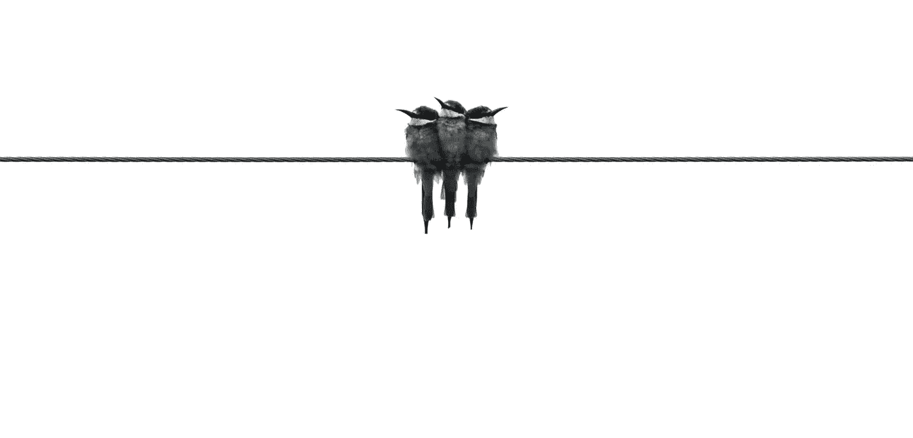
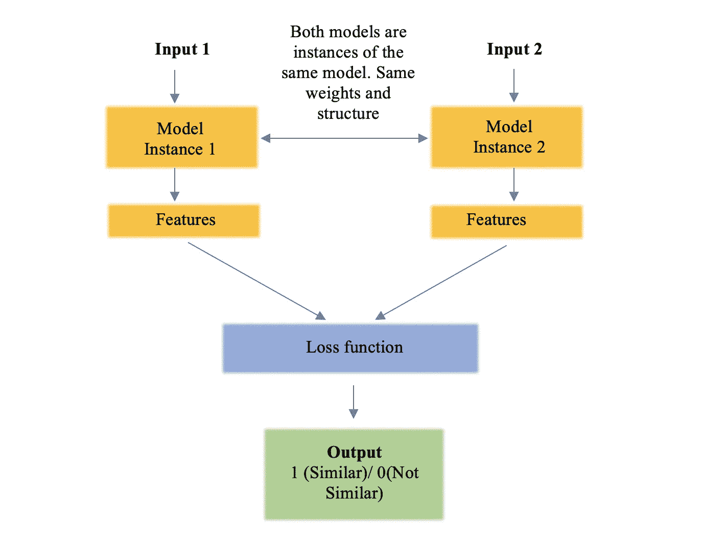
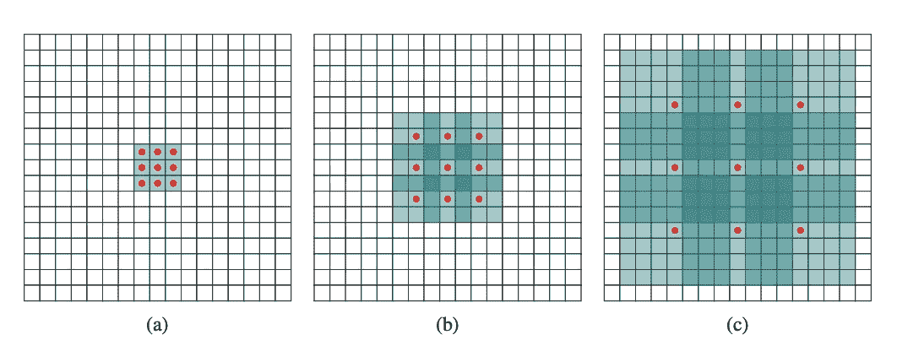
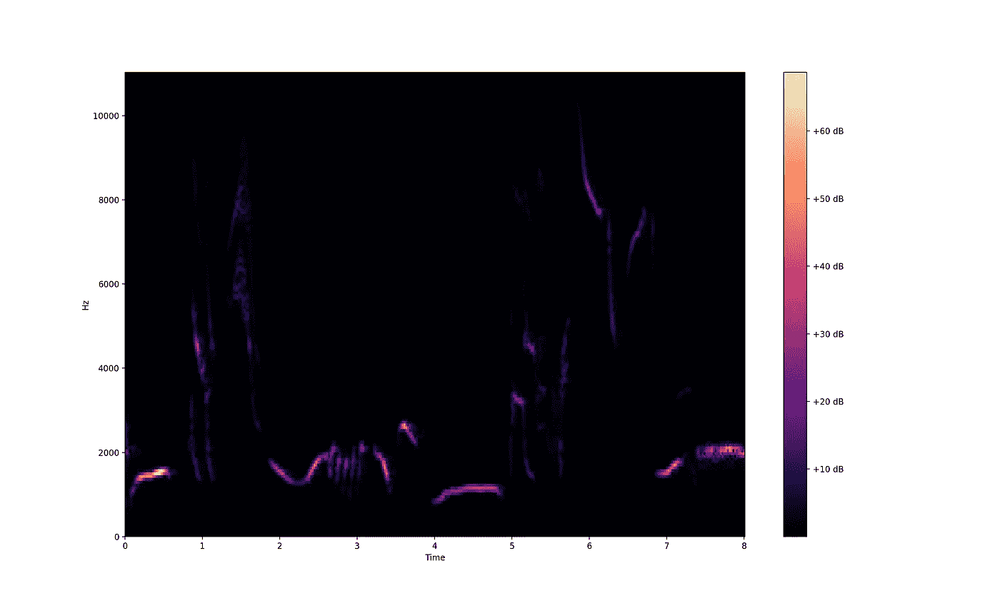
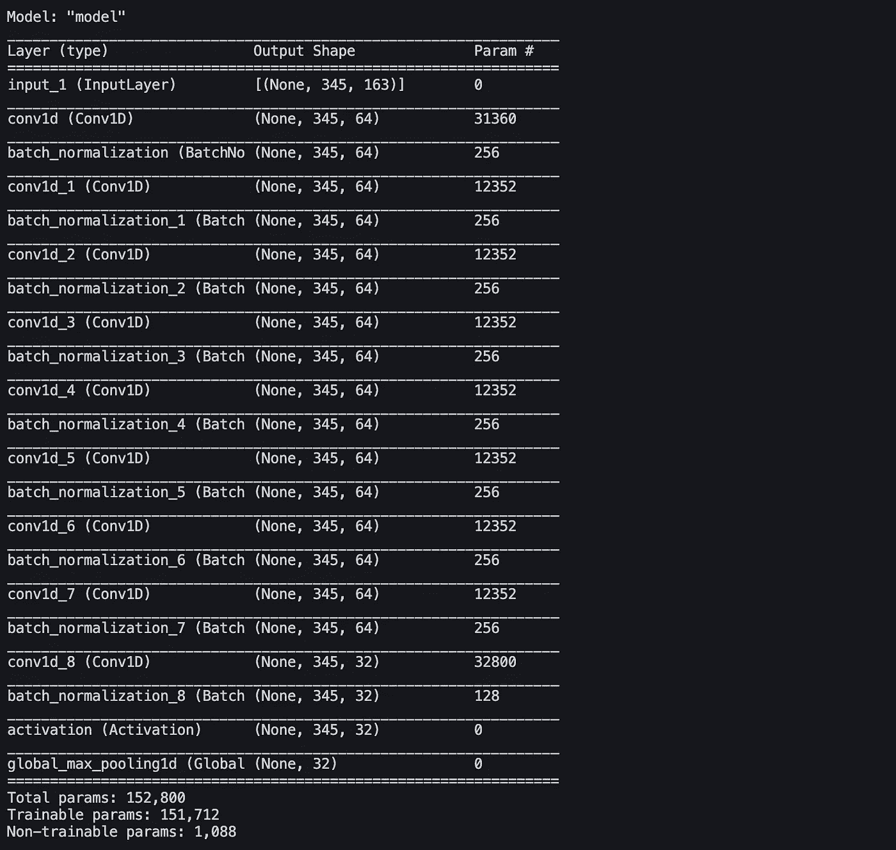
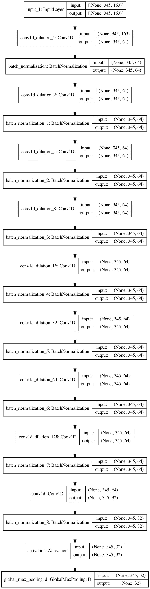
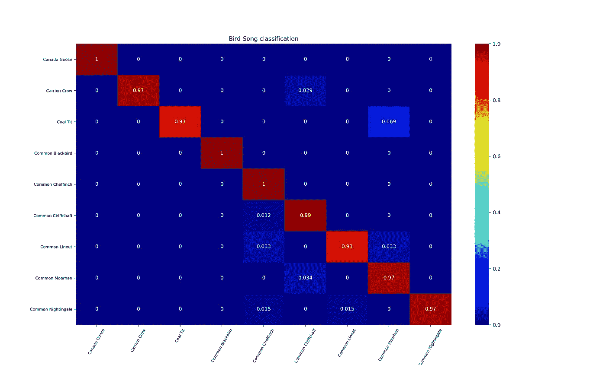
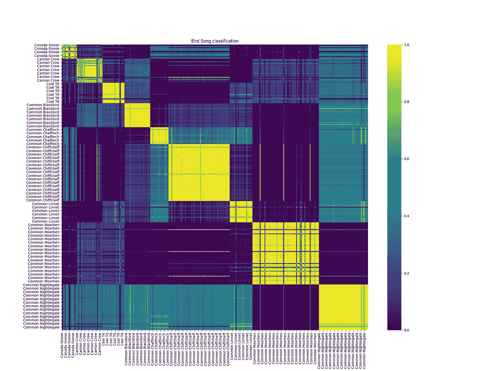
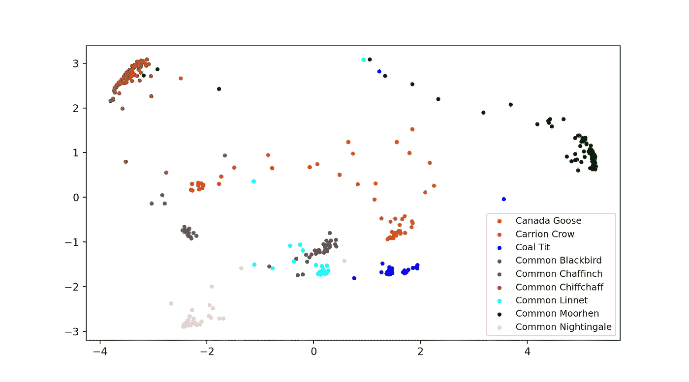

# 利用暹罗网络和扩张卷积进行鸟鸣分类

> 原文：<https://towardsdatascience.com/bird-song-classification-using-siamese-networks-and-dilated-convolutions-3b38a115bc1?source=collection_archive---------15----------------------->

[Glen Carrie 通过 Unsplash 拍摄的图像](https://unsplash.com/photos/_oNISBwMTwo)

# 介绍

T2:声学在研究环境方面非常有用。它已经被用于跟踪潜艇和鲸鱼很长时间了。鸟类对塑造我们身边的植物有很大帮助。**识别鸟鸣对于自动监测野生动物和研究鸟类的行为非常重要**。它可以帮助追踪鸟类而不打扰它们。我们还可以知道在某个特定的地方存在着哪些鸟类。它能给我们一些关于它们迁移模式的信息。每种鸟都有它们独特的声音。它们用不同长度和复杂程度的歌声来吸引配偶，警告其他鸟类附近的危险，并标记它们的领地。鸣禽可以根据地理位置有不同的方言。但是非鸣禽发出的声音不会因为地理位置而有太大变化。使用深度学习方法，我们可以很容易地根据鸟类的叫声和歌声对它们进行分类。我们可以使用任何神经网络框架，如 CNN、暹罗网络、WaveNets 等。为了这个任务。

# 问题陈述

**目标**:我们想根据不同鸟类的鸣叫声样本对它们进行分类。我们可以提取音频样本的频谱图，并使用它们作为分类的特征。在这个实验中，我们将使用 Kaggle 上的英国鸟鸣数据集。数据集在**数据描述**部分描述。

# 暹罗网络和膨胀卷积的快速介绍

## 暹罗网络

之前写过一篇[暹罗网](/siamese-networks-introduction-and-implementation-2140e3443dee)的文章。可以去查一下，深入了解一下它的工作和为它使用的损耗函数。该文章中还提供了代码。但是，我在这里给大家总结一下暹罗网。

**连体网络是一类包含一个或多个相同网络的神经网络。**我们向这些网络提供一对输入。每个网络计算一个输入的要素。然后，使用特征的差或点积来计算特征的相似性。对于相同的类输入对，目标输出是 1，而对于不同的类输入对，输出是 0。记住，两个网络有相同的参数和权重。如果不是，那他们就不是暹罗人。

暹罗网络基本结构

不同的损失函数可用于连体网络。

1.  **对比损失**:在对比损失中，取一对输入。对于相同的类对，它们之间的距离较小。对于不同的对，距离更多。尽管二进制交叉熵似乎是我们问题的完美损失函数，对比损失在区分图像对方面做得更好。对比损失，***L****=****Y * D+(1-Y)* max(margin—D，0)***
2.  **三重丢失**:三重丢失是 Google 在 2015 年推出的人脸识别。这里，模型有三个输入——锚、积极和消极。锚点是一个参考输入。实际输入与锚输入属于同一类别。负输入属于锚类之外的随机类。我们必须最小化锚和阳性样本之间的距离，同时最大化锚和阴性样本之间的距离。

我们将在实验中使用三重态损失。

## 扩张的回旋

> 膨胀卷积是一种卷积，它通过在内核元素之间插入孔洞来“膨胀”内核。它们也被称为 atrous 卷积。

扩展卷积的概念来自于小波分解，其中母小波被不同的尺度缩放或扩展以捕获不同的频率。

(a)标准 3×3 内核，(b)膨胀因子为 2 的内核，(c)膨胀因子为 4 的内核。来源[原论文](https://arxiv.org/pdf/1511.07122v3.pdf)

扩张卷积以相同的计算和存储成本增加了感受野，并且不损失分辨率。它可以用相同数量的参数从整个输入中捕获上下文。

这是 Sik-Ho Tsang 写的一篇关于[膨胀的脑回](/review-dilated-convolution-semantic-segmentation-9d5a5bd768f5)的好文章。

# 数据描述

在这个实验中，我们使用了 Kaggle 上的英国鸟鸣数据集。这是从 [Xeno Canto](https://www.xeno-canto.org/) 数据收集中收集的一个小子集，形成了英国 88 种鸟类的平衡数据集。

这里我们只对 9 种鸟类进行分类:**加拿大鹅****腐尸鸦****煤山雀****普通乌鸫****普通燕雀****普通红雀****普通朱雀****普通黑水鸡****普通夜莺**。

在这个数据集中，每只鸟的样本都很少。音频样本大约有 40-60 秒长。其中一些有点吵，有时背景中还有其他的鸟。从具有 50%重叠的每个样本中提取 2 秒钟的剪辑，以创建新样本。这将为训练神经网络创建足够数量的样本。数据分为 60%用于训练，40%用于测试。

# 履行

## 特征抽出

***Librosa***python 中的库用于音乐和音频分析。我们可以读取音频文件，并用它提取频谱图。

**第一步:**使用 ***librosa* 读取音频文件。**将-1 和 1 之间的时间序列归一化。

**步骤 2:** 去除音频中的静音。

**步骤 3:** 将每个音频文件分割成 2 秒长的片段，重叠 50%。

**第四步:**将数据分为训练和测试。60%用于培训，40%用于测试。

**步骤 5:** 从样品中提取光谱图。一个过滤器被应用到频谱图中，以获得一个在**1 千赫**和**8 千赫**之间的频率范围，因为大多数鸟鸣声的频率都在这个范围内。现在，标准化所有的光谱图(你也可以在 0 到 1 之间标准化它们)。这里，每个声谱图的形状是 163×345。

常见乌鸫鸣声的样本声谱图

**第六步:**为暹罗网络生成正负样本对。

首先，生成正对。

现在，生成负的类对。

您可以使用下面的函数生成正对和负对。它以: ***输入特征、目标类别标签、从每个类别中取出的随机数的数目、*** 和 ***正对的数目作为输入。*** 返回锚点、阳性和阴性样本。

现在，数据已准备好用于暹罗网络。

我们有 3 种类型的输入:锚、阳性和阴性样本。每个输入的形状是:(10800 x 345 x 163)。

现在，我们需要建立一个神经网络。

## 建立神经网络

编码器模型包含 8 个 1-D 卷积层，具有指数增长的膨胀因子。之后，应用 1D 卷积层来减少特征的数量。最后，应用全局最大池 1D 层。每一层后应用一个**批量标准化**层。除了最后一层，所有层都有一个'***【reLu】***'激活。在最后一层应用'*'激活。在最后一层，我们得到一个 32 维向量作为输出。*

*创建了该编码器模型的三个实例。它们代表锚定输入、积极输入和消极输入。所有三个 32 维特征向量被连接成一个 96 维向量。这个连接的向量被视为输出。正如您在下面的代码中看到的，函数 ***triplet_loss*** 获取输出，再次分离 3 个嵌入，并计算损失。*

*下面你可以看到模型的代码。*

*以下是编码器型号摘要:*

**

*编码器型号摘要*

**

*编码器模型架构*

*现在我们有了一个完整的暹罗网络。*

## *训练模型*

*我们现在可以拟合模型了。模型的目标输出是虚拟输出。这是因为我们没有将模型的输出与目标输出进行比较。相反，我们只是最小化相同类嵌入之间的距离，并推开不同类嵌入。*

*我们的锚定样本、正样本和负样本的输入大小是:(10800 x 345 x 163)。批量大小设置为 256。由于批量标准化，该模型仅在 30 个时期内收敛。如果你愿意，你可以训练更长时间。*

## *结果*

*该模型在训练集上的准确率为 **98.1%** ，在测试数据集上的准确率为 **97.3%** 。*

*以下是测试数据集的标准化混淆矩阵:*

**

*测试数据集的混淆矩阵*

*以下是嵌入的相似性矩阵:*

**

*测试数据集嵌入的相似性矩阵*

*下面是对测试数据集嵌入应用 PCA 后的散点图。所有的班级之间有很好的区分。并且，除了几个样本，所有的类都聚集在一起。*

**

*应用 PCA 后测试数据集嵌入的散点图*

# *要点*

1.  *这里光谱图被用作特征。也可以使用 Mel 光谱图。*
2.  *音频的小波变换也可以作为特征。*
3.  *可以用更长的框架尺寸进行实验。过长的帧尺寸会使模型过拟合，并降低整体性能。*
4.  *批处理规范化层起着非常重要的作用。它使训练期间的小批量标准化，并解决了**内部协变量移位**的问题。它使训练更快，模型变得更健壮。我强烈推荐在你的模型中使用这个。*
5.  *如果你想对更多种类的鸟类进行分类，模型的集合肯定会进一步提高精确度。*

# *结论*

*暹罗网络成功地根据鸟类的叫声对它们进行了分类，准确率高达 97%。连体网络将分类问题转化为相似性问题。它们也可以使用更少的样本，因为我们生成的是成对的样本。具有扩展的 1-D 卷积的模型以及批量标准化层收敛得非常快。*

***这里是这个项目的 GitHub 库。***

*<https://github.com/AdityaDutt/Bird-Song-Classification>  

# 未来的实验想法

这个模型可以扩展到对 50 或 100 多只鸟进行分类。我对鸟类了解不多，因为这不是我的研究领域，但我非常好奇，想知道我们是否可以根据鸟类的叫声来识别不同的地理位置。这是因为鸣禽的方言随着地理位置的变化而变化。**这里是一个** [**GitHub**](https://github.com/AgaMiko/bird-recognition-review) **储存库，其中包含了与鸟类**相关的数据集列表。Xeno-canto 网站收录了世界各地的鸟鸣。它有不同国家、物种等的数据。您可以从这里为自己的项目选择一个数据集。

请记住，您可以将该模型用于类似的基于音频的任务，如说话者分类、情感检测等。

***非常感谢您的阅读！我希望它有帮助。*🐧**

如果你想合作一个项目，或者需要一些关于你的项目的想法，请随时联系我。

# 参考

<https://arxiv.org/abs/1609.03499>  <https://arxiv.org/abs/1511.07122v3>  </review-dilated-convolution-semantic-segmentation-9d5a5bd768f5>  <https://www.kaggle.com/rtatman/british-birdsong-dataset>    <https://github.com/AgaMiko/bird-recognition-review>  <https://arxiv.org/abs/1502.03167>  <https://machinelearningmastery.com/how-to-accelerate-learning-of-deep-neural-networks-with-batch-normalization/>  <https://machinelearningmastery.com/batch-normalization-for-training-of-deep-neural-networks/>  <https://www.xeno-canto.org/> *