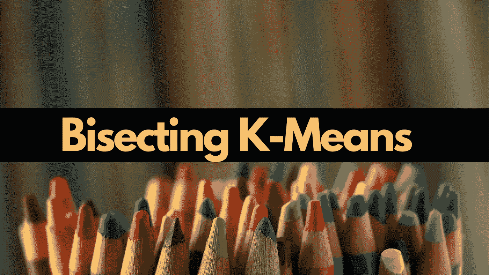
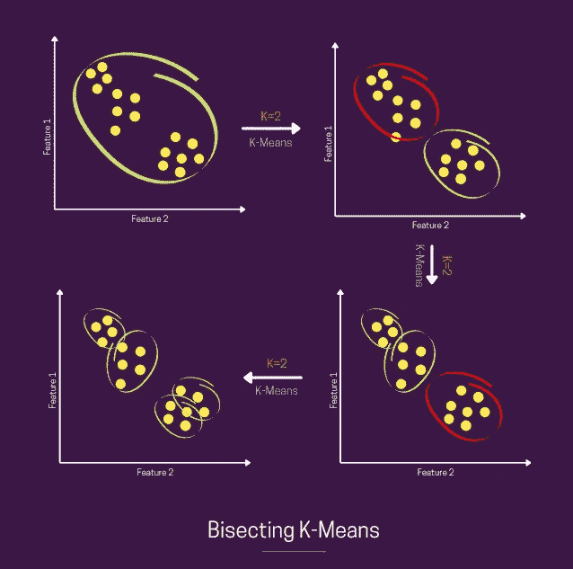
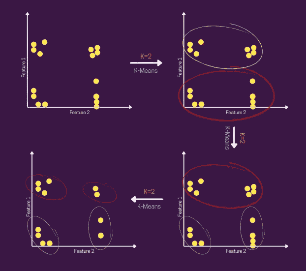

# 机器学习中的二分 K 均值聚类算法

> 原文：<https://towardsdatascience.com/bisecting-k-means-algorithm-clustering-in-machine-learning-1bd32be71c1c?source=collection_archive---------11----------------------->

## 理解对分 K-均值聚类算法(视觉和代码)



来自[源](https://unsplash.com/photos/dnGgAIRNnsE)的修改图像

B isecting K-means 聚类技术是对常规 K-means 算法的一点修改，其中您固定了将数据划分为聚类的过程。所以，类似于 K-means，我们首先初始化 K 个质心*(你可以随机地做或者可以有一些先验)*。之后我们应用规则的 **K-means，K=2** *(这就是为什么单词平分)。*我们**不断重复这一对分步骤，直到达到期望的聚类数**。在第一次对分*(当我们有 2 个聚类)*完成*，*之后，人们可以想到多种策略来选择其中一个聚类，并在该聚类内重复对分和分配的整个过程——例如:*选择具有最大方差的聚类或展开的聚类，选择具有最大数量数据点的聚类，等等。*

*没有时间看完整个博客？然后看这个快速的< 60 秒的 YouTube 短片—*

你可以想象整个流程，如下图所示—



按作者划分 K-Means |图像的步骤

如上图所示，我们首先假设所有数据都在一个聚类*(第一张图)*中，在第一步之后，我们得到 2 个*(二分法)*聚类，然后我们检查是否达到了期望的聚类数。如果没有，我们从上一步的两个聚类中选择一个*(红色)*，再次应用 K=2 的 K-means，并且我们**重复“*检查*和“*二等分*”步骤。**

你可能已经猜到了，这看起来像是层次聚类和 K 均值聚类的混合。因为在这里您正在构建一个树，这是一个层次结构，其中一个节点根据 K-means 策略和赋值被分成两个子节点。

## 对 K-Means 的改进

与常规 K-Means 不同，在常规 K-Means 中，我们在每一步计算每个数据点和质心之间的距离，直到满足收敛标准，在这里，我们只做一次*(第一步)*，之后，我们只使用特定聚类中的**数据点来计算距离**和进一步细分，使其比常规 K-Means 更有效。它还可以**识别任何形状和大小的簇**，不像 **K-Means 假设的是球形簇。** *我还发现了一篇有趣的研究文章，比较了 K-Means 和二分法 K-Means 在分析网络日志数据时的性能——在这里阅读*<https://ijeter.everscience.org/Manuscripts/Volume-4/Issue-8/Vol-4-issue-8-M-23.pdf>**。**

## *限制*

*因为基本聚类技术在这里仍然是 K-Means，所以在离群值的情况下，这个**算法也可能遭受对聚类中心**的错误估计。*

> ***提示:****二等分 K-Medoid** 聚类技术可以帮助你解决上述限制。*

## *密码*

**我将使用 Python 的 Sklearn 库来实现目的—**

```
**from sklearn.cluster import KMeans
import numpy as np**X = np.array([[1, 2], [2, 1], [1, 1.5], [1.5, 1],
               [10, 2], [10, 4], [10, 0], [10, 1],
               [1, 10], [2, 11], [1.5, 9], [1, 10.5],
               [10.5, 9], [9, 9.5], [9.5, 9], [10, 10]])**K = 4
current_clusters = 1**while current_clusters != K:* *kmeans = KMeans(n_clusters=2).fit(X)
    current_clusters += 1
    split += 1* *cluster_centers = kmeans.cluster_centers_* *sse = [0]*2
    for point, label in zip(X, kmeans.labels_):
        sse[label] += np.square(point-cluster_centers[label]).sum()* *chosen_cluster = np.argmax(sse, axis=0)
    chosen_cluster_data = X[kmeans.labels_ == chosen_cluster]
    X = chosen_cluster_data**
```

**下图展示了上述示例代码的图示演练—**

**

**上例演练|作者图片**

*简而言之，当考虑将 K-Means 作为算法的选择时，尝试平分 K-Means 也是一个好主意。由于上面讨论的原因，很有可能你会得到更好的结果。*

*希望你喜欢阅读这篇博客。感谢您的宝贵时间！*