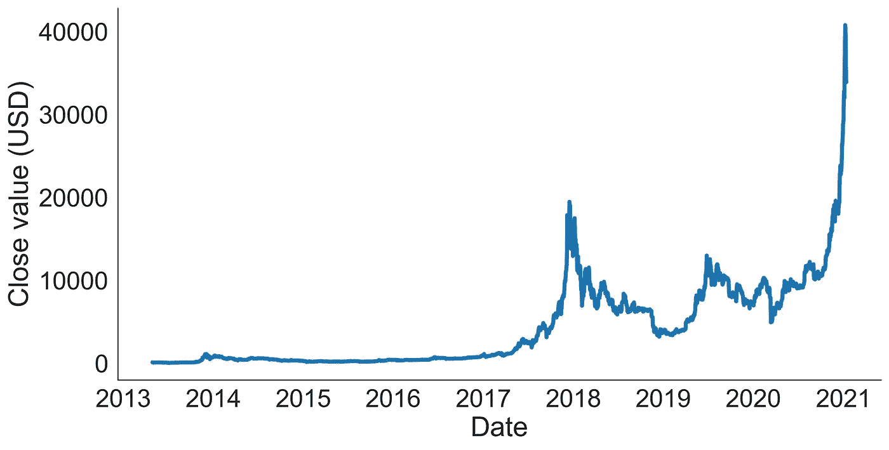
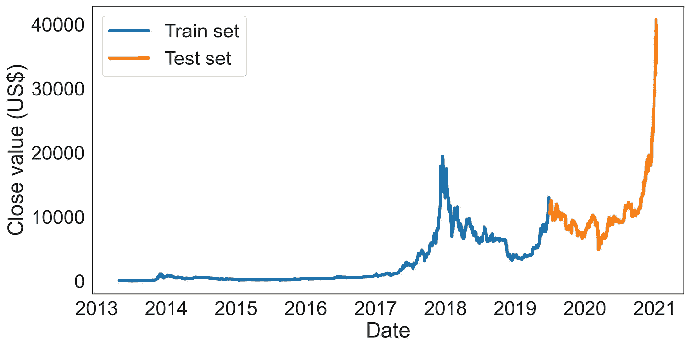
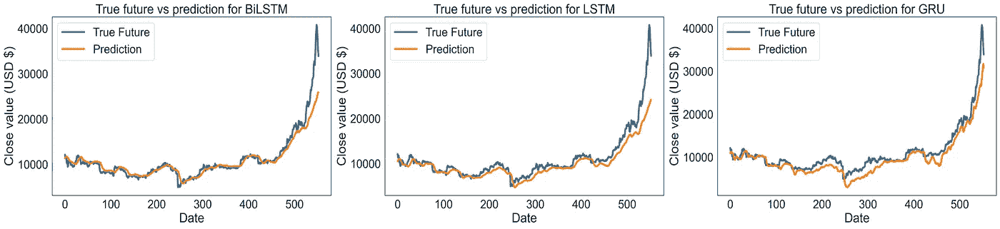
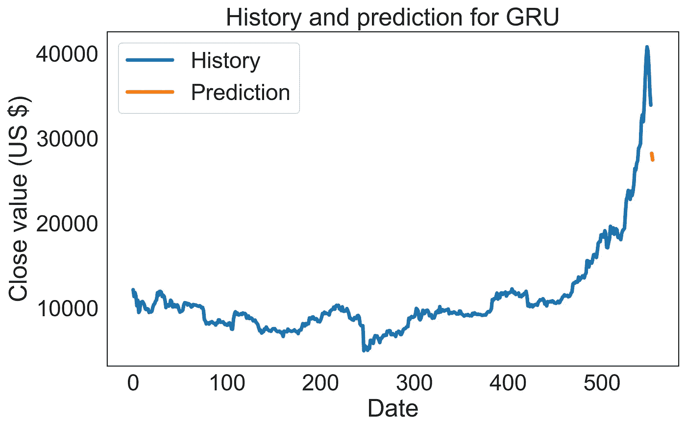

# 比特币财源滚滚！

> 原文：<https://towardsdatascience.com/bitcoin-bonanza-2cb208026bbd?source=collection_archive---------24----------------------->

## 比较 GRU、LSTM 和比尔斯特姆预测比特币价格的有效性

图片来源:andréFran ois McKenzie 在 [Unsplash](https://unsplash.com/s/photos/bitcoin?utm_source=unsplash&utm_medium=referral&utm_content=creditCopyText) 上拍摄的照片

# 介绍

我已经跟踪加密价格好几年了。我对区块链的演变及其含义很感兴趣。我不止一次对数字货币的想法嗤之以鼻。这并不是什么新东西，但我出生在 80 年代，那时如果我们想提取真正的纸币，我们必须填写一张纸并与人交谈……还记得纸币吗？

无论如何，今天我想和你分享我最近的一个项目。我将比较三种模型，以确定它们在预测加密之王*比特币价格方面的功效。在这个项目中，我使用了门控循环单元(GRU)、长短期记忆单元(LSTM)和双向 LSTM 单元(比尔斯特姆)。首先，让我们快速了解一下这些神秘预测模型的工作原理。*

自 90 年代以来，人们对递归神经网络(RNNs)进行了大量的研究。RNNs 的基本功能是处理序列数据的能力，使其成为探索涉及文本、音频、图像、videos⁴和金融市场的任务的宝贵工具，例如我们将要探索的市场。想了解 RNNs 如何工作的有趣方法，请查看这篇有创意的[帖子](/illustrated-guide-to-recurrent-neural-networks-79e5eb8049c9)！

当我们开始大量使用 data⁵.时，RNNs 的局限性就变得很明显了例如，为了这篇文章，我收集了大约 7 年的比特币价格数据。这意味着我有超过 2500 个时间步长的输入。因此，每次模型更新时，将对这些输入中的每一个计算衍生产品。这可能导致权重下降到接近零(*消失梯度*)或爆炸(*爆炸梯度*)，这意味着模型学习缓慢。因为 rnn 在学习大型数据集的早期输入时有困难，所以他们被称为具有*短期*记忆。

为了克服这个问题，开发了专门的 rnn。长短期记忆单位(LSTM)、双向 LSTM (BiLSTM)和门控循环单位(GRU)。这些模型使用称为“门”的内部机制，可以调节信息在网络中的流动方式。最终，他们决定哪些信息是重要的，要保留或丢弃(如果你想更深入，你可以看看这篇[帖子](/illustrated-guide-to-lstms-and-gru-s-a-step-by-step-explanation-44e9eb85bf21))。

现在，我们已经讨论了一些关键概念，让我们开始工作，看看这些模型如何作为比特币价格的预测器！

首先，让我们看一下我们的数据。下图 1 展示了比特币价格随时间的演变。虽然波动比较大，但我必须承认，2013 年我没有购买比特币，这让我有点郁闷！

图 1——比特币收盘价随时间的演变(图片由作者提供)。日期范围(2013 年 4 月 29 日-2021 年 1 月 12 日)。数据收集自[*https://coinmarketcap . com/currences/bit coin/historical-data/*](https://coinmarketcap.com/currencies/bitcoin/historical-data/)

***来自《走向数据科学》编辑的提示:*** *虽然我们允许独立作者根据我们的* [*规则和指导方针*](/questions-96667b06af5) *发表文章，但我们并不认可每个作者的贡献。你不应该在没有寻求专业建议的情况下依赖一个作者的作品。详见我们的* [*读者术语*](/readers-terms-b5d780a700a4) *。*

# 数据准备

## 移位数据

在我们开始构建模型之前，需要几个重要的步骤。第一步是将我们的结果变量上移(-1)一个时间步长。目的是组织我们的数据，以便预测变量将用于预测第二天的收盘价，TOMORROW_CLOSE。

因为我不想用一个不存在的值来估算空单元格，所以我用 0 填充它，并将其从数据集中删除。另一种方法是将所有预测值下移(+1)。这将导致在数据集的开头插入 0，这将接近 2013 年的初始值。

## 将“日期”转换为日期时间

接下来，使用 df.dtypes，我们可以检查数据集中存在的变量类型。使用时，这总是一个好主意。csv(或其他)文件类型，以确保该列已被正确读取。例如,“日期”列在 Excel 中是日期格式，但在导入时它被解释为对象。因此，我们必须使用下面的代码将其转换为日期时间。

## 将日期设置为索引

接下来，我们必须将列“Date”设置为索引。如果您跳过这一步，您将得到以下错误:*无效的类型提升。这一步对我来说真的很难。试着在谷歌里输入‘无效类型推广’，你会找到 29，100，000 个结果！*

顺便提一下，您还可以在读取。使用 index_col = 'Date '的 csv 文件

## 将数据分成训练集和测试集

现在，我们的数据已经准备好分成训练集和测试集。我分别为训练和测试数据选择了 80/20 的分割。让我们看看这给我们带来了什么(图 2)。

图 2 —数据分为 80%的训练集(蓝色)和 20%的测试集(橙色)。(图片由作者提供)

## 独立的预测因素和结果变量

到目前为止，一切看起来都不错！现在，在开始训练我们的模型之前，我们需要分离我们的预测变量(X)和结果变量(y)。

## 缩放数据

许多机器学习模型的一个良好实践是将数值变量缩放到指定的范围。因为这些模型的默认激活函数是双曲正切(tanh)函数，它输出的范围是从-1 到 1，所以我调整了值以适应这个范围。为此，我使用了 sklearn 的 MinMaxScaler。遵循以下 3 条准则被视为良好实践:

*   首先，我们使用 *fit()* 函数将缩放器拟合到训练集
*   接下来，我们使用*变换()*函数将该比例应用于训练集
*   最后，您将量表应用于测试集

## 创建三维数据集

我们模型的输入数据必须是带有形状[批次、时间步长、特征]的 3D 数据(参见 Keras 说明[此处](https://keras.io/api/layers/recurrent_layers/lstm/))。下面，一个名为 threeD_dataset 的函数将数据重塑为必要的格式。时间步长设置为 10，这意味着模型将根据前 10 天的输入来预测“明天 _ 收盘”。

## 构建模型

最后，我们将创建用于预测比特币价格的 3 个模型。所有模型都保持简单，具有包含 64 个神经元的两层和包含 1 个神经元的致密层。我还增加了 20%的辍学，以防止过度拟合。最后，我使用 adam 作为优化函数，使用均方差作为这些模型的度量。有关这些层和函数如何工作的更多信息，请查看我的上一篇[文章](/harnessing-the-power-of-transfer-learning-for-medical-image-classification-fd772054fdc7)，在那里我详细介绍了相当多的细节！

## 拟合模型

现在是时候拟合模型了，看看它们对比特币价格的预测有多准确！我将为这些模型运行 100 个纪元；然而，我添加了 [EarlyStopping](https://keras.io/api/callbacks/early_stopping/) ，耐心为 10，当验证损失在 10 个时期内没有改善时，它会阻止模型继续运行。这可以节省大量的时间，尤其是在处理大量数据集的情况下。

需要注意的是，因为我们处理的是时间序列数据，时间步长的顺序是有意义的，所以我们必须设置 shuffle = False。

# 结果

## 预测的反向标度

在我们可以对数据进行预测之前，我们必须使用逆变换将结果变量返回到其原始形式。回想一下，我们将数据的范围从-1 调整到 1。如果我们不使用反函数，那么我们的预测将在这个标度范围内。

## 根据测试数据进行预测

现在是我们期待已久的时刻！我们将看到哪个模型在未知测试集上预测比特币价格的表现最好。这些试验的结果如下图 3 所示。

图 3-比尔斯特姆、LSTM 和 GRU 模型的预测图。(图片由作者提供)

正如我们所看到的，当目视检查时，来自 LSTM 和比尔斯特姆的预测值都非常好地跟随试验数据，直到在数据集的末尾值急剧上升。另一方面，GRU 模型似乎有最好的整体拟合。即使它没有紧紧跟随真实的数据，但它似乎更善于跟随数据中呈现的趋势。

## 韵律学

以上给出了数据的定性解释。这里，创建了一个函数来为每个模型提供定量的准确性度量。所有三个模型都提供了平均绝对误差(MAE)和均方根误差(RMSE)。关于这两个指标的解释，请查看这篇文章。

## BiLSTM:

*   梅:913.15
*   RMSE: 2052.10

## LSTM:

*   梅:1286.47
*   RMSE: 2459.72

## GRU:

*   梅:1334.79
*   RMSE 1934.90

我们应该如何解读这些价值观？首先我说一下，我不是专业交易者。我只能提供一个观点。MAE 似乎更符合图 3 中观察到的紧密配合。比尔斯特姆和 LSTM 都有较低的 MAE 值，表明模型更准确(当使用这一指标时)。相反，GRU 有较低的 RMSE，建议使用更准确的模型(使用此指标)。

在我看来，交易不像彩票。我们的目标不是准确知道资产的未来价格。更好的策略是预测未来价格的走向。

比如知道明天 1 比特币会值 42749.67，没有上下文就没用了。然而，如果我知道今天 1 比特币的价值是 39，118.33，那么预测的上涨趋势将会更有价值。这将引导我决定买或卖。

考虑到这一点，我觉得 GRU 模型作为趋势指标比价格指标表现得更好。接下来，我们将使用 GRU 模型来预测未来的价格！

## 预测

我在调查时间序列数据的时候经常用到这三个模型，不得不承认每次都很惊讶。如果你回头看看图 2，它描绘了训练集和测试集，它们没有太多的共同点。模型可以学习训练集中的模式，这对预测测试中相对不同的模式是有用的，这一事实令人难以置信！

在这最后一部分，我一直等到积累了足够的数据，可以使用新的数据集预测比特币的价值。因为我使用了 10 的时间步长，所以我至少需要 10 天的额外时间。之前的数据集结束于 2021 年 1 月 12 日，然而，在将收盘价上移后，它被从数据集中删除，以避免必须用一个虚构的值来估算值。因此，预测数据集包含 2021 年 1 月 12 日至 23 日的数据。

值得一提的是，所有相同的数据准备方法都应用于新的预测数据集。为了避免重复的材料，我在课文中省略了它们。

在下面的图 4 中，你会发现我预测比特币未来价值的结果。我有足够的数据来预测两个未来值。

图 4-预测 GRU 模型对比特币价格进行预测。(图片由作者提供)

## 1 月 22 日

*   预测:28226.11
*   实际:33，005.76

## 1 月 23 日

*   预测值:27468.18
*   实际:32，067.64

# 结论

在本文中，我测试了 LSTM、比尔斯特姆和 GRU 模型在预测比特币价格方面的功效。在提供了模型的一般概述之后，我描述了准备数据以避免可怕的模糊错误消息的方法。

在训练完这些模型后，他们每个人都要接受*测试。*每一个都表现得相当好，但 GRU 模型被发现是更好的趋势指标，我觉得从交易的角度来看，它更相关。

当 GRU 模型用于预测价值时，它表现得相当好。虽然价格没有准确预测，但趋势是正确的！

如果你想玩这些模型，请在我的 [Github](https://github.com/ryancburke) 上查看完整的笔记本。我想保持一切简单，但模型肯定可以改进。尝试:

*   其他预测变量
*   改变时间步长
*   将数据移动 2 或 3 天，观察结果如何变化
*   改变模型本身的参数(层、删除、激活函数、优化器等)

写这篇文章让我很开心。非常感谢您花时间阅读它！

记住，解决你的研究问题的最好方法是带着孩子般的好奇心！玩得开心！

# 参考

1.王芳，郭，秦，雷，张(2017)。用于场景文本识别的隐马尔可夫模型引导卷积递归神经网络。IET 计算机视觉，11(6)，497–504。

2.Sak，h .，Senior，a .，Rao，k .，和 Beaufays，F. (2015 年)。用于语音识别的快速准确的递归神经网络声学模型。arXiv 预印本 arXiv:1507.06947。

3.牟，李，加米西，p .，，朱，X. X. (2017)。用于高光谱图像分类的深度递归神经网络。IEEE 地球科学与遥感汇刊，55(7)，3639–3655。

4.Güera，d .，& Delp，E. J. (2018 年 11 月)。基于递归神经网络的深度伪造视频检测。2018 年第 15 届 IEEE 高级视频和信号监控国际会议(AVSS)(第 1-6 页)。IEEE。

5.茨韦塔纳·斯特灵、北卡罗来纳州法鲁吉亚和弗吉尼亚州格里彭(2017 年)。普通 rnns 和 gru 模型之间的本质区别。COGNTIVE 2017，84。