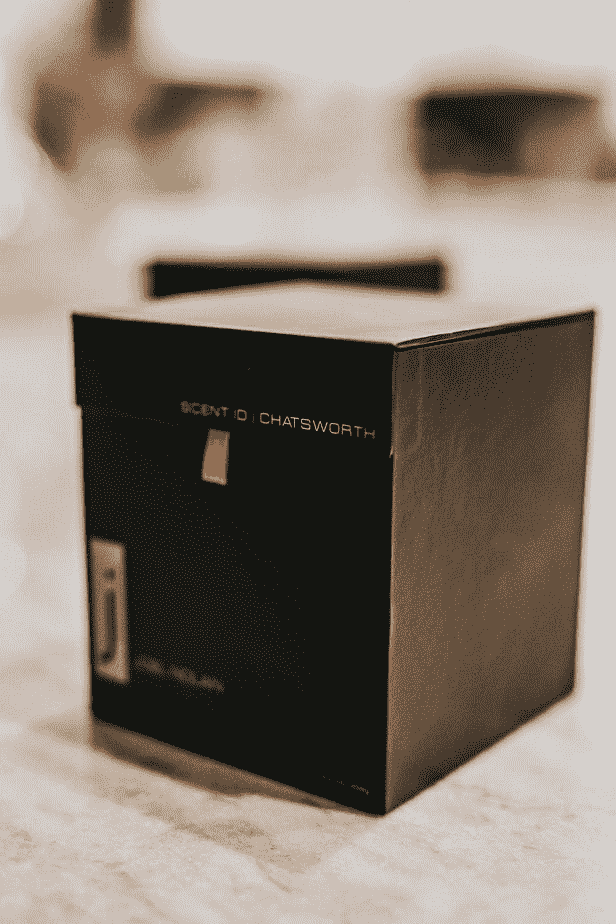
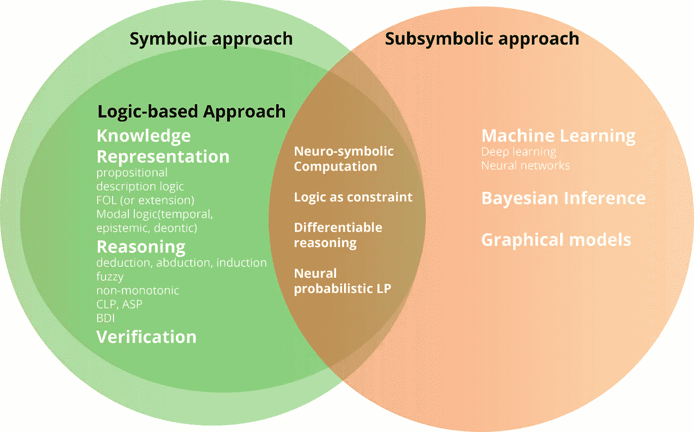
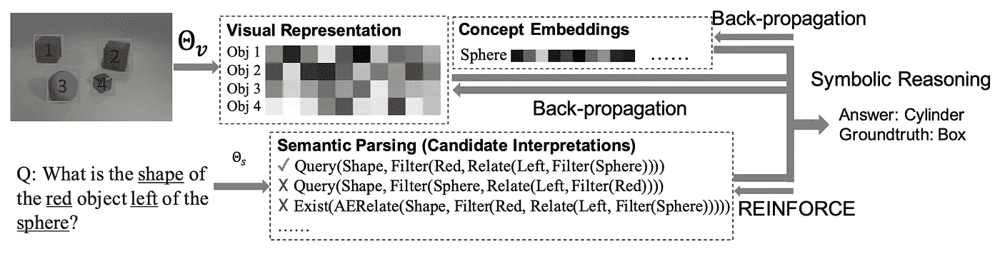
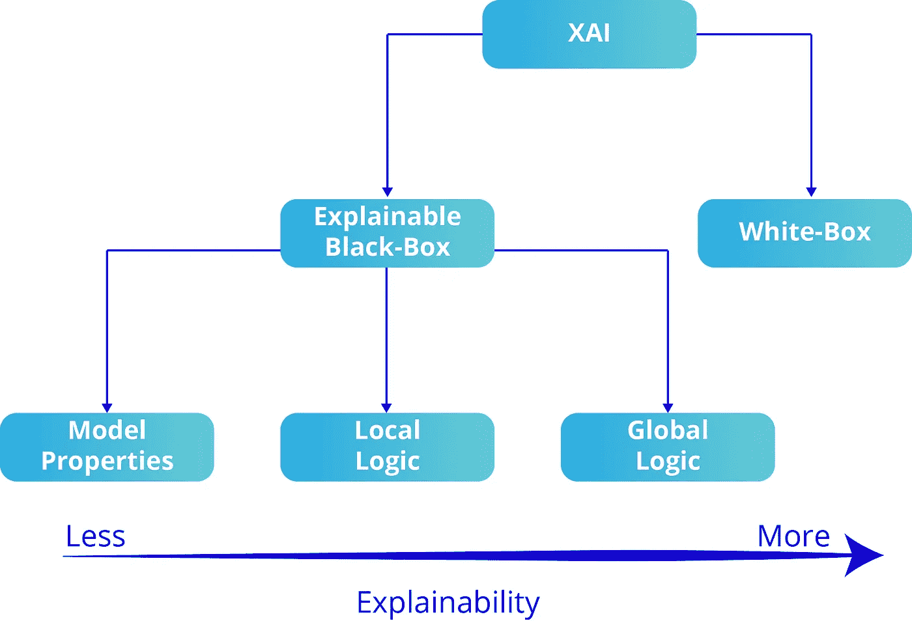
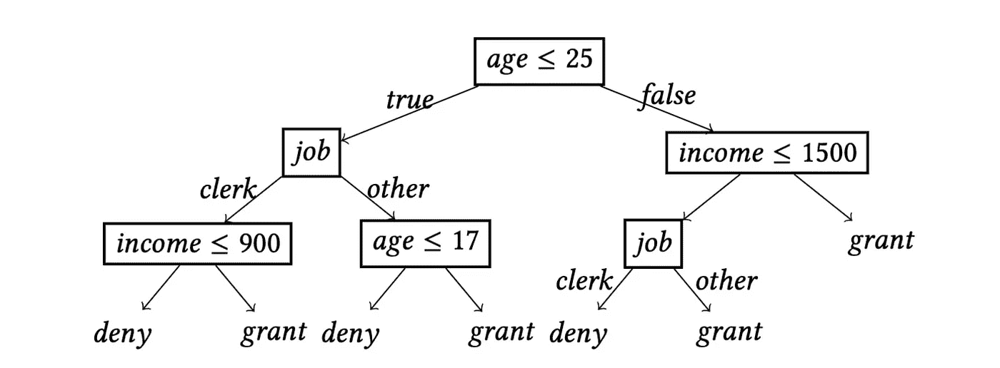
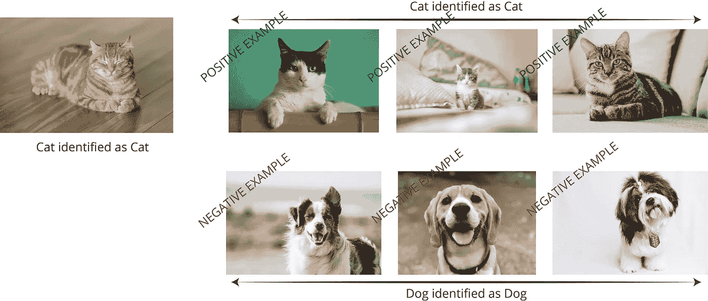
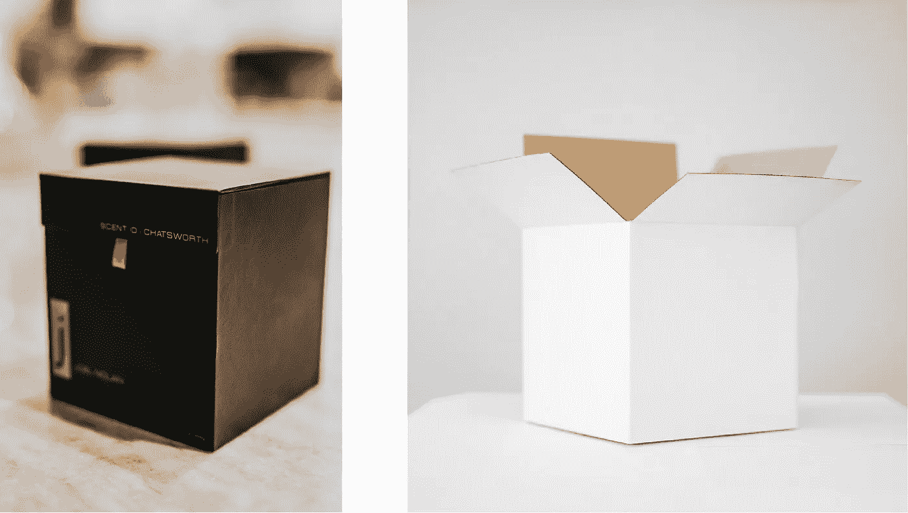

# 面向可解释人工智能的黑盒和白盒模型

> 原文：<https://towardsdatascience.com/black-box-and-white-box-models-towards-explainable-ai-172d45bfc512?source=collection_archive---------13----------------------->

## 第一部分 | [第二部分](/symbolic-vs-subsymbolic-ai-paradigms-for-ai-explainability-6e3982c6948a) |可解释的人工智能——第三部分

## 使用模型属性、局部逻辑表示和全局逻辑表示从黑盒模型中生成解释

图一。照片由[Andrew“Donovan”valdi via](https://unsplash.com/@donovan_valdivia?utm_source=medium&utm_medium=referral)在 [Unsplash](https://unsplash.com?utm_source=medium&utm_medium=referral) |和图 2 拍摄。照片由[凯利·麦克林托克](https://unsplash.com/@kelli_mcclintock?utm_source=medium&utm_medium=referral)在 [Unsplash](https://unsplash.com?utm_source=medium&utm_medium=referral) 上拍摄

# 快速回顾:XAI 和国家安全委员会

**可解释的人工智能(XAI)** 处理开发人工智能模型，这些模型本质上对人类来说更容易理解，包括用户、开发者、决策者和执法人员。**神经符号计算(NSC)** 处理子符号学习算法与符号推理方法的结合。因此，我们可以断言，神经符号计算是可解释人工智能下的一个子领域。NSC 也是最适用的方法之一，因为它依赖于现有方法和模型的结合。

图 3。符号人工智能 vs 次符号人工智能(作者提供图片)

> 如果说**可解释性**是指**用**人类语言有意义地描述**事物的能力。换句话说，它**是将**原始信息(数据)**映射成对人类有意义的**符号表示**的可能性(例如英文文本)****

通过从子符号中提取符号，我们可以使这些子符号变得可以解释。XAI 和国家安全委员会都试图让次符号系统更容易解释。NSC 更多的是关于将子符号映射到符号，通过逻辑设计的可解释性:对子符号学习表示的符号推理。XAI 没有那么具体，更多的是关于所有细微差别的可解释性，即使可解释性被包裹在不可解释的模型中。如果从子符号中提取符号意味着可解释性，那么 **XAI 包括 NSC** 。

> 让我们通过一个示例来看看这些 NSC:

## 神经符号概念学习者

Mao 等人提出了一种新的 NSC 模型，即神经符号概念学习器，它遵循以下步骤:

图 4。神经符号概念学习者(图由[毛等](https://arxiv.org/pdf/1904.12584.pdf)

*   图像分类器学习从图像或文本片段中提取子符号(数字)表示。
*   然后，每个子符号表示都与一个人类可以理解的符号相关联。
*   然后，符号推理器检查符号表示的嵌入相似性
*   训练继续进行，直到通过更新表示使推理机的输出精度最大化。

# 白盒与黑盒模型

人工智能模型可以是(I)白盒或(ii)黑盒。

*   白盒模型可以通过设计来解释。因此，它不需要额外的能力来解释。
*   黑箱模型本身是无法解释的。因此，为了使一个黑盒模型可解释，我们必须采用几种技术从模型的内部逻辑或输出中提取解释。

黑盒模型可以用

1.  **模型属性:**展示模型或其预测的特定属性，如(a)对属性变化的敏感性或(b)负责给定决策的模型组件(如神经元或节点)的识别。
2.  **局部逻辑:**单个决策或预测背后的内在逻辑的表示。
3.  **全局逻辑**:整个内部逻辑的表现。

因此，下图显示了人工智能模型在可解释性方面的子类别:

图 5。简单易懂的人工智能分类法

# 基于规则的可解释性与基于案例的可解释性

除了可解释模型的逻辑区别之外，我们还确定了两种常见的解释类型，所有上述模型都可以采用这两种类型来提供解释:

**基于规则的解释**:基于规则的可解释性依赖于生成一套“形式化的逻辑规则，阐明给定模型的内部逻辑”。

图 6。决策树可以很容易地公式化，以提供基于规则的解释(图由 [Guidotti 等人](https://arxiv.org/pdf/1805.10820.pdf)

**基于案例的解释**:基于规则的可解释性依赖于提供有价值的输入输出对(积极的和消极的)来提供模型内部逻辑的直觉。基于案例的解释依赖于人从这些对中推断逻辑的能力。

图 7。基于案例的解释示例(作者图)(图片来自 [Unsplash](https://unsplash.com/) )

> **基于规则与基于案例的学习算法比较示例:**

假设我们的模型需要学习如何做苹果派的食谱。我们有蓝莓派、芝士蛋糕、牧羊人派的食谱，还有一份简单的蛋糕食谱。基于规则的学习方法试图为制作所有类型的甜点提出一套通用规则(即，渴望方法)，而基于案例的学习方法则根据需要概括信息，以涵盖特定的任务。因此，它会在可用数据中寻找与苹果派最相似的甜点。然后，它会尝试在类似的食谱上做一些小的改动。

## XAI:设计白盒模型

包括基于规则和基于案例的学习系统，我们有四类主要的白盒设计:

*   手工制作的专家系统；
*   **基于规则的学习系统:**从数据中学习逻辑规则的算法，如归纳逻辑编程、决策树等；
*   **基于案例的学习系统**:基于案例推理的算法。他们利用例子、案例、先例和/或反例来解释系统输出；和
*   **嵌入符号&提取系统**:更多的生物启发算法，如**神经符号计算**。

在本系列接下来的部分中，我们将有这些方法的实际例子。

# 最终注释

在本帖中，我们:

1 —简要介绍了 XAI 和 NSC 之间的差异和相似之处；

2 —定义和比较黑盒和白盒模型；

3 —使黑盒模型可解释的方法(模型属性、局部逻辑、全局逻辑)；

4-比较基于规则的解释和基于案例的解释，并举例说明。

在下一篇文章中，我们将介绍市场上可解释工作的库和技术，并将使用其中一些库从黑盒模型和白盒模型中提取解释。

# 订阅邮件列表获取更多内容

如果你想获得我在 Google Colab 上的其他教程文章的代码，并尽早获得我的最新内容，可以考虑订阅:✉️的邮件列表

> [*现在就订阅*](https://medium.us4.list-manage.com/subscribe?u=bf0e9524ea3d765ba10131675&id=52221072de)

如果你对深度学习感兴趣，也可以看看我的人工智能内容指南:

<https://blog.orhangaziyalcin.com/a-guide-to-my-content-on-artificial-intelligence-c70c9b4a3b17>  

如果你正在阅读这篇文章，我确信我们有着相似的兴趣，并且现在/将来会从事相似的行业。那么我们就通过 [*Linkedin*](https://linkedin.com/in/orhangaziyalcin/) *来连线吧！请不要犹豫发送联系请求！*[*Orhan g . yaln—Linkedin*](https://linkedin.com/in/orhangaziyalcin/)

# 参考

Guidotti，r .，Monreale，a .，Ruggieri，s .，Pedreschi，d .，Turini，f .，& Giannotti，F. (2018 年)。*黑盒决策系统的基于局部规则的解释*。[www . propublica . org/article/machine-bias-risk-assessments-in-criminal-pending](http://www.propublica.org/article/machine-bias-risk-assessments-in-criminal-sentencing)

毛，甘，c，柯利，p，特南鲍姆，J. B .，，吴，J. (2019)。神经符号概念学习者:从自然监督中解读场景、词语和句子。*第七届国际学习代表大会，ICLR 2019* 。[http://nscl.csail.mit.edu](http://nscl.csail.mit.edu)

Sovrano，F. (2021)，现代人工智能对可解释性的需求，博洛尼亚大学信息学院

图一。Andrew "Donovan" Valdivia 在 [Unsplash](https://unsplash.com?utm_source=medium&utm_medium=referral) |和图 2 上拍摄的照片。照片由[凯利·麦克林托克](https://unsplash.com/@kelli_mcclintock?utm_source=medium&utm_medium=referral)在 [Unsplash](https://unsplash.com?utm_source=medium&utm_medium=referral) 上拍摄