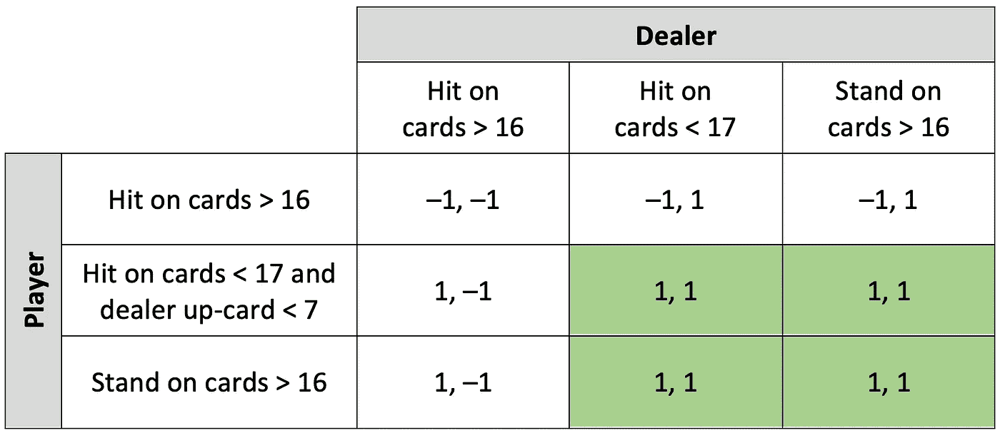
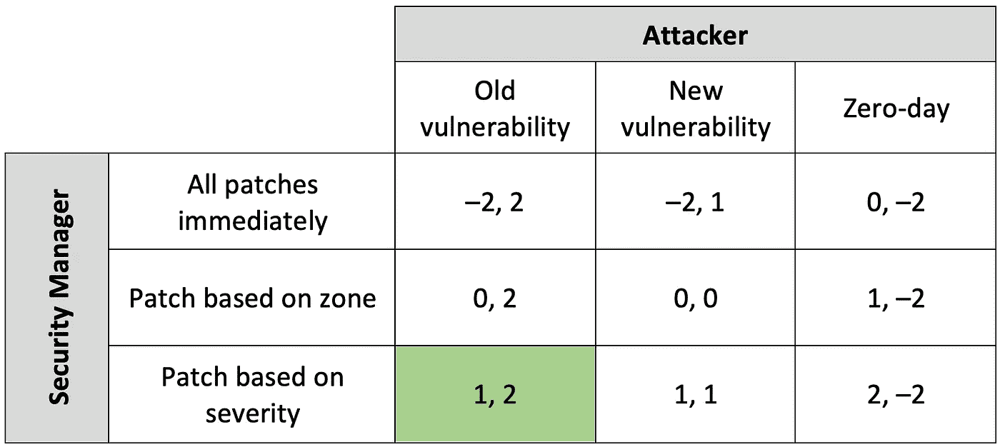

# 21 点:将人工智能应用于网络安全的游戏模型

> 原文：<https://towardsdatascience.com/blackjack-a-game-model-for-applying-ai-to-cybersecurity-206746f46aa5?source=collection_archive---------20----------------------->

## [人工智能校准和安全](https://towardsdatascience.com/tagged/ai-alignment-and-safety)

## 博弈论、强化学习和信念更新如何模拟网络冲突与合作

照片由[安娜·施韦茨](https://www.pexels.com/@shvetsa?utm_content=attributionCopyText&utm_medium=referral&utm_source=pexels)从[派克斯](https://www.pexels.com/photo/people-woman-casino-luck-6664176/?utm_content=attributionCopyText&utm_medium=referral&utm_source=pexels)拍摄

网络攻击继续威胁着大大小小的组织。数据泄露或勒索软件攻击的影响可能会对客户和股东产生重大影响。为了帮助应对网络威胁，一些组织已经开始探索大数据和人工智能(AI)如何帮助降低网络安全风险。

机器学习算法现在在网络安全中很常见。我们发现在更多的商业产品中提供了机器学习，从那些完全集成到产品中并且不需要机器学习知识的产品到那些需要卷起袖子来整理算法并执行统计分析的产品。用于网络安全的机器学习最常被应用于检测代表攻击的模式。这包括评估审计日志数据、发现网络入侵检测系统的异常以及识别和阻止计算机系统上的恶意软件的算法。

在一些应用中，机器学习被用来训练网络上正常活动的模型，希望以后能够检测到可能代表网络攻击的异常事件。机器学习在网络安全中的当前使用包括监督和非监督方法。

尽管机器学习越来越多地用于网络安全，但人工智能的使用却很少。换句话说，我们使用算法来检测模式，但我们很少使用算法来自主决定最佳行动方案。

从表面上看，机器学习应该非常有利于提高组织的网络安全，但仔细一看，有一个重要的弱点。机器学习完全是关于学习者的。它的重点是创建一个足够精确的模型来检测数据中的重要特征，而不会过度拟合。机器学习经常忽略的是，在学习的同时，它也在教导网络冲突与合作游戏中的其他参与者。

网络安全不是一个静态的游戏。规则不断变化。有许多不同类型的玩家，每一种都有自己的目标、战略和战术。当一个组织调整它的防御时，攻击者改进他们的攻击，要求该组织进一步改进它的防御。结果就是无休止的升级游戏。

这与机器学习的大多数传统应用非常不同，传统应用进行预测，对数据进行分类，并利用不包括对手的数据检测异常。在网络安全中，安全管理员采取的每个行动都可能通知攻击者，并可能导致下一次攻击中不可预测的变化。

为了从机器学习的基本模型转向人工智能，我们需要超越模式检测来理解这个升级游戏。如果我们应用博弈论来探索多智能体游戏中的战略决策，我们就可以开始应用人工智能。

# 博弈论

博弈论的工具有助于评估不同代理人或玩家的决策和行为。博弈论试图根据一个玩家可能做出的决定来寻找另一个玩家的最佳决策。有了它，我们可以将网络安全建模为一个游戏，以了解安全管理员的行为如何影响攻击者的决策并与之互动。使用这个模型，我们可以开始探索人工智能和大数据的潜力，以更智能地保护计算机系统和数据。

战略决策的博弈论可以追溯到 1713 年，但直到 1928 年约翰·冯·诺依曼才将其正式作为一个研究领域。作为博弈论一部分的流行游戏包括囚徒困境、美元拍卖、公主和怪物游戏以及最后通牒游戏。但是当考虑到网络安全的复杂性时，这些游戏是非常简单化的。

西蒙·西内克写了一本非常平易近人的关于博弈论的书，*《无限游戏》* [1]。在书中，他建议组织中的领导者经常将战略决策视为有限游戏，有开始也有结束。有赢家和输家。反而大部分游戏都没有结局。这些无限游戏的目标不是赢，而是留在游戏中。

当将博弈论应用于组织中的网络安全时，乍一看，网络安全似乎是一个无限的游戏。该组织的目标是阻止网络攻击，但永远不会结束。安全经理的目标是留在游戏中，并确保组织的防御措施足以让组织继续完成其使命。但这种简单化的博弈论观点足以描述网络安全的复杂性吗？

# 21 点中的竞争与合作

在探索与网络安全相似的现有游戏模型时，常见的模型似乎不够充分。网络安全是什么类型的游戏？找到一个模型的挑战是因为不同的玩家对网络安全的玩法非常不同。这不是一个简单的决定游戏是有限的还是无限的，因为对一些玩家来说它是有限的，但对其他人来说目标是留在游戏中。

赌场游戏有助于将博弈论应用于现实世界的问题。以 21 点游戏为例。在这个多人游戏中，我们可以考虑三个主要的战略决策者。首先是赌场老板，我们称他为房子。接下来是庄家，他执行接战规则，代表庄家执行游戏。最后，还有玩家。

在 21 点中，每个玩家都直接与庄家竞争。虽然有多名玩家坐在桌旁，但每个人都用自己的牌来对抗庄家的牌。在最简单的层面上，每个玩家的目标是比庄家更接近总牌值 21，而不超过。对于每个玩家来说，这个游戏是非常有限的。每一轮，玩家不是赢就是输。玩家决定下多少注，除了下注之外没有任何风险。

另一方面，庄家使用一套预定义的策略与每个玩家竞争，这些策略使庄家在多轮比赛中稍占优势。同时，经销商与公司合作，始终遵循公司制定的规则。庄家是庄家的代理人，并不根据每一轮的结果直接获利或损失。这种合作使经销商能够赚取工资并继续工作。结果，庄家在一系列短暂的有限游戏中与每个玩家单独竞争，但仍与庄家合作以留在游戏中。

最后，赌场的目标是赚钱，雇佣劳动力，并为顾客创造一种赌博体验，让他们不断回头。为了做到这一点，它的策略是利用对它有利的赔率，并仍然允许玩家定期获胜。结果，房子本质上与玩家合作，同时与他们竞争。

在 21 点中，我们既看到冲突，也看到合作。我们看到球员以短期的眼光竞争，目标是获胜。我们也看到经销商从长远角度竞争，目标是留在游戏中。我们看到这个房子合作创造了一个支持游戏的环境。但是本文的目标并不是将博弈论应用于 21 点，那么这与网络安全有什么关系呢？

# 网络安全和 21 点模式

要从 21 点的角度来看待网络安全，请考虑玩家之间的关系。相当于房子的是组织。组织存在的目的是为股东创造价值，保持利润，并为人们创造机会，将他们的技能和专业知识一起用于共同的目的。这与我们 21 点模型中的房子非常相似。大多数组织的目的不是防御网络攻击。相反，组织通过确保网络攻击不会阻止他们执行其主要功能来管理风险。

安全经理相当于经销商。安全经理可能是高管，如大型组织中的首席信息安全官，或者是负责网络安全的信息技术负责人。安全经理和经销商一样，遵循既定的最佳实践。安全经理与组织合作，确保有足够的资源投资于安全实践，以维护组织的目标。安全管理器定期与攻击者竞争。像庄家一样，安全经理与每个攻击者进行一对一的竞争，并认识到会有赢有输。最终，安全经理通过遵循最佳实践并确保尽管攻击者可能赢得一些冲突，但他们最终不会对组织产生负面影响，从而留在游戏中。

网络冲突中的攻击者就像 21 点中的个体玩家。每个人都坐在桌子旁，并愿意在可能导致胜利的攻击上下注。对于攻击者来说，胜利可能是对组织网络的初步破坏。可能是盗窃知识产权。它可能是组织数据的加密，以迫使支付赎金。攻击者通常玩一个有限的游戏。它们的区别在于，与组织防御攻击所需的投资相比，攻击的成本可能非常低。此外，攻击数不胜数，而归因于攻击的能力有限，因此起诉很少。攻击者可以保持一种不对称的优势，并面临很小的风险，因为他们几乎没有不利方面。

因此，我们看到 21 点游戏和网络冲突与合作之间有一些有趣的相似之处。但这些相似之处还不足以开始应用人工智能。

# 用 21 点模型计算收益

为了建立一个对人工智能有用的模型，我们需要一些方法来计算每个玩家的最佳决策。在博弈论中，最基本的表示法是矩阵，被称为博弈的战略形式。矩阵的每一面代表一个玩家，以及他们可能采用的策略。在每个参与者策略的交叉点，我们计算每个参与者的收益。回报可能有多种形式。它可以用一美元的价值来具体表示。它可以被抽象为估计期望效用。有些收益是负的，代表玩家的损失，有些是正的，代表收益。下表提供了 21 点的名义回报矩阵。

作者图片

在这个简单的模型中，我们不会考虑支付的概率或金额。我们根据预期效用来衡量支出，其中 1 是潜在的好结果，1 是潜在的坏结果。每个单元格中的第一个数字代表玩家的期望值，第二个数字代表庄家的期望值。举个例子，庄家很可能已经指示庄家，当他们的牌的总价值大于 16 时，千万不要出手。即使是偶然的，当庄家的牌大于 16 时，他也不会与庄家合作，这可能会导致不好的结果，比如被炒鱿鱼。结果，当总牌值大于 16 时，发牌者击中牌的期望值总是负 1。

同样，当牌大于 16 时，建议玩家不要受到打击。因此，我们可以排除这两种策略，并认识到玩家和庄家更有可能遵循上表中突出显示的策略。如果你是一个有竞争力的 21 点玩家，你可能会批评这个模型没有显示什么时候双倍下注，什么时候拆分对子，或者什么时候投降。耐心点。这个例子只是游戏的一个简单的表现。

在博弈论中，就像上面的例子，我们可以寻求消除劣势策略，并找到一个纳什均衡，确定双方都可以接受的结果。在博弈论的简化模型中，也许可以在一页上分析这些决策，并直观地找到最佳决策。即使像 21 点这样的基本游戏也比支付矩阵的单一视图能够有效建模的游戏复杂，因为 21 点是一种顺序游戏。更复杂的游戏模型使用一棵树来表示连续的决策。根据其他玩家可能做出的决定，可以反复探索这些树以找到最佳收益。

在将人工智能应用于多智能体系统时，博弈论可能非常有效[2]。但是简单地推导纳什均衡可能并不能预测最佳决策，因为我们面对的是各种各样的决策、不同的目标和不完善的信息。研究发现，纳什均衡的简单计算在复杂的多主体游戏中表现不佳[3]。

这就是支持人工智能的算法可以发挥作用的地方。强化学习可以探索博弈树，并了解对手的决策应该如何影响自己的决策。强化学习可用于在模拟中反复玩大量游戏，以获得如何获得最佳回报的第一手信息。

信念更新在迭代遍历博弈树计算收益时也很有帮助。由于大多数网络冲突游戏都包含不完全信息，因此包含一个信念分数可以模拟不同类型攻击的概率，并可能有助于与强化学习相结合。使用进化方法将强化学习与信念更新相结合的模型可能会成为安全经理手中的强大工具，他可以决定下一步如何保护组织。

# 付诸实践

我们已经达成了将人工智能和博弈论应用于网络安全的高级概念。我们已经确定了可以帮助组织做出实现最佳回报的决策的算法。我们准备好用算法取代安全管理器了吗？还没有。

安全经理有许多战略和战术，他们可以应用来保护他们的计算机和数据。NIST 网络安全框架[4]是网络安全的五个核心功能的综合集合，每个功能都分为类别和子类别。总共有 108 个子类别的安全活动供经理们选择。攻击者同样拥有丰富的已知战术以及少量新颖的攻击手段。如果同时进行，对所有这些排列进行建模将是一项挑战。

首先，我们可以选择一组范围更窄的安全决策。举例来说，我们可以将其应用于漏洞和补丁管理。组织经常努力跟上漏洞的数量，并且无法在对手利用它们之前修补关键漏洞。安全经理必须根据漏洞的严重性、有助于缓解漏洞的环境因素、系统停机维护窗口的可用性，以及为组织增值的项目的竞争优先级来确定优先级。如果修补决策是由我们的人工智能算法做出的呢？

要将此建模为一个游戏，首先考虑攻击者可能的动作。攻击者可能试图利用已有多年可用补丁的旧漏洞、组织可能尚未修补的新漏洞，或者不存在补丁的零日漏洞。对于攻击者来说，每一种方法都有相关的成本和潜在的好处。

现在考虑安全管理器可能的操作。安全管理员可以使用策略来立即部署所有修补程序，根据安全区域部署修补程序，或者根据漏洞的严重性划分优先级。这些没有对错之分，但是根据攻击者的决定，有些可能比其他的更好。

每个行动都有成本和收益。我们可以将每个玩家的收益估计为高(3)、中(2)或低(1)。我们同样可以将成本估计为高(1)、中(2)或低(3)。请注意，该量表的值是颠倒的，以表明最低成本比更高成本的决策更有益。然后，我们可以将估计值计算为收益减去成本。

在高层次上，这个游戏的战略形式可能如下表所示。

作者图片

如果我们首先从攻击者的角度来看，很明显使用零日漏洞具有最低的预期价值。最好的选择是利用旧的漏洞。因此，我们可以预计，攻击者将总是试图利用旧的漏洞，然后花费所需的成本来利用新的漏洞或零天。因此，在这个游戏中，我们可以消除攻击者利用新漏洞或零日的策略。

有了攻击者可能的决策，安全管理员最好选择在旧漏洞列中具有最高期望值的策略。我们排除了前两行，发现最佳决策是根据严重性打补丁。在我侮辱正在阅读这篇文章的安全管理人员之前，这些期望值只是针对这个例子的。您可能会以不同的方式看待这些策略的成本和收益，或者有一个比这里列出的更好的策略。这仅仅是为了说明。

在这个例子中，我们可以看到，安全管理人员应该根据攻击者首先利用旧漏洞的理性决策来创建一个策略。作为一个战略决策，这可以抓住一个安全程序应该如何优先打补丁的哲学。但这还不是 AI。

在实际组织计算机系统的情况下，我们可以用实际数据替换这些高级期望值。我们算法的输入可以包括表征攻击面的网络模型。该算法可能具有关于组织的已识别漏洞及其严重性的数据。该算法还可以知道组织愿意使用什么中断窗口来修补系统。它甚至可能包括安全事件数据，有助于识别遭受攻击最多的系统。

将所有这些数据放在一起，学习算法可以通过创建各种游戏树并根据攻击者的决策计算不同修补策略的收益，来扩展这个简单的收益矩阵。这将是人工智能在网络安全领域取得进展的重要一步。该算法将使用人工智能来预测不同修补策略的最佳回报。它甚至可以根据可用补丁的数量和严重性来改变策略。它可以通过遍历游戏的数十万种排列来选择最佳收益。

预先定义了一组打补丁的规则和优先级的安全管理员无法执行与该算法一样多的分析。凭借对算法决策的信心，可以通过在对组织最有利的时候自动部署补丁，使用自动化来控制漏洞。在完全信任算法的决策之前，算法可用于决策支持，以帮助确定最重要的缓解活动的优先级。

# 结论

网络安全中的人工智能需要清楚地了解如何对网络冲突和合作进行建模。可以使用博弈论对网络安全进行建模的算法有可能降低组织的网络安全成本，同时提高其安全性。这一点尤其重要，因为网络安全是一场不对称的升级游戏。

需要进行更多的研究和开发，以使其对组织及其安全管理人员更有用。虽然一些研究和商业产品开始探索人工智能的安全功能，如补丁和漏洞管理，但还有许多其他安全功能可能受益于人工智能增强。

# 参考

[1] S. Sinek，《无限游戏》，(2019)，企鹅出版社

[2] Y. Shoham 和 K. Leyton-Brown，[多智能体系统:算法、博弈论和逻辑基础](http://www.eecs.harvard.edu/cs286r/courses/fall08/files/SLB.pdf)，(2008)，剑桥大学出版社

[3] N. Feltovich，[实验性非对称信息博弈中基于强化与基于信念的学习模型](https://onlinelibrary.wiley.com/doi/pdf/10.1111/1468-0262.00125?casa_token=zPL67pNxgGUAAAAA%3A15lekZ1ABn1_0H-7Vi6gYP-K0KFB8h0UnBuWR4BPdM3_HXFrdYP2fp9J2gglebtNoE4IMf3ddPgklw)，(2000)，计量经济学，68(3)，605–641

[4] M. P. Barrett，[改善关键基础设施网络安全的框架](https://doi.org/10.6028/NIST.CSWP.04162018)，(2018)，马里兰州盖瑟斯堡国家标准与技术研究所