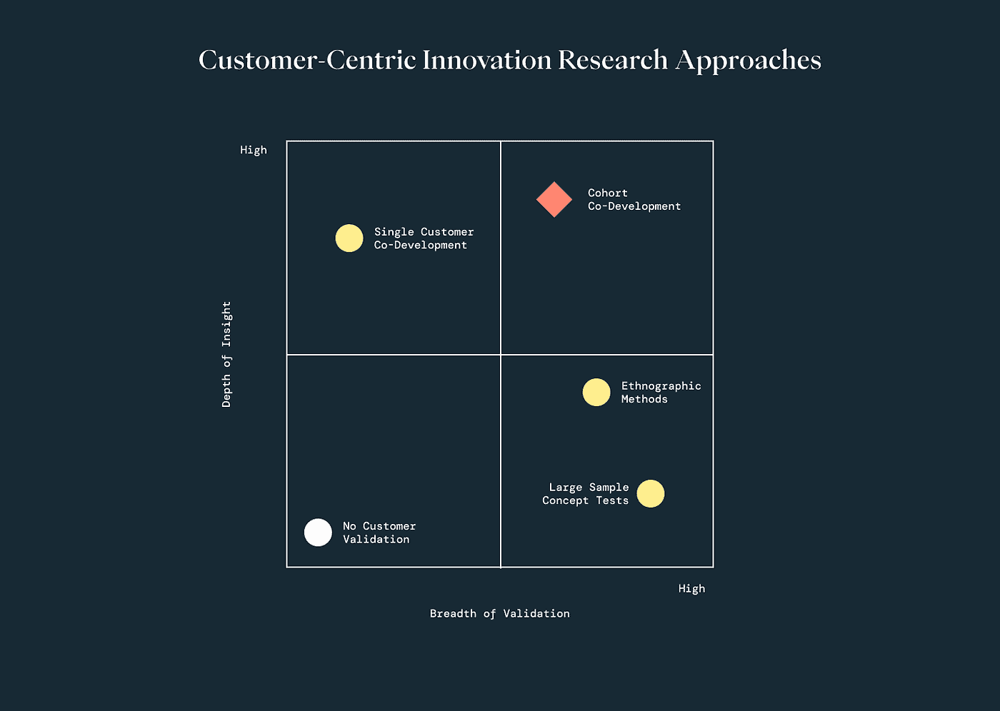
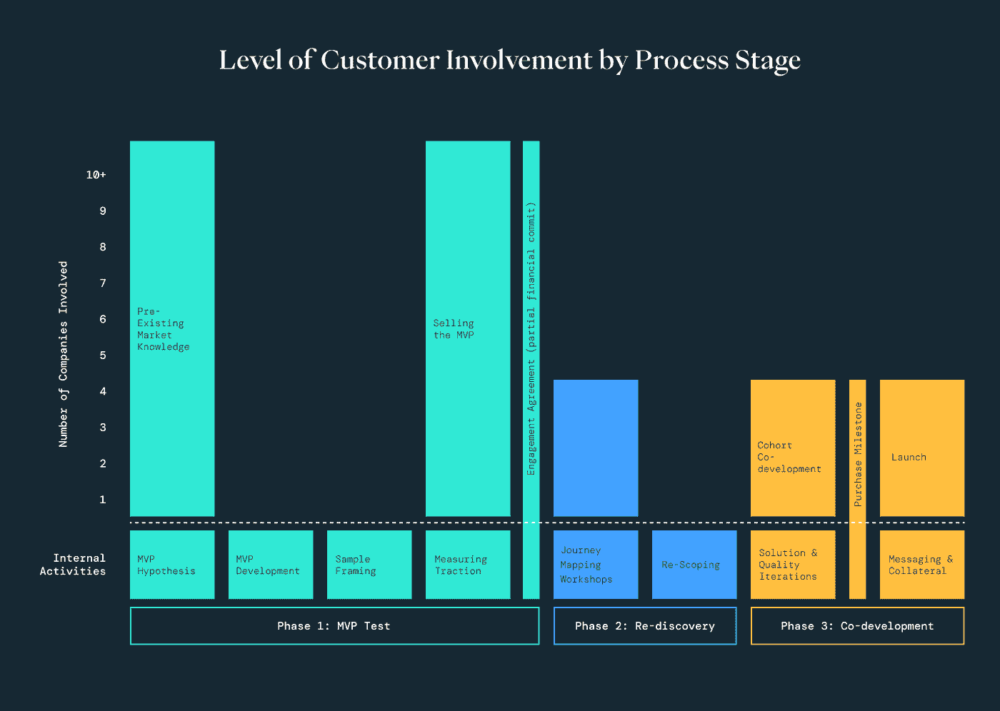
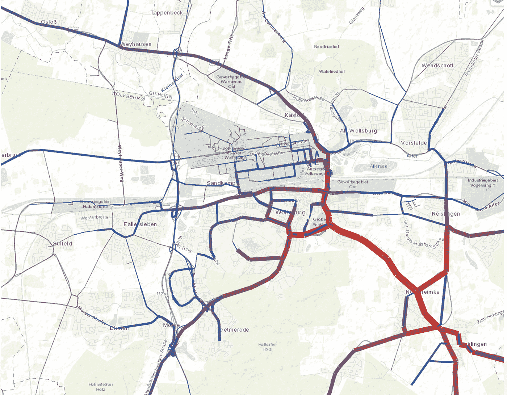

# 在 B2B 产品创新中融合精益、设计思维和共同开发——团队回顾

> 原文：<https://towardsdatascience.com/blending-lean-designing-thinking-and-co-development-in-b2b-product-innovation-a-team-7b9944c59302?source=collection_archive---------18----------------------->

## [行业笔记](https://towardsdatascience.com/tagged/notes-from-industry)

## *允许我们“深入”的方法组合，同时抵消了构建“一次性”(以及我们会采取的不同做法)的风险*

作者:梅森·王茂林，乔贝尔·布劳恩，尼克·科恩和蒂博·杜本内

照片由[塞尔吉奥·索萨](https://www.pexels.com/@serjosoza)在[像素](https://www.pexels.com/photo/headstream-of-amazon-river-flowing-through-lush-fields-6793564/)上拍摄

**简介**

[B2B 环境下的产品研究比消费产品更困难](https://businesscasestudies.co.uk/the-challenges-of-b2b-market-research-and-how-to-overcome-them/),因为潜在参与者相对较少，他们的使用案例复杂，并且由于他们的时间价值高而难以访问。因此，B2B 产品团队可能会决定放弃他们的消费者同行采用的大规模独立研究类型，而是选择直接与个人客户共同开发他们的产品。

共同开发(或共同创造)是一种有价值的 B2B 创新技术，可以产生对客户特定的深度理解，以及专有数据、竞争对手情报和 IT 生态系统细节等有价值的资源。然而，寻找合适的参与者和管理联合开发项目非常耗时，产品团队可能会发现他们实际上只能与一个客户进行联合开发。不幸的是，如此密集地接触一个客户，往往会放大建立一个单一市场的风险。

那么，产品团队如何才能达到来自高度参与的共同开发的理解程度，而不牺牲来自接触许多客户声音的市场视角呢？这是 Teralytics 的 Streets 产品团队面临的挑战，它引导我们找到了本文中描述的混合方法。

*与几个客户群体的共同开发比短期、大样本研究方法产生更深刻的见解，比仅与一个客户共同开发产生更广泛的验证。作者照片。*

**目标&接近**

Teralytics 将机器学习和启发式模型应用于来自数百万电信用户的匿名移动数据，以帮助我们的客户了解他们所在地区的人类移动模式。

2020 年夏天，来自我们市场的信号表明，我们道路规划部门的客户需要将车流量分配给各个路段。这些信号是我们称之为“街道”的新产品的推动力。

我们最初的目标市场包括德国中小城市的数百个交通规划部门。这些实体遵循复杂的流程，并依赖于高度准确(地面实况校准)的数据——这些条件受益于典型的合作开发的洞察力深度。然而，由于我们的许多客户受到公共预算的限制，我们也需要一种方法来帮助我们开发一种核心产品，这种产品将满足大多数客户的需求，而不需要为每笔交易进行昂贵的定制。

在我们的 MVP 测试中，我们借鉴了几十个客户的观点，而后面两个阶段的重新发现和共同开发涉及到四个客户。作者照片。

我们在此描述的流程跨越了整个上市生命周期，从客户和产品发现一直到向收入客户推出和交付功能性产品。这个过程由我们在三个阶段应用的完善的方法组成:MVP 测试、重新发现和共同开发。

# **第一阶段:MVP 测试**

为了避开寻找愿意自愿参与数小时研究的客户的困难，我们对最终的 Streets 产品提供了折扣，作为在其开发过程中参与研究会议的激励。衡量客户的金钱和时间的价值交换对未来产品交付的吸引力是我们用来评估 MVP 假设可行性的测试。

> *“看看向参与的合作伙伴客户收取象征性的费用。。。这改变了参与/激励的动力，从你想从他们那里得到的东西，变成了参与的特权。”*
> 
> 创新委员会

**1.1 开发我们的 MVP 假设检验**

我们希望用 MVP 测试的首要假设是，有交通用例的客户愿意为来自移动数据的道路级洞察付费。我们在假设管理练习中记录了这一点和其他关键假设，我们内部称之为“*流言终结者*”，其中我们记录关键假设，然后确定实验类型和每个实验的成功标准。

*流言终结者工作表记录了假设、实验类型、成功指标和收集的证据。作者照片。*

我们为产品假设选择的测试是试图在开发之前销售一个 MVP。我们认为，说服三到五个客户(占我们总可用市场的 2-3 %)为我们产品的未来交付预付费用可以被认为是足够的吸引力。由于我们流程的后期阶段会涉及定性方法，我们对这一特定阈值的选择受到了 Jacob Nielsen 的观点的影响，即三到五名同质参与者是定性研究最有效的样本量。

> 梅森——首席采购官:
> 
> *在过去的新产品开发中,“从哪里开始”这个令人生畏的问题一直困扰着我的团队，但《流言终结者》列举我们的信念，然后开发实验来测试它们的过程是一个打破最初的麻痹并快速开始验证的好方法。*
> 
> 乔贝尔——UX 设计经理:
> 
> *在我之前加入的组织中，产品和技术发现通常发生在筒仓中，想法存储在各种文档或融合页面中。《流言终结者》的好处在于，它允许从团队中的所有声音中产生假设，建立共识。*

**1.2 构建 MVP**

有了按价值(按设计和产品)和技术可行性和风险(按工程师)排列优先级的特性假设列表，我们现在可以开始界定我们的 MVP 产品了，但我们首先必须决定 MVP 的类型。

*从无产品到最小产品的 MVP 类型——Streets 采用“先卖后建”的方法。作者照片。*

精益实践者开出了各种各样的 MVP 风格，从价值主张的简单表达一直到第一个功能的发布。我们发现客户和最终共同开发的双重目标迫使我们尽可能接近“无产品”MVP，同时仍然表达一个足以实际激发购买的概念。幸运的是，我们行业中的解决方案倾向于在交付前作为定制项目销售，因此成品通常不是开始销售所必需的。

*我们的“先销售后构建”MVP 包括一个推介资料、一个可点击的演示、一个演示脚本、一份产品规格和一份面向客户的评估协议。作者照片。*

为了让我们的销售团队能够传达我们的主张，我们创建了一个包括定价、详细介绍核心功能的产品规格文档、一个可点击的演示以及一个演示脚本的推介资料。我们的行动号召是让客户预先支付标准价格的 5%作为加入“测试版”计划的报名费。在整个开发过程中保持参与的客户可以将该费用用于购买打折的年度订阅。

> 梅森——首席采购官:
> 
> 在理想的情况下，我们应该在构思解决方案假设之前进行广泛的发现研究，但是在我们的领域很难接触到客户进行研究。因此，我们在这一点上所设想的一切都是猜测。假设是好的，但是乔贝尔非常擅长她的工作，即使是我们最可疑的想法看起来也令人震惊。我太倾向于创造一个令人信服的命题，以至于我们的概念“太真实”，这使得说服客户在以后批评我们的功能假设变得更加困难。
> 
> 乔贝尔——UX 设计经理:
> 
> *如何通过公开邀请共同创作来展示产品的可能性？事实上，销售团队展示的概念证明在一个抛光的原型中有很多功能，它可能会发出信号，“嘿，这是一个很酷的成品。”任何试图销售带有概念验证的产品合作开发的人都可能会考虑减少提议的想法和功能的数量，而不仅仅是设计的保真度。*
> 
> thi baut——高级交通建模专家:
> 
> *从工程的角度来看，构建 MVP 就是评估由设计和产品提出的产品功能的可行性。我刚开始在公司工作，与一位在公司工作了 6 年的工程师合作。总的来说，这种结合效果很好:我新鲜的眼睛让我贡献新的想法，而他的经验让他快速识别与我们的 MVP 范围相关的潜在风险和资源。*

**1.3 选择参与者**

手头有了推销材料，我们现在需要一份销售线索清单，这样我们就可以开始销售了。重要的是，我们选择潜在客户的方法会产生一个与我们定性研究阶段相一致的样本。我们最终选定了研究人员所说的“[标准-i 抽样](https://www.ncbi.nlm.nih.gov/pmc/articles/PMC4012002/)”，这是一种常用的非概率“有目的抽样”方法，它依赖于预先确定的标准来定义样本框架。

方便的是，这种技巧看起来很像建立[理想客户档案](https://www.gartner.com/en/articles/the-framework-for-ideal-customer-profile-development) (ICP)的销售实践。因此，我们的样本框架和线索列表包括了我们最初目标细分市场中的公司，特别是人口在 50，000 到 150，000 之间的德国城市的交通规划组织。签署预购协议的前五家公司参与了随后的发现和验证研究活动。

> 梅森——首席采购官:
> 
> *事后看来，仅仅根据客户与目标角色的契合度和购买意愿来选择与他们进行数月合作开发的客户，可能是一个太低的标准。这些标准对评估客户的文化与创新的兼容性没有太大作用。早期，一些客户似乎对参与开放式发现感到不舒服，他们期望一个更加线性的产品开发过程。*

**1.4 测量牵引力**

我们用两种方法来评估 MVP 的接受度:转化和反对。

签署购买协议的正式转换步骤是对我们价值主张的有力验证，因为它涉及产品交付前的部分财务承诺。这项工作还有一个附带的好处，那就是在早期暴露任何采购障碍，从而简化最终的完整许可证采购。协议步骤也是澄清知识产权所有权等主题的机会，同时通过限制对范围或时间表的期望，为开放式创新奠定基础。

吸引潜在客户的目的是转化他们，同时试图向他们学习，这是一种微妙的平衡，需要一种不同于产品/市场适合产品的标准销售的方法。为此，我们鼓励我们的销售代表不要试图“推销”异议，而是倾听并探究“为什么”。

> *“如果会议过多地是关于销售，那么通过询问潜在客户对解决方案的反应，你实际上缩小了对话的范围。会议不再是寻找最佳机会。。。这是为了让潜在客户相信，你的广泛价值主张是有意义的。”*
> 
> 艾蒂安·嘉宝莉，莱安·B2B

在这一过程中，我们安排了与销售团队的每周汇报会议，讨论他们的发现，目的是根据现场的反应重复或改变我们的主张。为了帮助我们识别调查结果中的模式，我们对收到的异议进行了分类，让我们可以通过下图这样的图表来直观地了解我们推销中的摩擦来源。

*推介回顾帮助我们量化了 MVP 初始推介期间出现的意见和异议的类型和频率。作者照片。*

最终，我们的销售代表达到了五个有购买意向的客户的门槛，而不需要修改我们的推销。然而，由于与我们的价值主张无关的合同条款，与一个客户的谈判最终停滞不前；因此，我们从四个客户开始了我们流程的第二阶段。

> 梅森——首席采购官:
> 
> 让我们的销售代表将此作为学习练习并定期参加汇报会议非常困难。在很大程度上，我认为我们的销售代表将此视为典型的销售。这也许是可以理解的，因为除了首席执行官偶尔的督促，我们没有建立任何特殊的激励机制来鼓励他们以不同的方式对待这一点——这种“学习活动”最终会偏离他们的销售目标。

# **第二阶段:重新发现**

我们通过 MVP 获得的稳固牵引力是一个信号，表明我们的市场重视这些能力，但我们还不知道“为什么”。我们仍然需要了解我们的主张所支持的用户目标，这些用例对我们用户的工作有多重要，这在哪里适合他们的工作流程，以及我们产品周边的供应商和解决方案的生态系统。

**2.1 旅程映射**

我们将在项目启动会议上回答这些问题。这些会议的形式是一个四小时的(虚拟)研讨会，由代表每个客户的三到六名用户和决策者参加。为了实现研讨会的客户发现目标，我们首先需要参与者基本上“忘记”我们向他们推销的 MVP，而是告诉我们更多关于他们自己和他们工作的信息。

> *创建旅程图的过程迫使整个团队进行对话并形成一致的思维模式。。。这一共同愿景是旅程规划的关键目标。”*
> 
> —尼尔森诺曼集团的莎拉·吉本斯

启动研讨会的核心是[旅程规划](https://www.nngroup.com/articles/journey-mapping-101/)练习，这是一项大量借鉴设计思维概念的技术。在这里，我们要求参与者列出一个“长列表”，列出他们角色中最重要的活动和目标。从这个长长的列表中，参与者选择一个目标进行深入研究，向我们介绍实现该目标的步骤、时间表、人员和问题。

*我们在每次研讨会期间在 Miro 中捕捉到的路线图包括时间表、步骤顺序、主要参与者以及参与者所选目标的挑战。作者照片。*

> 梅森——首席采购官:
> 
> 这些研讨会的前 10 分钟很紧张！我们必须让参与者从销售过程中设定的产品即将完成的预期中走回来。尽管我们传达了信息，但我们演示的高逼真度给潜在客户留下了产品比实际更完整的印象。一旦我们重新设定了期望值，研讨会的其他部分就很棒了。在几个小时内，旅程地图帮助我们精确定位了客户最重要的工作流程中街道可以增加实际价值的区域。
> 
> 乔贝尔——UX 设计经理:
> 
> *参与者主要是说德语的人，我不能低估有一个母语主持人有多重要，他可以发现语言中的细微差别，并允许自然的对话流。在第一个研讨会中，现状路线图是从参与者典型工作流程的角度进行的，而不是对实际事件的叙述。我们在随后的研讨会中对此进行了更改。由此产生的对具体案例中实际发生的事情的强调引发了更有意义的讨论。*
> 
> nick——高级产品经理:
> 
> *在研讨会期间，由于缺乏数据和工具，与会者表达了对现状的强烈不满。这澄清了他们参与计划和投资潜在街道产品的动机。研讨会似乎允许客户在安全的环境下反思他们的工作，这引发了参与者之间关于他们真正的优先事项和挑战的一些对话。这些讨论为我们提供了对客户问题的坦诚和真实的看法。*

**2.2 重新审视我们的解决方案**

在与来自四个客户的 13 名参与者进行了 16 个小时的研讨会后，我们对用户的角色、目标、难点和背景有了足够深刻的理解，能够围绕这一背景重新定义我们的产品假设。

我们最初的一些假设在研讨会上得到了验证。例如，我们认为小城市缺乏数字工具来应对和决策市民不断变化的出行行为，这一观点被证明是正确的。另一方面，我们揭穿了一个重要的假设，即实时交通是这个用户群的需求。

综合我们的发现后，我们更新了最初的任务流程，省略了多余的步骤，专注于我们现在理解的核心流程。从这个核心，我们得出了一个新的基础范围，这将作为我们共同发展的基础。

> nick——高级产品经理:
> 
> 很明显，在最初的研讨会之前，客户就已经在思考新产品可能对他们有什么帮助，所以他们准备了一份需求清单。当我们与他们一起定义他们最重要的用例时，他们最终都给予了交通量最高的优先级，即使是与公共交通相关的用例。对“核心”产品定义的补充在关键时刻到来，当客户能够看到演示并通过触摸测试原型时，他们对设计和内容功能反应热烈。除了两个关键的例外，这些增加是对最初“核心”的重大改进，而不是重大转变。
> 
> 乔贝尔——UX 设计经理:
> 
> *综合我们在研讨会期间收集的丰富信息后，我们更好地了解了客户的经常性需求和目标。这给了我们下一次迭代所需要的焦点。我觉得自己像一个雕塑家在凿石头。一些最初的流言终结者假设已经被证实，而另一些被证明对我们的产品来说是不必要的。我们的团队对于保留在我们的研讨会中不被支持的功能并没有辩解。这确实是这个过程应该做的，很高兴看到它的工作。我们利用我们的学习来简化我们的任务流程，并总体上重新设想我们的产品。*
> 
> thi baut——高级交通建模专家:
> 
> *在这一阶段，Nick 不仅倾听客户的意见，也倾听团队的意见。例如，了解到客户对交通速度不感兴趣是一个受欢迎的发现，因为我们不确定我们能否准确地得出这些数据。另一方面，受到客户最热烈欢迎的功能之一(我们称之为“蜘蛛分析”)并没有被客户明确提及，而是由团队在我们进一步了解客户的目标后提出的。因此，我们决定制作第一个原型，稍后在我们的互动研讨会上展示。*

# **第三阶段:共同开发**

尽管与客户合作这一显而易见的概念似乎是一个复杂的术语，但客户共同开发(或共同创造)是一个合适的理论空间，有[正在进行的研究](https://www.impgroup.org/uploads/papers/8261.pdf)，越来越多的文献，不同的方法，以及[私营部门咨询](https://www.boardofinnovation.com/)。

与设计思维等其他以客户为中心的方法相关但不同的是，与前者相比，共同开发倾向于与相同主题进行更长时间、更密集的互动，以及更多地参与解决方案开发。

> “设计思维有助于通过深入的用户观察创造价值，而共同创造的目的是通过用户互动创造价值。”
> 
> *——2016 年芒索法布里赫莫内特-古约特*

共同开发佳能通常假定与单一领先客户的联合创新，我们同时与四个客户合作背离了这一原则。我们的方法使我们避免了建立一次性项目的风险，因为可能将我们引入错误道路的个人请求可能会与我们其他项目参与者的需求进行近乎实时的核对，从而不断将我们保持在“金发女孩”区域。

**3.1 解迭代**

在联合开发中,[“客户主导”和“客户验证”同样有效](https://hbr.org/2010/10/building-the-co-creative-enterprise),但供应商应仔细考虑哪种方法最合适。由于我们的 Streets 产品团队拥有广泛的领域、设计和工程技能，我们相信我们有能力领导解决方案的开发。通过率先行动，我们可以将解决方案的空间构建为可行性和财务可行性，在此范围内，我们的内部设计能力和客户参与的结合确保了高水平的创造力。

每隔几周，我们将举行一次回顾迭代，我们将通过提出越来越逼真的解决方案概念来引导，然后客户将在这些概念的基础上做出回应和思考。我们以这种方式持续了两个多月，在每次迭代后进行验证的同时进行设计和开发，直到我们开发出第一个功能完整的产品。

中间前端原型的屏幕截图，带有一小组真实的数据，在可用性测试期间生成了有意义的响应。作者照片。

这一旅程中的一个重要里程碑是我们第一次“可点击”体验的交付。这允许我们开始测试可用性，同时进一步验证价值和我们的解决方案实现。有了这个版本，客户实际上可以登录并测试我们对他们用例的实现。我们记录了与每个人的一对一会谈，并根据我们观察到的用户反馈模式改进了我们的方法。

> nick——高级产品经理:
> 
> *随着我们在每次迭代中提高我们概念的保真度，我们收到了更加具体和可行的反馈..例如，我们构建的一个用例是“选定链路路由分析和显示”。我们在一个交互式会话的上下文中演示了它。虽然这是交通规划领域中一种众所周知的分析类型，但对客户来说却是全新的，他们很快就兴奋地使用它来回答许多与用例相关的工作问题。通过这种方式，我们验证了这是核心产品的重要组成部分。*
> 
> 在这个过程的所有步骤中，与四个客户迭代是最耗时的。我们测试了将多个客户合并到一个会话中，但发现这并不能节省时间。对我们来说，从每个参与者那里获取反馈显然非常重要，而且客户也希望他们的具体反馈能够被听到，而不仅仅是参与小组讨论。
> 
> 乔贝尔——UX 设计经理:
> 
> *在一次迭代中，我通过电子邮件将漫威的原型发送给客户以获得反馈，但是这种异步方法没有产生太多的响应。从那时起，我只在我们的现场会议中分享原型并寻求反馈。事后看来，我们不应该期望参与者在既定的会议节奏之外参与共同创造。*
> 
> *当我们在可用性会议上展示高保真度模型以进一步验证用例及任务时，参与者的反馈反而集中在数据的“虚假性”和“看起来不错”上这令人沮丧，因为这些会议并没有产生高质量的体验反馈。只是到了后来，一旦我们开发了一个包含少量真实数据的测试应用程序，参与者才会真正地参与到这些概念中来。在这些会议中，他们详细阐述了他们将如何处理这些数据，这些数据是否看起来可信，以及他们可以使用该产品完成的其他潜在用例。*
> 
> thi baut——高级交通建模专家:
> 
> *研讨会的形式允许我们采取一种“快速而肮脏”的方法来制作原型:在某些情况下，我们的可视化软件在构建它的工程师的机器上运行，并且通过浏览器的控制台选择链接:唯一能够实际操作它的人就是构建它的人。只有当我们看到积极的反应时，才开始在实际的 UI 中集成可视化的完美版本。*
> 
> *作为数据计算需求的反馈来源，与客户的持续互动非常重要。然而，一旦我们开始向客户展示他们特定领域的数据(这有利于保持他们的参与，并帮助我们评估我们的第一个结果的“表面有效性”)，交付新数据版本的压力就出现了，并在一定程度上干扰了开发的研究方面。事实证明，在我们正确地自动化我们的计算管道的各个步骤之前，向客户交付定期更新非常耗时，并且我们必须在方法被完善和测试的同时调试我们的数据源。*

**3.2 校准和质量**

与客户作为合作伙伴共同开发的最有价值的好处之一是，他们愿意提供专有数据和真实世界测试条件，以及他们的一般专业知识。

我们通过利用客户对其所在地区的总体交通状况的现有了解，完成了第一步校准。在这里，我们向客户提供了他们网络上交易量的概况，以便他们可以用他们对我们产品准确性的高层次“印象”来回应。然后，更深入地研究，我们提供了一些与流量计数的现场位置比较，并在向他们介绍用例时，询问他们内容是否看起来可信。

基于我们的学习，我们多次重复我们的方法，越来越详细地审查与流量计数的比较。在这一过程中，除了已经公开提供的数据集之外，一些客户还提供了地面真实数据集，我们用这些数据集来调整我们的模型。

> nick——高级产品经理:
> 
> 需要注意的是,“地面实况”一词具有误导性，因为即使是客户也指出可用的交通数据是不完善的。一位客户提到，他们希望我们的数据实际上可以被视为事实，并显示他们有限的计数或调查信息哪里不正确。尽管每个数据集都有不完美的本质，但访问多个专有数据源有助于我们进一步验证和调整我们的模型。
> 
> thi baut——高级交通建模专家:
> 
> *我们的宏伟愿景是能够以完全自动化的方式‘点击按钮’为新客户提供数据，而无需依赖客户数据或手动校准。因此，我们使用地面实况数据(公开可用的和客户提供的)只是为了检查结果的质量，而不是校准参数。能够仅在几次迭代中实现对该数据的合理拟合，而无需任何广泛的参数调整，这给了我们对我们的方法在规模上的可行性的信心。*
> 
> *同样值得注意的是，许多“可用”数据并不容易使用。特别是，流量计数通常以地图的形式提供，需要手动转换为机器可读的格式，并进一步手动映射以将计数站与网络定义相关联。由于没有时间对其进行适当的格式化，只有一小部分数据可以在联合开发阶段使用。*

**3.3 交付和投放**

根据我们的合作协议，产品的第一个功能版本的交付将触发一个购买决策里程碑。在这一点上，根据我们共同定义和开发的内容，客户需要决定是加入折扣产品订阅还是放弃预付款。

我们的协议还包括非约束性语言，要求对产品满意的客户提供我们可以公开引用的认可。虽然这是可选的，但该计划的所有参与者都愿意这样做，这些报价已包含在我们的发布宣传资料中。

> 顾客的参与似乎有利于增强对公司的认知，愿意向他人推荐公司，以及更高的购买意愿和支付意愿
> 
> Schreier，Fuchs 和 Dahl，2012 年

对共同开发的实证研究表明，我们的参与者公开支持街道的意愿并不罕见。随着公司认知度的提高，在产品创新上的合作[有助于吸引客户最终购买](https://journals.sagepub.com/doi/10.1509/jm.10.0462)。虽然这是一个直观的概念，但对于任何考虑这种方法的成本和收益的人来说，这也是一个很好的指导。

> nick——高级产品经理:
> 
> *购买里程碑很难跨越，因为从技术上讲，这是一个销售代表应该管理的销售结束，但对我来说，决定产品何时“准备好”要求承诺是一个判断。在那之前，我们一直是在研究的基础上以同行的身份进行合作，所以很难回到商业对话上来。测试客户的反应各不相同:一些客户认为他们已经“接受”了产品开发轨迹并保留了预算，而另一些客户在开发项目过程中改变了对他们时间和预算的要求。总的来说，反应可以说是积极的和商业上成功的。*
> 
> 乔贝尔——UX 设计经理:
> 
> *设计准备好发布意味着什么？在我们的案例中，一个高优先级可用性问题的综合，已经被记录和处理，并且有一个符合我们 Figma 设计和我们设计系统的前端。与前端团队一起，我们在频繁的 Slack 和 Zoom 要求澄清中完成了 JIRA 设计标签。团队中的每个人都对结果感到满意。设计永远不会结束，但是总是会积压一些优先级较低的问题。*
> 
> thi baut——高级交通建模专家:
> 
> *联合开发过程的一个重要方面是，我们只需要提供客户愿意购买的绝对最小的功能集。特别是，与客户的讨论清楚地表明，他们不需要频繁的数据更新就可以开始从产品中获得价值，这使我们可以在不构建自动更新基础架构的情况下发布产品。没有高质量的报告和在发布前解决数据生产的已知问题让我们感到紧张，但我们都知道这是第一个版本，重要的更新将很快跟上，这让每个人都可以放心。*

**总结**

在评估了我们产品的第一个功能版本并了解了我们为即将到来的版本指定的路线图后，参与我们计划的所有客户都选择订阅并继续使用该产品。

从一个以高层次价值主张假设开始的项目开始，Teralytics 在五个月内就从一个在发布前已经销售了多次的产品中获得了收入。该产品一开始就取得了良好的势头，这是使用其他难以访问的验证数据开发的直接结果，这些数据被证明对产品质量及其上市前的开发、购买和领先客户的认可非常宝贵。

因为我们验证了我们的价值主张，并与多个客户共同开发，所以我们相信这一势头将会持续下去，更广泛的市场份额将会发现我们的解决方案比其他情况下更能满足他们的需求。

**推荐**

虽然我们开发街道的方法是成功的，但它并不完美。我们从这个过程中学到了很多，我们认为其他人也可以从我们的经历中受益。为此，我们向任何开发类似 B2B 提案的人提供以下建议:

1.  **参与费用:**共同开发可能是一个漫长的过程，通常需要几个月。进行金融投资的客户更有可能在此期间保持参与。
2.  **系统地提出假设:**通过将你对产品机会的所有信念和假设整理成目录，你可以开始消除新产品机会中典型的高度不确定性。
3.  **让产品参与推销:**产品团队成员从现场学习的最佳方式是实际参加销售会议。
4.  **调整销售激励:**虽然先学习后发展对一家公司整体而言非常重要，但这种重要性应该体现在如何激励销售代表招募共同发展合作伙伴上。
5.  **用低保真度的概念测试你的价值主张:**在 MVP 测试中，低保真度的线框图将传递关于产品成熟度的正确信息，同时保持对核心主张的关注，而不是对精致 UI 的关注。
6.  **找出“为什么”:**如果你的价值主张测试成功了，不要只把这个事实当作是一盏绿灯。进行跟进，以确定用户重视的功能及其服务的目标。在构建之前，使用上下文来重新设想您的产品范围。
7.  **为以数据为中心的产品校准原型:**一般的设计研究实践倾向于关注*用户体验*的保真度，首先用线框进行验证，然后详细阐述。然而，对于以数据为中心的产品，考虑何时增加原型中数据的保真度也很重要。很可能在你需要一个完美的用户界面之前，你需要用更高保真的数据进行验证。
8.  **与三到五个客户共同开发:**除了避免构建一次性产品的风险，如果您的产品受益于校准或培训数据，获得来自多个客户的数据肯定会提高您产品的初始质量。
9.  **澄清知识产权所有权:**通过避免最终开发成果的所有权模糊不清，保护你在合作开发过程中可能获得的商誉。
10.  **发布时合作:**由于研究表明，共同开发的合作伙伴自然倾向于购买你的产品，并成为你的产品的拥护者，所以确保你不要在工程完成后立即终止合作。如果您的客户愿意将他们的信誉借给您的市场推广工作，就让他们这么做吧！

**参考文献**

建立共同创新的企业。(2010 年 10 月 1 日)。*哈佛商业评论*。[https://hbr.org/2010/10/building-the-co-creative-enterprise](https://hbr.org/2010/10/building-the-co-creative-enterprise)

Garbugli，E. (2014 年)。精益 B2B:生产企业想要的产品。创建空间独立发布平台。

赫蒙内-古约特，法布利，j .，，芒索，D. (2013)。*设计思维 vs 合作创新:两种创新方法的比较。*

*征途映射 101* 。(未注明)。Nngroup.Com。于 2021 年 9 月 23 日从[https://www.nngroup.com/articles/journey-mapping-101/](https://www.nngroup.com/articles/journey-mapping-101/)检索

梅里韦瑟，E. (2020 年 6 月 12 日)。*区别:原型 vs MVP* 。Productschool.Com。[https://product school . com/blog/product-management-2/difference-prototype-MVP/](https://productschool.com/blog/product-management-2/difference-prototype-mvp/)

奥伊诺宁，M. (2014 年)。*客户参与 B2B 市场的共同发展:关于关键贡献和成功因素的文献综述*。

Palinkas，L. A .，Horwitz，S. M .，Green，C. A .，Wisdom，J. P .，Duan，n .，& Hoagwood，K. (2015)。混合方法实施研究中定性数据收集和分析的有目的抽样。*精神健康管理与政策*， *42* (5)，533–544。

Pinder，M. (2019 年 1 月 30 日)。 *B2B 共同创造:50 个关键的学习和见解——创新委员会*。Boardofinnovation.Com。[https://www . boardofinnovation . com/blog/B2B-co-creation-50-key-learning-and-insights/](https://www.boardofinnovation.com/blog/b2b-co-creation-50-key-learnings-and-insights/)

k . reshetilo(2021 年 6 月 15 日)。什么类型的 MVP 适合你的创业？— Greenice。检索于 2021 年 9 月 23 日，来自[https://greenice.net/type-mvp-right-startup/](https://greenice.net/type-mvp-right-startup/)

Schreier、c . Fuchs 和 d . w . Dahl(2012 年)。用户设计的创新效应:探索消费者对销售用户设计产品的企业的创新感知。*市场营销杂志*， *76* (5)，18–32。

b2b 市场研究的挑战以及如何克服这些挑战。(2019 年 6 月 5 日)。Businesscasestudies.Co.Uk。[https://business case studies . co . uk/the-challenges-of-B2B-market-research-and-how-to-comprise-them/](https://businesscasestudies.co.uk/the-challenges-of-b2b-market-research-and-how-to-overcome-them/)

*理想客户档案发展框架*。(未注明)。Gartner.Com。2021 年 9 月 23 日检索，来自[https://www . Gartner . com/en/articles/the-framework-for-ideal-customer-profile-development](https://www.gartner.com/en/articles/the-framework-for-ideal-customer-profile-development)

*为什么只需要 5 个用户测试*。(未注明)。Nngroup.Com。2021 年 9 月 23 日检索，来自[https://www . nn group . com/articles/why-you-only-need-to-test-with-5-users/](https://www.nngroup.com/articles/why-you-only-need-to-test-with-5-users/)