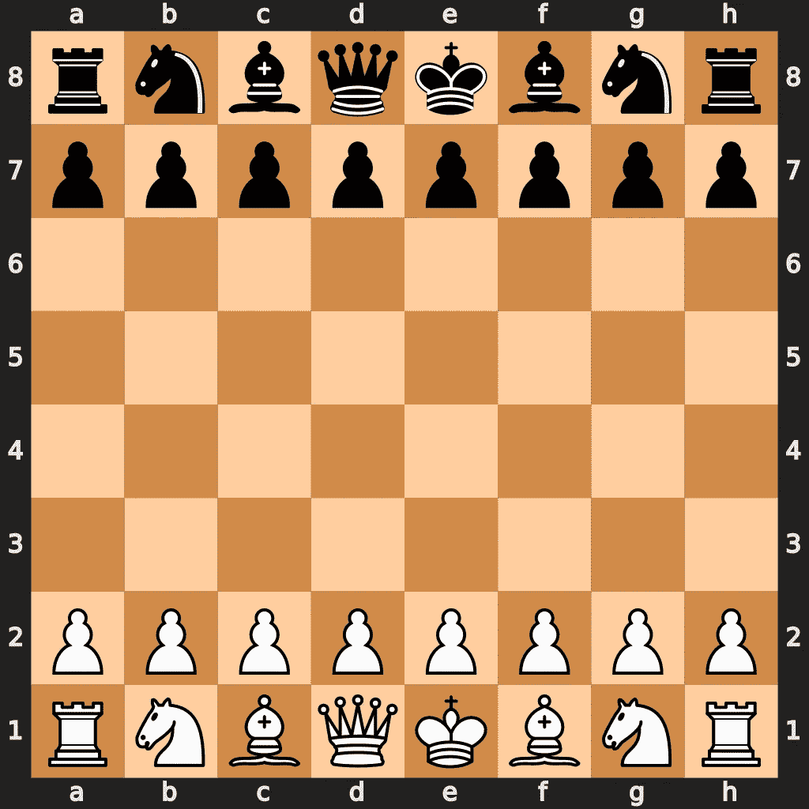
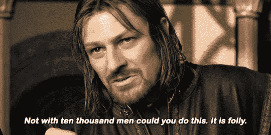

# 盲棋日志[0]

> 原文：<https://towardsdatascience.com/blind-chess-log-0-d6b05c6cf90c?source=collection_archive---------35----------------------->

## 部分观测环境的蒙特卡罗树搜索

作者出品。

欢迎来到盲棋日志索引 0。在这里，我计划与我的朋友[格莱布·特卡切夫](https://www.linkedin.com/in/gleb-tkachev-851b6096/)一起分享每周在机器学习宠物项目上工作的经历。该项目的目标是为侦察盲棋开发一个 ML 机器人，它不会做非常愚蠢的动作，也许能够击败一个随机的机器人。一套完整的规则可以在`reconchess` python 包的文档[中找到。但简而言之，这是一种象棋变体，你看不到对手的移动，每次在决定你的移动之前，你可以选择 3 乘 3 的正方形，并在那里获得棋盘的实际真实状态。听起来很刺激？我们走吧…](https://reconchess.readthedocs.io/en/latest/)

## 相当大的探索

如果你通读侦察棋的[规则](https://reconchess.readthedocs.io/en/latest/rules.html)并思考这里可能适用的 RL 算法，你首先想到的是什么？我敢打赌，对大多数读者来说，它是 AlphaZero。那当然不是没有原因的。但是，AlphaZero 无疑是一种“不要在家里尝试”的项目。尽管从概念上来说这是一个非常简单的方法，但它是由一群杰出的科学家和工程师用非常昂贵的预算建造的工程杰作。它的规模使得它不可战胜。当然，人们可以尝试为单台机器开发一些 DIY 克隆，但它训练一些合理行为的可能性相当小。

动画来自 [Tumgir](https://www.tumgir.com/static/about) 。

知道了这一切，我们毫不犹豫地决定采用类似 AlphaZero 的方法。不过，我们有一个小小的借口。我们的目标不是重新实现 AlphaZero 的一对一，而是试图建立一种受它启发的东西，即一种结合搜索和学习的算法。

我个人最喜欢的 AlphaZero 鸟瞰图是，我们训练策略函数来压缩蒙特卡罗树搜索(MCTS)迭代和价值函数来预测未访问状态的价值估计。然后，我们使用这两种方法，通过用策略缩小搜索范围和用值函数引导估计来改进 MCTS 的收敛性。这使得即使在评估期间在有限的计算预算下运行，也可以计算强移动。原则上，考虑到无限的计算能力，人们可以只用 MCTS 来解决像围棋和国际象棋这样的游戏。因此，从实现 MCTS 开始，并让它发挥作用(即使相当悲惨)听起来相当合理。

## 问题开始的地方

方便的是，我有一个 MCTS 实现放在我未完成项目的私人墓地上。唯一的问题是标准 MCTS 适用于完全观察到的环境。相比之下，盲棋只能被部分观察到，因为你看不到对手的行动。这带来了一些复杂性…

MCTS 有自己的环境模拟器(游戏)来搜索可用的动作空间。为了从某个给定的状态运行搜索，我们需要能够将我们的模拟器重置到这个状态。你能看出问题所在，对吗？由于我们不知道状态，在部分观察环境的情况下就不那么简单了。在盲棋的背景下，如果我们假设对手的移动是模拟的一部分，我们可以只为第一个状态建立树，并且只在我们下白棋的情况下。在第一步之后，我们不知道对手棋子的实际位置，因此我们不知道从哪个状态开始寻找下一步。

**下面是后面解释的重点:**一个 MCTS 的内部模拟器，用于从一个单一的状态进行搜索，仍然可以返回给你真实的状态。你将把它编码，并自由地做任何你认为合理的事情。然而，这不会帮助你超越第一步，只有当第一个状态是已知的(如盲棋中的白棋手)。当然，在训练过程中我们可以黑任何我们想黑的东西，甚至可以让一个真实的模拟器还原对手的招式，还原真实的状态。但是这显然不能用于评估，特别是如果你的机器人应该和其他玩家进行一些在线比赛的话。

幸运的是，已经提出了相当多的方法来使 MCTS 适应部分观察的设置。我们发现大卫·西尔弗等人的[POM CP](https://papers.nips.cc/paper/2010/hash/edfbe1afcf9246bb0d40eb4d8027d90f-Abstract.html)(是的，那个家伙)是最简单和最容易实现的，并决定采用它。该方法的思想是将 MCTS 与真实状态的粒子滤波估计器结合起来。我不会详细解释这篇论文，但这里有一个摘要:

1.  你通过行为和观察(而不是经典中的状态)来分支你的树，并且为你的树中的每个节点维护一组可能的真实状态。你还需要一个内部模拟器，除了观察结果之外，它还能返回状态(如上所述，它不是一个节目停止器)。
2.  开始时，你从初始状态分布中抽取 N 个状态，这些状态应该是已知的(即使是盲棋也是这种情况)，并将它们添加到根的集合中。
3.  对于每一次 MCTS 迭代，也就是扩展和反向传播，你从当前根的集合中抽取一个状态，并重置你的模拟器。当您在树中移动时，您将内部模拟器返回的每个新状态添加到下一个节点的集合中，该节点对应于您获得的观察。
4.  一旦你建立了一个树或者超出了你的计算预算，你就可以根据收集到的统计数据选择最好的移动，并把它提供给真正的模拟器。True simulator 只返回一个观察结果，您可以用它来选择树的下一级的正确节点，并将其提升到根节点。然后你重复第三步。

即使考虑到论文中提供的使你的状态估计稳定的众多技巧，这似乎仍然是解决 MCTS 部分可观测性的最简单的方法。因此，我们在晚上花了很大一部分空闲时间来实施它。在开始的时候，我们确实有点担心，不知道“感觉”动作(那些你得到一个 3x 3 正方形的真实状态)在这种方法中是否“有意义”。幸运的是，经过一些头脑风暴、绘图和编写第一个原型之后，我们意识到它们可以很自然地集成在一起。本质上，你把你真实状态的粒子估计散布在树的不同分支上，因为“好的”感觉动作揭示了额外的信息并导致不同的观察结果。理论上，这将减少状态估计的方差，一切都将顺利进行。然而，没过多久，我们意识到还有一个问题…

## 让我们一起玩吧

AlphaZero 的另一个被认为对超人表现至关重要的关键因素是自我游戏。对于 MCTS 来说，自我游戏是通过在同一棵树上以循环方式为两个玩家寻找最佳移动来实现的。

现在让我们忘记部分可观察性，假设我们正在为一些根状态构建一棵树，并根据我们之前收集的一些统计数据(或者如果统计数据不可用，则随机选择)选择一个动作。我们现在过渡到我们的对手必须采取行动的状态。那么我们应该采取哪一步呢？我已经提到过，最简单的方法是对对手使用一些固定的策略。然而，如果我们真正的对手有不同的打法，那就不行了。相反，在自玩 MCTS 中，我们将这个状态添加为节点，并从它开始继续树搜索，就像我们将为对手玩一样。本质上，当展开树时，你假设你的对手也使用 MCTS。这应该可以让你想出更强的动作。这种方法也可以很好地适应您的计算预算。一个额外的好处是，对于零和游戏(如国际象棋)，将 MCTS 扩展到自我游戏并不需要太多，至少在概念上是如此。当反向传播对手节点的统计数据时，你需要做的就是否定一个玩家在首次展示中获得的奖励。当然，这需要一个足够通用的实现来跟踪玩家的 id 并仔细处理统计数据的更新。在相当多的“设计讨论”之后，我们设法实现了类似的东西，并且看起来工作可靠。

让我们回到我们的部分观察设置，在这里一切都变得“有点复杂”。现在，当为一个已知状态(例如，可能是初始状态)构建树时，由于我们的内部模拟器，我们仍然可以进行自我游戏。如前所述，我们确实对它有完全的控制权，我们可以通过某种方式实现它，以返回对手的观察和动作，这样我们就可以在它们上分支，并向我们的树中添加相应的节点。当我们超出了一步棋的计算预算，选择了目前为止我们发现的最好的一步棋，并将其输入到真正的模拟器中时，问题就出现了。模拟器的状态很先进，对手也做出了自己的举动，但我们对此一无所知。现在我们需要在我们的子树中找到一个新的根节点，它对应于再次轮到我们的观察，并且可能包含状态估计集合中的真实状态。因为我们不知道对手得到了哪个观察值，也不知道他选择了哪个移动，所以我们不知道要遍历哪个分支。因此，我们没有对当前真实状态的估计，也无法重置我们的内部模拟器来再次运行搜索…

抱歉，我知道没有一些图纸可能会很难掌握，但我真的不想把这些日志变成全取教程。否则，我会花更多的时间来准备这些，而不是实际参与项目。因此，如果你有任何问题，或者对这个话题感到兴奋，请在评论中或在 [LinkedIn](https://www.linkedin.com/in/mlefarov/) 上联系。我将很高兴与你讨论它。

当然，我们想到了一些简单的方法，比如遍历对应于玩家移动的分支，然后汇集并合并来自下一级对应于我们回合的子节点的所有可用状态估计。然而，这可能会给我们的真实状态估计带来相当大的差异。此外，根据规则，当对手抓住你的棋子时，你实际上获得了一些关于他的移动的信息。所以你可能会遇到这样的情况，你从孩子那里收集了一些状态，而这些状态对于你刚刚得到的新信息来说是不可能的。或者更糟，在你没有任何与新信息一致的粒子估计的情况下。无论如何，这听起来是最直接的开始方式，所以下周很可能会继续使用。

这就是盲棋日志的迭代。请继续关注大约一周后的下一次更新。