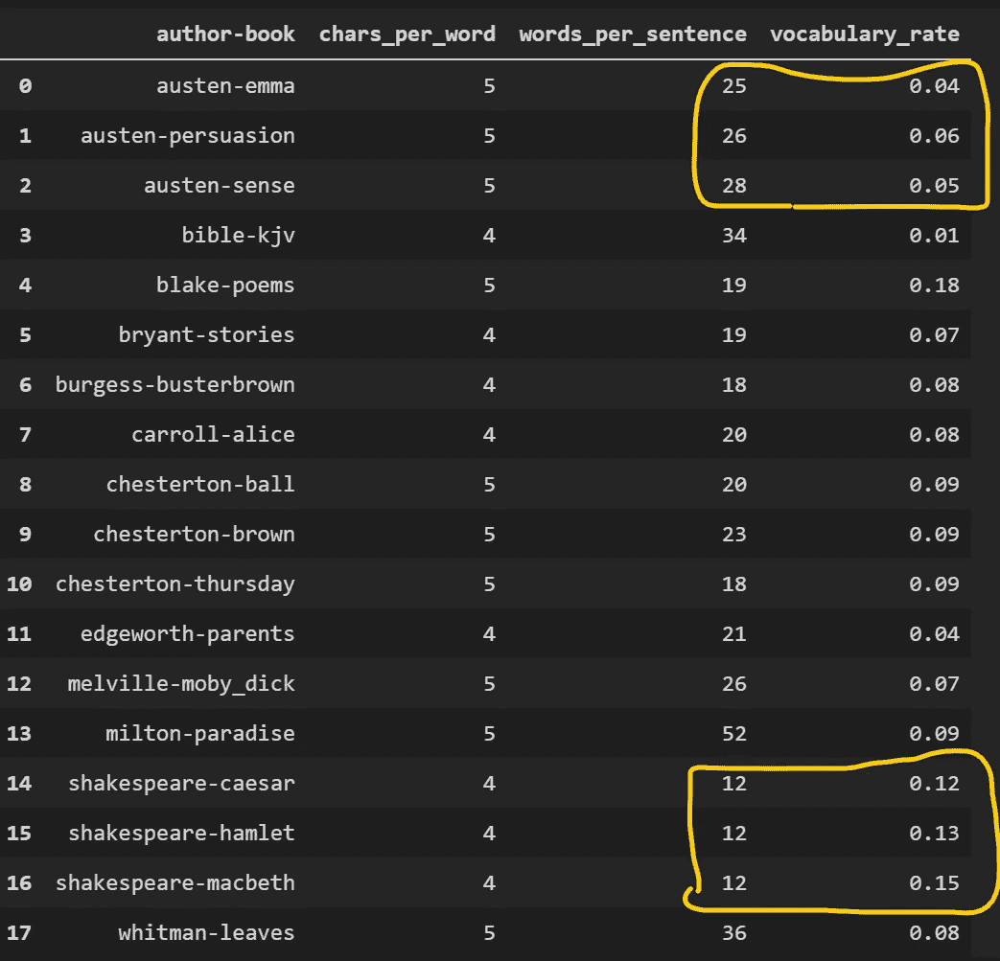
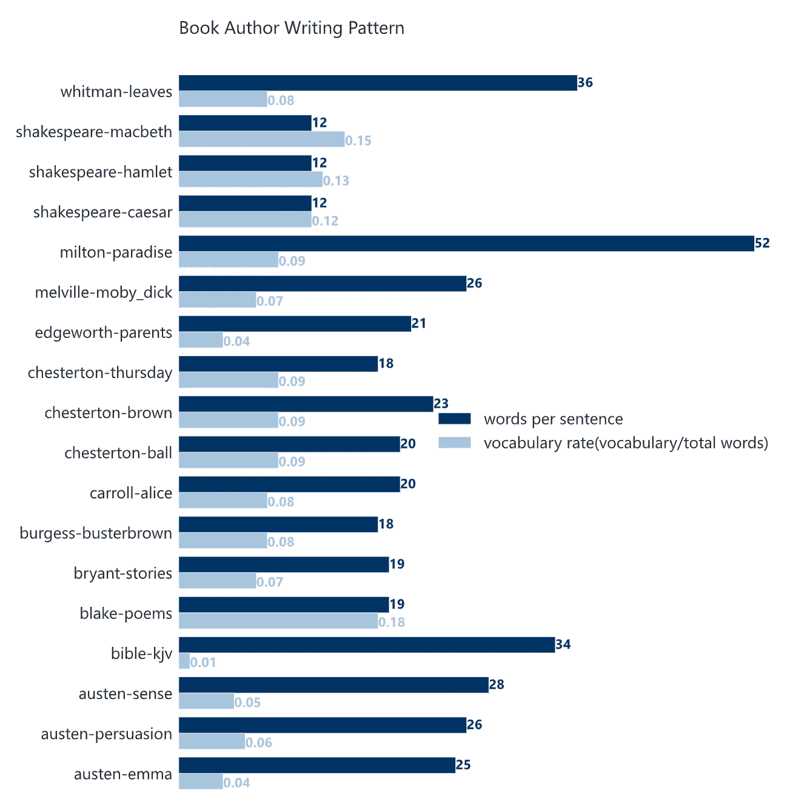

# 书籍写作模式分析

> 原文：<https://towardsdatascience.com/book-writing-pattern-analysis-625f7c47c9ad?source=collection_archive---------36----------------------->

## 通过一个用例开始 NLTK 和 Python 文本分析。


西雅图图书馆 Andrew Zhu 摄

当我还是学生的时候，我读到一些文章，说语言学家可以使用文本分析技术来确定一本匿名书的作者。我当时觉得很酷。

回想起来，感觉这个手法还是很酷的。但是，如今在 NLTK 和 Python 的帮助下，你和我可以通过几行代码成为“真正的”语言学家。

## 准备分析目标

您不需要编写一个爬虫来搜索分析语料库。出于学习和研究的目的，NLTK 包中已经有一个巨大的文本数据库。如果您没有安装这个包，只需运行 pip 来安装它。

```
pip install nltk
```

然后从[古腾堡](http://www.gutenberg.org/)下载书籍数据，这是古腾堡项目电子文本档案中的一小部分文本。

```
import nltk
nltk.download("gutenberg")
```

下载应该在 1 或 2 秒内完成。让我们列出下载书籍的名单。

```
from nltk.corpus import gutenberg
gutenberg.fileids()
```

你会看到像莎士比亚的《凯撒》、奥斯汀的《爱玛》和《圣经》等书籍。让我们看看圣经 KJV 版本中包含了多少单词。

```
bible = gutenberg.words('bible-kjv.txt')
len(bible)
```

共计 1010654 字。

## 衡量图书作者写作模式的标准

我将使用以下 3 个指标来检测作者的写作模式。

1.  **平均字数**
    这个指标反映了作者的词汇使用偏好，长词还是短词。
2.  **一个句子的平均字数**
    这个度量反映了作者的句子偏好，喜欢用长句还是短句。
3.  **书中使用的平均不同词汇**
    这个指标反映了作者的词汇量，很难伪造。

你可能会说，为什么不从每个作者那里获取最常用的单词和短语。是的，这很好，可能会产生更有趣的结果。但是频繁的单词检测也会给上下文带来额外的逻辑，可能会破坏这篇文章的可读性。(也许值得再写一篇如何自动检测关键词的文章)。

## 在古腾堡的书上应用 3 个标准

现在，用 Python 代码将这三个指标应用到古腾堡的书中。逻辑很简单，用 NLTK 的`raw()`、`words()`和`sents()`来捕捉字符#、单词#、句子#。并使用酷炫的 Python comprehensive with `set` 数据容器在一行代码中获取词汇编号。

如果你愿意，你可以把它复制并粘贴到你的 Jupyter 笔记本上来看看结果。

```
import pandas as pd 
data = []
for fileid in gutenberg.fileids():
    num_chars = len(gutenberg.raw(fileid))
    num_words = len(gutenberg.words(fileid))
    num_sents = len(gutenberg.sents(fileid))
    # get total vocabulary used in this book
    num_vocab = len(set(w.lower() for w in gutenberg.words(fileid))) 
    data.append([
        fileid.split('.')[0] # remove .txt from file name
        ,round(num_chars/num_words)    
        ,round(num_words/num_sents)
        # total vocabulary used divide total words used
        ,round(num_vocab/num_words,2) 
    ])
pattern_metrics = pd.DataFrame(data,columns=['author-book','chars_per_word','words_per_sentence','vocabulary_rate'])
pattern_metrics
```

从结果集中，我们可以很容易地看到奥斯汀每句话使用 25 到 28 个单词，而莎士比亚使用更多的短句，一致为 12 个。



数据表中的 3 个度量结果

莎士比亚被誉为英语的奠基者，的确，除了布莱克的诗之外，他的作品显然比其他作品用了更多的词汇。

结果是如此惊人和明显，你可以从这个表中得出更多的结论。如果数字不够清楚，条形图应该更直观地显示结果。



可视化指标

有了这种图表，你也可以为你的孩子列出阅读清单。开始阅读时使用较少的词汇和短句。嗯，Edgeworth 的[家长助手](https://en.wikipedia.org/wiki/The_Parent%27s_Assistant)看起来是个不错的开始。半夜睡不着的时候，去读几首布莱克的诗可能是个不错的选择。

## 结论

下次，当 J.K .罗琳[用假名](https://www.theguardian.com/books/2013/jul/14/jk-rowling-crime-novel-cuckoos-calling)出版另一本小说时。你可以很容易地运行几行 Python 代码来确定这本新小说是不是 J.K .罗琳写的。发表在杂志上，做一个“语言学家”。也许另一个年轻的头脑会阅读它，并成为数据科学家。