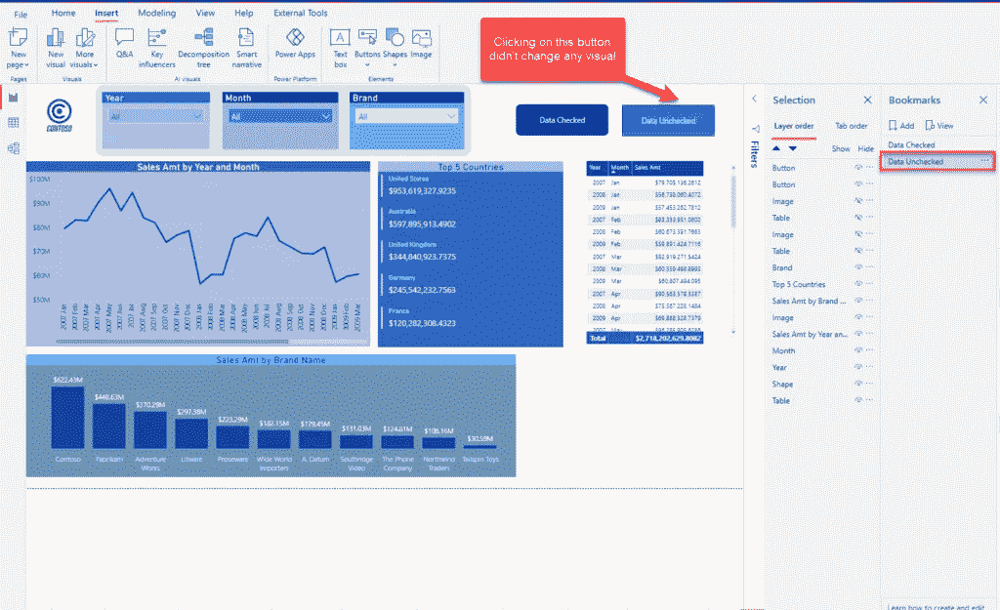

# Power BI 中的书签—这些数据意味着什么？

> 原文：<https://towardsdatascience.com/bookmarks-in-power-bi-what-this-data-mean-866857fe719b?source=collection_archive---------9----------------------->

## 书签是 Power BI 中最强大的功能之一！但是，有一些微妙的选择可以产生巨大的差异

作者图片

要我说，书签是 Power BI 中最强大的功能之一！我已经写了很多次关于书签的文章:例如，它们如何帮助你[将过滤体验](/build-pro-slicer-pane-in-power-bi-911248b39348)推向一个全新的水平，或者[重新发明传统的视觉效果](/push-card-visuals-to-a-new-level-in-power-bi-174db7deaa7)，比如卡片，一直到[使你的书签安全](/safe-click-trick-in-power-bi-d3e2296ade04)为“点击”行为。

## 书签到底是什么？

书签是一项强大的 BI 功能，使您能够捕获报告页面的当前状态。然后，您可以通过按钮、图像、形状等的 Action 属性，将这个捕获的状态称为“特殊”页面。

默认情况下，当您创建书签时，它将捕获以下报告元素的当前状态:

*   过滤器和切片器，包括 ***切片器状态***
*   视觉效果的选择状态(例如，如果您的视觉效果是交叉突出显示的)
*   钻孔位置
*   视觉效果内的排序
*   报告元素的可见性(这是通过选择窗格处理的)
*   聚焦或聚光灯模式，如果有的话

然而，一旦你选择创建一个书签，你会看到一个带有一些选项的下拉菜单——而且大部分选项已经被预先选中了！那么，让我们来看看这些选项对您意味着什么…

## 为什么数据选项很重要？

当您使用书签时，您需要做的第一步是打开书签和选择窗格。书签，原因很明显:)…而且，通过选择窗格，您可以完全控制单个报告元素的可见性。

作者图片

现在，当我添加一个书签并点击它旁边的三个点时，会出现一个下拉菜单，其中有许多选项已被预先选中:

作者图片

当您保持选中数据选项时，它将捕获过滤器、切片器和视觉效果中数据的当前状态，并且每次您导航到此书签时，您将看到完全相同的数据状态！

让我们创建一个书签，它将捕获由 Contoso 品牌过滤的视觉效果的状态，并选中数据选项:

作者图片

您可能已经注意到，在所有报表页面视图中，数据都是由 Contoso 品牌进行筛选的。

下一步是创建捕获完全相同的页面状态的书签，但这次不选中数据选项:

作者图片

然后，我将在报告页面上放置两个按钮，以控制书签之间的导航。为了实现这一点，我将在 Action 属性下指定我的书签:

作者图片

现在，让我们回到报告的原始状态，即品牌过滤器未被分割为特定值时的状态。看看如果我点击“数据未检查”按钮会发生什么:

作者图片

什么都没发生！由于我们未选中数据选项，因此没有切片器选择被传输到书签。但是，如果我单击另一个按钮“数据检查”,我们可以发现完全不同的行为:

作者图片

在这种情况下，由于在创建书签时选中了数据选项，捕获的状态包括在切片器中定义的数据点—因此，无论我们在品牌切片器中选择哪个值，只要我单击数据已选中按钮，我就会看到 Contoso 的数字！

让我给你看看这个是什么样子的:

作者图片

## 结论

正如您所看到的，书签是非常强大的功能，可以应用于各种不同的报告场景。但是，就像所有强大的东西一样，它需要完全控制它，以便以正确的方式工作。这就是为什么理解书签附带的各种选项极其重要。

在大多数情况下，这些细微的差异会对整个报表体验产生巨大的影响。说实话，在大多数情况下，您会在创建书签时取消选中数据选项，但有一个非常方便的用例是让数据选项保持选中，我将在下一篇文章中解释这一点。

感谢阅读！

成为会员，阅读 Medium 上的每一个故事！