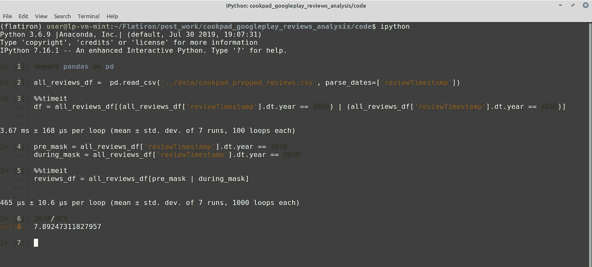

# 熊猫布尔掩蔽

> 原文：<https://towardsdatascience.com/boolean-masking-with-pandas-b21b7714d0b6?source=collection_archive---------7----------------------->

## 过滤熊猫数据帧


拉里·科斯塔莱斯在 [Unsplash](https://unsplash.com/?utm_source=unsplash&utm_medium=referral&utm_content=creditCopyText) 上的照片

在 [**Miki Tebeka**](https://medium.com/@tebeka) 的优秀“ [**更快的熊猫**](https://www.linkedin.com/learning/faster-pandas)**”***课程中的一个主题是如何使用布尔掩码来过滤熊猫中的数据。我想实践我所学的，所以我更新了一个[最近的项目](https://github.com/lspope/cookpad_reviews_analysis)来使用布尔遮罩。我认为这是一个非常有用的技术，所以我想分享一下我是如何更新代码的。我将向您展示如何在一些直接取自我的项目的 之前的 ***和*** 之后的 ***代码片段中使用布尔掩码。****

*在我们深入片段之前，我将提供一些背景。我想分析一个流行的烹饪应用的评论。我下载了这些评论，并重点关注了 2019 年和 2020 年发布的评论。为什么是这个时间范围？我想看看 COVID 之前和期间的应用评价是否有所不同。我的家庭在 2020 年增加了家庭烹饪，我很好奇烹饪应用的评论是否会显示应用使用和/或用户享受的增加。*

## *如何使用布尔掩码*

*现在，让我们通过检查一些 之前的 ***和*** 之后的 ***代码片段来学习如何使用布尔掩码。****

*下面的代码筛选数据集，只使用年份为 2019 或 2020 的行。*

****之前:****

```
*#reviewTimestamp is a datetime objectreviews_df = all_reviews_df[(all_reviews_df[‘reviewTimestamp’].dt.year == 2019) | (all_reviews_df[‘reviewTimestamp’].dt.year == 2020)]*
```

****后:****

```
*pre_mask = all_reviews_df[‘reviewTimestamp’].dt.year == 2019
during_mask = all_reviews_df[‘reviewTimestamp’].dt.year == 2020reviews_df = all_reviews_df[pre_mask | during_mask]*
```

*下面还有一个例子。该代码过滤数据集，以找到 2019 年和 2020 年的“高”和“低”评论。*

****之前:****

```
*top_reviews_2019 = reviews_df[(reviews_df[‘reviewTimestamp’].dt.year == 2019) & (reviews_df[‘score’] == 5)][‘content’].to_list()low_reviews_20191 = reviews_df[(reviews_df[‘reviewTimestamp’].dt.year == 2019) & (reviews_df[‘score’] < 3)][‘content’].to_list()top_reviews_2020 = reviews_df[(reviews_df[‘reviewTimestamp’].dt.year == 2020) & (reviews_df[‘score’] == 5)][‘content’].to_list()low_reviews_2020 = reviews_df[(reviews_df[‘reviewTimestamp’].dt.year == 2020) & (reviews_df[‘score’] < 3)][‘content’].to_list()*
```

****后:****

```
*pre_mask = reviews_df[‘reviewTimestamp’].dt.year == 2019
during_mask = reviews_df[‘reviewTimestamp’].dt.year == 2020
high_mask = reviews_df[‘score’] == 5
low_mask = reviews_df[‘score’] < 3high_reviews_2019 = reviews_df[pre_mask & high_mask][‘content’].to_list()low_reviews_2019 = reviews_df[pre_mask & low_mask][‘content’].to_list() high_reviews_2020 = reviews_df[during_mask & high_mask][‘content’].to_list()low_reviews_2020 = reviews_df[during_mask & low_mask][‘content’].to_list()*
```

## *为什么使用布尔掩码？*

*为什么我发现做这些改变很有用？第一个原因是它使代码更容易阅读和修改。例如，我可能会用 2018 年和 2019 年的 COVID 前时间框架以及 2020 年和 2021 年的 COVID 期间时间框架来更新分析。我只需要更新布尔掩码定义中的标准，而不是遍历代码并替换我过滤数据集的每个地方的标准。*

*第二个原因是，有人告诉我使用布尔掩码可以提高性能。我使用 [IPython](https://ipython.org/) 交互命令 shell 中的[%timeit](https://ipython.readthedocs.io/en/stable/interactive/magics.html?highlight=%25%25timeit#magic-timeit) 魔法命令(在单元模式下)对我的代码进行了性能测试。我的性能检查显示，使用布尔掩码的代码比使用常规条件过滤的代码更快。在我的电脑上，代码比 T11 快了 7 倍。*

**

*图片由作者提供*

*现在，您已经看到了一些如何使用布尔掩码的示例，并且知道了应该考虑在代码中使用它们的原因。请随时提出建议，并让我知道这些内容是否对您有所帮助。*

*编码快乐！*