# 增强基本数据集和简单 CNN 来回答实际环境问题

> 原文：<https://towardsdatascience.com/boost-basic-dataset-and-simple-cnn-to-answer-real-environment-problem-3622c28b3fad?source=collection_archive---------28----------------------->

## [实践教程](https://towardsdatascience.com/tagged/hands-on-tutorials)

## CNN——具有数据扩充、背景和多输出的树叶分类。

> 由[克莱曼婷执笔页面](https://medium.com/u/35892034f8ca?source=post_page-----3622c28b3fad--------------------------------)、[让·琼邦](https://medium.com/u/5311199e1416?source=post_page-----3622c28b3fad--------------------------------)和[塞尔瓦·克莱伯](https://medium.com/u/d1d27f890fbd?source=post_page-----3622c28b3fad--------------------------------)—2021 年 3 月


克里斯·劳顿在 [Unsplash](https://unsplash.com?utm_source=medium&utm_medium=referral) 上的照片

# 1.语境

该项目是我们在 Data Scientist 的[数据科学家训练营课程](https://datascientest.com/formation-data-scientist)验证的一部分，将我们在这 11 周的理论课中学到的一切付诸实践，并确保每个主题都已掌握。

这个项目的目标是从图片中定位和分类植物的种类。一旦分类完成，返回植物的描述，并确定最终的疾病。

# 2.项目

## 数据集—迭代 1

数据集[新植物病害数据集](https://www.kaggle.com/vipoooool/new-plant-diseases-dataset)来自 Kaggle，被许多用户彻底使用，不包含任何错误或错误分类的图像。

该数据集由放置在统一背景上的树叶组成:

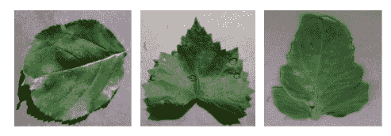

来自数据集的图像样本([来源](https://www.kaggle.com/vipoooool/new-plant-diseases-dataset))

包含大约 87，000 张叶子的图片——患病的和健康的。这些图片代表了 38 类 14 种植物:

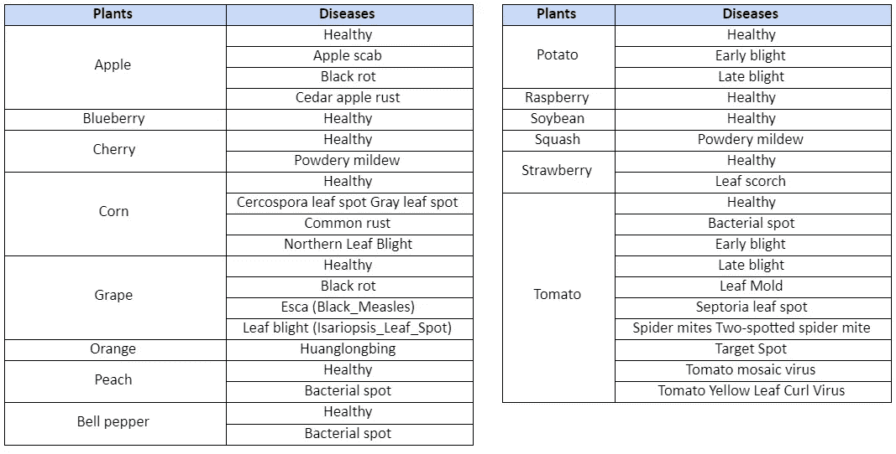

每株植物病害

分配情况如下:

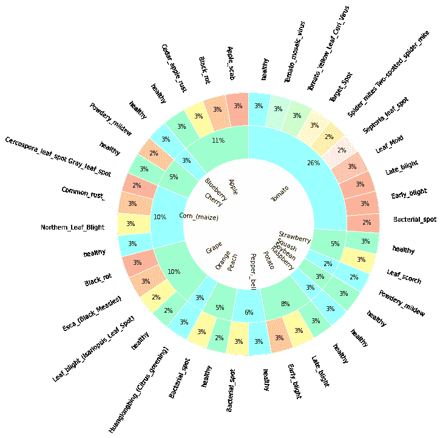

数据集中类的分布— *作者提供的图片*

该数据集是使用另一个数据集的离线扩充重新创建的，因此，正如我们在前面的图表中看到的那样，这些类非常平衡(每个类约占 3%—外部层)。

为了在植物环境中的树叶图像上测试我们的模型，我们实现了一个 *web 抓取*脚本来从“Google image”中提取图像。这个测试数据集类似地由 38 个类加上另一个代表没有植物的图像的类“其他”组成。

与原始数据集相比，测试集中的图像不遵循相同的格式(每个图像一片叶子)。

## 深度学习—迭代 1

作为第一次迭代，我们用 **TensorFlow** 开发了自己的 CNN 模型:

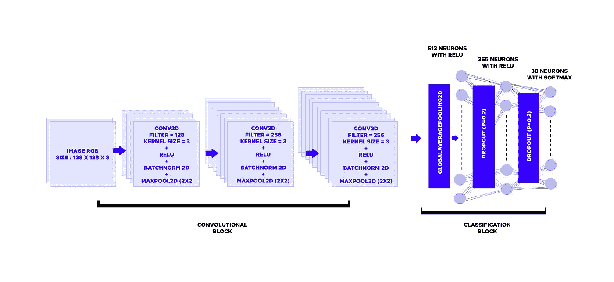

CNN 模型— *作者图片*

该模型由三个卷积块和一个分类块组成。

**卷积块层数:**

*   **图像大小**:图像大小调整为 128x128x3，这是时间计算和信息损失之间的一个很好的折衷。
*   **Conv2D** :使用滤镜从图像中提取图案。为了捕捉更大的图案组合，每个 Conv2D 层的滤镜数量都比前一层增加了一倍。
*   **激活功能**:使用 CNN 最常用的 Relu 应用非线性。
*   **batch normalization(BN)**:BN 用于归一化前几层的输出。它使 CNN 更快，更稳定，并减少过度拟合。
*   **MaxPool2D** :通过减少像素数量来降低图像的维数，它减少了模型的参数数量，并为内部表示提供了轻微的尺度不变性。

**分类块层数:**

*   **密集**:用于分类的三个全连通层。
*   **退出**:通过在训练过程中随机忽略选定的神经元来防止过拟合。

**conv 区块与分类区块之间的层:**

*   **globalaveragepool2d**(GAP):它对每个特征图的值进行平均。与“展平”层不同，“间隙”移除了大量可训练参数，提供了平移不变性，从而减少了过度拟合的趋势。

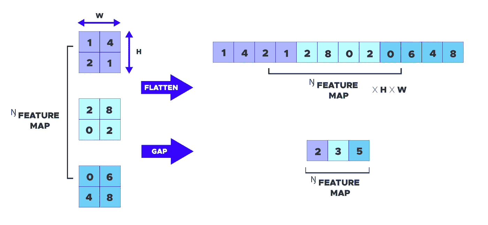

Flatten 和 GlobalAveragePooling 之间的差异— *作者图片*

**正则化**:为了防止过度拟合，我们使用了 **L2** 正则化，它将参数(权重)的平方和添加到损失函数中。

型号代码如下所示:

该模型在**验证数据集上的准确率为 99.3%** 。

然而，它在测试数据集上给出了非常糟糕的预测，准确率为 **13.2%** 。

**迭代 1 总结:**

*   数据集:“新植物疾病数据集”，其是在统一背景上的叶子图像
*   对验证数据集的出色预测— val 准确率> 99%。
*   对由自然环境中的树叶图像组成的测试数据集的错误预测。
*   即使图像上没有任何植物，模型也能预测植物。

**对自然环境中的树叶图像预测不佳的主要原因是我们的模型是用统一背景上的树叶图像数据集训练的**。此外，正如在训练数据集中一样，没有图像是没有植物的，如果发生这种情况，我们的模型不可能预测图像中不存在植物。

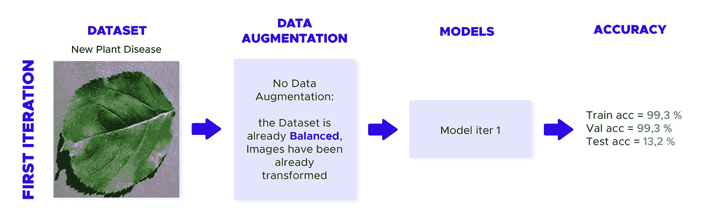

迭代 1 图— *作者图片*

## 深度学习—迭代 2

在第二次迭代中，我们试图通过给树叶图像添加植物背景来改进我们的模型。我们修改了我们的数据集，并使用了来自 Kaggle 的[植物村数据集](https://www.kaggle.com/abdallahalidev/plantvillage-dataset)，它与我们的第一个数据集相似(在统一的背景上留下图像)，但没有任何数据扩充。因此，数据集是高度不平衡的(来自一些类的超过 5000 幅图像，而来自其他类的不到 200 幅图像)，但是包含我们可以用来添加植物背景的分割的叶子图像。

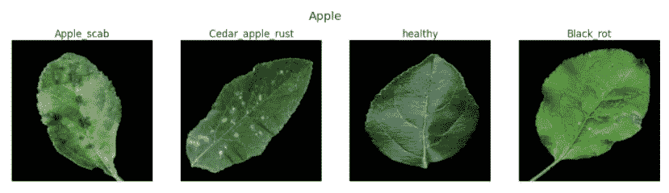

来自新数据集的分割图像样本([来源](https://www.kaggle.com/abdallahalidev/plantvillage-dataset))

为了重新平衡该数据集，按照以下描述的转换进行了数据扩充:

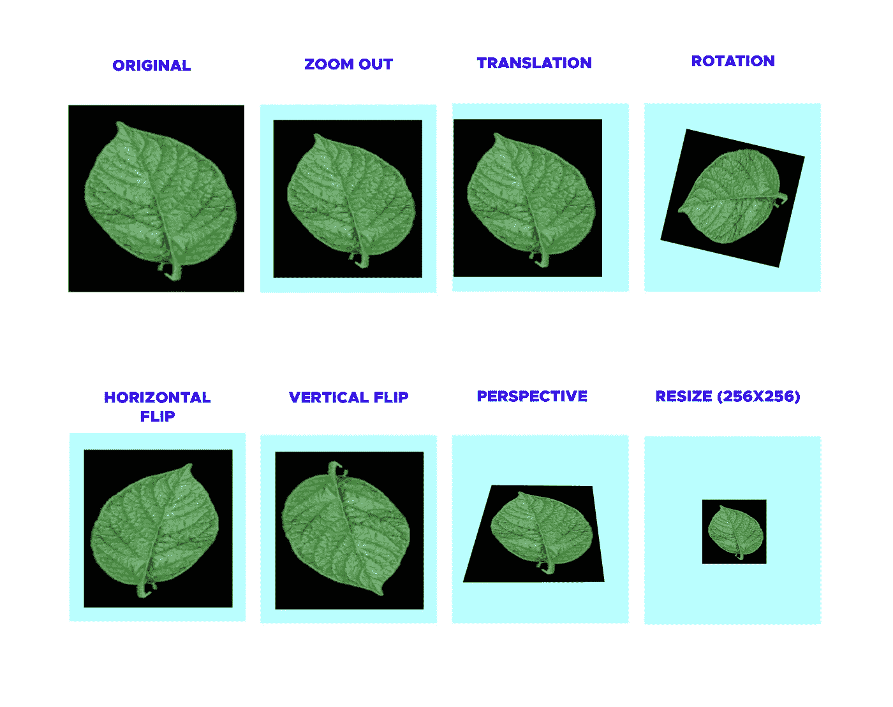

数据扩充— *作者提供的图片*

为了检测图像中植物的缺失，我们使用来自[“Image-net”数据集](http://www.image-net.org)的随机图像向我们的数据集添加了另一个类“ *Others* ”。

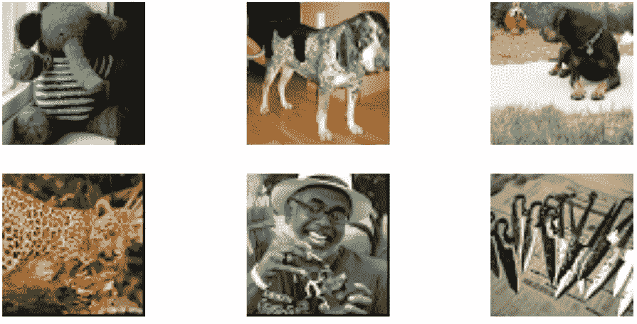

来自新类别"*其他* " ( [来源](http://www.image-net.org))的图像样本

在数据扩充和添加新类别“其他”之后，该数据集包含 114 077 幅图像，分布如下:

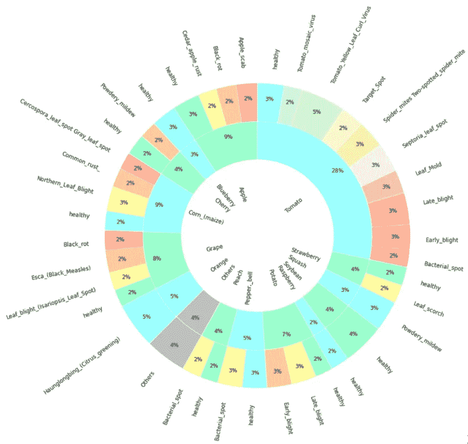

数据扩充后数据集中类的分布— *作者图片*

我们使用“自定义数据集”来加载图片并添加背景，用我们的背景像素替换分段图片的黑色像素。

用函数“tf.where”替换像素，如果叶子图像像素的值低于定义的阈值，则用背景图像之一替换叶子图像的像素。

注意，在第二次迭代中，我们对每种植物只使用了**一个**背景。例如，任何番茄类都使用相同的番茄植物背景。

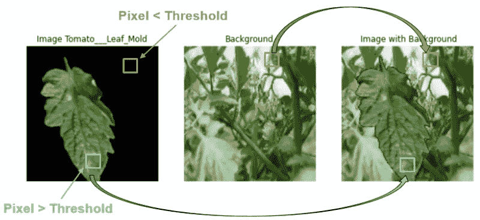

背景添加过程— *作者图片*

代码如下所示:

我们使用相同的模型来比较两次迭代的结果，只是最后一个密集层的输出形状为 39 (38 株植物+其他)。

该模型在新的验证数据集上给出了 95.1% 的准确度。

然而，它在测试数据集上给出了非常糟糕的预测，准确率为 **10.5%** 。

**第二次迭代总结:**

*   数据集“Plant Village”增加了数据，并从数据集“Image-Net”添加了新的类。
*   在模型训练期间添加背景(每个植物类型只有一个背景)。
*   好的预测与数据集相关的图像。
*   测试数据集上的预测略有改进，但性能仍低于预期，尤其是在无法完全看到树叶的图像上。
*   该模型似乎能够预测图像是否不是植物。
*   该模型似乎专注于背景而不是叶子本身。

在迭代 2 期间，我们的模型学会了使用背景而不是树叶，所以我们使用完全相同的模型和方法做了另一次迭代“ *2-bis* ”，但不是每株植物只有一个背景，我们为每株植物创建了一组背景，每次都将随机选择**。**

**因此，我们为每株植物(我们的数据集中有 14 株植物)创建了一个文件夹，在每个文件夹中:**

*   **5 幅实际植物的图像(即:所有马铃薯种类的马铃薯植物)。**
*   **4 植物、草坪和森林的图像将在每个文件夹中共享。**

**这应该有助于模型:**

*   **而不是聚焦在背景图像上。**
*   **在真实环境中有更好的表现。**

**该模型(2-bis)在验证数据集**上给出了 98.4%** 的准确度。**

**然而，它在测试数据集上给出了非常糟糕的预测，准确率为 **18.1%** 。**

****迭代 2 之二的总结:****

*   **数据集:“植物村”，增加了数据，并从数据集“Image-Net”添加了新的类。**
*   **在模型训练期间添加背景(随机)。**
*   **好的预测与数据集相关的图像。**
*   **与迭代 2 相比，测试数据集上的预测略有改进，因为背景是随机的，所以模型没有关注它。**
*   **该模型似乎能够预测图像是否不是植物。**

**我们可以在测试数据集上看到一些预测性能的改进，尽管结果仍然低于预期。然而，这个模型可以预测一个图像是否是植物，这与我们的第一次迭代相比是一个增强。**

**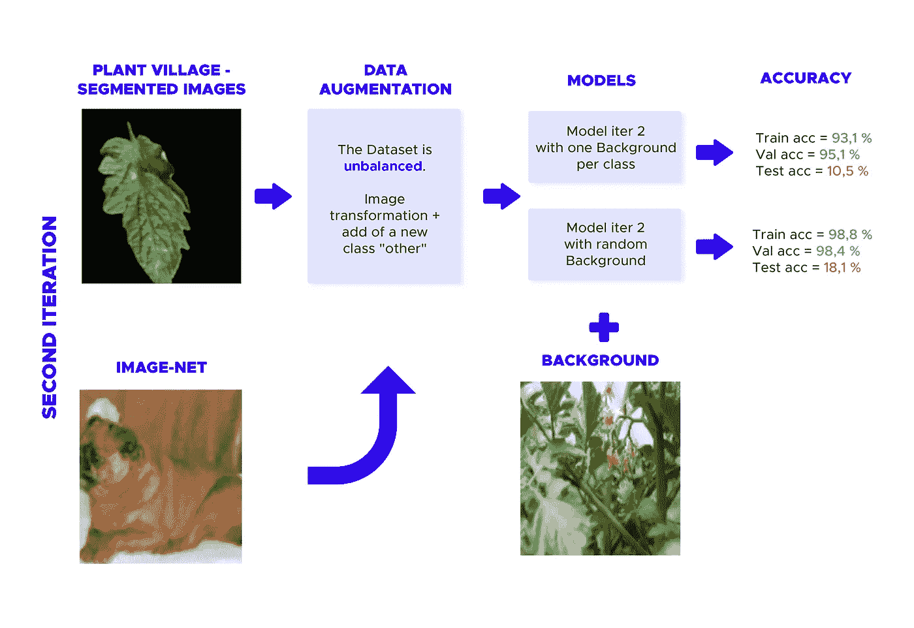**

**迭代 2 图— *作者图片***

## **深度学习——迭代 3**

**在迭代 2 中，我们包含了一个名为“Others”的新类，表示“任何东西”的图像。这一举措是为了帮助模型避免在图像中没有植物时预测植物。但是我们可以看到，在测试数据集上的结果不如预期的好。一种解决方案是预测图像中植物出现的概率。一个输出表示图像是否包含植物，第二个输出表示植物分类。**

**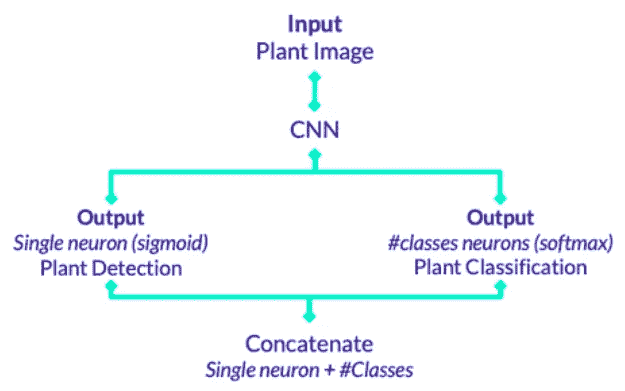**

**模型迭代 3 — *作者图片***

**此后，模型的代码—我们使用功能模型:**

**为了评估我们的模型预测数据集的效果，我们需要创建一个自定义损失函数:**

****

**定制损失函数**

**用 *P_other* ={0，1}。图像是植物(=1)还是植物(=0)。如果图像不是植物，则不计算*分类交叉熵*。**

**根据我们的模型，第一个神经元代表图像是否包含植物，其他 38 个神经元代表植物分类。**

**该模型(3)在验证数据集**上给出了 97.4%** 的准确度。**

**然而，它在测试数据集上给出了非常糟糕的预测，准确率为 **19.2%** 。**

**但是，在测试数据集上对没有植物的图像(类别:*其他*)的预测比用迭代 2-bis 模型完成的预测要好。**

****迭代 3 总结:****

*   **数据集:“植物村”，增加了数据，并从数据集“Image-Net”添加了新的类。**
*   **对验证数据集的出色预测— val 准确率> 99%。**
*   **对测试数据集的预测仍然很差。**
*   **在测试数据集上更好地预测没有植物的图像(类别:*其他*)。**

**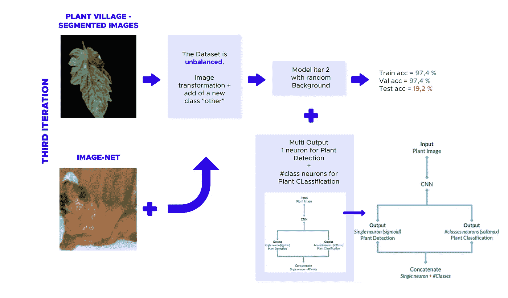**

**迭代 3 图— *作者提供的图片***

# **改进**

1.  ****包含真实环境中图像的新数据集:**正如我们在几个测试阶段发现的那样，该模型在只有一片叶子和统一背景的图像上表现很好，但无法预测自然环境中的图像。我们试图通过添加背景来解决这个问题，但我们仍然可以在结果中看到一些缺陷。从直接在真实环境中拍摄的图像(或两者的组合)创建完整的数据集可能有助于提高结果的可靠性。这可以使用*网页抓取*来完成。**
2.  ****两个模型串联(多输出)**:在当前数据集中，一些植物有相同的病害(*即* : *番茄和桃叶的细菌性斑点病*或马铃薯和番茄叶的晚疫病……)。在自然环境中，我们的模型似乎能发现正确的疾病，但不能发现正确的植物。一个解决方案是创建一个多输出模型:**

*   **一个关注休假分类的模型**
*   **一个侧重于疾病分类的模型**

**用这种方法，我们可以分别预测植物和疾病。因此，这可以改进模型，并可能预测新植物的已知疾病——即苹果上的*细菌性斑点*(已知疾病)。**

**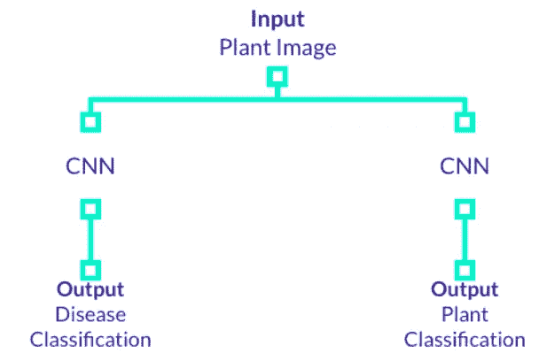**

**多输出模型— *作者图片***

**3.**语义分割:**为了提高在自然环境中的预测，使用像 UNET 这样的语义分割模型，将有助于提取树叶的像素，然后我们将使用树叶分类模型来预测植物本身。**

**4.**更深的模型:**由于真实环境中的叶子图像更复杂，具有更多卷积块的更深的模型，为了捕捉更多模式，应该给出更好的预测。**

# **概括起来**

****

**照片由[阿维纳什·库马尔](https://unsplash.com/@ashishjha?utm_source=medium&utm_medium=referral)在 [Unsplash](https://unsplash.com?utm_source=medium&utm_medium=referral) 上拍摄**

**通过这三次迭代开发的模型在验证数据集上进行了出色的预测，结果高达 97%。在自然环境中的图像上测试这些模型是一个自然的选择，以代表一个真实的商业案例。**

**但我们很快发现，即使我们尽最大努力改进我们的模型，以检测真实环境中的图像，我们也无法实现这个目标。**

**我们可以尽可能地调整模型，它只能预测它被训练的内容——统一背景上的树叶图像。**

**我们能够验证一些假设——检测没有植物的图像，对具有统一背景的图像进行分类…——并拒绝添加背景有助于提高模型鲁棒性的事实。**

**这个模型仍有改进的空间，但在此之前，我们应该考虑使用一个更接近有问题的的**数据集——从任何照片中预测植物病害。****

> **由[克莱曼婷·佩奇](https://medium.com/u/35892034f8ca?source=post_page-----3622c28b3fad--------------------------------)、[让·琼邦](https://medium.com/u/5311199e1416?source=post_page-----3622c28b3fad--------------------------------)和[塞尔瓦·克莱伯](https://medium.com/u/d1d27f890fbd?source=post_page-----3622c28b3fad--------------------------------)撰写。感谢 DataScientest 团队的帮助。**

***迭代代码可以在*[*Github*](https://github.com/clementine-pages/ML-doctoplant_tensorflow)*上找到。***

## **承认**

```
[Samir Bhattara](https://www.kaggle.com/vipoooool) (2018, Nov.), [New Plant Diseases Dataset](https://www.kaggle.com/vipoooool/new-plant-diseases-dataset) v2
**Orignial Dataset**: [spMohanty](https://github.com/spMohanty) (2018, Sept.), [PlantVillage-Dataset](https://github.com/spMohanty/PlantVillage-Dataset)[Abdallah Ali](https://www.kaggle.com/abdallahalidev) (2019, Sep.), [Plant Village dataset](https://www.kaggle.com/abdallahalidev/plantvillage-dataset) v3[ImageNet](http://image-net.org/) (2016), [Stanford Vision Lab,](http://vision.stanford.edu/) [Stanford University](http://www.stanford.edu/), [Princeton University](http://www.princeton.edu/)
```