# 利用 R 中的高效编码提高计算速度

> 原文：<https://towardsdatascience.com/boost-computational-speed-with-efficient-coding-in-r-8320a29b83ed?source=collection_archive---------11----------------------->

## [理解大数据](https://towardsdatascience.com/tagged/making-sense-of-big-data)

## 了解代码基准测试，以优化 HolzingerSwineford1939 数据集数百个观察值的数据分析


**照片由** [**马修·施瓦茨**](https://unsplash.com/@cadop?utm_source=unsplash&utm_medium=referral&utm_content=creditCopyText) **上** [**下**](https://unsplash.com/s/photos/speed-task?utm_source=unsplash&utm_medium=referral&utm_content=creditCopyText)

R 专为智能统计数据分析而构建，与 C 或 Python 等其他编程语言相比，只需要我们编写很少的代码。不过时不时的显得有点慢。随着我们中的一些人处理大型复杂的数据集，计算速度变得非常方便。但是老实说，我们总是以最有效的方式构造代码吗？我不确定。因此，熟悉加速分析的主要技术至关重要——这将使您更容易尽快获得结果，而不必等待几十年直到代码最终执行。这就是我将通过 R 中探索性数据分析的典型工作流向您展示的内容，包括:

*   获得数据概览
*   将数据转换成合适的格式
*   汇总数据以获得一些描述性统计数据
*   绘制感兴趣的方面。

有时，您可能还会将数据分成更小的部分，以获得更多的见解(例如，每个人、每个州、每个性别……)。现在如何才能加快进程，成为更厉害的程序员呢？

在我们开始一个小的案例研究之前，这里有一些通用的建议来加速你的分析:

## **1。** **让你的 R 版本保持最新**

确保你定期更新你的 R 版本。新版本的 R 通常包括速度提升和在幕后开发的错误修复。但是从我的个人经验来说，我知道更新有时会很痛苦，因为程序可能无法再从库中找到包。离开 R，进入任何文件夹，然后进入用户>文档> R > win-library，这可能会有所帮助。然后选择包含早期版本的所有包的文件夹(例如，在我的例子中，它被称为 3.4，我想安装 4.0 版本)。现在手动删除文件夹。这确保了没有类似“为…加载包或名称空间失败”的混淆，并且 R 可以毫无困难地找到包。

## **2。**避免常见的速度瓶颈

即使这不会使您的代码特别快，您也可以避免一些会使您的代码更慢的常见缺陷。首先，如果没有必要，确保不要存储太多的变量/对象。例如，如果您对 X 的平均值感兴趣，一个常见的习惯是使用'

另一个节省时间的方法是避免重复。我记得在 2018 年的一段时间里，我开始编码，并总是在数据帧的每一行使用相同的程序-我产生了令人尴尬的乏味和混乱的代码:

可以通过使用更整洁的 dplyr 语法来解决这个问题，例如:

由于不知道更好的方法来做到这一点，我最终得到了无尽的代码行，这使得我几乎不可能知道所有的步骤都包括什么。如果您一遍又一遍地重复一个定制的过程，并且没有用于此目的的特定内置函数，您可以编写一个函数来使您的代码更整洁(例如，如果您希望在不同的组上生成一个特定的绘图，而不进行分面，我将在下面向您展示)。最后但同样重要的是，确保尽可能避免使用循环。下面是一个简单的例子:假设你想生成一个固定长度为 n 的整数序列。你可以像这样简单地保持它:

或者你决定运行一个 for 循环，遍历 n 的每个元素来填充向量 X:

这是不必要的，因为您可以很容易地使用第一个版本，但它最多只会减慢您的代码几秒钟。如果你生成了一个空的 X 向量，并且想要一步一步地增长它，那会怎么样呢？

请不要这样做！为什么？在这个 for 循环的每一次迭代中，你需要更多的内存，如果你想创建大的向量，这可能需要几个小时才能完成。

我的经验是:如果有一个选项可以在一行代码中运行相同的操作(例如，使用 base R、data.table 或 dplyr 函数)，你应该选择它，因为每个开发团队已经对它进行了大量的速度优化。您可能还听说过程序员建议对您的代码进行“矢量化”——这意味着您使用只被调用一次的内置函数来返回具有固定数量条目的向量(例如，使用 rnorm(n)生成 n 大小的随机正态分布)。相比之下，如果使用一个循环来运行相同的操作，则该函数会被调用多次——对于每次迭代(就像上一个示例中一样)。根据生成的向量应该有多大，使用 for 循环增长向量可能需要几个小时才能执行。最后但同样重要的是，尽可能使用矩阵而不是数据框:如果数据元素只包含一种数据类型(字符、整数、浮点等)。)使用矩阵而不是数据帧会给你带来巨大速度提升，因为它会更有内存效率。但是，如果您需要在矩形中存储不同类型的数据，数据框、tibbles 或 data.tables 是更合适的解决方案。

## **3。** **基准测试你的代码**

如果没有参照物与之比较，您就无法真正知道您的代码是“太慢”还是“足够快”——这就是代码剖析发挥作用的地方。它基于以下原则:编写相同代码的不同版本，跟踪执行每个版本所用的时间，然后选择最快的版本。即使只是有一些操作不能再优化了，它也确实有助于找到代码中减慢整个执行速度的瓶颈。如果你时不时地重复这个过程，你会对麻烦制造者有所了解，并知道如何克服他们，给你留下成就感和自我效能感。在 R 中有多种方法可以对您的代码进行基准测试——我将在下一节中向您展示它们。

> 声明:所有图片均由作者创作，除非另有说明。

# **加快分析 1939 年以来的情报数据**


照片由纽约公共图书馆在 [Unsplash](https://unsplash.com/s/photos/intelligent-pupils?utm_source=unsplash&utm_medium=referral&utm_content=creditCopyText) 上拍摄

假设你有一台时间机器，回到了 1939 年，你的任务是帮助一组教师对来自两所不同学校(巴斯德和格兰特-怀特)的 301 名七年级和八年级学生进行一系列智力测试，数据集名为 HolzingerSwineford1939，从 lavaan 包中检索。现在你要为每个学生准备有意义的反馈——在 1939 年，这是一项乏味的教师工作！感谢你的数据科学技能，你知道该怎么做:你要准备、总结和可视化结果，最终为每个孩子提供一个漂亮的图表。因为你的时间机器只有有限的时间段用于旅行，所以你需要优化代码执行的速度。这就是我们将要一起做的事情:我们将在追踪时间和记忆的同时，通过不同版本的代码进行游戏。我们将使用 base R 函数，来自 tidyverse 和 data.table 包的函数。为了区分不同的语法风格，我将简要介绍不同的软件包:

## **基地 R**

顾名思义，你不需要安装一个额外的包来使用 [base R 包](https://stat.ethz.ch/R-manual/R-devel/library/base/html/00Index.html)——它已经是内置的，会自动加载。例如，$运算符或 subset 函数的使用是一个基本的 R 函数。

## **Tidyverse/dplyr**

这种风格在 R 社区中变得非常流行，说真的，我认为这是完全合理的——[tidy verse](https://www.tidyverse.org/packages/)编写代码的风格让我的生活变得简单多了，因为我发现了% > %管道操作符及其可读性、一致性和可再现性的无与伦比的美。实际上，tidyverse 包括一系列高度兼容的包，如 dplyr、stringr、magittr 和 purrr。特别是，有一组非常有用的数据操作函数，如 mutate()、filter()和 group_by()。

## **数据表**

data.table 的内存效率非常高，尤其是在数据操作方面，但是它的语法与 tidyverse 的语法有点不同，而且更难学习和阅读。与 tidyverse 不同，它指的是单个包: [data.table](https://cran.r-project.org/web/packages/data.table/data.table.pdf) 。据开发者称，它允许:

> 大型数据的快速聚合(例如 RAM 中的 100GB)、快速有序连接、完全不使用副本按组快速添加/修改/删除列[…]，为更快的开发提供了自然而灵活的语法

它甚至支持低级并行:许多常见操作在内部并行化，以使用多个 CPU 线程。因此，即使在处理大型数据集和复杂的数据操作时，它的超级能力也是速度。这是否意味着在数据操作管道的每一步，data.table 函数真的比 tidyverse 或 base R 函数更节省时间？我们会看到——让我们证明这一点。

首先，我们将设置我们的工作空间，并从 lavaan 包中加载[holzingerswinford 1939](https://rdrr.io/cran/lavaan/man/HolzingerSwineford1939.html)数据集。

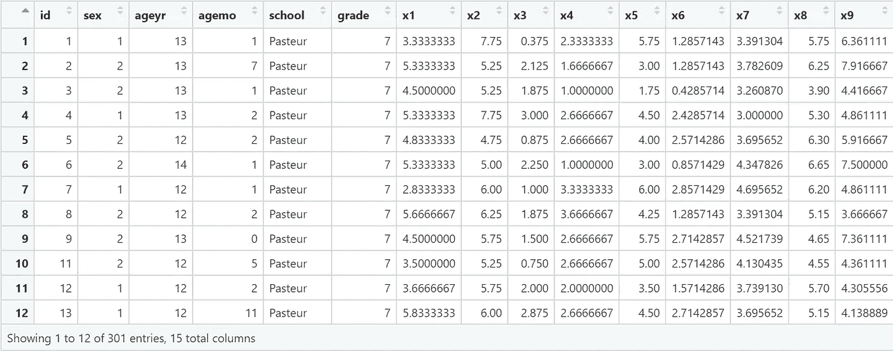

正如你所看到的，数据集包含 301 个观察值和 15 列，包括学生的 ID、性别、年龄、学校、年级和 9 项智力任务中每一项的分数。为了确保每一列都有正确的格式，我们将使用两个不同的函数来获取数据的结构。出于这个目的，我们将把它包装到 system.time()中，以跟踪计算机执行它所花费的时间。

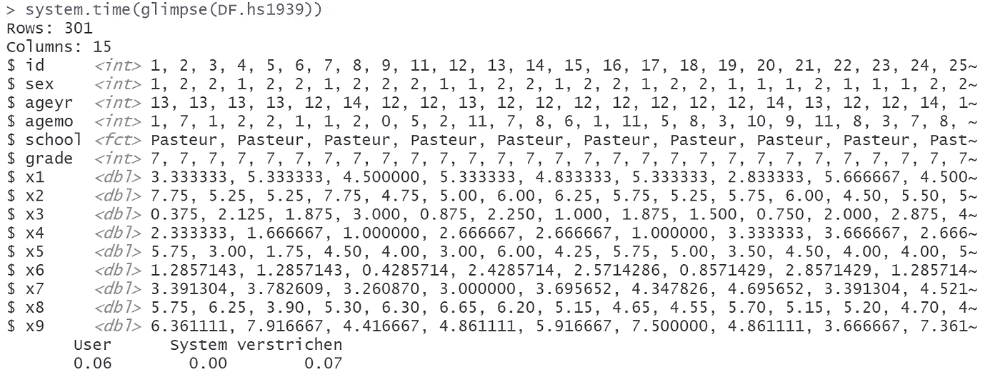

在输出中，你可以看到 R 首先执行了我们真正感兴趣的函数，然后才给出计时结果。它给出了几个关键指标:

*   **用户时间**是执行用户指令收取的 CPU 时间。
*   **系统时间**是系统代表调用进程强制执行的 CPU 时间。
*   **Elapsed** time(德语:“verstrichen”)是我们通常感兴趣的时间，因为它大约是用户和系统的总和。在我们的例子中，这真的很快，只有 0.07 秒。

如果我们用 str()代替 glimpse()会怎么样？

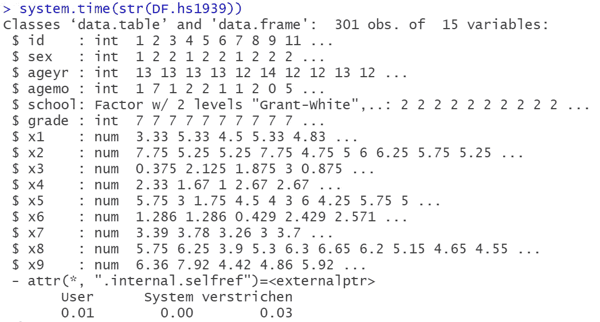

看起来 base-R 函数运行得更快一些，但是 0.04 秒应该不会有太大的差别。接下来，我们将讨论数据。更具体地说，我们将

*   只选择我们感兴趣的变量，
*   为 9 项智能任务中的每一项赋予更有意义的名称，
*   将数据从宽格式更改为长格式
*   将任务变量更改为对以后的绘图有用的系数。

为此，我们将以 dplyr-以及 data . table-格式编写此过程。为了相互比较各个版本，我们需要将每个版本包装到一个函数中，以便再次使用 system.time()。

## **dplyr-版本**

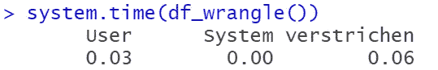

## **数据表-版本**

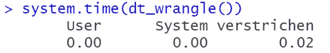

好的——似乎 data.table 在将数据转换成正确的格式方面做得更有效，并且比 dplyr 快 3 倍。

对于感兴趣的读者，我发现了一个关于 data.table 和 dplyr 之间差异的有趣的[堆栈溢出讨论](https://stackoverflow.com/questions/21435339/data-table-vs-dplyr-can-one-do-something-well-the-other-cant-or-does-poorly#:~:text=or%20less%20equivalent.-,data.,whereas%20dplyr%20generates%20it%20automatically)。

现在，让我们通过使用[微基准测试](https://cran.r-project.org/web/packages/microbenchmark/microbenchmark.pdf)包来进一步扩展我们的时间比较。与 system.time()相比，它的优势在于，它提供了不同函数之间更详细的计时概要，并且每个函数都运行多次迭代，从而为您提供更可靠的结果。在描述中，开发人员认为，通过使用用 C 代码编写的毫秒级(据说是纳秒级)精确计时函数，可以实现更精确的计时。为了利用它，我们将编写不同版本的代码来计算每个任务和学校的平均分数，并将它们包装到一个函数中。稍后，该总结将为我们提供一个参考，以比较每个学生在每项任务上的得分和学校特定的表现。

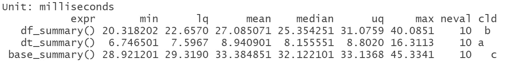

哇 microbenchmark 函数甚至给你一个函数时间效率的排名，让你更容易直接选择最快的。在这种情况下，data.table 函数最快，其次是 tidyverse 版本，然后是 base R 函数。通过计算相对速度，我们可以看到，与 data.table 函数相比，base R 函数几乎慢了 4 倍，而 dplyr 函数慢了 3 倍！因此，data.table 在这里再次成为明显的速度赢家。

接下来，我们将用一个更复杂的任务来挑战每个包:我们想创建一个显示每个学生任务表现的图表，然后我们想自动将它们导出到预先指定的文件夹中。通过包括学校特定的得分，我们将有一个参考线来找出孩子与他或她的同龄人相比的得分。换句话说——我们想知道在每项智力任务中，他或她与其他人相比，表现是高于还是低于平均水平。

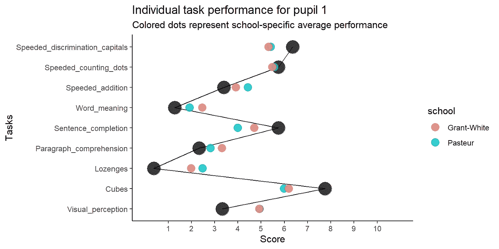

在这个例子中，你可以看到这个人在快速辨别大写字母和完成句子方面表现出高于平均水平的表现。他或她在立方体任务中表现尤为突出，而在点数任务中表现一般，在其余任务中表现中等至中等以下。通过观察彩色圆点，我们可以认为格兰特-怀特学校似乎在口头任务(段落理解、句子完成和词义)上平均略胜一筹，而两所学校在与速度相关的任务上表现出相似的结果(即，加快对大写字母的辨别和加快点数)。但请记住，我们仅参考学校的具体表现——我们没有任何关于实际用于规范结果的参考人群的信息，我们也没有任何关于学校之间学生得分自然变化的线索。

正如我之前所说的，我们希望为 301 名学生中的每一名生成一个图表，并自动将其导出到我们预先指定的文件夹中。为此，我们将使用[provis 包](https://rstudio.github.io/profvis/)分析每个版本的代码，这是一个有用的交互式图形界面，可以帮助您找出计算机在哪里分配了最多的时间和内存。因此，您会发现代码中真正的速度瓶颈。

# **基地 R 图自动化**

为了有一个好的参考，我们将首先创建一个循环，该循环遍历学生的 ID 以创建情节，然后保存它。在此代码的每个版本的结尾，我们将删除 plots 文件夹中的文件，以保持所有内容在试验中保持不变(从而不会覆盖任何现有的 png 文件)。

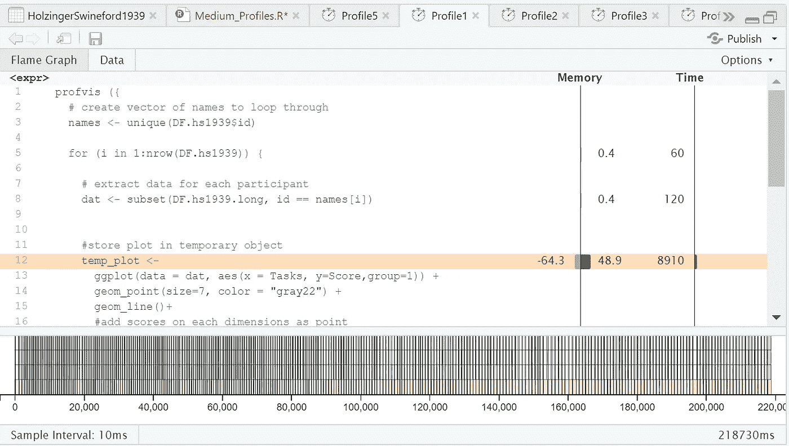

您可以看到，将 ggplot 对象保存到一个临时文件(以便在下一次迭代中覆盖它)已经消耗了相当多的内存，并分配了总时间的 4%用于代码执行。

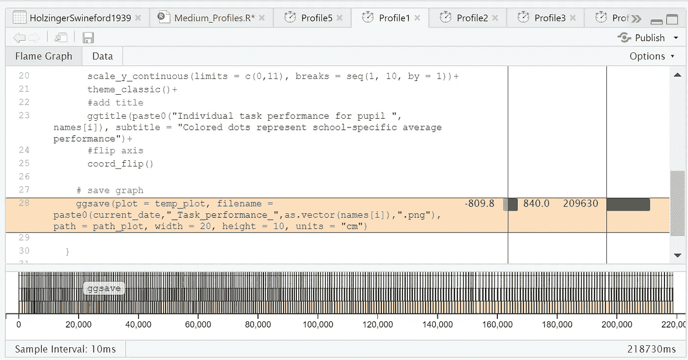

更让我担心的是，几乎 96%的时间都花在对每个临时 ggplot 文件运行 ggsave-function 上，同时通过迭代瞳孔 id 向量来生成适当的文件名。至少我们现在有了一个文件夹，里面装满了每个学生的不同文件，甚至不用去碰它:

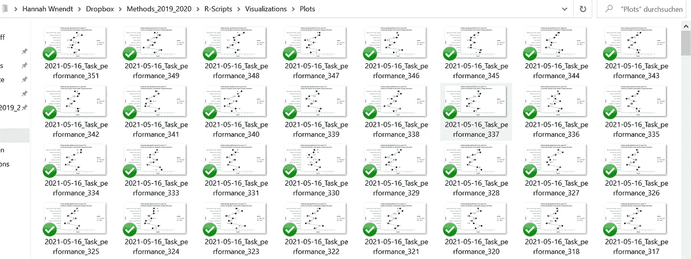

# **潮汐图形自动化**

tidyverse 风格的图形自动化的优势在于它的可理解性——首先我们按照学生 ID 对数据进行分组，然后通过实用的 [do 函数](https://www.rdocumentation.org/packages/dplyr/versions/0.7.8/topics/do)将 ggplot 对象与学生 ID 一起保存在数据框中。do 函数采用之前与 dplyr 相关的操作，执行特定函数(本例中为 ggplot ),并将输出存储在数据帧中。

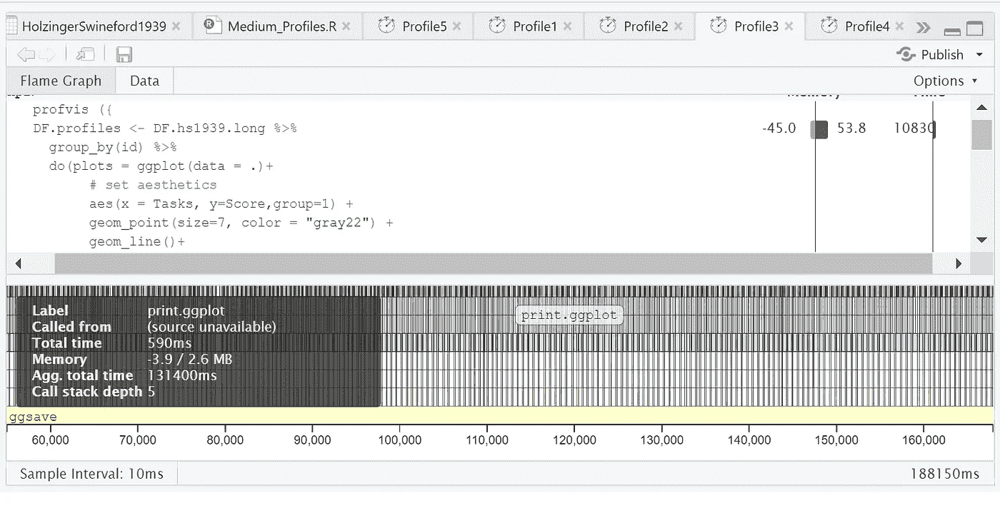

正如你所看到的，tidyverse 版本比 for-loop 快一点，但并不令人印象深刻(188150 ms vs. 218730 ms)。循环速度慢了 1.16 倍，而 tidyverse 版本的代码速度提高了约 1.5 倍。14%.

如果将光标移到图形的下部，您可以看到在后台执行的功能的详细历史记录:例如，似乎每个 ggplot 在导出之前都是先打印的—尽管我们没有注意到。此外，如果我们单击“数据”而不是火焰图，我们可以很好地了解占用时间和内存最多的函数——在我们之前的分析之后，ggsave 同样减慢了这个过程，这不再让我感到惊讶。但我发现值得注意的是，分组过程分配了如此大量的内存，因为我们将数据帧分成了大量的组(每个孩子一个组)。

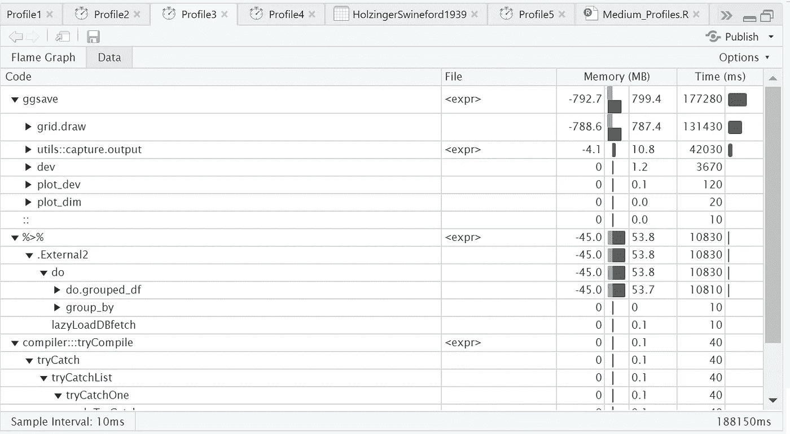

这里有一个小奖励:我们将尝试使用 [purrr](https://purrr.tidyverse.org/) 包中的一项技术来生成图形，看看它是否比 dplyr 版本更有效。其思想是按 ID 分割数据框-每个子集将是一个存储在大型列表中的数据框。然后我们将 ggplot 函数映射到这个列表的每个元素。这里，pwalk()开始发挥作用，它是一个映射函数的变体，允许您在一个列表中提供任意数量的参数，在这种情况下，它帮助我们遍历列表的每个元素(每个学生一个 data.frame)，应用一个函数。f (ggplot 函数)并相应地导出它们。

尽管这个语法对我来说非常漂亮和优雅，但是代码执行将大部分时间分配给了实际的绘图，甚至比 dplyr 版本的代码还多。现在问题仍然存在 data.table 在自动生成绘图方面做得更好吗？

# **Data.table 图形自动化**

作为第一步，我们创建一个生成并保存 ggplot 的函数。然后我们遍历 data.table，将这个函数应用于每个子集(按 ID 分组)。

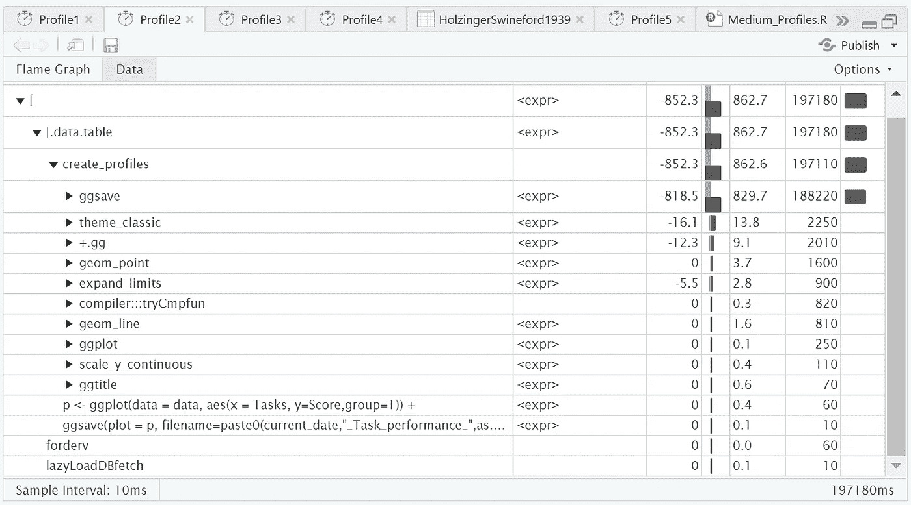

啊？与 dplyr 版本相比，data.table 生成图形的速度并不快，甚至还慢了一点。我猜想这是因为我们违反了编写高效 R 代码的几条规则:我们在每次调用函数时都将一个 ggplot 对象赋给了一个临时变量(p ),并且在每次数据表通过 ID 进行子集化时都调用具有绘图生成和保存功能的函数。但是在幕后到底发生了什么呢？请记住，data.table 类似于 SQL 中的查询，具有以下基本语法:

```
DT[i, j, by]*## R: i j by**## SQL: where | order by select | update group by*
```

根据[数据表文档](https://cran.r-project.org/web/packages/data.table/data.table.pdf)。by 是一个列表，包含 BY 中每一项的长度为 1 的向量(在我们的例子中是学生 id)。by 变量也可以通过名称直接用于 j；例如，如果 j 是一个绘图命令(就像我们的例子中一样),这对于图形的*标题*很有用。。SD 可以理解为代表数据的子集、自同或自引用。特别是，这也意味着。SD 本身是一个数据表。因此，这意味着我们在 301 个新生成的数据表中的每一个上使用我们定制的函数，这些数据表由学生 ID 子集化。我觉得你可以用 data.table 做类似的事情，但这不是它的设计初衷。

# 我们的关键要点是什么？

我们还了解到…

*   运行分组操作和绘图功能(如在 do-call 中)会花费很多时间。
*   我们应该避免在临时对象中保存不必要的变量(比如 ggplots)。
*   与映射和应用函数相比，循环并不总是最坏的选择，因为它们实际上是基于相同的原理。
*   data.table 语法是数据操作目的的支持者，但不能应用于任何数据分析步骤。
*   ggsave 占用了大部分时间，但是我们可以试着将预先指定的图像分辨率调小一点，使它更有内存效率。

## 在这里，我尝试结合所有世界的精华:

现在，由于 ggsave 函数分配了大量时间来导出高分辨率图像，我们将稍微调低分辨率。

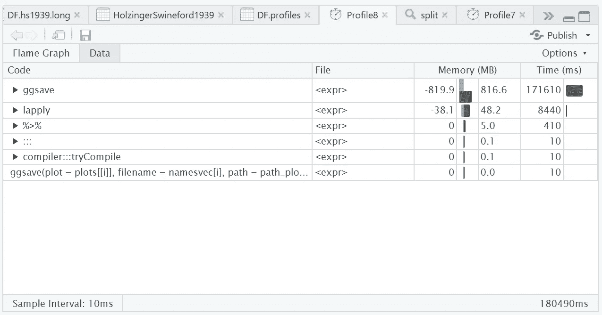

…还有 tada！与我们的 purrr 版本的代码相比，我们能够减少 22%的计算时间成本，并找到了在大量个体上自动生成图形的最快版本。代码基准测试得到了回报。

# **奖励:我可以使用多核进行计算吗？**

如果您熟悉 Python，您可能以前听说过并行计算。理论上，你可以通过将任务的不同部分分配给计算机上的每个 CPU(中央处理器)来提高计算速度。CPU 是计算机的大脑，负责幕后发生的计算。但是，R 只用其中一个。您可以通过运行以下代码来确定您的机器有多少个 CPU:

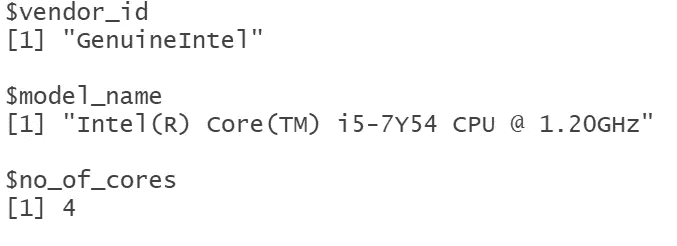

我的电脑上似乎有 4 个内核。我能在我的每段代码中使用这些吗？可惜我不能。并不是每个计算都可以并行运行——例如，如果每一行代码都是基于前一行的，就像我们的图形自动化例子一样。但是，如果您可以向前和向后阅读代码，它仍然会给您预期的结果，它可能是并行计算的一个很好的候选。这通常适用于算术运算，如随机抽样。如果这听起来像是你感兴趣的任务，R 中的[并行包](https://stat.ethz.ch/R-manual/R-devel/library/parallel/doc/parallel.pdf)可能适合你。网上有一个很好的[教程](https://nceas.github.io/oss-lessons/parallel-computing-in-r/parallel-computing-in-r.html)向你展示它是如何工作的。

# **那又怎样？**

如果你花时间考虑时间，你可以学习写更多的内存高效的代码——R 中有各种各样的工具可以帮助你提高自己。特别是，如果您处理更大的数据集和更复杂的数据科学任务，这将非常有意义，因为您将更快地获得见解，并避免在未来某个时间点在时间压力下工作时遇到麻烦。另一个好处是:它会让你的代码更干净，增强可读性——如果你在一个团队中从事数据科学项目，你的同事肯定会从中受益。去开始分析你的分析吧！

## **参考文献**

[1] Y. Rosseel，T.D. Jorgensen，N. Rockwood，D. Oberski，J. Byrnes，L. Vanbrabant，…和 h . Du[holzingerswinford 1939](https://rdrr.io/cran/lavaan/man/HolzingerSwineford1939.html)(2021)[lavaan R 包](https://cran.r-project.org/web/packages/lavaan/lavaan.pdf)

[2]全球研发核心团队和贡献者(2021 年)，[基础研发包](https://stat.ethz.ch/R-manual/R-devel/library/base/html/00Index.html)

[3] H. Wickham (2017)， [The tidyverse](https://cran.r-project.org/web/packages/tidyverse/tidyverse.pdf) ，R package ver，1(1)，1 .

[4] M. Dowle，A. Srinivasan，J. Gorecki，m .基里科，P. Stetsenko，T. Short，…和 X. Tan (2019)，[包'数据。表'](https://cran.r-project.org/web/packages/data.table/data.table.pdf)'数据的扩展。框架。

[5] O. Mersmann & S. Krey (2011)，[微基准:一个精确基准化 R 表达式的包](https://www.researchgate.net/profile/Fabio-Veronesi/publication/265864567_IntR_-_Interactive_GUI_for_R/links/541fec610cf203f155c28213/IntR-Interactive-GUI-for-R.pdf#page=142)，在 R 用户大会上，用户！2011 年 8 月 16 日至 18 日，英国考文垂华威大学(第 142 页)

[5] W. Chang，J. Luraschi & T. Mastny (2019)，[profivis:用于分析 R 代码的交互式可视化](https://cran.r-project.org/web/packages/profvis/profvis.pdf)，R 包版本 0.3。7.

[6]全球 R 核心团队和贡献者(2020)，[平行 R 包](https://stat.ethz.ch/R-manual/R-devel/library/parallel/doc/parallel.pdf)