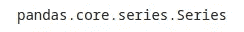

# 用熊猫提升你的数据分析

> 原文：<https://towardsdatascience.com/boost-your-data-analysis-with-pandas-69c4be5d73bb?source=collection_archive---------4----------------------->

## 你需要知道的关于熊猫的一切，通过代码示例开始提高你的生产力


文斯·拉塞尔在 [Unsplash](https://unsplash.com/) 上的照片

# 目录

1.  [**为什么用熊猫？**](#44fc)
2.  [**入门**](#2f04)[安装和导入熊猫](#0da5)
3.  [**熊猫数据帧**](#0c83)[读取文件并创建数据帧](#1005)
4.  [**检查数据帧**](#e31f)
5.  [**用熊猫**](#de8a)[操纵数据数据帧索引](#8264)[行和列](#e9c0)[用 loc 和 iloc 选择数据](#45ab)
6.  [**处理缺失值**](#da66) [检测缺失值](#f678)
    [删除缺失值](#af0a) [填充缺失值](#1d92)
7.  [**可视化数据**](#d051)[直方图](#0861)
    [散点图](#c8d4)
8.  [**保存到文件**](#ac70)
9.  [**结论**](#91d9)

无论你是在建立复杂的机器学习模型，还是只想在 Excel 电子表格中组织每月的预算，你都必须知道如何操作和分析数据。

虽然许多工具都可以完成这项工作，但今天我们将谈论其中最常用和最适合初学者的工具之一， [**熊猫**](https://pandas.pydata.org/) 。

# 为什么用熊猫？

**Pandas** 是一个开源的 Python 库，旨在处理数据分析和数据操作。援引[官网](https://pandas.pydata.org/)，

> **“pandas 是一个快速、强大、灵活且易于使用的开源数据分析和操作工具，构建于 Python 编程语言之上。”**

它建立在 [NumPy](https://numpy.org/) (用于科学计算的 Python 库)之上，它有几个用于清理、分析和操作数据的函数，可以帮助您提取关于数据集的有价值的见解。Pandas 非常适合处理表格数据，如 SQL 表或 Excel 电子表格。

Pandas*中的主要数据结构是一个名为 **DataFrame** 的二维表。要创建 DataFrame，您可以导入几种格式的数据，例如 *CSV* 、 *XLSX* 、 *JSON* 、 *SQL* 等等。通过几行代码，您可以添加、删除或编辑行/列中的数据，检查集合的统计数据，识别和处理缺失的条目，等等。*

此外，如上所述， *Pandas* 应用广泛，对初学者友好，这意味着你会在网上找到很多关于它的内容，找到你的问题的答案应该不难。

# 入门指南

首先，我们需要安装 *Pandas* 并且有几种不同的环境可以运行它。如果你想直接在你的机器上运行它，你应该看一下 [Anaconda](https://www.anaconda.com/) ，这是一个针对科学计算的发行版，附带了数百个预安装的软件包。Anaconda 可以安装在 Windows、macOS 和 Linux 上。

然而，有一种更简单的方法通过你的浏览器开始使用*熊猫*，使用云中的 [Jupyter 笔记本](https://jupyter.org/)。例如，你可以使用 [IBM Watson Studio](https://www.ibm.com/cloud/watson-studio) 或者 [Google Colab](https://colab.research.google.com/) 。两者都可以免费使用，并且预装了几个 Python 包。

在本文中，我使用的是 **Google Colab** ，因为它开箱即用，不需要任何预先设置。

## 安装和导入熊猫

您需要在您的环境中编写以下命令来安装 Pandas，这取决于您的软件包管理器。

```
pip install pandas
```

或者

```
conda install pandas
```

请注意，在 Google Colab 中，我们不需要使用上面的代码，因为 *Pandas* 是预装的。

现在，我们需要导入*熊猫*，这样我们就可以在我们的 Jupyter 笔记本中使用它了。

```
import pandas as pd
```

我们通常将它作为快捷方式“as pd”导入，这样我们就不需要每次需要调用*熊猫*函数时都要写完整的单词。

# 熊猫数据框

安装并导入 *Pandas* 之后，让我们看看如何读取文件并创建一个 **Pandas DataFrame** 。在这篇文章中，我们将要处理的数据集是一个简化版的数据集，它是在一个关于房价的竞赛中提供的。

包含该数据集的文件是一个**。CSV** (逗号分隔值)。如果你想自己玩，你可以在这里[找到它](https://raw.githubusercontent.com/rmpbastos/data_sets/main/kaggle_housing/house_df.csv)，在我的 Github 仓库里。

## 读取文件和创建数据帧

要将文件读入数据帧，我们只需在下面的函数中输入文件路径作为参数:

```
PATH = 'https://raw.githubusercontent.com/rmpbastos/data_sets/main/kaggle_housing/house_df.csv'df = pd.read_csv(PATH)
```

注意，我使用了函数 *read_csv* ，因为我们正在处理一个 *csv* 文件。如上所述，熊猫可以处理几种文件扩展名，你可以在这里查看。

上面的函数读取了 *csv* 文件，并自动从中创建了一个数据帧。但是如果你想从 Python **Dict** 、 **List** 、 **NumPy Array** 或者甚至从另一个 **DataFrame** 中创建一个 DataFrame，你可以使用下面的函数。

```
df = pd.DataFrame(mydict)
```

让我们检查一下我们刚刚创建的数据帧的类型。

```
type(df)
```


# 检查数据帧

在本文的其余部分，我们将使用上面提到的住房数据集。下一件我们应该做的事情是看看我们的数据框架。我们可以用函数 *head* 检查第一个 *n* 条目。如果没有提供 *n* ，我们将默认看到前 5 行。

```
df.head()
```


乍一看，一切正常。我们还可以使用函数 *tail* 检查集合的最后一个条目。

```
df.tail()
```


接下来，让我们使用 *shape* 属性来检查数据的维度。

```
df.shape
```


它返回一个包含行数和列数的元组。我们的数据帧有 1460 行和 16 列，或者说特征。

接下来，我们可以使用功能*信息*查看数据集的概要。

```
df.info()
```


它向我们展示了关于数据帧的有用信息，比如列名、非空值、数据类型和内存使用情况。从这个总结中，我们可以观察到一些列缺少值，这个主题我们将在后面看到。

以下函数将为我们提供一些关于数据集的描述性统计数据。

```
df.describe()
```


此函数显示每个要素的计数、平均值、中值、标准差、上下四分位数以及最小值和最大值。请注意，它只显示关于数字特性的数据(数据类型为 int 或 float 的列)。

在这个序列中，在进入下一节之前，让我再向您展示一个函数， *value_counts* 。

```
df['Neighborhood'].value_counts()
```


该函数返回包含每列唯一值数量的序列。它可以应用于整个数据帧，但是在上面的例子中，我们只将它应用于列“Neighborhood”。

在我们继续之前，让我总结一下数据集的每个特性，以便更好地理解。

*   *Id* —每行的唯一标识(我们将使用它作为我们的索引)。
*   *LotArea* —以平方英尺为单位的批量
*   *街道* —道路通道类型
*   *邻里* —房屋的物理位置
*   *住宅风格* —居住风格
*   *建造年份* —建造日期
*   *中央空调* —中央空调
*   *BedroomAbvGr* —地下室标高以上的卧室数量
*   *壁炉* —壁炉数量
*   *车库类型* —车库位置
*   车库建造年份
*   *车库面积* —车库面积，平方英尺
*   *公摊面积* —公摊面积，平方英尺
*   *泳池质量控制* —泳池质量
*   *栅栏* —栅栏质量
*   *销售价格* —房价

我们的数据集包含不同类型的数据，如数值型、分类型、布尔型，但我们不会深入研究这些概念，因为它们超出了本文的范围。

现在，让我们开始操作我们的数据框架。

# 用熊猫操纵数据

熊猫为我们提供了几个处理数据的工具。在这一节中，我们将看到如何操作行和列，以及在表中定位和编辑值。让我们开始为我们的数据框架设置一个索引。

## 数据帧索引

在检查了我们的数据之后，我们注意到第一列( **Id** )对于每一行都有一个唯一的值。我们可以利用它，使用这个列作为我们的索引，代替我们设置 DataFrame 时默认创建的索引。

```
df.set_index('Id', inplace=True)df.index
```


当将参数*就地*设置为*真*时，数据帧将就地更新。否则，使用默认值 *inplace = False* ，将返回数据帧的副本。

如果您事先知道您将使用数据集中的一列作为索引，您可以在读取文件时设置它，如下所示。

```
df = pd.read_csv(PATH, index_col='Id')
```

让我们来看看设置索引后集合是什么样子的。


数据集现在看起来更干净了！继续，我们来谈谈行和列。

## 行和列

正如您已经注意到的，数据框是表格数据，包含行和列。在*熊猫*中，单列一栏可以叫做*系列*。我们可以很容易地检查这些列，并用下面的代码访问它们。

```
df.columns
```


```
df['LotArea'].head()
```


```
type(df['LotArea'])
```



请注意，我们的数据框架中的一列属于类型*系列*。

**重命名列**

用*熊猫*来重命名你的列真的很简单。例如，让我们将我们的特性 *BedroomAbvGr* ，并将其重命名为 *Bedroom* 。

```
df.rename(columns={'BedroomAbvGr': 'Bedroom'}, inplace=True)
```

您可以一次重命名多个列。在函数 *rename* 内，将所有“旧名称”和“新名称”作为键/值对添加到*列*字典中。

**添加列**

您可能想在数据框架中添加一列。让我们看看你怎么做。

我将借此机会向您展示我们如何创建数据帧的副本。让我们在副本中添加一列，这样就不会改变原始数据帧。

```
df_copy = df.copy()df_copy['Sold'] = 'N'
```

这是创建新列最简单的方法。请注意，我为本列中的所有条目分配了一个值**“N”**。

检查添加了新列的下图。


**添加行**

现在，假设您有另一个数据帧( *df_to_append* )，其中包含您想要添加到 *df_copy* 的 2 行。将行追加到数据帧末尾的一种方法是使用函数 *append* 。

```
data_to_append = {'LotArea': [9500, 15000],
                  'Steet': ['Pave', 'Gravel'],
                  'Neighborhood': ['Downtown', 'Downtown'],
                  'HouseStyle': ['2Story', '1Story'],
                  'YearBuilt': [2021, 2019],
                  'CentralAir': ['Y', 'N'],
                  'Bedroom': [5, 4],
                  'Fireplaces': [1, 0],     
                  'GarageType': ['Attchd', 'Attchd'],  
                  'GarageYrBlt': [2021, 2019],
                  'GarageArea': [300, 250],
                  'PoolArea': [0, 0],
                  'PoolQC': ['G', 'G'],
                  'Fence': ['G', 'G'], 
                  'SalePrice': [250000, 195000],
                  'Sold': ['Y', 'Y']}df_to_append = pd.DataFrame(data_to_append)df_to_append
```


现在，让我们将上面的 2 行数据帧添加到 *df_copy* 中。

```
df_copy = df_copy.append(df_to_append, ignore_index=True)
```

检查 *df_copy* 的最后一个条目，我们有:

```
df_copy.tail(3)
```


**移除行和列**

为了消除数据帧的行和列，我们可以使用函数 *drop* 。假设我们想要删除最后一行和列“Fence”。查看下面的代码。

```
df_copy.drop(labels=1461, axis=0, inplace=True)
```

上面的函数删除了最后一行(Id 为 *Id 为* 1461 的行)。您也可以一次删除几行，将索引列表作为参数传递。

axis=0，这是默认值，意味着您正在删除一行。对于列，我们需要指定 axis=1，如下所示。

```
df_copy.drop(labels='Fence', axis=1, inplace=True)
```

## 使用 loc 和 iloc 选择数据

选择数据的最简单方法之一是使用 *loc* 和 *iloc* 方法。

*loc* 用于通过标签/索引或基于布尔数组访问行和列。假设我们想要访问索引= 1000 的行。

```
df.loc[1000]
```


上面的方法选择了 index = 1000 的行，并显示了该行中包含的所有数据。我们还可以选择想要可视化的列。

```
df.loc[1000, ['LotArea', 'SalePrice']]
```


现在，让我们看看如何将条件应用于 *loc* 。假设我们想要选择销售价格至少为 600，000 美元的所有房屋。

```
df.loc[df['SalePrice'] >= 600000]
```


通过一行简单的代码，我们只找到了 4 栋价值超过 60 万美元的房子。

*iloc* 用于根据整数位置或布尔数组选择数据。例如，如果我们想要选择包含在第一行和第一列中的数据，我们有以下内容:

```
df.iloc[0,0]
```


显示的值是 *ID* 为 1 的行的 *LotArea* 。记住整数位置是从零开始的。

我们也可以选择一整行。在这种情况下，该行位于位置 10

```
df.iloc[10,:]
```


我们可以选择整个列，例如最后一列。

```
df.iloc[:,-1]
```


我们也可以选择多行和多列，如下所示。

```
df.iloc[8:12, 2:5]
```


# 处理缺失值

关于如何处理缺失值，可以谈很多。请记住，这里的目标不是深入主题，而是向您展示由 *Pandas* 提供的处理缺失值的工具。

## 检测缺失值

这里的第一步是用函数 *isnull* 找到数据集中缺失的值。该函数将返回一个与原始数据帧大小相同的对象，包含集合中每个元素的布尔值。它将认为*为真*值，如 *None* 和 *NumPy。南*。您可以通过下面的代码行找到它们。

```
df.isnull()
```


注意，处理上面返回的数据可能很麻烦。如果您正在处理一个非常小的数据集，您应该没问题，但是对于成千上万的行和几个列，就像在我们的例子中，我们只能添加每列缺失值的数量，如下所示。

```
df.isnull().sum()
```


现在好多了！我们可以很容易地看到每一列中缺失值的数量。我们还可以意识到大多数专栏都是完整的，这很好。 *sum* 函数将所有由*返回为 *True* 的值相加为 null* ，因为它们等同于 *1* 。*假值*相当于 *0* 。

我们还可以检查每列缺失值的比例:

```
df.isnull().sum() / df.shape[0]
```


让我们更进一步，使用 Python 只获取缺少值的列，并显示缺少值的百分比。

```
for column in df.columns:
    if df[column].isnull().sum() > 0:
        print(column, ': {:.2%}'.format(df[column].isnull().sum() /
                                               df[column].shape[0]))
```


## 删除丢失的值

检测到丢失的值后，我们需要决定如何处理它们。在这里，我将向您展示如何消除丢失的值。

在删除整个列或行之前，我们应该非常谨慎，因为我们是在从数据集中提取数据，这会损害您的分析。

首先，我们来思考一下特性 *PoolQC* 。由于该列中有超过 99%的值丢失，我们将删除它。正如我们在前面的章节中已经看到的，我们可以用函数 *drop* 删除一个列。

这里，我将使用原始数据帧的副本。

```
df_toremove = df.copy()df_toremove.drop(labels='PoolQC', axis=1, inplace=True)
```

现在，我们来看看 *GarageType* 。因为它只有大约 5%的值丢失，我们可以使用函数 *dropna* 简单地删除该特性中丢失值的行。

```
df_toremove.dropna(subset=['GarageType'], axis=0, inplace=True)
```

## 填充缺失值

当我们处理缺失值时，除了删除它们之外，我们还可以用一些非空值来填充这些缺失数据。有几种技术可以帮助你确定应该在数据中插入哪些值，包括使用机器学习，我真的建议你搜索关于这个主题的文章，但这里我只展示由*熊猫*提供的完成这项工作的工具。

首先，我们来看看特性*栅栏*。请注意，它有 80%的缺失值。假设它的发生是因为这些房子没有围栏！因此，我们用字符串 *NoFence* 填充这些缺失的数据。

我将再次使用原始数据帧的副本。

```
df_tofill = df.copy()df_tofill['Fence'].fillna(value='NoFence', inplace=True)
```

现在，让我们检查一下特性 *GarageYrBlt* 。在这个例子中，我将向您展示如何用列的中值填充条目。

```
garage_median = df_tofill['GarageYrBlt'].median()df_tofill.fillna({'GarageYrBlt': garage_median}, inplace=True)
```

让我提醒你，这些例子只是为了教育目的。您可能已经意识到 *GarageType* 和 *GarageYrBlt* 有 81 个缺失值。大概是因为那些房子没有车库吧。在现实分析中，删除这些缺少 *GarageType* 的行并用一些值填充 *GarageYrBlt* 可能不是最明智的做法。

事实上，如果我没有使用原始数据帧的副本，您会看到当我们删除缺少 *GarageType* 的行时，这些也是缺少 *GarageYrBlt* 的 81 行。这显示了在修改数据之前解释和了解数据的重要性。

# 可视化数据

在这一节，我将谈论如何用*熊猫*做一些简单的绘图。如果您想构建更精细的图表，我建议您看看另外两个 Python 库: [Matplotlib](https://matplotlib.org/) 和 [Seaborn](https://seaborn.pydata.org/) 。

在这里，我们将看到两种类型的图表:直方图和散点图。

## 直方图

直方图非常适合显示数据的分布。下面是特性*销售价格*的直方图，其中 **x 轴**包含将值划分为区间的*箱*，而 **y 轴**表示频率。

```
df['SalePrice'].plot(kind='hist')
```


## 散点图

有了散点图，你可以直观地看到两个变量之间的关系。使用[笛卡尔坐标](https://en.wikipedia.org/wiki/Cartesian_coordinate_system)构建图表，将值显示为点的集合，每个点有一个变量的值确定在 **x 轴**上的位置，另一个变量的值确定在 **y 轴**上的位置。

让我们为变量 *SalePrice* 和*year build*构建一个散点图，以检查它们之间是否有任何关系。

```
df.plot(x='SalePrice', y='YearBuilt', kind='scatter')
```


嗯，我们可以看到销售价格和建造年份之间有一个小的正相关关系。

*plot* 函数还支持许多其他类型的图表，如折线图、条形图、面积图、饼图等。

# 保存到文件

在本文的最后一部分，让我们看看如何将数据帧保存为文件。

就像我们读取 *csv* 文件来创建我们的数据帧一样，我们也可以将我们的数据帧保存为[各种格式](https://pandas.pydata.org/pandas-docs/stable/user_guide/io.html)。如果您使用的是 *Google Colab* ，您可以简单地编写下面一行代码，来保存一个 *csv* 文件。

```
df.to_csv('My_DataFrame.csv')
```

保存的文件可以在 Google Colab 左上角的文件夹中找到，如下图所示。


您也可以在计算机中指定路径。例如，在 windows 中:

```
df.to_csv('C:/Users/username/Documents/My_DataFrame.csv')
```


杰瑞米 C 在 [Unsplash](https://unsplash.com/) 上的照片

# 结论

我希望这篇文章能帮助你了解你可以用熊猫做什么。经过一些练习后，操纵你的数据变得相当容易。

*熊猫*广泛应用于数据科学。许多数据科学家在建立机器学习模型之前利用它来操纵数据，但即使在使用 *Excel* 完成更简单的任务时，你也可以从中受益。

如今，在工作中，我过去在 excel 中做的许多活动现在都用 Python 和 Pandas 来做。也许学习曲线有点陡峭，但是您的生产力的潜在增长是值得的，更不用说 Python 是一个非常好的工具！

完整代码请参考[笔记本](https://github.com/rmpbastos/data_science/blob/master/_0014_Boost_your_Data_Analysis_with_Pandas.ipynb)。