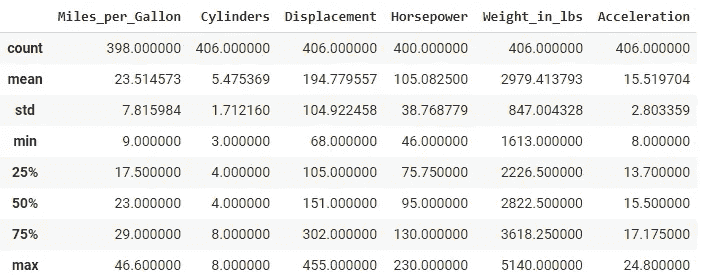
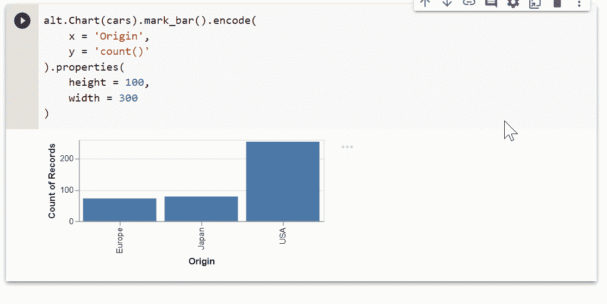
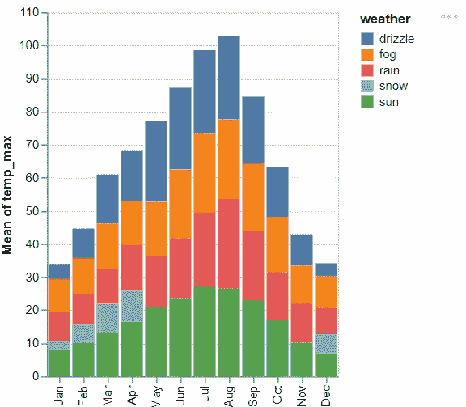
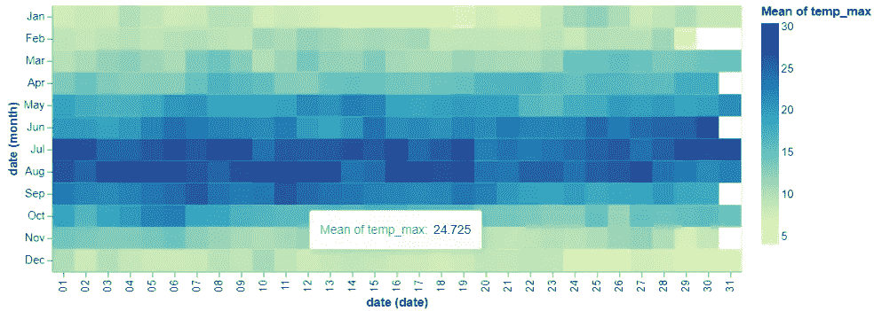
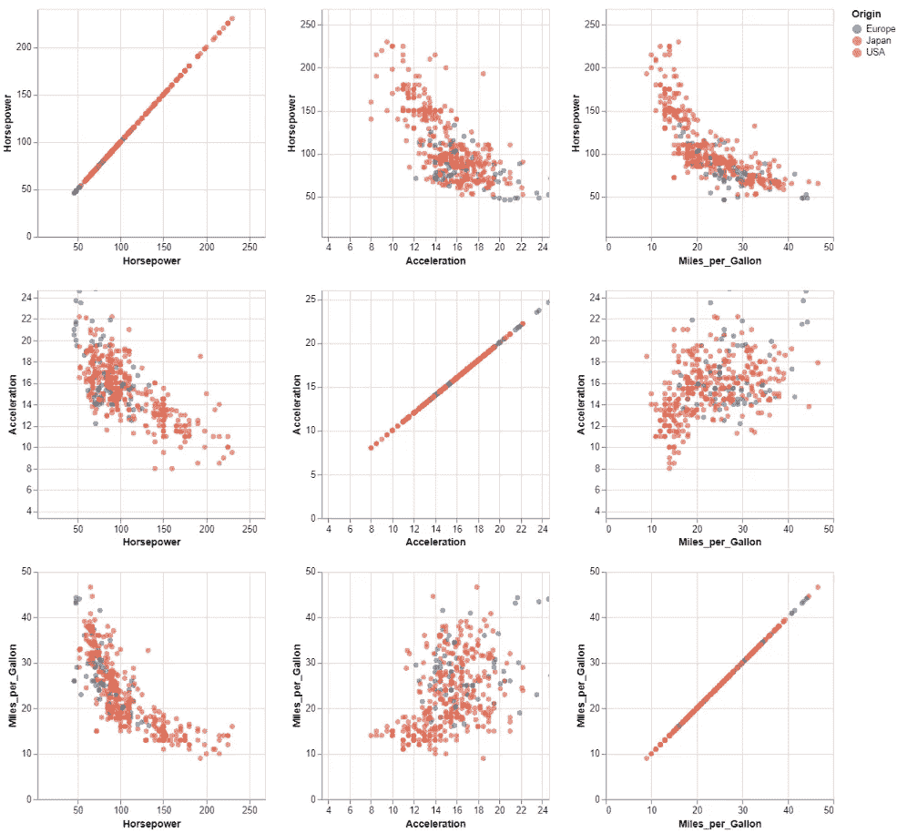
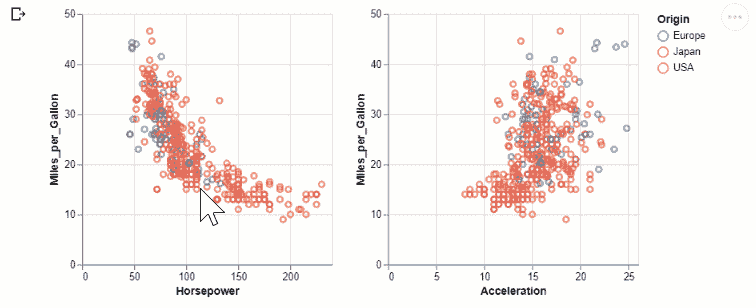
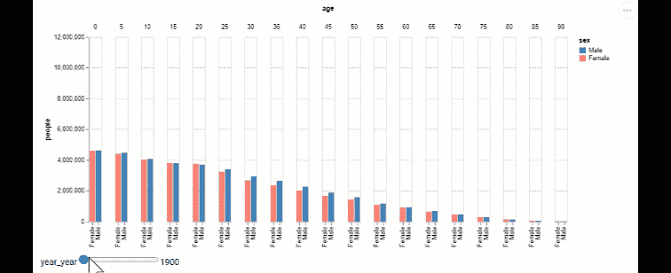

# 提高您的数据即生产力

> 原文：<https://towardsdatascience.com/boost-your-data-viz-productivity-1ae29fb713af?source=collection_archive---------33----------------------->

## 数据科学家可视化数据指南

## 使用 Altair 快速创建令人惊叹的可视化


牛郎星是天鹰座中最亮的星星

> 我们大多数人需要听音乐才能理解它有多美。但通常这就是我们展示统计数据的方式:我们只展示音符，不演奏音乐。—汉斯·罗斯林

数据可视化对于理解数据分析之美至关重要。通过数据可视化，我们的利益相关者了解我们分析的影响。这有助于他们集中注意力，做出明智的决定。

然而，尽管它很重要，我一直收到关于有抱负的数据科学家如何开始探索数据分析的问题。

> *简单，具有数据可视化。*

# 牛郎星的力量

> [*“*](https://github.com/plotly/dash)Altair 是一个针对 Python 的声明式统计可视化库，基于 [Vega](http://vega.github.io/vega) 和 [Vega-Lite](http://vega.github.io/vega-lite) ，源代码可在 [GitHub](http://github.com/altair-viz/altair) 上获得 *—* [*牛郎星即*](https://altair-viz.github.io/)

Altair 是 Python 中的一个数据可视化包，它基于 [Vega](https://vega.github.io/) 和 [Vega Lite](https://vega.github.io/vega-lite/) 语法，并根据最佳可视化实践进行了更新。

## 宣布你的需求

Altair 支持**声明式编程**，它允许您基于输入数据和输出属性构建 Altair 可视化。你将只陈述你需要什么，而不是如何实现目标的细节。


来源 [Unsplash](https://unsplash.com/photos/auEPahZjT40)

## ***假设你要买鸡蛋。***

**声明式编程**会说“给我找鸡蛋买鸡蛋。这是现金”

然而**传统编程**会说“去法院超市，去 6 号通道找到你右手角的鸡蛋，去收银台用 5 美元现金支付”。

显然，从这个例子中，声明式编程将卸载**“如何”**。与金钱和鸡蛋类似，您只需要提交输入数据和输出属性，可视化结果就会自动呈现。

你甚至不需要理解 Altair 是如何处理你的可视化的。你将简单地指导和接受结果。这就是 Altair 支持声明式编程的美妙之处。

其实这一点都不外国。许多语言也是用相同的概念构建的。 [SQL(结构化查询语言)](https://neo4j.com/blog/imperative-vs-declarative-query-languages/)和 [Kubernetes yaml](https://kubernetes.io/docs/tasks/manage-kubernetes-objects/declarative-config/) 使用声明性概念。 [Dash 也是基于声明式编程](/build-your-own-data-dashboard-93e4848a0dcf)构建 dashboard web 应用的工具。两者都是数据科学家优化数据检索和开发流程的重要工具。

> *希望我让你兴奋！！让我们开始吧*

# 牛郎星的组件

**Altair 使用这些组件作为主要语法来指导可视化:**

1.  **数据** →可视化的数据帧
2.  **标记** →每行观察的符号(线、条、刻度、点)
3.  **编码** →数据表示通道(X 位置、Y 位置、颜色、尺寸)
4.  **转换** →应用可视化之前的数据转换(计算、过滤、聚集、折叠)
5.  **标尺** →输入数据并将其显示在屏幕上的功能。
6.  **指南** →图表(图例)上的视觉辅助，x 轴和 y 轴上的刻度。

# 用 Altair 弄脏你的手

## Colab 笔记本

在这篇文章中，我们将使用下面的 Colab 笔记本。

  

## 装置

要安装很容易，您可以运行 pip 安装如下

```
pip install altair
```

## 数据

对于我们的教程，我们将使用这些数据集:

1.  `data.cars`:来自 UCI 机器学习知识库的 AutoMPG 数据集。
2.  `data.stocks`:每日收盘股票价格(AAPL、AMZN、GOOG 等)
3.  `data.seattle_weather`:2012-2015 年西雅图天气

这些数据集可以在 vega_datasets 上获得，Vega _ datasets 与 Altair 一起预加载到 Pandas 数据帧中。



UCI 机器学习知识库上预装的 Cars 数据集(来源于作者)

# 牛郎星一步步来

## 图表

表示“另类的”图表是一种需要数据、标记和编码才能运行的结构。

```
alt.Charts()
```

## 数据

要插入数据，可将数据框输入功能图()。

```
alt.Charts(cars)
```

## 标记

需要标记来表示每一行观察值(线、条、记号、点)

```
alt.Charts(cars).mark_tick()
```

## 编码

对数据集的表示进行编码。您可以将 1 列作为 1D 表示，2 列作为 2D，3 列作为 3D，等等。

```
alt.Chart(cars).mark_tick().encode(
encoding_1 = value_1,
encoding_2 = value_2,
......
)
```

# 你只需要一张图表

创建一个图表很容易。您可以添加维度，在声明性语言中更改不同的符号，一切都会为您处理好。

## 线条、线条、点等等！

只需将 mark_line()转换为 mark_bar()



满足您可视化需求的简单声明性命令(由作者提供)

## 构建直方图超级简单！

```
alt.Chart(weather).mark_bar().encode(
  x=alt.X('date', timeUnit='month', type='nominal'),
  y='mean(temp_max):Q',
  color='weather'
) 
```



简单直方图(来源于作者)

## 使用热图进行模式发现

创建热图。你可以把符号从`mark_bar()` 替换成`mark_rect().`

```
alt.Chart(weather).mark_rect().encode(
  x=alt.X(‘date’, timeUnit=’date’, type=’ordinal’),
  y=alt.Y(‘date’, timeUnit=’month’, type=’ordinal’),
  color=’mean(temp_max)’,
  tooltip=[‘mean(temp_max)’]
)
```



基于温度的月份和日期的热图(来源于作者)

从这里我们可以发现，最高气温是从 4 月份开始到 10 月份(颜色较深)。这与旱季相对应。整洁！

# 许多图表可供比较

Altair 还配备了简单的语言来表示多图形表示。

例如，想象三维散点图的 3X3 散点图。你所需要的只是模块`repeat.`

```
alt.Chart(cars).mark_circle().encode(
  alt.X(alt.repeat("column"), type='quantitative'),
  alt.Y(alt.repeat("row"), type='quantitative'),
  color='Origin:N'
).properties(
  width=250,
  height=250
).repeat(
  row=['Horsepower','Acceleration','Miles_per_Gallon'],
  column=['Horsepower','Acceleration','Miles_per_Gallon']
).interactive()
```



重复的列和行创建散布矩阵(来源于作者)

# 要比较的交互式图表

您甚至可以添加交互来比较多个图表。例如，您可以使用 altair 中的模块`selection` 来创建选择。

```
brush = alt.selection(type='interval',resolve='global')
base = alt.Chart(cars).mark_point().encode(
  y='Miles_per_Gallon',
  color=alt.condition(brush,'Origin',alt.ColorValue('lightgray'))
).properties(
  selection=brush,
  width=250,
  height=250
)
base.encode(x='Horsepower') | base.encode(x='Acceleration')
```



互动情节(来源于作者)

您甚至可以使用稍微复杂的选择来创建基于时间的动画。例如，您可以应用`year`作为选择和过滤标准。

```
from altair.expr import datum, if_
from vega_datasets import datapop = data.population.url
pink_blue = alt.Scale(domain=(‘Male’, ‘Female’),
range=[“steelblue”, “salmon”])
slider = alt.binding_range(min=1900, max=2000, step=10)
year = alt.selection_single(name=”year”, fields=[‘year’], bind=slider)
alt.Chart(pop).mark_bar().encode(
  x=alt.X(‘sex:N’, axis=alt.Axis(title=None)),
  y=alt.Y(‘people:Q’, scale=alt.Scale(domain=(0, 12000000))),
  color=alt.Color(‘sex:N’, scale=pink_blue),
  column=’age:O’
).properties(
  width=20,
  selection=year,
).transform_calculate(
  “sex”, if_(datum.sex == 1, “Male”, “Female”)
).transform_filter(
  year.ref()
)
```



时间动画图(来源于作者)

# 最后的想法

> *Altair 让绘制哪怕是复杂的剧情变得非常简单。它使我们能够直接将想法可视化，而不必担心背后的机制。用最少的努力就可以创造出从简单到复杂的惊人的情节和视觉效果。—*[*Parul Pandey*](https://medium.com/analytics-vidhya/exploratory-data-visualisation-with-altair-b8d85494795c)*—H2O . ai 的数据科学家*

同样，我爱上了牛郎星。它简单、直观、快速。我用谷歌搜索 matplotlib 来添加交互式线条并将多个图对齐在一起的日子已经一去不复返了。Altair 足够直观，可以提高我可视化数据的效率。

**如果你有兴趣了解更多关于牛郎星的信息，请查看**

*   [我的实习实验室](https://colab.research.google.com/drive/17r77TMJ5Z6lPxRgG6UhLwxYC-_OhHYpr?authuser=1#scrollTo=ZtZs6ETCtjwM)实验
*   [帕鲁尔·潘迪关于牛郎星的介绍](https://medium.com/analytics-vidhya/exploratory-data-visualisation-with-altair-b8d85494795c)。这个教程启发我记录我自己的牛郎星学习。Parul 提供了关于 Altair 的清晰介绍。我强烈推荐这个作为额外的参考。
*   官方[文档](https://altair-viz.github.io/getting_started/overview.html)配有解释和实例探讨([牛郎星教程](https://altair-viz.github.io/getting_started/starting.html)、[牛郎星案例分析](https://altair-viz.github.io/case_studies/exploring-weather.html)、[实例图库](https://altair-viz.github.io/gallery/))

索利·德奥·格洛丽亚

# 关于作者

文森特用 ML @ Google 对抗网络滥用。文森特使用高级数据分析、机器学习和软件工程来保护 Chrome 和 Gmail 用户。

除了在谷歌的工作，文森特还是《走向数据科学媒体》的特约撰稿人，为全球 100 多万观众的有志 ML 和数据从业者提供指导。

在空闲时间，文森特在佐治亚理工学院攻读硕士学位，并为铁人三项/自行车旅行进行训练。

最后，请通过[**LinkedIn**](http://www.linkedin.com/in/vincenttatan/?source=post_page---------------------------)**，**[**Medium**](https://medium.com/@vincentkernn?source=post_page---------------------------)**或** [**Youtube 频道**](https://www.youtube.com/user/vincelance1/videos?source=post_page---------------------------) 联系文森特