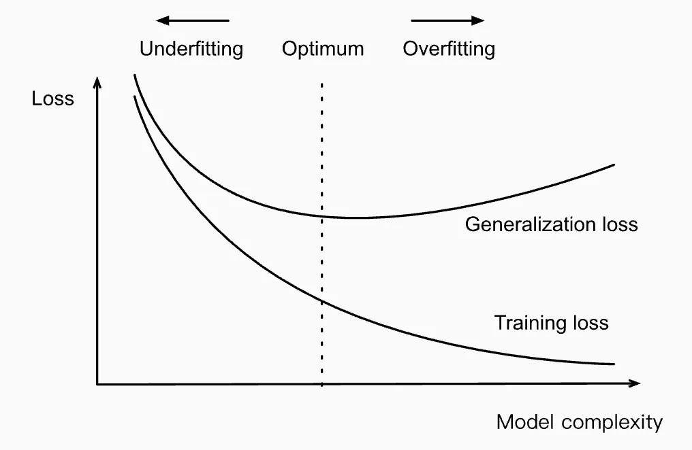
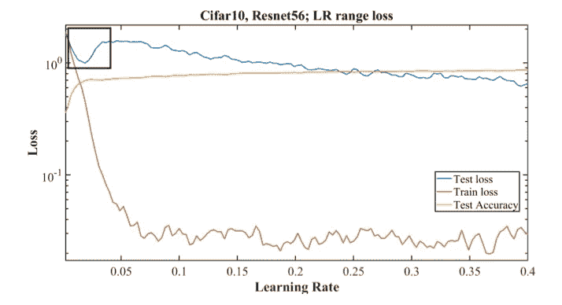
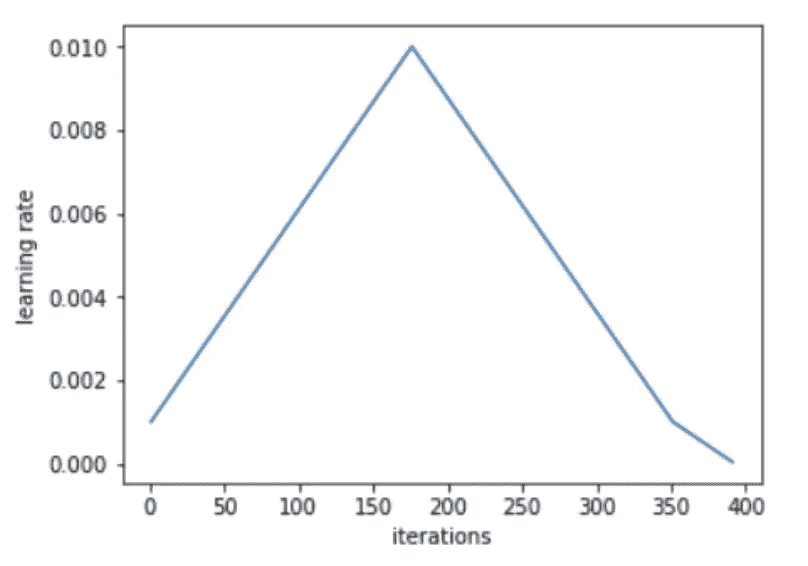
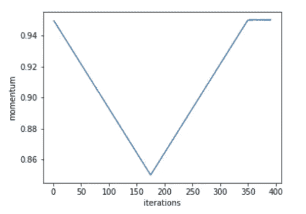

# 提升您的网络性能

> 原文：<https://towardsdatascience.com/boost-your-network-performance-cc0a2a95c5ef?source=collection_archive---------26----------------------->

## 超参数调整和训练优化

你准备了一个有几百万样本的大数据集，设计了一个最先进的神经网络，训练了 100 个纪元，却得不到一个满意的结果？这是很多 ML 从业者都很熟悉的问题。另一个流行的观点是，神经网络是黑盒，所以除非代码中有明显的错误，否则几乎不可能识别问题并提高性能。然而，不应该是这样的。到目前为止，ML 社区对不同组件如何影响网络的训练速度和性能有了相当好的理解。在本文中，我将分享一些优秀的超参数调优和性能评估方法。

# 培训和验证损失

虽然很难将神经网络的内部工作可视化，但一些线索对于普通从业者来说是容易获得的，例如验证和训练损失监控。损失是模型收敛的一个强有力的指标。当额外的训练不能改进模型时，模型“收敛”。缺乏收敛性表明模型无法学习数据的底层结构。

在这种情况下，记住*过拟合*和*欠拟合的概念是有益的。*欠拟合是指一个模型既不能学习训练数据，也不能推广到新数据，因为它不够强大。过度拟合是一种相反的情况，其中模型太了解训练数据和噪声。训练目标是在过度适应和欠适应之间找到一个最佳点，以确保最佳训练。但是我们如何知道模型是过拟合还是欠拟合呢？

过度拟合和欠拟合之间的权衡。

上图说明了我们想要实现验证损失的水平部分，这是欠拟合和过拟合之间的平衡点。连续下降的曲线表示拟合不足，而损失增加则表示拟合过度。监控过拟合和欠拟合的早期迹象可以节省大量时间。如下图所示，在训练早期的过度拟合表明超参数的次优选择。如果超参数设置正确，它们应该在整个过程中表现良好:

黑色方块显示了训练早期过度适应的迹象(Smith，2018。)

我现在将解释各种超参数如何影响过拟合-欠拟合权衡。先说学习率。

# 学习率

学习率是一个超参数，它控制着我们调整网络权重的程度。低学习率会导致过度拟合，因为模型的步长很小，很容易拟合噪声，而不是实际的数据结构。较大的学习率有助于通过制定更重要的步骤来规范训练。但是，如果学习率太大，训练就会发散。循环学习率(CLR)和学习率范围测试(LRR)是为特定用例定义最合适的学习率的有用程序。

## 循环学习率

要使用 CLR，您需要指定最小和最大学习速率以及步长。步长是每步使用的历元数，一个周期由两个这样的步骤组成，一个是学习率线性增加，另一个是线性减少。

开始时较低的值用于训练的热身。不建议直接切换到更高的值，而是线性增加。在周期的中间，高学习率充当正则化方法，并防止网络过度拟合。它们防止模型落在损失函数的陡峭区域。在周期结束时学习率的下降让模型进入到更平滑部分的更陡峭的局部最小值。在学习率高的部分，我们看不到损失或准确性的实质性改善，验证损失有时会非常高。尽管如此，当我们最终降低学习率时，我们看到了这样做的所有好处。但是我们如何选择最小和最大的 LR 值呢？

循环学习率图

## 学习率范围测试

LRR 测试是一个预训练步骤，我们以逐渐增加的学习率运行模型。它提供了关于最大学习速度的有价值的信息。当以小的学习率训练时，网络收敛，并且随着学习率的增加，网络变得太大并导致验证损失和准确性的降低。在这种背离之前，学习率是可以用循环学习率进行训练的最高值。然而，当选择恒定的学习速率时，较小的值是必要的，否则网络将不会开始收敛。最小学习速率界限通常比最大界限小 10 倍。然而，其他因素也是相关的，例如学习率增加的速度(增加太快将导致不稳定)和架构的深度(网络越深，学习率越大)。

一些研究人员建议使用小于迭代/历元总数的一个周期，并允许学习率的下降小于初始学习率。这种学习率策略被称为“1 周期”，它显示出在训练结束之前允许准确度达到稳定状态。

# 批量

小批量具有调整效果。已经表明，对于每个数据集和架构，正则化的总量必须是平衡的。减少其他形式的正规化和学习率巨大的正规化，使培训更有效率。因此，最好使用更大的批量。一些论文建议修改批量大小，而不是学习率(Smith et al .，2017)。然而，批量大小受到硬件的限制。如果您的服务器有多个 GPU，最佳批处理大小是 GPU 上的批处理大小乘以 GPU 的数量。

# 周期性动量

动量或 SGD 与动量是一种方法，有助于加速梯度向量在正确的方向，从而导致更快的收敛。与学习率密切相关。动量值为 0.99、0.97、0.95 和 0.9 的短距离跑步将帮助您找到动量的最佳值。

如果使用 1 周期学习率计划，最好使用周期动量(CM)。理论上，动量的恒定值可以给出与循环相同的最终结果。然而，周期性动量消除了尝试多个值和运行几个完整周期的麻烦。此外，当学习速率增加时，减少循环动量使训练稳定，从而允许更大的学习速率。

循环动量图

# 重量衰减

权重衰减是一种正则化过程，它使权重指数衰减为零。权重衰减是一种简单的方法来平衡总正则化和来自增加的学习速率的正则化。虽然其他正则化技术具有固定值(即，丢弃)，但是当试验最大学习速率和步长值时，很容易改变权重衰减值。需要进行网格搜索来确定适当的星等，但通常不需要超过一个有效数字的精度。

# 结论

如果您在训练的早期寻找验证损失的线索，超参数优化可以相当快。在过拟合和欠拟合之间找到一个最佳平衡点并优化正则化对于快速有效的训练至关重要。您可能会很高兴地得知，这些技术中的大部分已经在 fast.ai 和 PyTorch 中实现了！快乐训练:)

# 资源

史密斯律师事务所(2018 年)。神经网络超参数的训练方法:第 1 部分——学习速率、批量大小、动量和重量衰减。 *arXiv 预印本 arXiv:1803.09820* 。

纽约州史密斯市和新泽西州托平市(2017 年)。超收敛:使用大学习率非常快速地训练神经网络。arXiv 电子版，第页。 *arXiv 预印本 arXiv:1708.07120* 。

j .霍华德和 s .古格(2020 年)。Fastai:深度学习的分层 API。*信息*， *11* (2)，108。