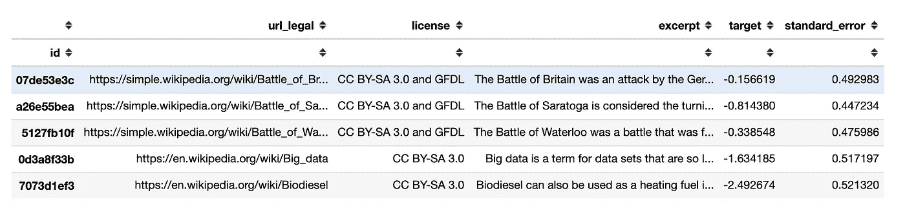
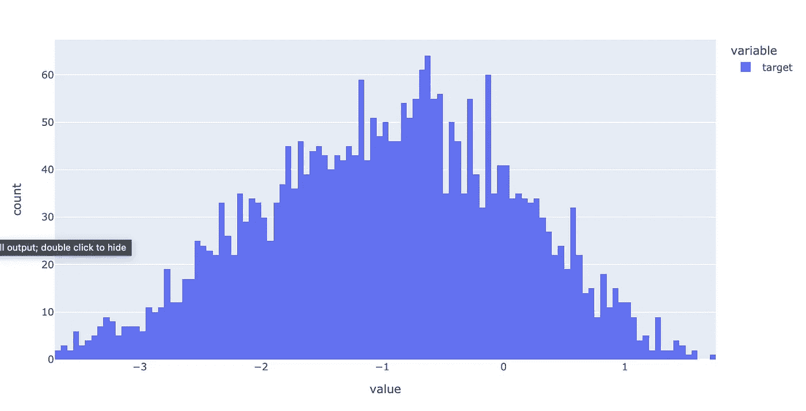
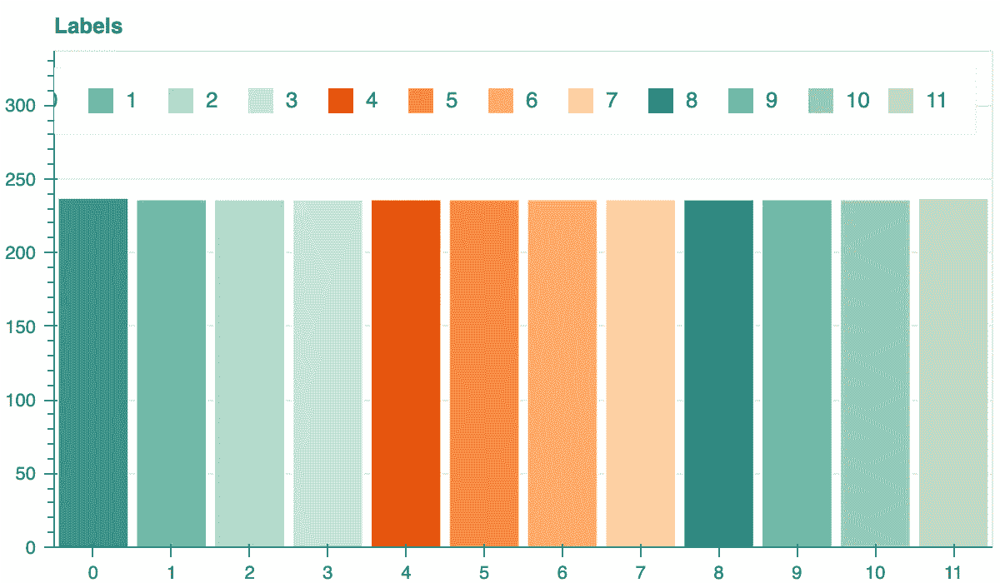
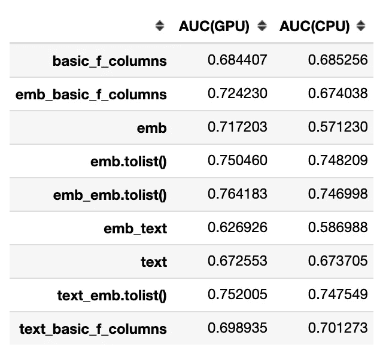

# 使用 Catboost 增强嵌入

> 原文：<https://towardsdatascience.com/boosted-embeddings-with-catboost-8dc15e18fb9a?source=collection_archive---------11----------------------->

## 本文深入探讨了 Catboost，这是一种简单且鲜为人知的方法，可以将嵌入与梯度增强模型结合使用。


由 [Romain Vignes](https://unsplash.com/@rvignes?utm_source=unsplash&utm_medium=referral&utm_content=creditCopyText) 在 [Unsplash](https://unsplash.com/s/photos/text-book?utm_source=unsplash&utm_medium=referral&utm_content=creditCopyText) 上拍摄的照片

# 介绍

当处理大数据时，有必要将具有特征的空间压缩成矢量。文本嵌入就是一个例子，它是几乎所有 NLP 模型创建过程中不可或缺的一部分。不幸的是，使用神经网络来处理这种类型的数据并不总是可行的，例如，原因可能是拟合率或推断率较低。

我建议一个很有趣的方法来使用梯度增强，很少有人知道。

# 数据

Kaggle 的竞赛之一[最近结束了，一个带有文本数据的小数据集出现在那里。我决定将这些数据用于实验，因为竞赛表明数据集被很好地标记，并且我没有面临任何令人不愉快的意外。](https://www.kaggle.com/c/commonlitreadabilityprize/overview)



列:

*   `id` -摘录的唯一 ID
*   `url_legal` -来源的 URL
*   `license` -源材料许可证
*   `excerpt` -文本预测阅读的难易程度
*   `target`——读书容易
*   `standard_error` -对每个摘录在多个评价人之间的分数分布的测量

作为数据集中的一个目标，它是一个数值型变量，提出它是为了解决回归问题。但是，我决定换成一个分类问题。主要原因是我将使用的库不支持在回归问题中处理文本和嵌入。希望以后开发者消除这个不足。但是在任何情况下，回归和分类问题都是密切相关的，对于分析来说，解决哪一个问题都没有区别。



目标

让我们用斯特奇法则来计算箱子的数量:

```
num_bins = int(np.floor(1 + np.log2(len(train))))train['target_q'], bin_edges = pd.qcut(train['target'],
    q=num_bins, labels=False, retbins=True, precision=0)
```



目标 _q

但是，首先，我清理数据。

```
train['license'] = train['license'].fillna('nan')
train['license'] = train['license'].astype('category').cat.codes
```

借助一个自写的小函数，我对文字进行清理和词条化。函数可以很复杂，但这对于我的实验来说已经足够了。

```
def clean_text(text):

    table = text.maketrans(
        dict.fromkeys(string.punctuation))

    words = word_tokenize(
        text.lower().strip().translate(table))
    words = [word for word in words if word not in stopwords.words('english')]
    lemmed = [WordNetLemmatizer().lemmatize(word) for word in words]    
    return " ".join(lemmed)
```

我将清理后的文本保存为新特征。

```
train['clean_excerpt'] = train['excerpt'].apply(clean_text)
```

除了文本，我还可以选择 URL 中的单个单词，并将这些数据转换成新的文本特征。

```
def getWordsFromURL(url):
    return re.compile(r'[\:/?=\-&.]+',re.UNICODE).split(url)train['url_legal'] = train['url_legal'].fillna("nan").apply(getWordsFromURL).apply(
    lambda x: " ".join(x))
```

我从文本中创建了几个新特征——这些是各种各样的统计信息。还是那句话，创意的空间很大，但是这个数据对我们来说已经足够了。这些特性的主要目的是对基线模型有所帮助。

```
def get_sentence_lengths(text): tokened = sent_tokenize(text)
    lengths = []

    for idx,i in enumerate(tokened):
        splited = list(i.split(" "))
        lengths.append(len(splited)) return (max(lengths),
            min(lengths),
            round(mean(lengths), 3))def create_features(df):

    df_f = pd.DataFrame(index=df.index)
    df_f['text_len'] = df['excerpt'].apply(len)
    df_f['text_clean_len' ]= df['clean_excerpt'].apply(len)
    df_f['text_len_div'] = df_f['text_clean_len' ] / df_f['text_len']
    df_f['text_word_count'] = df['clean_excerpt'].apply(
        lambda x : len(x.split(' ')))

    df_f[['max_len_sent','min_len_sent','avg_len_sent']] = \
        df_f.apply(
            lambda x: get_sentence_lengths(x['excerpt']),
            axis=1, result_type='expand')

    return df_ftrain = pd.concat(
    [train, create_features(train)], axis=1, copy=False, sort=False)basic_f_columns = [
    'text_len', 'text_clean_len', 'text_len_div', 'text_word_count',
    'max_len_sent', 'min_len_sent', 'avg_len_sent']
```

当数据稀缺时，更容易检验假设，结果通常需要更加稳定。因此，为了对结果更有信心，我更喜欢在这种情况下使用 OOF(Out-of-Fold)预测。

# 基线

我选择了 [Catboost](https://catboost.ai/) 作为模型的免费库。Catboost 是一个高性能的开源库，用于决策树的梯度提升。从版本 0.19.1 开始，它支持在 GPU 上开箱即用的分类文本功能。主要优点是 CatBoost 可以在数据中包含分类和文本函数，而无需额外的预处理。

在[非常规情感分析:BERT vs. Catboost](/unconventional-sentiment-analysis-bert-vs-catboost-90645f2437a9) 中，我详述了 Catboost 如何处理文本，并将其与 BERT 进行了比较。

这个库有一个杀手锏:它知道如何处理嵌入。不幸的是，目前文档中对此只字未提，只有少数人知道 Catboost 的这一优势。

```
!pip install catboost
```

当使用 Catboost 时，我建议使用池。它是一个方便的包装器，结合了特性、标签和元数据，比如分类和文本特性。

为了比较实验，我创建了一个仅使用数字和分类特征的基线模型。

我写了一个函数来初始化和训练模型。顺便说一下，我没有选择最佳参数。

```
def fit_model_classifier(train_pool, test_pool, **kwargs):
    model = CatBoostClassifier(
        task_type='GPU',
        iterations=5000,
        eval_metric='AUC',
        od_type='Iter',
        od_wait=500,
        l2_leaf_reg=10,
        bootstrap_type='Bernoulli',
        subsample=0.7,
        **kwargs
    ) return model.fit(
        train_pool,
        eval_set=test_pool,
        verbose=100,
        plot=False,
        use_best_model=True)
```

为了实现 OOF，我编写了一个简单明了的小函数。

```
def get_oof_classifier(
        n_folds, x_train, y, embedding_features,
        cat_features, text_features, tpo, seeds,
        num_bins, emb=None, tolist=True):

    ntrain = x_train.shape[0]

    oof_train = np.zeros((len(seeds), ntrain, num_bins))    
    models = {} for iseed, seed in enumerate(seeds):
        kf = StratifiedKFold(
            n_splits=n_folds,
            shuffle=True,
            random_state=seed)    

        for i, (tr_i, t_i) in enumerate(kf.split(x_train, y)):
            if emb and len(emb) > 0:
                x_tr = pd.concat(
                    [x_train.iloc[tr_i, :],
                     get_embeddings(
                         x_train.iloc[tr_i, :], emb, tolist)],
                    axis=1, copy=False, sort=False)
                x_te = pd.concat(
                    [x_train.iloc[t_i, :],
                     get_embeddings(
                         x_train.iloc[t_i, :], emb, tolist)],
                    axis=1, copy=False, sort=False)
                columns = [
                    x for x in x_tr if (x not in ['excerpt'])]  
                if not embedding_features:
                    for c in emb:
                        columns.remove(c)
            else:
                x_tr = x_train.iloc[tr_i, :]
                x_te = x_train.iloc[t_i, :]
                columns = [
                    x for x in x_tr if (x not in ['excerpt'])] 
            x_tr = x_tr[columns]
            x_te = x_te[columns]                
            y_tr = y[tr_i]            
            y_te = y[t_i] train_pool = Pool(
                data=x_tr,
                label=y_tr,
                cat_features=cat_features,
                embedding_features=embedding_features,
                text_features=text_features) valid_pool = Pool(
                data=x_te,
                label=y_te,
                cat_features=cat_features,
                embedding_features=embedding_features,
                text_features=text_features) model = fit_model_classifier(
                train_pool, valid_pool,
                random_seed=seed,
                text_processing=tpo
            )
            oof_train[iseed, t_i, :] = \
                model.predict_proba(valid_pool)
            models[(seed, i)] = model

    oof_train = oof_train.mean(axis=0)

    return oof_train, models
```

我将在下面写关于 *get_embeddings* 函数，但是它不用于获取模型的基线。

我用以下参数训练了基线模型:

```
columns = ['license', 'url_legal'] + basic_f_columns oof_train_cb, models_cb = get_oof_classifier(
    n_folds=5,
    x_train=train[columns],
    y=train['target_q'].values,
    embedding_features=None,
    cat_features=['license'],
    text_features=['url_legal'],
    tpo=tpo,
    seeds=[0, 42, 888],
    num_bins=num_bins
)
```

训练模型的质量:

```
roc_auc_score(train['target_q'], oof_train_cb, multi_class="ovo")AUC: 0.684407
```

现在我有了模型质量的基准。从数字来看，这个模型很弱，我不会在生产中实现它。

# 嵌入

你可以把多维向量转化为嵌入，嵌入是一个相对低维的空间。因此，嵌入简化了大输入的机器学习，例如表示单词的稀疏向量。理想情况下，嵌入通过将语义相似的输入放在嵌入空间中彼此靠近来捕获一些输入语义。

有许多方法可以获得这样的向量，我在本文中不考虑它们，因为这不是研究的目的。然而，对我来说，以任何方式获得嵌入就足够了；最重要的是他们保存了必要的信息。在大多数情况下，我使用目前流行的方法——预训练变形金刚。

```
from sentence_transformers import SentenceTransformerSTRANSFORMERS = {
    'sentence-transformers/paraphrase-mpnet-base-v2': ('mpnet', 768),
    'sentence-transformers/bert-base-wikipedia-sections-mean-tokens': ('wikipedia', 768)
}def get_encode(df, encoder, name):    
    device = torch.device(
        "cuda:0" if torch.cuda.is_available() else "cpu")

    model = SentenceTransformer(
        encoder, 
        cache_folder=f'./hf_{name}/'
    )
    model.to(device)
    model.eval()
    return np.array(model.encode(df['excerpt']))def get_embeddings(df, emb=None, tolist=True):

    ret = pd.DataFrame(index=df.index)

    for e, s in STRANSFORMERS.items():
        if emb and s[0] not in emb:
            continue

        ret[s[0]] = list(get_encode(df, e, s[0]))
        if tolist:
            ret = pd.concat(
                [ret, pd.DataFrame(
                    ret[s[0]].tolist(),
                    columns=[f'{s[0]}_{x}' for x in range(s[1])],
                    index=ret.index)],
                axis=1, copy=False, sort=False)

    return ret
```

现在我已经准备好开始测试不同版本的模型了。

# 模型

我有几个拟合模型的选项:

*   文本特征；
*   嵌入特征；
*   嵌入特征，如一列分离的数字特征。

我一直在这些选项的各种组合中接受训练，这让我得出结论，嵌入可能是多么有用，或者，也许，它是一个过度工程。

作为一个例子，我给出了一个使用所有三个选项的代码:

```
columns = ['license', 'url_legal', 'clean_excerpt', 'excerpt'] oof_train_cb, models_cb = get_oof_classifier(
    n_folds=FOLDS,
    x_train=train[columns],
    y=train['target_q'].values,
    embedding_features=['mpnet', 'wikipedia'],
    cat_features=['license'],
    text_features=['clean_excerpt','url_legal'],
    tpo=tpo,
    seeds=[0, 42, 888],
    num_bins=num_bins,
    emb=['mpnet', 'wikipedia'],
    tolist=True
)
```

为了获得更多信息，我在 GPU 和 CPU 上训练了模型；并将结果汇总在一个表格中。



首先让我震惊的是**文字特征和嵌入的交互极差**。不幸的是，我还没有对这个事实的任何逻辑解释——在这里，需要在其他数据集上对这个问题进行更详细的研究。同时，请注意，文本的组合使用和同一文本的嵌入会降低模型的质量。

**更新**:我收到开发者的评论:

> “谢谢你的报告！这个错误已经在[提交](https://github.com/catboost/catboost/commit/d76e62988dea0e2a0b3b2e56df979d75c944279e)中修复，并将在下一个版本中发布”

我的另一个发现是，当在 CPU 上训练模式时,**嵌入不起作用。**

现在，一件好事是，如果你有一个 GPU 并且可以获得嵌入，最好的质量将是当你同时使用嵌入作为一个功能和一系列单独的数字功能时。

# 摘要

在这篇文章中，我:

*   选择了一个小型免费数据集进行测试；
*   为文本数据创建了几个统计特征，用于制作基线模型；
*   测试了嵌入、文本和简单特性的各种组合；
*   我得到了一些非显而易见的见解。

这些鲜为人知的信息将对社区有所帮助，并从您的项目中受益。不幸的是，Catboost 处理嵌入和文本的功能仍然是原始的。但是，它正在积极改进，我希望很快会有一个稳定的版本，开发者会更新文档。复制本文结果的完整代码可从[这里](https://github.com/sagol/boosted-embeddings/blob/main/boosted_embeddings.ipynb)获得。