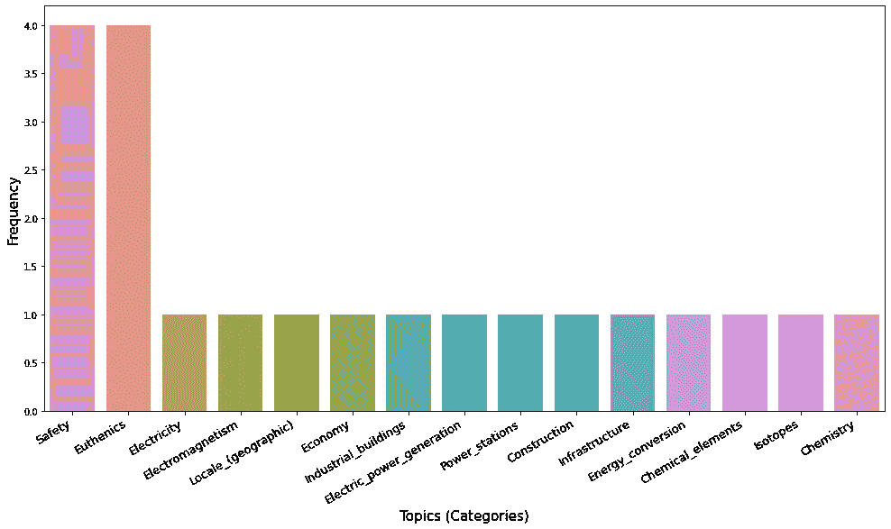

# 用维基百科推进自然语言处理

> 原文：<https://towardsdatascience.com/boosting-natural-language-processing-with-wikipedia-b779103ba396?source=collection_archive---------15----------------------->

## [实践教程](https://towardsdatascience.com/tagged/hands-on-tutorials)

## *使用维基百科改进自然语言处理任务，如命名实体识别和主题建模*


照片由 [Artem Maltsev](https://unsplash.com/@art_maltsev?utm_source=medium&utm_medium=referral) 在 [Unsplash](https://unsplash.com?utm_source=medium&utm_medium=referral) 拍摄

# 介绍

自然语言处理(NLP)正在兴起。计算语言学和人工智能正在联手培育突破性发现。当研究集中于显著改进 NLP 技术时，企业将该技术视为战略资产。这种由 NLP 引导的彻底革新的主要作用是由文本数据的大量可用性发挥的。当谈到数字化时，尤其是对企业而言，重要的是要记住文档本身就是数字化的，因此，文本数据是知识的主要来源。

然而，当寻求磨练自然语言处理任务时，最大的瓶颈之一是关于数据的训练。当涉及到真实世界的应用时，比如在特定的领域，我们面临着低资源数据的问题。训练数据有两个主要问题:(I)难以获得大量数据，以及(ii)注释用于训练和测试的可用数据的耗时过程。

面对这些问题，计算机科学已经投入了大量的注意力。特别是，最新的计算进展提出了两种方法来克服低资源数据问题:

*   微调预先训练的语言模型，如 BERT 或 GPT-3；
*   利用高质量的开放式数据存储库，如维基百科或概念网。


维基百科标志(图片来自[维基百科](https://it.wikipedia.org/wiki/Wikipedia_in_inglese#/media/File:Wikipedia-logo-v2-en.svg))

大多数现有的计算语言学开放库都提供了基于这两种方法之一开发 NLP 工具的架构。我们现在演示如何利用维基百科来提高两个 NLP 任务的性能:**命名实体识别**和**主题建模**。

## 从句子中提取维基百科信息

有几种工具可以用来处理来自维基百科的信息。关于文本数据的自动处理，我们使用 spaCy 的一个开放项目 [SpikeX](https://spacy.io/universe/project/spikex) 。

SpikeX 是准备插入 spaCy 管道的管道集合，spaCy 管道是 NLP 的 python 库。SpikeX 由一家意大利公司( [Erre Quadro Srl](https://www.errequadrosrl.com/) )开发，旨在帮助构建知识提取工具，几乎不费吹灰之力。

SpikeX 有两个主要特点:

1.  给定一个维基百科页面，它提取所有相应的类别。

```
Categories for `Natural_Language_Processing`:
  Category:Artificial_intelligence
  -> Category:Emerging_technologies
  -> Category:Cybernetics
  -> Category:Subfields_of_computer_science
  -> Category:Computational_neuroscience
  -> Category:Futures_studies
  -> Category:Cognitive_science
  -> Category:Personhood
  -> Category:Formal_sciences
  Category:Speech_recognition
  -> Category:Artificial_intelligence_applications
  -> Category:Computational_linguistics
  -> Category:Human–computer_interaction
  -> Category:Digital_signal_processing
  -> Category:Speech
  Category:Natural_language_processing
  -> Category:Artificial_intelligence_applications
  -> Category:Computational_linguistics
  Category:Computational_linguistics
  -> Category:Computational_social_science
```

2.给定一个句子，它会在文本中找到匹配维基百科页面标题的组块。

```
Elon Musk 
('Elon_Musk', 'Elon_musk', 'Elon_Musk_(book)', 'Elon_Musk_(2015_book)', 'Elon_Musk_(2015)', 'Elon_Musk_(biography)', 'Elon_Musk_(2015_biography)', 'Elon_Musk_(Ashlee_Vance)') 
------ 
Elon 
('Elon_(Judges)', 'Elon_(name)', 'Elon_(Hebrew_Judge)', 'Elon_(Ilan)', 'Elon_(disambiguation)', 'Elon_(biblical_judge)', 'Elon_(chemical)', 'Elon') 
------ 
Musk 
('Musk', 'MuSK', 'Musk_(wine)', 'Musk_(song)', 'Musk_(Tash_Sultana_song)', 'Musk_(disambiguation)') 
------ 
runs
('Runs_(baseball_statistics)', 'Runs', 'Runs_(cricket)', 'Runs_(music)', 'Runs_(baseball)', 'Runs_(Baseball)', 'Runs_(musical)') 
------
Tesla Motors 
('Tesla_motors', 'Tesla_Motors')
------ 
Tesla 
('Tesla_(band)', 'Tesla_(unit)', 'Tesla_(Czechoslovak_company)', 'Tesla_(crater)', 'Tesla_(microarchitecture)', 'Tesla_(2020_film)', 'Tesla_(car)', 'Tesla_(GPU)', 'TESLA', 'Tesla_(physicist)', 'Tesla_(group)', 'Tesla_(opera)', 'Tesla_(Bleach)', 'Tesla_(company)', 'Tesla_(disambiguation)', 'Tesla_(2016_film)', 'TESLA_(Czechoslovak_company)', 'Tesla_(unit_of_measure)', 'Tesla_(vehicles)', 'Tesla_(vehicle)', 'Tesla_(film)', 'Tesla_(album)', 'Tesla_(Flux_Pavilion_album)', 'Tesla_(surname)', 'Tesla') 
------ 
Motors ('Motors')
```

我们可以看到，在第一个例子中，SpikeX 提取了维基百科页面“自然语言处理”所属的所有类别。例如，“*自然 _ 语言 _ 处理*”属于“*人工 _ 智能*”、“*语音 _ 识别*”、“*计算 _ 语言学*”的范畴。Wiki 类别的树形结构可以通过更深层次的检查来进一步探究。

在第二个例子中，对于句子“*埃隆·马斯克(Elon Musk)经营特斯拉汽车公司”*，SpikeX 提取句子中所有可能在维基百科上有页面的页面。

我们现在看到这两个处理特性如何被用来执行**命名实体识别**和**主题建模**。

## 命名实体识别

命名实体识别(NER)是一项自然语言处理任务，旨在定位文本中提到的实体并将其分类到预定义的类别中(如人名、组织、位置等)。不同的方法处理这一任务以实现高精度:基于规则的系统，训练深度神经网络的方法或精细运行预训练语言模型的方法。例如，Spacy 嵌入了一个预先训练的命名实体识别系统，该系统能够从文本中识别常见类别。

我们现在着手建立一个 NER 系统，能够识别属于某个维基百科类别的文本片段。让我们考虑下面的例句:

*“命名实体识别和主题建模是自然语言处理的两项任务”*

这句话潜在地包含了三个实体:*命名实体识别*、*主题建模*、*自然语言处理*。这三个实体都有属于特定类别的各自的维基百科页面。


维基百科类别结构示例(图片由作者提供)

在这张图片中，我们可以看到不同的类别是如何分布在三个实体中的。在这种情况下，类别可以被看作是我们想要从文本中提取的实体的标签。我们现在可以利用 SpikeX 的两个特性来构建一个定制的 NER 系统，该系统接受两个输入变量:句子的(I)文本和我们想要检测的(ii)类别。

```
Named Entity Recognition - COMPUTATIONAL LINGUISTIC
Topic Modeling - COMPUTATIONAL LINGUISTIC
Natural Language Processing - COMPUTATIONAL LINGUISTIC
```

将维基百科的类别定义为 NER 任务的标签，使得定义 NER 系统避免数据训练问题成为可能。通过使用 *displacy* 来表示我们基于维基百科类别的 NER 系统提取的实体，展示了另一个例子。


NER 摘录示例(图片由作者提供)

在这个例子中，类别“编程语言”和“计算语言学”作为输入给出，然后在文本中搜索。

## 主题建模

当谈到**主题建模**时，我们通常指的是能够发现文本主体的“隐藏语义结构”的 NLP 工具。最近，人们讨论到“为了自动文本分析的目的，主题的定义在某种程度上取决于所采用的方法”[1]。**潜在狄利克雷分配(LDA)** 是流行的主题建模方法，使用概率模型从*组文档*中提取主题。另一个著名的方法是 **TextRank** ，这是一种使用网络分析来检测单个文档中的主题的方法。最近，NLP 中的高级研究还引入了能够在*句子级别*提取主题的方法。一个例子是 [**语义超图**](https://graphbrain.net/overview/hypergraph.html) **，**“一种结合了机器学习和符号方法的优势，从句子的意思推断主题的新技术”[1]。

我们现在看到如何使用维基百科在*句子*和*文档*级别执行主题建模。

让我们考虑来自专利 [US20130097769A1](https://patents.google.com/patent/US20130097769A1/en) 的以下文本。

> 封装的防护服可以在污染区域穿着，以保护该防护服的穿着者。例如，当在核动力发电厂内工作或在存在放射性物质的情况下工作时，工人可能穿着密封防护服。封装的防护服可以是一次性使用类型的系统，其中在一次使用后该防护服被丢弃。在正常操作条件下，封装的防护服可以通过连接到防护服的外部气流软管接收呼吸空气。例如，空气可以由用户携带的动力空气净化呼吸器(PAPR)提供。

```
Sentence:
Encapsulated protective suits may be worn in contaminated areas to protect the wearer of the suit. Topics in the sentence:
   Safety -> 1
   Euthenics -> 1 ----Sentence:
For example, workers may wear an encapsulated protective suit while working inside of a nuclear powered electrical generating plant or in the presence of radioactive materials.
Topics in the sentence:
   Safety -> 1
   Euthenics -> 1
   Electricity -> 1
   Electromagnetism -> 1
   Locale_(geographic) -> 1
   Electric_power_generation -> 1
   Power_stations -> 1
   Infrastructure -> 1
   Energy_conversion -> 1
   Chemistry -> 1
   Radioactivity -> 1
---- Sentence:
An encapsulated protective suit may be a one-time use type of system, wherein after a single use the suit is disposed of. Topics in the sentence:   
   Safety -> 1
   Euthenics -> 1
   Transportation_planning -> 1
   Feminist_economics -> 1
   Schools_of_economic_thought -> 1
   Land_management -> 1
   Architecture -> 1
   Planning -> 1
   Transport -> 1
   Feminism -> 1
   Urban_planning -> 1
   Feminist_theory -> 1
   Urbanization -> 1
   Spatial_planning -> 1
   Social_sciences -> 1
----Sentence:
An encapsulated protective suit may receive breathing air during normal operating conditions via an external air flow hose connected to the suit. Topics in the sentence:
   Safety -> 1
   Euthenics -> 1
   Chemical_industry -> 1
   Gases -> 1
   Industrial_gases -> 1
   Breathing_gases -> 1
   Diving_equipment -> 1
   Respiration -> 1
   Electromechanical_engineering -> 1
   Heat_transfer -> 1
   Home_appliances -> 1
   Engineering_disciplines -> 1
   Automation -> 1
   Building_engineering -> 1
   Temperature -> 1
   Heating,_ventilation,_and_air_conditioning -> 1   
---- Sentence:
The air may be supplied, for example, by a power air purifying respirator (PAPR) that may be carried by the user.Topics in the sentence:
   Personal_protective_equipment -> 1
   Air_filters -> 1
   Respirators -> 1
   Protective_gear -> 1
----
```

专利文本的每个句子都用 SpikeX 处理，并从句子中检测到的相应维基百科页面中提取类别。我们认为主题是维基百科的类别。这样我们就有了第一个天真的话题检测。与语义超图、文本排名或 LDA 不同，这种方法在不直接引用术语的情况下找到句子主题的标签。所提取的主题标签指的是 SpikeX 匹配的维基百科页面的类别。如果我们使用这种方法来聚合每个句子的主题，我们就可以更好地表示整个文档。



段落级别的主题检测(作者图片)

对句子中类别的频率进行分类可以更广泛地查看文本的主题分布。“安全性”和“优效性”比其他类别出现得更频繁。

我们现在使用整个专利文本(可以在 Google Patent 中找到)来找到分类分布。


文档级别的主题检测(按作者分类的图片)

正如我们所看到的，我们可以自动检测整个文档的主题(或类别)(在本例中是专利)。查看前 5 个类别，我们可以推断出专利是关于什么的。这是在没有任何培训前任务的情况下完成的。

# 结论

十多年来，维基百科一直被用作知识的来源，并在各种应用中反复使用:文本注释、分类、索引、聚类、搜索和自动分类生成。事实上，维基百科的结构有许多有用的特性，使它成为这些应用程序的良好候选。

这篇文章展示了如何通过使用这个强大的资源来改进简单的 NLP 任务。然而，这并不是说这种方法优于其他现有技术的方法。评估自然语言处理任务准确性的典型方法*精确度*和*召回率*在这篇文章中没有给出。

此外，这种方法有优点也有缺点。主要优点是避免了培训，从而减少了耗时的注释任务。可以将维基百科视为一个巨大的训练集，其贡献者来自世界各地。对于有监督的任务(如 NER)和无监督的任务(如主题建模)都是如此。这种方法的缺点是双重的。首先，维基百科是一项公共服务，是一个由专家和非专家贡献的知识库。第二，从主题建模结果可以看出，自然语言的歧义性会导致有偏的表现。词义消歧和非专家驱动的数据管理显然会影响整个系统的可靠性。

然而，还有很大的改进余地。将维基百科视为 NLP 任务的大型开放知识库与即将到来的新范式转变相一致:所谓的**人工通用智能** ( **AGI** )，即系统理解或学习人类可以完成的任何智力任务的假设能力。

[1]梅内塞斯，特尔莫，和卡米尔罗斯。“语义超图。” *arXiv 预印本 arXiv:1908.10784* (2019)。

*我要感谢*[***Erre Quadro Srl***](https://www.errequadrosrl.com/)*，特别要感谢 Paolo Arduin，他开发了 SpikeX 项目，使其成为开放访问项目。*

*这个帖子是在研究实验室* [***B4DS(数据科学的商业工程)***](http://b4ds.unipi.it/) *的帮助下概念化和设计的。我要感谢团队，我的博士同事和导师，他们帮助我写了这篇文章。*

*见我最新发表在 PlOs one 上的《* [*快速检测压力下的快速创新新冠肺炎*](https://journals.plos.org/plosone/article?id=10.1371/journal.pone.0244175) *》。*