# 通过将树与 GLM 结合来提高绩效:基准分析

> 原文：<https://towardsdatascience.com/boosting-performance-by-combining-trees-with-glm-a-benchmarking-analysis-1840cac91cb1?source=collection_archive---------16----------------------->


西蒙·伯杰在 [Unsplash](https://unsplash.com?utm_source=medium&utm_medium=referral) 上的照片

## 通过将树和 GLM 结合起来，可以获得多大的改进，它与加法模型相比如何？

统计建模的一个常见缺陷是确保建模方法适合数据结构。像逻辑回归这样的线性模型假设预测事件的可能性和独立变量之间存在线性关系。在最近研究这个话题时，我看到了[这篇关于 StackExchange 的](https://stackoverflow.com/questions/41692017/decision-trees-combined-with-logistic-regression)文章，讨论了使用浅层决策树作为逻辑回归的特征工程步骤。简而言之，这种策略试图通过使用树作为特征工程步骤来处理非线性数据，以将其转换为虚拟变量，然后可以在逻辑回归规范中使用。

在研究了这个策略之后，我的印象是执行这个介绍性的步骤可能会引入降低模型灵活性的缺点，同时提供模型结果的边际增加。转换数据以消除非线性，或者在模型的规格中说明非线性，可能更有用。然而，我很惊讶地看到，没有多少文章或帖子将其与其他方法进行比较！

为了了解决策树结合逻辑回归(树+GLM)的表现，我在三个数据集上测试了该方法，并根据标准逻辑回归和广义加法模型(GAM)对结果进行了基准测试，以了解这两种方法之间是否存在一致的性能差异。

# 树+ GLM 方法论

逻辑回归和决策树通常是最先介绍的两种分类模型。每个都有自己的陷阱。回归模型假设因变量可以用一组应用于自变量的线性函数来解释，并具有以下形式的方程:


决策树不对变量的分布做出假设，它们只是根据基尼系数等标准在决策树中创建一个新的分支。但是，决策树容易过度拟合，并且对于训练数据的变化可能不稳定。

下图说明了一元模型中因变量范围内的线性回归和决策树模型的结果:

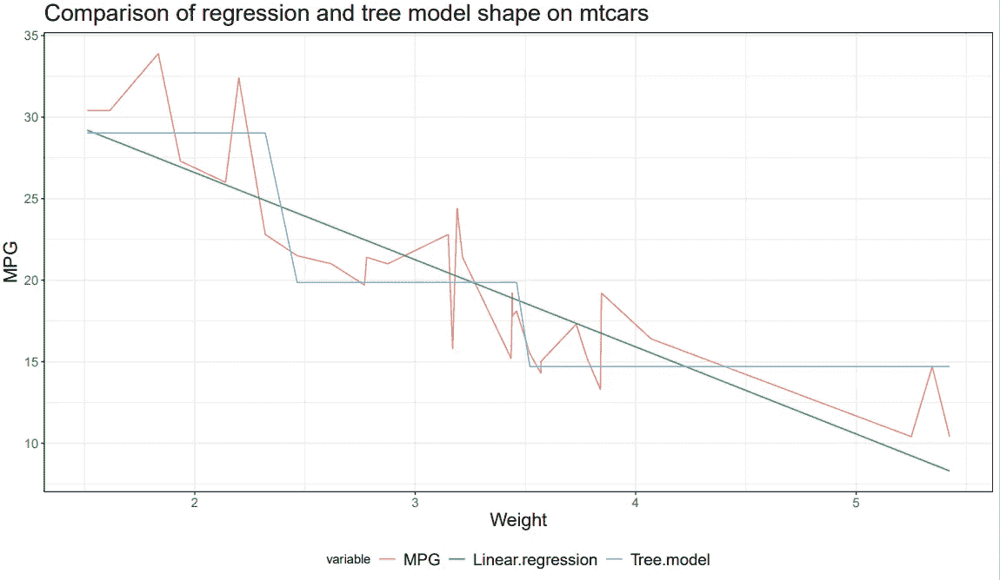

作者图片

从上面的图表中，我们可以看到，与线性回归模型生成的平滑函数相比，决策树的预测是不连续的。虽然这对于简单的线性数据是有问题的，但是决策树策略以非线性方式改变的能力为其在非线性数据上的使用提供了理由。

为了试图弥补这两种方法的缺点，一些来源建议使用决策树作为中间步骤，这有助于消除模型中潜在的非线性。最简单的过程如下:

1.  为训练数据 X 拟合一个浅层决策树 T(X)。该树将有 N 个终端节点。
2.  表示为 C_n 的 n 个分类变量作为特征包含在逻辑回归规范中。
3.  使用修改的数据集拟合逻辑回归。

有两种简单的方法来处理数据中的非线性。第一种选择是对原始数据使用一些其他转换步骤，使其与因变量成线性关系。不过，这种策略并不总是一种选择，其适当性因领域而异。消除它的第二种方法是将模型规范改为可以处理非线性数据的方法。

# 广义可加模型

有几种方法可以用来处理非线性数据，但我选择的是广义加法模型。广义加性模型是由 Trevor Hastie 和 Robert Tibshirani 在“[广义加性模型](https://web.stanford.edu/~hastie/Papers/gam.pdf)”中提出的一个框架。作者接着写了统计学习的[元素](https://web.stanford.edu/~hastie/ElemStatLearn/)，这是我第一次遇到它。

它采用了逻辑回归所基于的广义线性模型的概念，放松了线性基函数的假设。在逻辑回归规范的情况下，逻辑回归的 GAM 等价于:

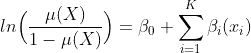

在这种情况下，上面的符号替代

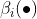

为

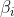

在原始的逻辑回归方程中。这是因为我们已经将对每个因变量进行操作这一术语改为任意平滑函数。或者，我们可以将逻辑回归模型视为加法模型，其中:

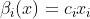

对于某些回归系数

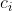

很明显，这为我们如何处理我们正在建模的变量提供了额外的灵活性，因此我们将在我们的数值实验中使用该规范作为 tree+logistic 回归规范的挑战者。

# 数据

本文中使用了三组数据进行比较，它们是:

1.  合成数据集—包含 10，000 个观察值的人工数据集，包括线性和非线性变量。
2.  银行数据—由银行活动生成的数据集。这里使用的数据实际上是由 Andrzej Szymanski 博士整理和格式化的，他写了一篇关于使用决策树进行逻辑回归的文章。我想包括这个，因为它可以提供一个有价值的比较，结果已经产生了。原始数据来自 [Andrzej 的](https://github.com/AndrzejSzymanski/TDS/blob/master/banking.csv) GitHub。
3.  成人数据—用于尝试预测收入是否超过 50，000 美元/年的人口普查数据。它可以在 UCI 机器学习库[这里](https://archive.ics.uci.edu/ml/datasets/adult)获得。

在下面的代码块中，我们收集了将在我们的三个测试中使用的数据，并对其进行了检查。我们首先生成合成数据，然后下载并格式化银行和成人数据集。在此之后，我们执行一些数据清理步骤，以确保我们使用的变量不被表示为字符。最后，我们将数据分为训练和测试数据:

```
rm(list = ls())
library(pacman)
p_load(data.table,caret,ggplot2,plotly,mgcv,rpart,magrittr,precrec,MLmetrics,partykit,gam,rmarkdown,knitr,broom,rpart.plot,reactable)
set.seed(13)
with.nonlinear <- data.table(twoClassSim(10000,
                                         linearVars = 6,ordinal = F ) )
data.list <- list("Synthetic" = with.nonlinear,
                  "Banking" =  fread("[https://raw.githubusercontent.com/AndrzejSzymanski/TDS-LR-DT/master/banking_cleansed.csv](https://raw.githubusercontent.com/AndrzejSzymanski/TDS-LR-DT/master/banking_cleansed.csv)")  ,
                  "Adult" = fread("[https://archive.ics.uci.edu/ml/machine-learning-databases/adult/adult.data](https://archive.ics.uci.edu/ml/machine-learning-databases/adult/adult.data)")  )
names(data.list[[3]]) <- c("age","workclass","fnlwgt","education","education-num","marital-status","occupation", "relationship", "race","sex","capital-gain","capital-loss","hours-per-week","native-country","Income-class")
# Change variables to factors for banking data-set
banking.names.for.factors <- names(data.list$Banking)[apply(data.list$Banking,MARGIN = 2, function(x){length(unique(x))})==2]
data.list$Banking[,
                  names(data.list$Banking)[apply(data.list$Banking,MARGIN = 2, function(x){
                    length(unique(x))})==2] := lapply(X = .SD,FUN = factor),
                  .SDcols = banking.names.for.factors]
# Change variables to factors for Adult data-set:
adult.names.for.factors <- names(data.list$Adult)[sapply(X = 1:ncol(data.list$Adult),function(x){is.character( data.list$Adult[[x]]  )})]
data.list$Adult[,names(data.list$Adult)[sapply(X = 1:ncol(data.list$Adult),
                                               function(x){is.character( data.list$Adult[[x]]  )})]:= lapply(X = .SD,FUN = factor),
                .SDcols = adult.names.for.factors]
data.list$Adult[,names(data.list$Adult)[sapply(X = 1:ncol(data.list$Adult),
                                               function(x){is.integer( data.list$Adult[[x]]  )})]:= lapply(X = .SD,FUN = as.numeric ),
                .SDcols = names(data.list$Adult)[sapply(X = 1:ncol(data.list$Adult),
                                                        function(x){is.integer( data.list$Adult[[x]]  )})]]
training.data <- list()
test.data <- list()
for( i in 1:length(data.list)){
  train_inds <- sample(x = 1:nrow(data.list[[i]]) ,size = .8*nrow(data.list[[i]]))
  training.data[[i]] <- data.list[[i]][train_inds]
  test.data[[i]] <-   data.list[[i]][-train_inds]  }
names(training.data)<- names(data.list)
names(test.data)<- names(data.list)
```

在进行我们的基准分析之前，了解哪些变量与因变量有非线性关系是有用的。一个简单而直观的方法是绘制因变量和自变量之间的关系图，看看从视觉上看非线性关系是否明显。在这里的实现中，我使用一个 GAM 和一个变量来描述两个变量之间关系的大致形状。您可以在下面看到使用图表评估非线性的实现:

```
nonlinear.viz <- function(dt,dep.var,indep.var,bins = 100){
  dt$y <- as.numeric(as.character(dt$y))
  return.plot <- ggplot(dt, 
                        aes_string( x = indep.var,y = dep.var) ) + stat_smooth(method = "gam", 
                                                                               method.args = list(family = "binomial"),) + theme_bw() + theme(axis.title = element_text(size = 16),axis.text = element_text(size = 11),plot.title = element_text(size = 20)   ) +ylab(indep.var)+
    xlab(dep.var)+
    ggtitle(paste("Relationship between ",dep.var," and ", indep.var,sep = ""))
  return(return.plot)}training.data$Synthetic[,Class := ifelse(Class == "Class1", 1,0)]
test.data$Synthetic[,Class := ifelse(Class == "Class1", 1,0)]
training.data$Adult[,"Class" := ifelse(`Income-class` == ">50K", 1,0)]
test.data$Adult[,"Class" := ifelse(`Income-class` == ">50K", 1,0)]
synthetic.plot <- lapply(X = names(training.data$Synthetic)[names(training.data$Synthetic)!="Class"],
                         function(x){nonlinear.viz(dt = training.data$Synthetic,dep.var = "Class",x)})
banking.plot <- lapply(X = c("age","previous","euribor3m","cons_conf_idx","cons_price_idx","nr_employed", "emp_var_rate"   ,   "pdays"),
                       function(x){nonlinear.viz(dt = training.data$Banking,dep.var = "y",x)})
names(training.data$Adult) <- gsub(names(training.data$Adult),pattern = "-",replacement = "_")
names(test.data$Adult) <- names(training.data$Adult)
adult.plot <- lapply(X = c("age","education_num","capital_gain","capital_loss","hours_per_week"),
                     function(x){nonlinear.viz(dt = training.data$Adult,
                                               dep.var = "Class",x )})
```

上面的代码将为*所有*变量关系生成图表。为了简洁起见，我在下面的章节中只关注非线性数据:

**合成数据集**

正在使用的合成数据集是从 caret 库中的 [twoClassSim](https://rdrr.io/cran/caret/man/twoClassSim.html) 函数生成的。这个函数很简单:数据集是由一个二元结果和一组线性相关或非线性相关的变量生成的。这个数据集对我们的测试很有用，因为它允许我们比较算法，而不需要关心关于问题领域的信息。下表总结了变量之间的关系:

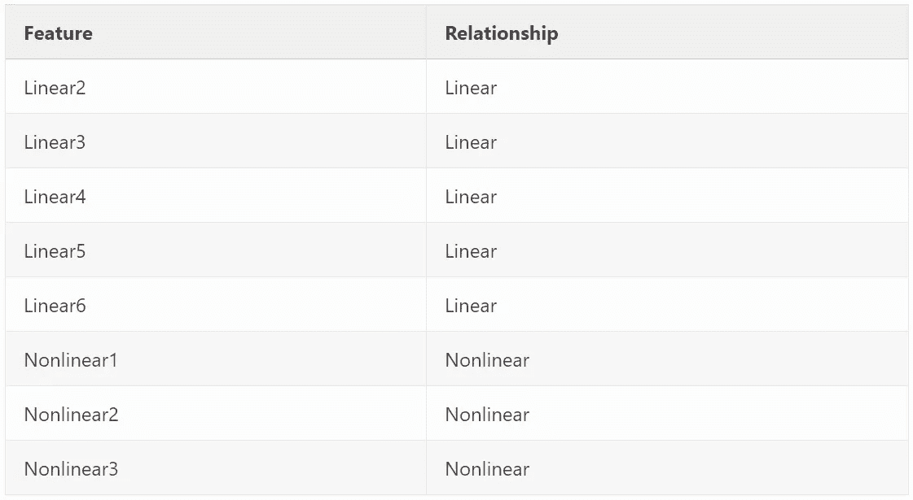

作者图片

我使用以下公式绘制了合成数据的非线性变量与数据集中类的可能性的关系:

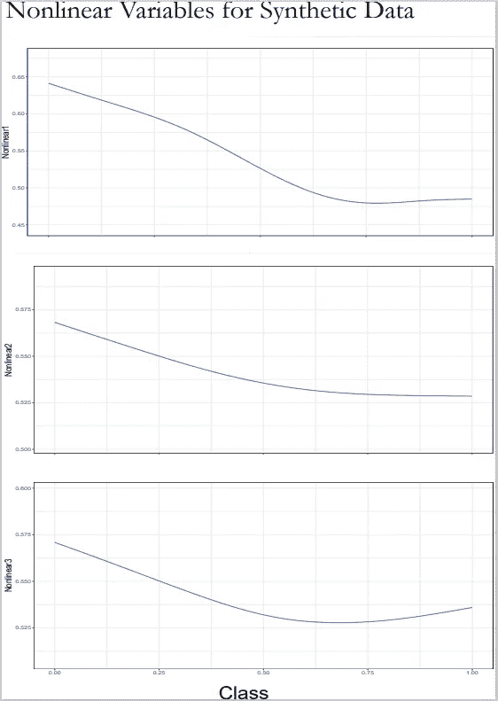

作者图片

我们可以看到变量是我们所期望的:在所有情况下，在实例是正类的可能性和负类的可能性之间通常存在负的非线性关系。

**银行数据集**

银行数据集包含 27 个独立变量。其中，7 个变量是连续变量，其余的是二元变量。该特性与因变量的关系如下表所示:

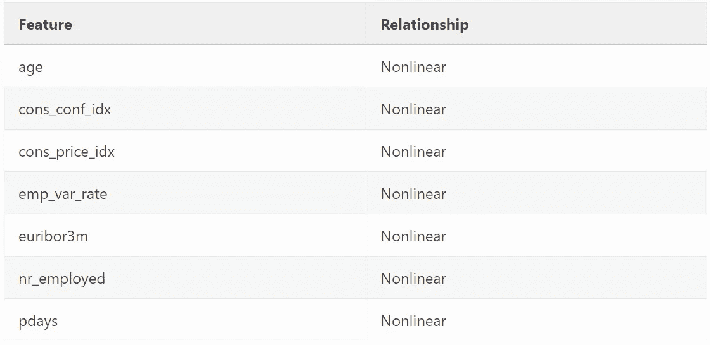

作者图片

与合成数据一样，我也制作了一组图表，显示连续特征变量和因变量(在本例中为 y)之间的关系:

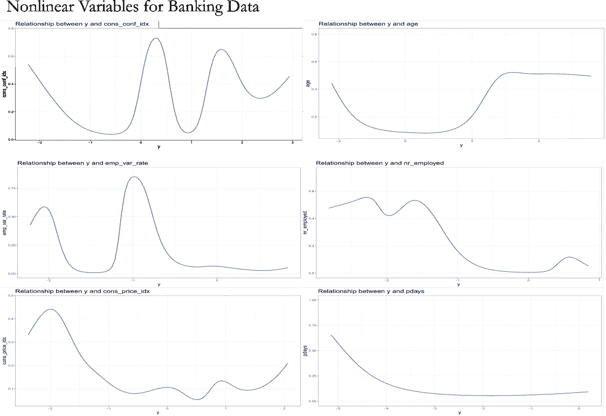

作者图片

我们可以看到，在上面的每个示例图表中，因变量和自变量之间存在明显的非线性关系，使用线性基函数很难补偿这种关系。

**成人数据集**

与银行数据集一样，成人数据集有许多变量，这些变量是二元变量以及一组连续变量(在本例中是五个)。下表对它们进行了总结:

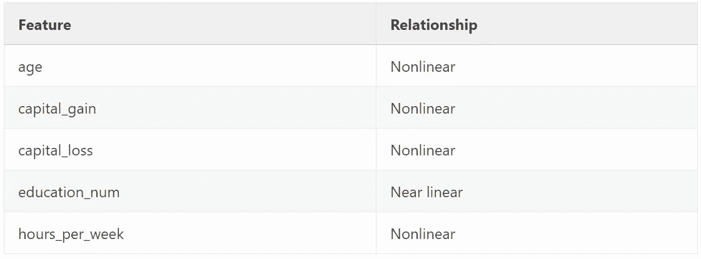

作者图片

我还制作了下图，展示了每个变量和因变量之间的关系:

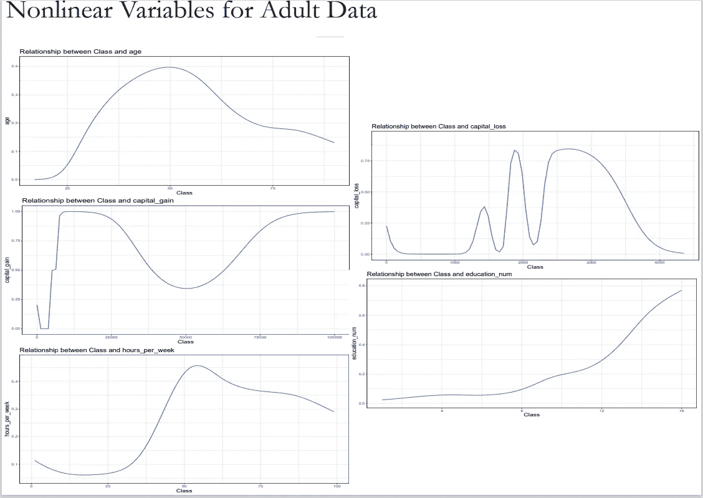

作者图片

连续自变量和因变量之间的关系类似于银行数据集。唯一的例外是 education_num 变量，它表示在校的年数。我们可以看到，它有一个明显的积极的关系，可能是近似的线性函数，尽管凹度。

## 数据平衡

在拟合和试验模型之前，检查数据集中类之间的平衡是有帮助的。数据中的类别不平衡会引入偏差，这可能需要使用重采样技术来解决。

我们将使用下面显示的代码来调查这种不平衡:

```
sum.func <- function(x,col,model.name){ 
  dims <- data.table( "Measure" = c("Observations","Factors")  , "Count" = dim(x))
  factors <- data.table( "Minority Class Percent",  min(x[,.N,by = col]$N)/sum(x[,.N,by = col]$N)  )
  names(factors) <- c("Measure","Count")
  for.return <- data.table(rbind(dims,factors)   )
  names(for.return)[2] <- model.name
  # factors$Measure <- paste("Class = ",factors$Measure,sep = "")
  return(  for.return    )  }
dep.vars <- c("Class", "y", "Income_class")summaries <- lapply(X = 1:length(training.data),
                    FUN = function(x){sum.func(training.data[[x]], dep.vars[x] ,
                                               model.name = names(training.data)[x])   })
summaries[[1]]$Banking <- summaries[[2]]$Banking
summaries[[1]]$Adult <- summaries[[3]]$Adult
kable(summaries[[1]],digits = 3)
```

我对表格的结果进行了格式化，以显示与下面数据集的其余部分相比，因变量的少数类的大小。

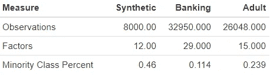

作者图片

从上表中我们可以看出，银行和成人数据集在预测类别上存在明显的不平衡。为了纠正这一点，我们将使用合成少数过采样技术并查看结果。

快速注意:SMOTE 步骤可能需要一些时间。

```
banking.smote <- RSBID::SMOTE_NC(data = training.data$Banking , outcome = "y" )
adult.smote <- RSBID::SMOTE_NC(data = training.data$Adult, outcome = "Income_class" )p_load(data.table,rmarkdown,knitr)
resampled_data <- list(training.data$Synthetic,banking.smote,adult.smote)
dep.vars <- c("Class", "y", "Income_class")
names(resampled_data) <- names(training.data)
summaries <- lapply(X = 1:length(training.data),
                    FUN = function(x){sum.func(resampled_data[[x]], 
                                               dep.vars[x] ,
                                               model.name = names(training.data)[x])   })
summaries[[1]]$Banking <- summaries[[2]]$Banking
summaries[[1]]$Adult <- summaries[[3]]$Adult
kable(summaries[[1]],digits = 3)
```

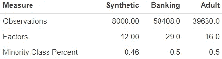

# 构建决策树

我们首先构建简单的决策树，作为原始分类变量的因子*而不是*。这些树必须很小，以避免过度生长。我已经使用最大深度为 2、3 和 4 的树测试了模型，并基于其在 ROC 和 PR AUC 中提高的准确性，选择在每个模型中使用最大深度为 4 的树。在下面的代码块中，CART 决策树与叶节点预测相匹配，然后用于在数据中创建新的因子变量。之后，新数据用于拟合逻辑回归模型。

我们首先拟合初始决策树(另一个注意:我用深度和其他细节的几次迭代测试了这个。以下选项似乎表现最佳):

```
synthetic.tree.2 <- rpart(data = training.data$Synthetic,
                          formula = Class~Linear1+Linear2+Linear3+Linear4+Linear5+Linear6+Nonlinear1 +Nonlinear2 +Nonlinear3,
                          control = rpart.control(  maxdepth = 4 ))
banking.tree.3 <- rpart(data = banking.smote,
                        formula = y~.-V1, control = rpart.control(  maxdepth = 4)  )
adult.tree.3 <- rpart(data = adult.smote,
                      formula = Class~age+workclass+fnlwgt+education+education_num +marital_status+occupation+relationship+race+sex+capital_gain +  capital_loss + hours_per_week+ native_country,
                      control = rpart.control(  maxdepth = 4))synth.models <- list(synthetic.tree.2)
banking.models <- list(banking.tree.3)
adult.models <- list(adult.tree.3)tree.to.feature <- function(tree.model,dt){
  require(partykit)
  tree_labels <- factor( predict(as.party(tree.model), dt ,type = "node") )
  return(tree_labels)}
```

接下来，我们将这些结果用于拟合逻辑回归模型:

```
synth.train.preds <- lapply(X = synth.models,FUN = function(x){   tree.to.feature(tree.model = x,dt = training.data$Synthetic)  }) %>% data.frame
banking.train.preds <-lapply(X = banking.models,FUN = function(x){   tree.to.feature(tree.model = x,dt = training.data$Banking)  }) %>% data.frame
adult.train.preds <-lapply(X = adult.models,FUN = function(x){   tree.to.feature(tree.model = x,dt = training.data$Adult)  }) %>% data.frame
names(synth.train.preds) <- c("three.nodes")
names(banking.train.preds) <- c("four.nodes")
names(adult.train.preds) <- c("four.nodes")
training.data$Synthetic <- cbind( training.data$Synthetic,synth.train.preds )
training.data$Banking <- cbind(training.data$Banking ,banking.train.preds )
training.data$Adult <- cbind(training.data$Adult ,adult.train.preds )
synth.model.three.deep<- glm(formula = Class~Linear1+Linear2+Linear3+Linear4+Linear5+Linear6+Nonlinear1 +Nonlinear2 +Nonlinear3 + three.nodes,family = "binomial",data = training.data$Synthetic)
banking.mode.four.deep <- glm(formula = y~.-V1 ,family = "binomial",data = training.data$Banking)
adult.mode.four.deep <- glm(formula = Class~age+workclass+fnlwgt+education+education_num +marital_status+occupation+relationship+race+sex+capital_gain +  capital_loss + hours_per_week+ native_country + four.nodes,
                            family = "binomial",
                            data = training.data$Adult)
```

最后，我们拟合了 GAM 和 GLM 模型，我们将使用这两个模型对 GAM 树模型结果进行基准测试:

```
# Create GAM models and the GLM models:
synth.gam <- gam(data = training.data$Synthetic,formula = Class~s(Linear1)+s(Linear2)+s(Linear3)+s(Linear4)+s(Linear5)+s(Linear6)+s(Nonlinear1) +s(Nonlinear2) +s(Nonlinear3),family = binomial)banking.gam <- gam(formula = y~s(age)+s(previous)+s(euribor3m)+s(cons_conf_idx)+s(cons_price_idx)+s(nr_employed)+s(emp_var_rate)+s(pdays)+`job_blue-collar`+
                     job_management+`job_other 1`+`job_other 2`+job_services+job_technician+marital_married+marital_single+ education_high.school+education_professional.course+education_university.degree+education_unknown+default_unknown+housing_unknown+
                     housing_yes+loan_unknown+loan_yes+poutcome_nonexistent+poutcome_success,family = "binomial",data = training.data$Banking)adult.gam <- gam(formula = Class~s(age)+(workclass)+s(fnlwgt)+(education)+s(education_num) +(marital_status)+(occupation)+(relationship)+(race)+(sex)+s(capital_gain) +  s(capital_loss) + s(hours_per_week)+ (native_country),
                 family = "binomial",
                 data = training.data$Adult)
# Create GLM Modelssynth.model.glm<- glm(formula = Class~Linear1+Linear2+Linear3+Linear4+Linear5+Linear6+Nonlinear1 +Nonlinear2 +Nonlinear3 ,family = "binomial",data = training.data$Synthetic)banking.mode.glm <- glm(formula = y~.-V1-four.nodes ,family = "binomial",data = training.data$Banking)adult.mode.glm <- glm(formula = Class~age+workclass+fnlwgt+education+education_num +marital_status+occupation+relationship+race+sex+capital_gain +  capital_loss + hours_per_week+ native_country ,
                      family = "binomial",
                      data = training.data$Adult)Finally, we fit the GAM and GLM models which we will be using to benchmark the GLM+Tree model results:*# Create GAM models and the GLM models:*
synth.gam **<-** gam(data **=** training.data**$**Synthetic,formula **=** Class**~**s(Linear1)**+**s(Linear2)**+**s(Linear3)**+**s(Linear4)**+**s(Linear5)**+**s(Linear6)**+**s(Nonlinear1) **+**s(Nonlinear2) **+**s(Nonlinear3),family **=** binomial)

banking.gam **<-** gam(formula **=** y**~**s(age)**+**s(previous)**+**s(euribor3m)**+**s(cons_conf_idx)**+**s(cons_price_idx)**+**s(nr_employed)**+**s(emp_var_rate)**+**s(pdays)**+**`job_blue-collar`**+**
                     job_management**+**`job_other 1`**+**`job_other 2`**+**job_services**+**job_technician**+**marital_married**+**marital_single**+** education_high.school**+**education_professional.course**+**education_university.degree**+**education_unknown**+**default_unknown**+**housing_unknown**+**
                     housing_yes**+**loan_unknown**+**loan_yes**+**poutcome_nonexistent**+**poutcome_success,family **=** "binomial",data **=** training.data**$**Banking)

adult.gam **<-** gam(formula **=** Class**~**s(age)**+**(workclass)**+**s(fnlwgt)**+**(education)**+**s(education_num) **+**(marital_status)**+**(occupation)**+**(relationship)**+**(race)**+**(sex)**+**s(capital_gain) **+**  s(capital_loss) **+** s(hours_per_week)**+** (native_country),
                           family **=** "binomial",
                           data **=** training.data**$**Adult)
*# Create GLM Models*

synth.model.glm**<-** glm(formula **=** Class**~**Linear1**+**Linear2**+**Linear3**+**Linear4**+**Linear5**+**Linear6**+**Nonlinear1 **+**Nonlinear2 **+**Nonlinear3 ,family **=** "binomial",data **=** training.data**$**Synthetic)

banking.mode.glm **<-** glm(formula **=** y**~**.**-**V1**-**four.nodes ,family **=** "binomial",data **=** training.data**$**Banking)

adult.mode.glm **<-** glm(formula **=** Class**~**age**+**workclass**+**fnlwgt**+**education**+**education_num **+**marital_status**+**occupation**+**relationship**+**race**+**sex**+**capital_gain **+**  capital_loss **+** hours_per_week**+** native_country ,
                           family **=** "binomial",
                           data **=** training.data**$**Adult)
```

# 模型检验

既然我们已经拟合了模型，我们可以比较它们的结果。为此，我将依赖 ROC AUC 和 PR AUC。评估结果的代码如下所示:

```
synth.test.preds <- lapply(X = synth.models,FUN = function(x){  
  tree.to.feature(tree.model = x,dt = test.data$Synthetic)  }) %>% data.frame
banking.test.preds <-lapply(X = banking.models,FUN = function(x){ 
  tree.to.feature(tree.model = x,dt = test.data$Banking)  }) %>% data.frame
adult.test.preds <- lapply(X = adult.models,FUN = function(x){ 
  tree.to.feature(tree.model = x,dt = test.data$Adult)  }) %>% data.frame
names(synth.test.preds) <- c( "three.nodes")
names(banking.test.preds) <- c( "four.nodes")
names(adult.test.preds) <- c( "four.nodes")
test.data$Synthetic <- cbind( test.data$Synthetic,synth.test.preds )
test.data$Banking <- cbind(test.data$Banking ,banking.test.preds )
test.data$Adult <- cbind(test.data$Adult ,adult.test.preds )
training.for.mmdata <- data.frame(predict(banking.mode.glm,newdata = training.data$Banking, type = "response" ),
                                  predict(banking.mode.four.deep, newdata = training.data$Banking,type = "response" ),
                                  predict(banking.gam,newdata = training.data$Banking, type = "response" )  ) 
training.mdat <- mmdata(scores = training.for.mmdata,labels = training.data$Banking$y,
                        modnames = c("Logistic Regression", "Tree w/ GLM", "GAM"))
testing.for.mmdata <- data.frame(predict(synth.model.glm,newdata = test.data$Synthetic, type = "response" ),
                                 predict(synth.model.three.deep, newdata = test.data$Synthetic,type = "response" ),
                                 predict(synth.gam,newdata = test.data$Synthetic, type = "response" )  ) 
testing_mdat <- mmdata(scores = testing.for.mmdata,labels = test.data$Synthetic$Class,
                       modnames = c("Logistic Regression", "Tree w/ GLM", "GAM"))
training_ROC <- autoplot(evalmod(training.mdat),curvetype = c("ROC"))+theme(legend.position = "bottom") +ggtitle("ROC Curve - Training Data")
training_PR <- autoplot(evalmod(training.mdat),curvetype = c("PR"))+theme(legend.position = "bottom") +ggtitle("PR Curve - Training Data")
testing_ROC <- autoplot(evalmod(testing_mdat),curvetype = c("ROC"))+theme(legend.position = "bottom") +ggtitle("ROC Curve - Testing Data")
testing_PR <- autoplot(evalmod(testing_mdat),curvetype = c("PR"))+theme(legend.position = "bottom") +ggtitle("PR Curve - Testing Data")
```

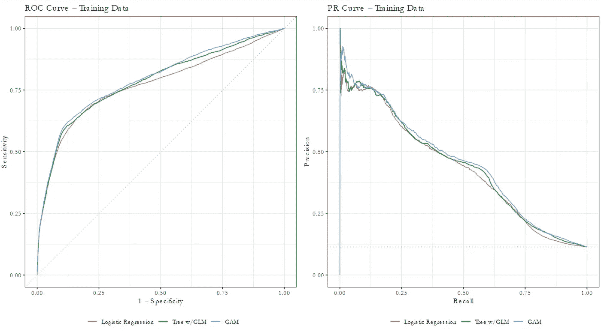

作者图片

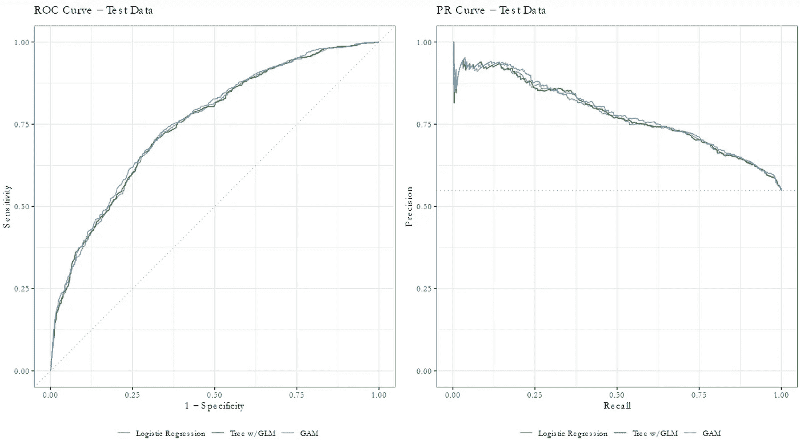

作者图片

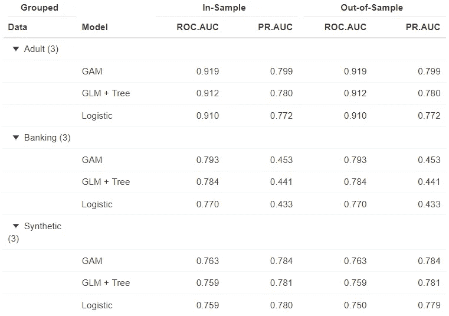

作者图片

每个模型在训练和测试数据集上都表现良好，当切换到样本外数据时，模型精度几乎没有下降。在所有情况下，使用决策树作为特性工程步骤都会对性能指标有一点改进。我们还看到，在所有情况下，GAM 模型优于任何一个模型。

在一些情况下，GAM 比 GAM 树模型的表现好得多，比 GAM 树模型比逻辑回归模型的表现好得多。由此，我们可以看到，在模型规范中包含非线性数据的结构而不是转换它，可以在所有情况下提高性能。这一点很重要，因为使用 GAM 还消除了对模型的潜在决策树的调查和比较。

# 结论:

我比较了处理非线性数据的两种不同方法的结果。第一种是使用决策树模型作为特征工程步骤来创建一组一次性编码器，然后在逻辑回归模型中使用。第二种方法是广义的附加模型，它将数据的潜在非线性纳入模型规范。这消除了因变量和自变量之间线性关系的假设。这两种方法在三个数据集上进行了比较，以查看它们的性能是否有一致的差异。测试表明，GAM 在各个方面都优于 GAM 树模型。两个模型都优于简单的逻辑回归模型。

GAMs 优于树+GLM 模型的事实是重要的，因为它还消除了特征工程步骤和关于用于生成处理变量的树的深度的模糊性。

# 参考资料:

[1] T. Hastie，R. Tibshirani，J. Friedman，[统计学习的要素](https://web.stanford.edu/~hastie/ElemStatLearn/) (2009)

[2] T. Hastie，R. Tibshirani，[广义加法模型](https://web.stanford.edu/~hastie/Papers/gam.pdf)，统计科学(1986)

[3]Syzmanski，Andrzej，[结合逻辑回归和决策树](/combining-logistic-regression-and-decision-tree-1adec36a4b3f)，走向数据科学(2020)