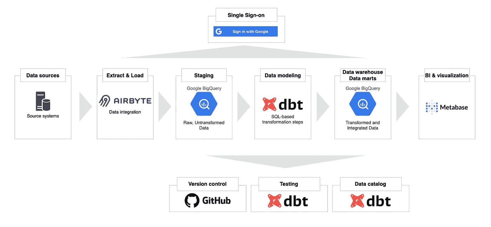
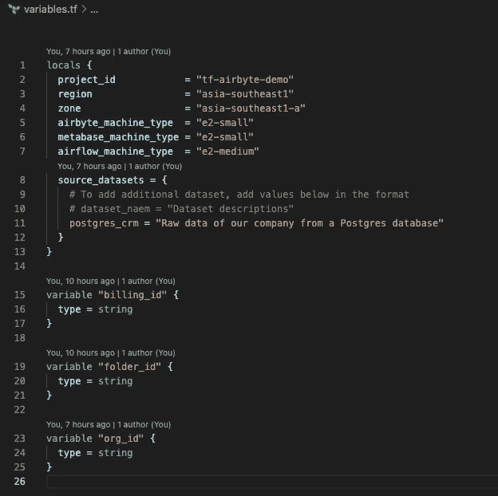
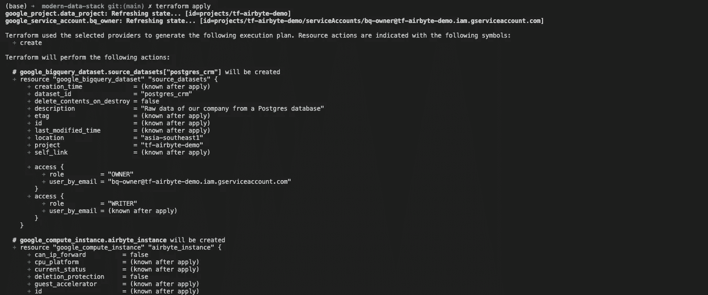
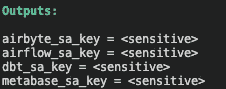
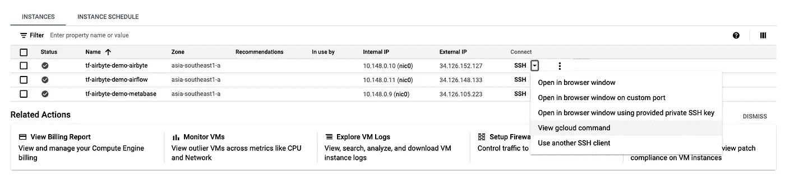
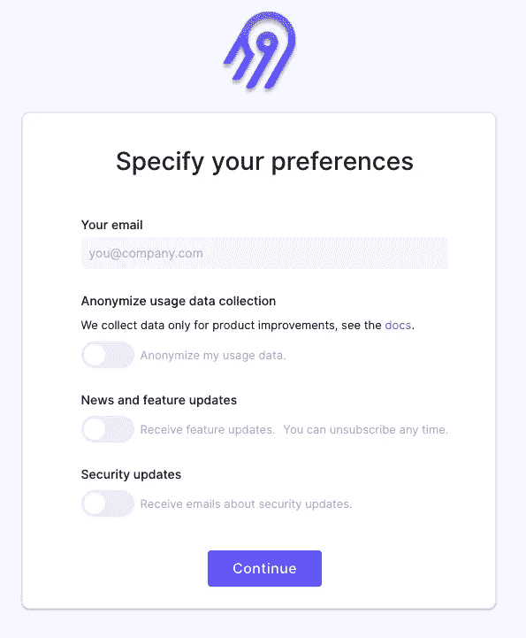
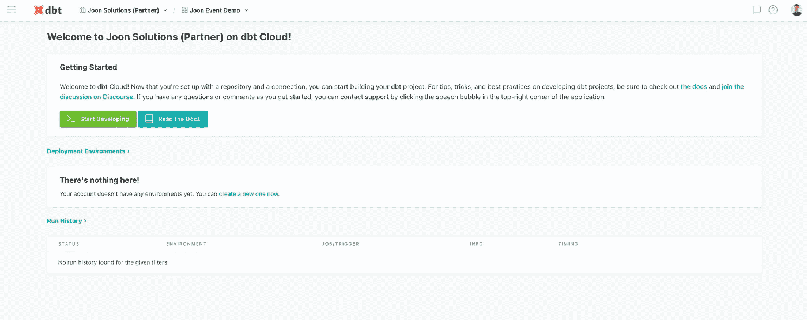
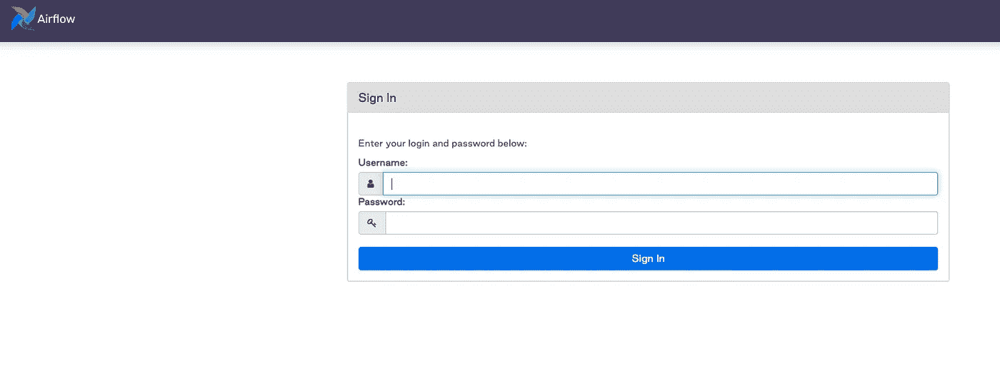
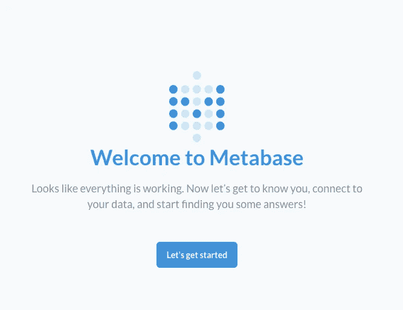

# 使用 Terraform 在 5 分钟内引导一个现代数据堆栈

> 原文：<https://towardsdatascience.com/bootstrap-a-modern-data-stack-in-5-minutes-with-terraform-32342ee10e79?source=collection_archive---------9----------------------->

## 设置 Airbyte、BigQuery、dbt、Metabase 以及使用 Terraform 运行现代数据堆栈所需的一切。



现代数据堆栈架构(图片由作者提供)

# 什么是现代数据堆栈

现代数据栈(MDS)是一系列技术的组合，使现代数据仓库的性能比传统数据仓库高 10-10000 倍。最终，MDS 节省了时间、金钱和精力。一个 MDS 的四大支柱是一个**数据连接器**，一个**云数据仓库**，一个**数据转换器**，一个 **BI &数据探索**工具。

**简单的** **集成**通过托管的&开源工具预构建数百个现成的连接器成为可能。过去需要数据工程师团队定期构建和维护的东西，现在可以用简单用例的工具来代替。像 **Stitch** 和 **Fivetran** 这样的托管解决方案，以及像 **Airbyte** 和 **Meltano** 这样的开源解决方案，正在让这一切成为现实。

由于其高性能和成本效益，使用基于云的柱状数据仓库已经成为最近的趋势。您可以从每月 100 美元(或更少)开始支付，而不是每年支付 10 万美元购买一个本地 MPP(大规模并行处理)数据库。云原生数据仓库据说比传统 OLTP 快 10 到 10000 倍。这一类的热门选项有 **BigQuery** 、**雪花**和**红移**。

在过去，由于技术的限制，在数据仓库中处理数据是一个瓶颈。结果，公司不得不倾向于 ETL 而不是 ELT 来减少数据仓库的工作量。然而，随着云原生数据仓库的发展，许多**数据仓库内转换工具**变得流行起来。这一类别中最值得注意的是 dbt(数据构建工具)和 Dataform。

**BI 工具**用于处理一些转换，以减少遗留数据仓库的工作量。然而，随着现代数据堆栈的出现，BI 工具的重点已经转移到(在我看来)民主化数据访问、自助服务和数据发现。一些我认为正朝着正确方向发展的工具是 **Looker** 、**元数据库**和**超集**。

# 我们的建筑

由于涉及许多不同的工具和流程，开始使用现代数据堆栈可能会令人望而生畏。本文旨在帮助您尽可能无缝地开始这一旅程。有许多准备步骤，但是一旦完成，只需要**五分钟**就可以启动所有资源。


现代数据堆栈架构(图片由作者提供)

我们将使用 **Terraform** ，一个基础设施即代码的开源工具来提供谷歌云中的一切。如果您遵循下面的说明，这里是将要创建的资源。

*   启用了必要 API 的谷歌云项目
*   摄取:运行 Airbyte 的 GCE 实例
*   仓库:大查询数据集
*   编排(可选):运行气流的 GCE 实例
*   BI 和数据发现:运行元数据库的 GCE 实例
*   不同服务的服务帐户及其 IAM 权限绑定

# 开始

## 创建一个 Google Cloud 帐户并启用计费

这个项目中的 Terraform 代码将与谷歌云平台进行交互。因此，我们创建 Google 帐户的第一步是[启用计费](https://cloud.google.com/billing/docs/how-to/modify-project)。请注意计费页面中具有以下格式的`billing ID`:`######-######-######`。在下一步中，您将需要这个值。

## 安装 Google Cloud CLI

按照这里的说明[为您各自的操作系统安装 Google Cloud SDK](https://cloud.google.com/sdk/docs/quickstart)。安装了`gcloud` CLI 后，在终端窗口中运行以下命令，并按照说明进行操作。这将让 Terraform 使用默认凭证进行身份验证。

```
gcloud auth application-default login
```

## 安装地形

按照这里的说明[在本地安装 Terraform CLI。之后运行以下命令检查您的安装:](https://learn.hashicorp.com/tutorials/terraform/install-cli)

```
terraform -v
```

您应该会看到类似这样的内容:

```
Terraform v1.0.0
on darwin_amd64
+ provider registry.terraform.io/hashicorp/google v3.71.0
```

## 在本地派生或克隆此回购

<https://github.com/tuanchris/modern-data-stack>  

您可以将此回购分支到您的帐户或克隆到您的本地机器。要克隆存储库，请运行以下命令:

```
git clone https://github.com/tuanchris/modern-data-stack
cd modern-data-stack
```

## 创建一个`terraform.tfvars`文件

用以下内容创建一个`terraform.tfvars`文件:

```
# The Billing ID from the first step
billing_id = ######-######-######
# The folder ID of where you want your project to be under
# Leave this blank if you use a personal account
folder_id  = ""
# The organization ID of where you want your project to be under
# Leave this blank if you use a personal account
org_id     = ""
# The project to create
project_id = ""
```

**警告**:这些被认为是敏感值。不要将该文件和`*.tfstate`文件提交给公共回购。

## 自定义`variables.tf`中的值

`variables.tf`中的变量将用于资源的配置。



作者图片

您可以通过更改变量为不同的服务定制机器类型。如果您不想使用任何服务，请在`gce.tf`文件中将其注释掉。

您还可以通过将源系统添加到源数据集字典来为源系统创建不同的数据集。

## 创建现代化的数据堆栈

最后，要在 Google Cloud 上提供所有这些资源，运行以下命令:

```
terraform apply
```



作者图片

研究终端中的输出，确保所有资源设置都是您想要的。键入`yes`并点击`enter`。

Terraform 将利用我们的现代数据堆栈创建一个谷歌云项目。整个过程大约需要 2-3 分钟。将服务安装到虚拟机实例上还需要 2-3 分钟。整个过程只需要 5 分钟或更少。

# 使用现代数据堆栈

## 检索不同服务的服务帐户



作者图片

谷歌建议不同的服务使用不同的服务账户。项目中的 terraform 代码为已经使用的不同技术创建了不同的帐户。若要检索特定服务的服务帐户，请运行以下命令:

```
terraform output [service_name]_sa_key
```

所有这些帐户的默认权限是`roles/bigquery.admin`。您可以在`iam.tf`文件中对此进行定制。

您得到的值是 base64 编码的。要将该值变回`JSON format`，运行以下命令:

```
echo "[value from the previous command]" | base64 -d
```

您可以使用 JSON 服务帐户来验证对项目资源的服务访问。

**警告**:任何拥有这个服务账号的人都可以访问你的项目。

## 使用 Airbyte 摄取数据

[Airbyte](https://airbyte.io/) 是一款优秀的开源数据集成工具。要访问 Airbyte UI，首先，获取 gcloud SSH 命令。



作者图片

你会得到一个类似这样的命令:`gcloud beta compute ssh --zone "asia-southeast1-a" "tf-airbyte-demo-airbyte" --project "tf-airbyte-demo"`。接下来，将以下内容添加到命令中，以在本地转发 Airbyte UI:`-- -L 8000:localhost:8000 -L 8001:localhost:8001 -N -f`。您的最终命令将如下所示:

```
gcloud beta compute ssh --zone "asia-southeast1-a" "tf-airbyte-demo-airbyte"  --project "tf-airbyte-demo" -- -L 8000:localhost:8000 -L 8001:localhost:8001 -N -f
```

**注意:**从 GCP UI 复制后，请务必删除换行符。

如果 Airbyte 实例已经完成启动，您可以通过浏览器访问`localhost:8000`来访问它。如果没有，请等待五分钟，让实例完成安装。



作者图片

现在，您可以集成您的数据源，使用`airbyte_sa_key`添加一个 BigQuery 目的地，并立即将您的数据放入 BigQuery 中。

您可以在虚拟机内部的`/airbyte/`访问 Airbyte 安装。

## 使用 dbt 模型数据

[dbt](https://www.getdbt.com) (数据构建工具)是一个使用 SQL 的强大的开源数据转换工具。它使数据分析师能够完成以前留给数据工程师的工作。它还帮助创建了一个全新的职位，称为分析工程师，是数据分析师和数据工程师的混合体。你可以在我的博客[这里](https://tuanchris.medium.com/become-an-analytics-engineer-in-90-days-759659d22ffd)阅读更多关于这个职位的信息。



作者图片

与 Airbyte、Airflow 和 Metabase 不同，运行 dbt 不需要服务器。你可以通过访问他们的[网站](https://www.getdbt.com/signup/)注册一个免费(永久)的单座账户。

## 利用气流协调工作流程

[Airflow](https://airflow.apache.org/) 是 Airbnb 打造的久经考验的工作流程编排工具。有了一个现代化的数据堆栈，希望你不需要经常使用气流。然而，在一些需要定制的情况下，气流可以成为你的首选工具。

要访问 UI，请使用 Airbyte 获得类似于上一节的 SSH 命令。使用以下命令进行端口转发:

```
gcloud beta compute ssh --zone "asia-southeast1-a" "tf-airbyte-demo-airflow"  --project "tf-airbyte-demo" -- -L 8080:localhost:8080 -N -f
```

现在你可以在`localhost:8080`访问气流装置。默认用户名&密码为`admin`和`admin`。



作者图片

您可以在虚拟机内部的`/airflow/`访问气流装置。

## 用元数据库可视化数据

[Metabase](https://www.metabase.com/) 是一个开源的数据可视化和发现工具。它超级用户友好，易于上手。

要访问元数据库 UI，请使用 Airbyte 获得类似于上述部分的 SSH 命令。然后，使用以下命令进行端口转发:

```
gcloud beta compute ssh --zone "asia-southeast1-a" "tf-airbyte-demo-metabase"  --project "tf-airbyte-demo" -- -L 3000:localhost:3000 -N -f
```



作者图片

# 打扫

为了避免任何不必要的开销，请确保通过运行。

```
terraform destroy
```

**警告:**这将删除项目中任何持久化的数据和资源。或者，您也可以关闭未使用的 GCE 来节省成本。

# 结论

我希望这篇文章能够帮助您更好地理解现代数据堆栈，并且/或者激励您开始这一旅程。

请随时向我寻求反馈/问题。

快乐学习！