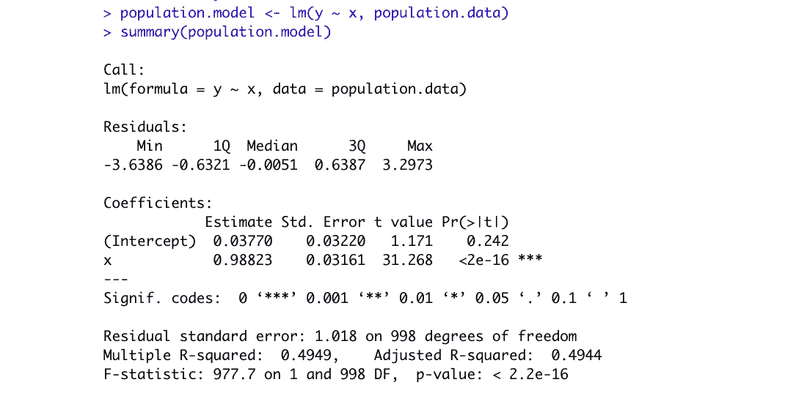

# R 中的自助回归

> 原文：<https://towardsdatascience.com/bootstrap-regression-in-r-98bfe4ff5007?source=collection_archive---------5----------------------->

## 回归系数的估计及其在 R 中的实现


安德鲁·雷德利在 [Unsplash](https://unsplash.com?utm_source=medium&utm_medium=referral) 上的照片

# 介绍

Bootstrap 是一种带替换的随机抽样方法。在它的其他应用中，如假设检验，它是检查回归系数稳定性的一种简单而有效的方法。在我们的[上一篇文章中，我们探讨了置换测试](/permutation-test-in-r-77d551a9f891)，这是一个相关的概念，但是没有替换。

线性回归依赖于几个假设，公式的系数可能在 CLT 下呈正态分布。它表明，平均来说，如果我们重复实验成千上万次，这条线将在置信区间内。
bootstrap 方法不依赖于这些假设*，而是简单地执行数千次估计。
*(请注意，bootstrap 方法不违反或绕过正态假设，但它不依赖于 CLT，而是建立自己的 Bootstrap 分布，这是渐近正态的)

在这篇文章中，我们将探讨 Bootstrapping 方法和估计回归系数的模拟数据使用 r。

# 数据集模拟

我们将模拟来自高斯分布的一个探索变量的数据集，以及通过向探索变量添加随机噪声而构建的一个响应变量。人口数据将有 1000 个观察值。

```
set.seed(2021)
n <- 1000
x <- rnorm(n)
y <- x + rnorm(n)population.data <- as.data.frame(cbind(x, y))
```

我们将从这些数据中抽取 20 个观察值作为样本。

```
sample.data <- population.data[sample(nrow(population.data), 20, replace = TRUE),]
```

# 简单回归模型

让我们探索一下人口和样本数据的简单回归模型:



人口模型


样本模型

我们可以看到，截距对于样本数据是有偏差的；然而，尽管我们的样本数据集中只有 20 个观察值，斜率却非常接近于总体值。样本模型的标准误差要高得多。

如果我们绘制模型，我们可以看到这些线有多接近:


# 自助方法

Bootstrap 方法提出了一个问题:如果我们用替换法对数据进行重新采样并估计系数，会有多极端？

这是一个 1000 次试验的简单循环，它从我们的样本数据集中用替换重新采样这 20 个观察值，运行回归模型并保存我们在那里得到的系数。最后，我们会有 1000 对系数。

我们将取这些系数的平均值，并将它们与我们先前获得的其他模型进行比较:


我们可以看到，在这个特定的例子中，截距更接近于总体模型，斜率与样本模型的精度水平大致相同。但是我们更感兴趣的是置信区间的精确度。


我们可以看到，精度几乎与样本模型相同，截距甚至更小。

# 图形表示

首先，自举表示法:


仅自举线

这是我们估计的 1000 条可能的回归线。现在，让我们添加图总体、样本和平均自举线:


总体、样本、自举线

我们可以看到，它们基本上以相同的方式获取数据。现在让我们添加样本数据的置信区间:


增加了置信区间

这就完成了我们的研究:我们可以得出结论，bootstrapping 方法返回了本质上相同的结果，但在统计学上是不同的。我们不依赖假设，而是使用强力方法模拟数据。当我们对数据的来源分布有疑问时，或者想要检查系数的稳定性时，特别是对于小数据集，这可能特别有用。

你可以在 GitHub 的找到完整的代码[。](https://github.com/serafimpetrov1/bootstrap/blob/main/BootReg.R)

# 结论

在本文中，我们探讨了估计回归系数的 bootstrap 方法。为了简单明了地展示这种强大的技术，我们使用了一个简单的回归模型。我们的结论是，这种方法基本上等同于 OLS 模型，但是不依赖于假设。这是一种估计系数不确定性的强有力的方法，可以与传统方法一起用来检查模型的稳定性。

# 感谢您的阅读！

在 [LinkedIn](https://www.linkedin.com/in/serafimpetrov/) 上连接