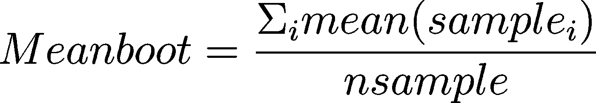
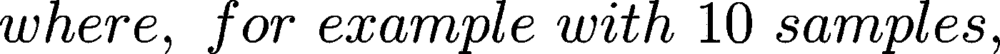
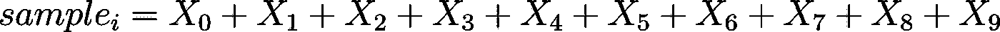
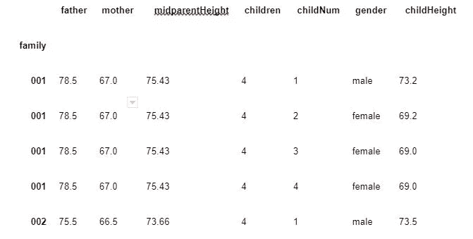
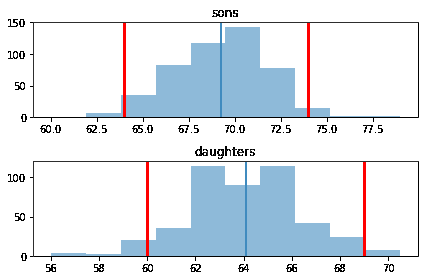
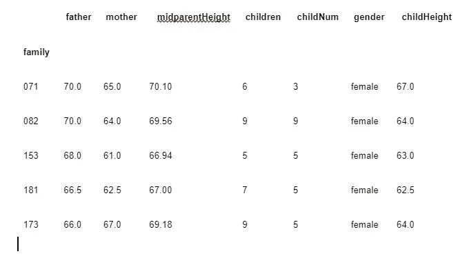
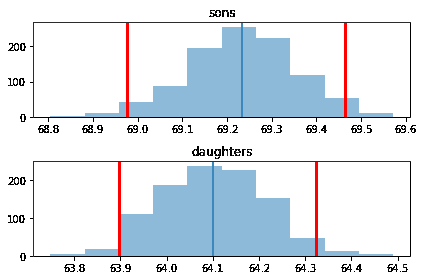
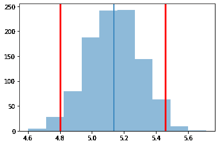
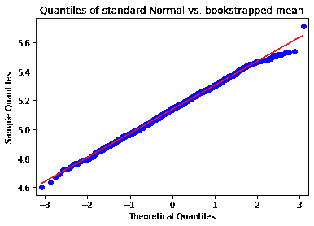

# 自举重采样

> 原文：<https://towardsdatascience.com/bootstrap-resampling-2b453bb036ec?source=collection_archive---------6----------------------->

## 简单，直接，方便。


替代数据尺寸|照片由[Rene b hmer](https://unsplash.com/@qrenep)拍摄

不，不是 Twitter Bootstrap——这种 Bootstrap 是一种数据采样的方式，最重要的是考虑数字的变化，分布的变化，分布的变化。为此，自举非常非常有效。对于数据科学家、机器学习工程师和统计学家来说，理解重采样方法至关重要。

但是为什么要使用重采样呢？我们使用重采样是因为我们只有有限的数据——至少可以说是时间和经济的限制。那么什么是重采样呢？重采样就是你取一个样本，然后你取这个样本的一个样本。你为什么要这么做？它可以让你看到有多少变化，它可以让你对你采集的样本有不同的理解。比方说，你想让 1000 人回答一项调查，但你只有 100 人。通过巧妙地对样本进行二次抽样，我们可以得到一个新的分布，我们将对样本的不确定性有所了解；我们进一步推测这与潜在人群的不确定性有关。

我们可以从数据集的多个子样本中计算统计数据，例如平均值。我们取一堆这样的物品，把它们加起来，然后除以物品的数量。自举重采样的技巧是用替换进行**采样。**

在 Python 中，通常在采样函数的采样代码中会有一个采样参数的布尔自变量。该布尔标志将为*替换=真*或*替换=假*。如果您有 100 个项目，随机抽样(例如，伯努利抽样)样本-记录它，并将该值替换回样本池。然后冲洗，再重复 99 次。这个子样本总体很可能是不同的。它们将具有原始 100 个值的不同比例。在大多数情况下，这些值会非常均匀地分布，但并不完美。然后重复该过程总共 10 次，以产生 1000 个样本。请注意，偶尔会发生一些奇怪的事情，例如，如果您的数据只有一个唯一的 X 值，那么您可以随机对 100 个包含 5 个 X 值的值进行二次抽样，尽管抽样总体只有一个值，但这种可能性不大，因为存在替换抽样。

对于这些样本中的每一个，我们可以计算平均值。然后我们可以看看这些平均值的分布。或者我们可以看看这些平均值。这些平均值应该非常接近总体平均值，并且应该非常接近更大样本的平均值。你可以对其他指标做同样的事情，比如标准差。自举是一种非常强大的技术，它允许你用另一种方法获得测量的不确定性。因为当你取这些值时，当你得到平均值时，所有子样本平均值的变化会告诉我们，你的样本相对于真实潜在人群的不确定性。

# 自助益处

Bootstrap 和重采样是广泛适用的统计方法，放宽了经典统计学的许多假设。重采样方法隐含地借鉴了[中心极限定理，正如我在之前的文章](https://medium.com/swlh/on-the-importance-of-the-central-limit-theorem-e8cce1f4d253)中所解释的。特别是自举(和其他重采样方法):

*   允许根据有限的数据计算统计数据。
*   允许我们从数据集的多个子样本中计算统计数据。
*   允许我们做最小的分布假设。

常用的重采样方法包括:

*   随机化或排列方法(如 Fisher 精确检验)。早在 1911 年，费希尔就开创了随机化和排列方法。费希尔在他 1935 年的书中充分发展了这一理论。即使使用现代计算机，这些方法的可扩展性仍然有限。
*   交叉验证:重新取样折叠而不替换。交叉验证最初是由 Kurtz 在 1948 年提出的，现在广泛用于测试机器学习模型。
*   刀切:留一个重采样。Maurice Quenouille 最初在 1949 年提出了这种方法。折叠刀是由约翰·w·图基在 1958 年完全发展起来的，他给这种方法起了名字:这种方法是一种简单的工具，像小刀一样有多种用途。
*   Bootstrap:用相等的大小和替换重新取样。bootstrap 方法首先由 Efron 和 Hinkley 在 1978 年提出，并在 1979 年由 Efron 进一步发展。

# 引导概述

我们将自举平均值计算为:



# 引导示例

为了展示 bootstrap 的威力，我将在 Jupyter 笔记本上分析来自 [Galton 的身高数据集](https://dataverse.harvard.edu/dataset.xhtml?persistentId=doi:10.7910/DVN/T0HSJ1)的不同人群的身高均值；以给我们一句“回归均值”w/r 到儿童身高而闻名。下面是一个参数自助估计的例子——参数，因为我们的模型有一个参数，均值，我们试图估计。

我将用一个例子来说明:

```
import pandas as pd
import numpy as np
from matplotlib import pyplot as plt
import seaborn as sns%matplotlib inline
```

导入基本库

```
# i imported the dataset from here, and called file_name
galton-families = pd.read_csv(file_name, index_col=0)
galton-families.head()
```

检查数据是否导入良好。



现在，我将按性别划分数据帧的子集，以获得数据集中男性和女性的数量。这将创建两个数据集，一个叫男性，一个叫女性。男性实际上是儿子，女性实际上是女儿。

```
male = galton-families[galton-families.gender == ‘male’]
female = galton-families[galton-families.gender == ‘female’]len(male), len(female)
(481, 453)
```

在这个数据集中，481 名男性，453 名女性看起来相当平衡。以下代码显示了这些分布中的最小值和最大值:

```
print(families.childHeight.min())
families.childHeight.max()
56.0
Out[11]: 79.0
```

它们从 56 英寸到 79 英寸不等。接下来要做的是绘制这两个直方图:

```
def plot_hist(x, p=5):
 # Plot the distribution and mark the mean
 plt.hist(x, alpha=.5)
 plt.axvline(x.mean())
 # 95% confidence interval 
 plt.axvline(np.percentile(x, p/2.), color=’red’, linewidth=3)
 plt.axvline(np.percentile(x, 100-p/2.), color=’red’, linewidth=3)

def plot_dists(a, b, nbins, a_label=’pop_A’, b_label=’pop_B’, p=5):
 # Create a single sequence of bins to be shared across both
 # distribution plots for visualization consistency.
 combined = pd.concat([a, b])
 breaks = np.linspace(
 combined.min(), 
 combined.max(), 
 num=nbins+1) plt.subplot(2, 1, 1)
 plot_hist(a)
 plt.title(a_label)

 plt.subplot(2, 1, 2)
 plot_hist(b)
 plt.title(b_label)

 plt.tight_layout() plot_dists(male.childHeight, female.childHeight, 20, a_label=’sons’, b_label=’daughters’)
plt.show()
```



这里需要注意的重要一点是，儿子和女儿之间有明显的重叠。你可以看到一些女儿实际上比儿子的平均身高要高。总的来说，我们可以看到女儿比儿子小，但这有意义吗？

我上一篇关于 CLT 的文章非常清楚地展示了如何区分这两种发行版。这看起来像是两个不同的发行版。然而，我们实际上可以说，儿子的分布与女儿的分布并没有太大的不同，因为用这些红色竖线表示的 95%的置信水平与平均值有些重叠。

# 自举手段

自助救援。我们将从样品中重新取样。Pandas 内置了从给定数据帧生成引导样本的支持。我将使用两个数据帧的`sample()`方法来绘制一个引导示例，如下所示:

```
female.sample(frac=1, replace=True).head()
```



注意:使用 replace equals true 参数，您可能会多次获得同一行，或者根本不会对某些行进行采样。

上述从高尔顿数据集采样的所有子代样本具有以下平均值:

```
female.sample(frac=1, replace=True).father.mean()
69.0664459161148
```

这个女性数据框架的自举样本有 453 个女儿，平均身高为 69.1 英寸。

现在，我们将采用许多`(*n_replicas*)` bootstrap 样本，并绘制样本均值的分布，以及样本均值。在下面的代码中，我们引导 1000 个子样本，每个样本的原始数据帧大小为 481 和 453。

```
n_replicas = 1000female_bootstrap_means = pd.Series([
 female.sample(frac=1, replace=True).childHeight.mean()
 for i in range(n_replicas)])male_bootstrap_means = pd.Series([
 male.sample(frac=1, replace=True).childHeight.mean()
 for i in range(n_replicas)])plot_dists(male_bootstrap_means, female_bootstrap_means, 
 nbins=80, a_label=’sons’, b_label=’daughters’)
plt.show()
```



自举平均值的分布完全不重叠！这证明了**差异是显著的**。

# 自举手段的差异

在下面的单元格中，我将展示如何从完整的男性+女性数据集生成引导样本，然后计算每个样本的男性和女性子女身高的均值差异，生成样本均值差异的分布。

```
diffs = []
for i in range(n_replicas):
 sample = families.sample(frac=1.0, replace=True)
 male_sample_mean = sample[sample.gender == ‘male’].childHeight.mean()
 female_sample_mean = sample[sample.gender == ‘female’].childHeight.mean()
 diffs.append(male_sample_mean — female_sample_mean)
diffs = pd.Series(diffs)plot_hist(diffs)
```



平均值中**差的分布远离零**。像以前一样，我们可以推断两个群体的平均值**显著不同**——这是为了数据集的目的，也就是说儿子和女儿确实有不同的平均身高。换句话说:置信区间不跨越零，因为它不跨越零，我们确信差异是显著的。蓝线表示来自 bootstrap 样本的儿子和女儿之间的平均差异约为 5.1 英寸，其中我们有 95%的信心，真实的人口平均差异在 4.8 英寸和约 5.5 英寸之间。这就是答案——平均来说，儿子比女儿高 5.5 英寸。

然而，我们必须验证均值差异的分布是正态的，正如 CLT 所暗示的那样。如果数据不是正态分布，那么我们不能相信 95%置信区间:

```
import statsmodels.api as sm
fig = sm.qqplot(diffs, line=’s’)
plt.title(‘Quantiles of standard Normal vs. bookstrapped mean’)
plt.show()
```



Q-Q 正态图上的点几乎在一条直线上。显然，均值差异的 bootstrap 分布确实符合 CLT，这使得我们可以相信通过 bootstrap 对原始数据集进行重采样得到的统计数据。

# 结论

该分析的结果证明了工具重采样对于数据科学家或机器学习工程师是多么有用。Bootstrap 不是唯一的重采样方法，有几种方法，但在 IMO 看来，它是生产模型的最佳方法，因为它对父分布做了最少的假设，并且可以很好地在许多语言和包中实现。如果没有用正确的上下文正确地处理和分析数据，数据是没有用的。正如马克·吐温的名言，“有谎言，该死的谎言，和统计数据。”

请继续，我将在[贝叶斯统计](/bayesian-statistics-11f225174d5a)和[中使用 bootstrap 和回归模型](/linear-regression-with-bootstrapping-4924c05d2a9)构建这些概念。

在 [Linkedin](https://www.linkedin.com/in/james-a-w-godwin/) 上找到我

*物理学家兼数据科学家——适用于新机遇| SaaS |体育|初创企业|扩大规模*