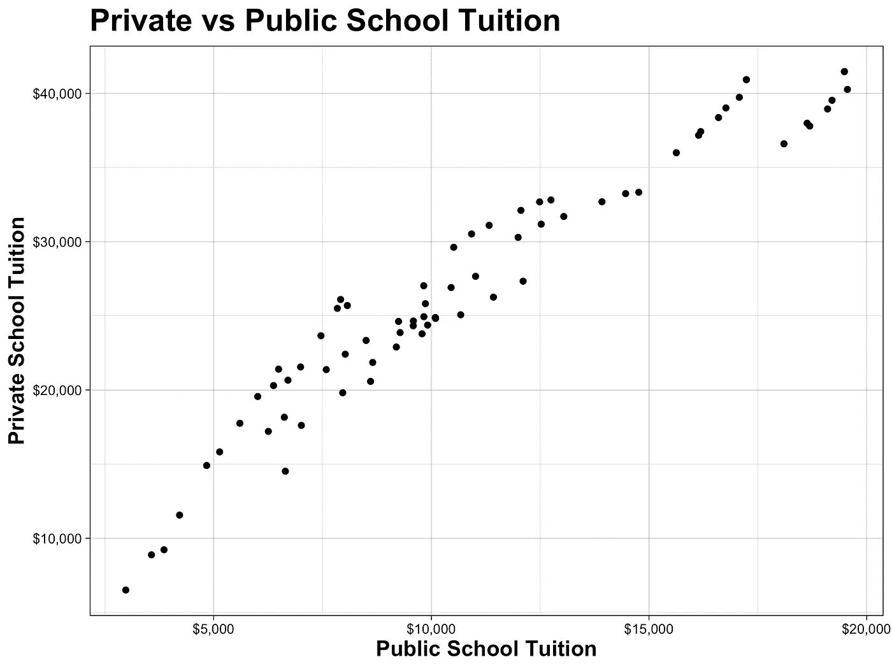
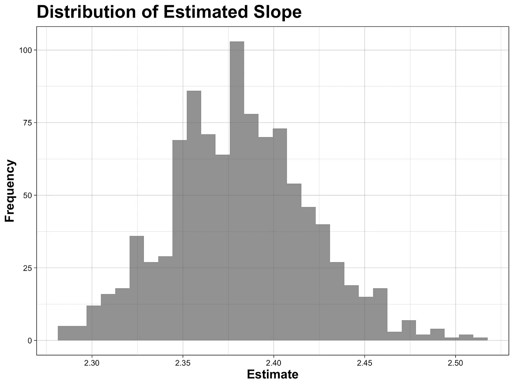
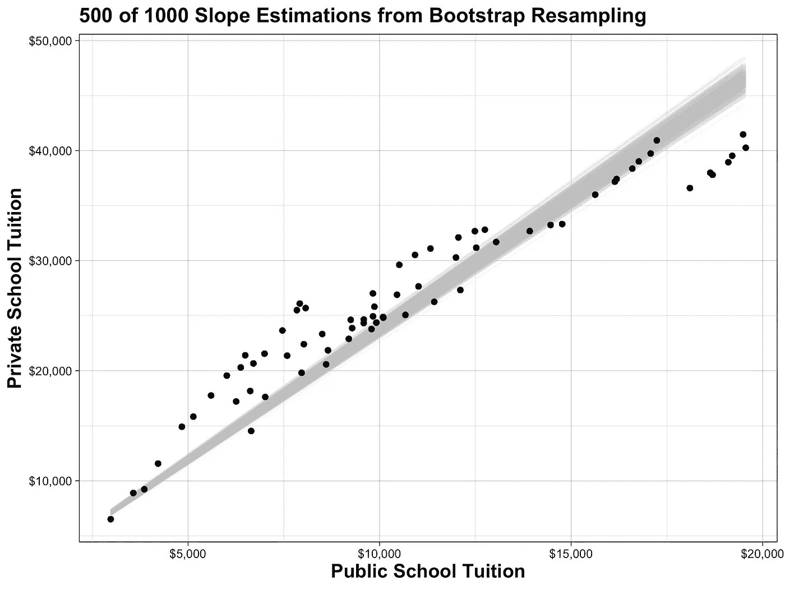

# R 中的自举抽样

> 原文：<https://towardsdatascience.com/bootstrap-sampling-in-r-a7bc9d3ca14a?source=collection_archive---------11----------------------->

## 探索公立和私立学校的学费差异

Bootstrapping 使用带替换的随机抽样来估计样本的统计数据。通过对此样本进行重采样，我们可以生成能够代表总体的新数据。这大致基于大数定律。我们可以对统计数据进行多次估计，而不是对一个小样本的统计数据进行一次估计。因此，如果我们用替换重新采样 10 次，我们将计算 10 次期望统计的估计。

引导过程如下:

1.  用替换 *n* 次重新采样数据
2.  计算期望的统计数据 *n* 次，以生成估计统计数据的分布
3.  从自举分布中确定自举统计量的标准误差/置信区间

在本文中，我将演示如何使用 [TidyTuesday](https://github.com/rfordatascience/tidytuesday/blob/master/data/2020/2020-03-10/readme.md) 的历史学费数据集执行 bootstrap 重采样来估计私立和公立大学的学费成本之间的关系。

首先，我们从 GitHub 加载数据。

```
library(tidyverse)
library(tidymodels)historical_tuition <- readr::read_csv('[https://raw.githubusercontent.com/rfordatascience/tidytuesday/master/data/2020/2020-03-10/historical_tuition.csv'](https://raw.githubusercontent.com/rfordatascience/tidytuesday/master/data/2020/2020-03-10/historical_tuition.csv'))# A tibble: 6 x 4
  type             year    tuition_type    tuition_cost
  <chr>            <chr>   <chr>                  <dbl>
1 All Institutions 1985-86 All Constant           10893
2 All Institutions 1985-86 4 Year Constant        12274
3 All Institutions 1985-86 2 Year Constant         7508
4 All Institutions 1985-86 All Current             4885
5 All Institutions 1985-86 4 Year Current          5504
6 All Institutions 1985-86 2 Year Current          3367
```

目前，数据是长格式的，每行代表一个观察值。每年都有多个观察值，代表每种机构类型的数据:公立、私立、所有机构。为了利用数据进行重采样，我们需要将数据转换为宽格式，其中一列包含私立学校的学费，另一列包含公立学校的学费。这种宽格式中的每一行代表特定年份的历史学费。下面是将长格式数据转换为更宽格式的代码。我们将对建模感兴趣的列是`public`和`private`，它们代表由列`year`给出的特定学年公立和私立学校的学费。

```
tuition_df <- historical_tuition %>% 
  pivot_wider(names_from = type,
              values_from = tuition_cost
              ) %>%
  na.omit() %>% 
  janitor::clean_names()# A tibble: 25 x 5
   year    tuition_type    all_institutions public private
   <chr>   <chr>                      <dbl>  <dbl>   <dbl>
 1 1985-86 All Constant               10893   7964   19812
 2 1985-86 4 Year Constant            12274   8604   20578
 3 1985-86 2 Year Constant             7508   6647   14521
 4 1985-86 All Current                 4885   3571    8885
 5 1985-86 4 Year Current              5504   3859    9228
 6 1985-86 2 Year Current              3367   2981    6512
 7 1995-96 All Constant               13822   9825   27027
 8 1995-96 4 Year Constant            16224  11016   27661
 9 1995-96 2 Year Constant             7421   6623   18161
10 1995-96 All Current                 8800   6256   17208
```

有了这种更宽格式的数据，我们可以很快直观地了解私立和公立学校学费之间的关系。

```
tuition_df %>% 
  ggplot(aes(public, private))+
  geom_point()+
  scale_y_continuous(labels=scales::dollar_format())+
  scale_x_continuous(labels=scales::dollar_format())+
  ggtitle("Private vs Public School Tuition")+
  xlab("Public School Tuition")+
  ylab("Private School Tuition")+
  theme_linedraw()+
  theme(axis.title=element_text(size=14,face="bold"),
        plot.title = element_text(size = 20, face = "bold"))
```

私立学校和公立学校的学费之间似乎存在直接的正相关关系。一般来说，私立学校比公立学校花费更多。我们现在将从数量上来看。



作者图片

我们可以对数据进行线性拟合，以确定私立学校和公立学校学费之间的关系。我们可以通过 r 中的`lm`函数来实现这一点。我们可以看到斜率估计为 2.38。公立学校每花费 1 美元的学费，私立学校预计要多支付 2.38 倍。

```
tuition_fit <- lm(private ~ 0 + public,
               data = tuition_df)# We tidy the results of the fit
tidy(tuition_fit)# A tibble: 1 x 5
  term   estimate std.error statistic  p.value
  <chr>     <dbl>     <dbl>     <dbl>    <dbl>
1 public     2.38    0.0346      68.7 1.05e-66
```

现在，我们将使用重采样来尝试更好地估计公立和私立学校学费之间的关系。使用自举，我们将随机绘制替换以从原始数据集创建与原始数据集大小相同的新数据集。这实质上模拟了从原始数据集生成新的数据集。我们将对数据重新采样 1000 次。

```
# Set set.seed a starting number to generate a sequence of random numbers so that we can get reproducible results
set.seed(123)
tution_boot <- bootstraps(tuition_df,
                          times = 1e3,
                          apparent = TRUE)
```

接下来，我们将对 1000 次重新采样拟合一个线性模型。这些结果将存储在一个名为`model`的新列中，统计数据将存储在一个名为`conf_inf`的列中。然后，我们将对结果进行去嵌套，以提取估计的统计数据(直线的斜率)、误差和 p 值。

```
tuition_models <- tution_boot %>% 
  mutate(model = map(splits, ~lm(private ~ 0 + public,
               data = .) ),
         coef_inf = map(model, tidy))tuition_coefs <- tuition_models %>% 
  unnest(coef_inf)splits          id            model  term   estimate std.error statistic  p.value
   <list>          <chr>         <list> <chr>     <dbl>     <dbl>     <dbl>    <dbl>
 1 <split [72/25]> Bootstrap0001 <lm>   public     2.37    0.0354      66.7 8.41e-66
 2 <split [72/28]> Bootstrap0002 <lm>   public     2.38    0.0353      67.4 4.30e-66
 3 <split [72/23]> Bootstrap0003 <lm>   public     2.36    0.0365      64.9 6.19e-65
 4 <split [72/25]> Bootstrap0004 <lm>   public     2.30    0.0328      70.1 2.67e-67
 5 <split [72/25]> Bootstrap0005 <lm>   public     2.35    0.0364      64.7 7.15e-65
 6 <split [72/26]> Bootstrap0006 <lm>   public     2.36    0.0344      68.5 1.31e-66
 7 <split [72/25]> Bootstrap0007 <lm>   public     2.33    0.0299      77.9 1.61e-70
 8 <split [72/23]> Bootstrap0008 <lm>   public     2.34    0.0368      63.5 2.60e-64
 9 <split [72/21]> Bootstrap0009 <lm>   public     2.41    0.0349      68.9 8.70e-67
10 <split [72/26]> Bootstrap0010 <lm>   public     2.39    0.0334      71.6 6.00e-68
# … with 991 more rows
```

我们现在有 1000 个估计值，这些估计值是通过重新采样获得的，存储在`estimate`列中的是私立学校和公立学校的学费之间的关系。现在的问题是，私立和公立学校学费之间的估计斜率的分布是什么？

```
tuition_coefs %>% 
  ggplot(aes(estimate))+
  geom_histogram(alpha = .7)+
  ggtitle("Distribution of Estimated Slope")+
  xlab("Estimate")+
  ylab("Frequency")+
  theme_linedraw()+
  theme(axis.title=element_text(size=14,face="bold"),
        plot.title = element_text(size = 20, face = "bold"))
```

我们可以看到分布呈正态分布，我们可以感受到它有多宽。从数字上看，我们可以把这种分布的描述列表如下。



作者图片

```
int_pctl(tuition_models,
         coef_inf)# A tibble: 1 x 6
  term   .lower .estimate .upper .alpha .method   
  <chr>   <dbl>     <dbl>  <dbl>  <dbl> <chr>     
1 public   2.31      2.38   2.46   0.05 percentile
```

我们可以看到，通过 bootstrapping，描述私立和公立学校学费之间关系的估计斜率约为 2.38，与我们在没有 bootstrapping 的情况下获得的结果相似。这可能是因为公立和私立学校之间的潜在关系是线性的，并且线性模型的潜在假设适用于该数据集。线性回归的基本假设是:

*   变量之间的基本关系是线性的
*   误差通常是分布的
*   最佳拟合线周围有相等的方差(误差的同方差)
*   观察是独立的

此外，通过 bootstrapping，我们还可以获得关系的上下限，这是我们在未采样数据上仅使用线性模型时所没有的。

最后，我们可以可视化从自举样本中计算出的各种估计值。

```
tuition_aug <- tuition_models %>% 
  # Sample only 200 bootstraps for visualization
  sample_n(200) %>% 
  mutate(augmented = map(model, augment)) %>% 
  unnest(augmented)tuition_aug %>% 
  ggplot(aes(public, private))+
  geom_line(aes(y = .fitted, group = id), alpha = .1, color = 'grey')+
  geom_point()+
  scale_y_continuous(labels=scales::dollar_format())+
  scale_x_continuous(labels=scales::dollar_format())+
  ggtitle("200 of 1000 Slope Estimations from Bootstrap Resampling")+
  xlab("Public School Tuition")+
  ylab("Private School Tuition")+
  theme_linedraw()+
  theme(axis.title=element_text(size=14,face="bold"),
        plot.title = element_text(size = 20, face = "bold"))
```



作者图片

总之，这篇博客演示了如何使用 R 中的 bootstrap 重采样来确定私立学校和公立学校学费之间的关系。这种技术使用随机抽样来估计几乎任何统计数据的抽样分布。