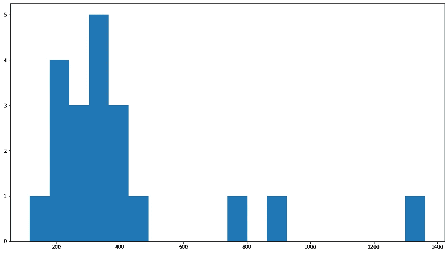
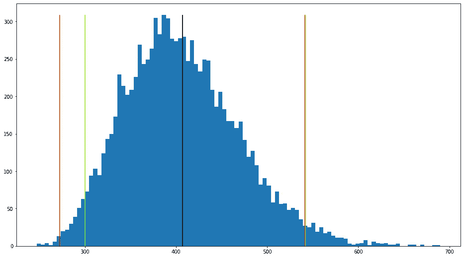
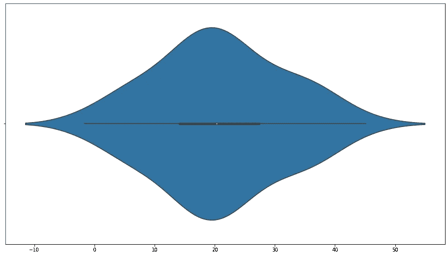
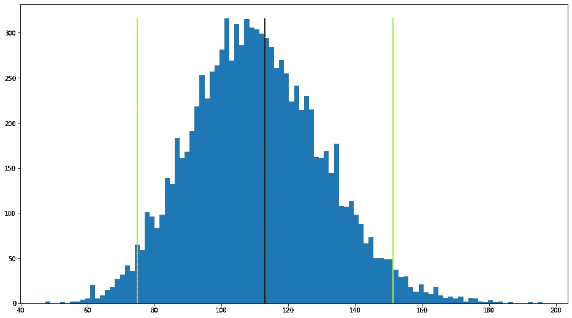
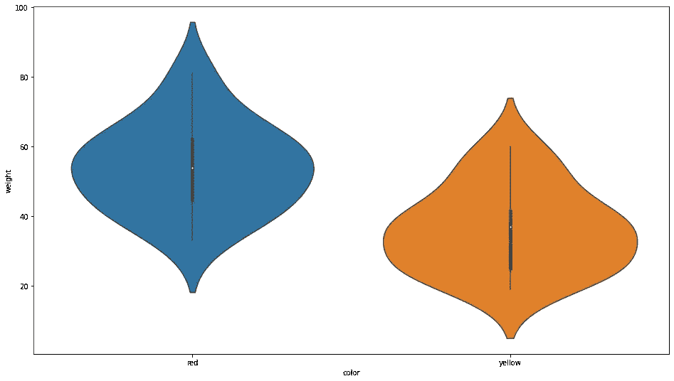
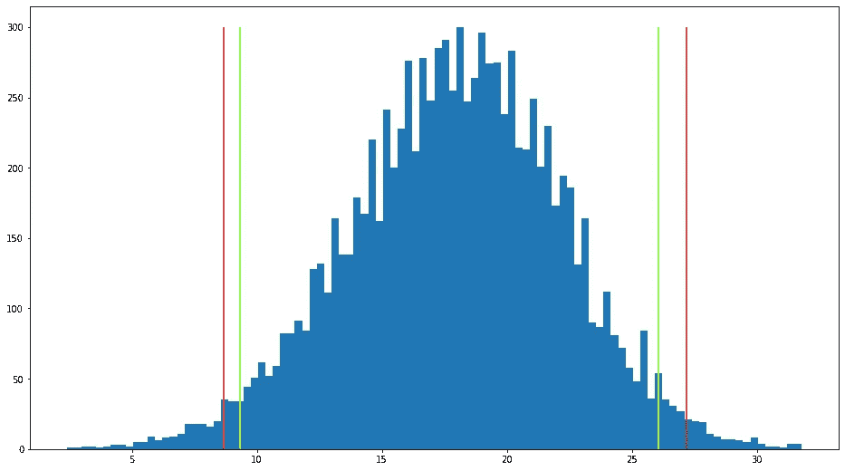
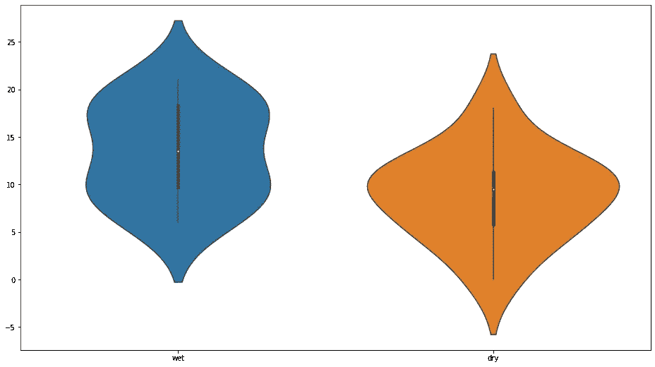
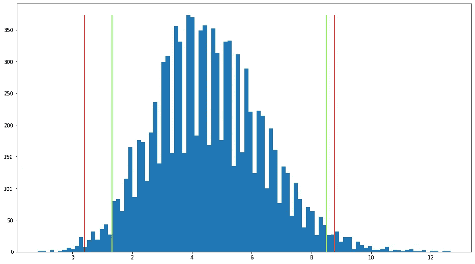

# 自助统计——如何解决简单统计测试的局限性

> 原文：<https://towardsdatascience.com/bootstrap-statistics-how-to-work-around-limitations-of-simple-statistical-tests-13180a301efd?source=collection_archive---------13----------------------->

## [入门](https://towardsdatascience.com/tagged/getting-started)

你有一个数据样本。由此，您需要计算总体平均值的置信区间。你首先想到的是什么？通常是 t 检验。

但是 t 检验有几个要求，其中之一是均值的抽样分布接近正态(要么总体是正态的，要么样本相当大)。在实践中，这并不总是正确的，因此 t 检验可能并不总是提供最佳结果。

要解决这种限制，请使用 bootstrap 方法。它只有一个重要的要求:样本足够接近总体。常态不是必须的。

我们先来试试 t 检验，然后再和 bootstrap 法对比。

# 均值置信区间的单样本检验

让我们首先加载我们需要的所有库:

```
from sklearn.utils import resample
import pandas as pd
from matplotlib import pyplot as plt
import pingouin as pg
import numpy as np
import seaborn as snsnp.random.seed(42)
plt.rcParams["figure.figsize"] = (16, 9)
```

*注意:我们在这里使用 Pingouin 库进行一些统计测试。这很棒，因为许多重要的技术都在同一个屋檐下，有统一的接口和语法。试试看:*

【https://pingouin-stats.org/ 

现在回到主题，这是一个例子:

```
spl = [117, 203, 243, 197, 217, 224, 279, 301, 317, 307, 324, 357, 364, 382, 413, 427, 490, 742, 873, 1361]
plt.hist(spl, bins=20);
```



你可以假装这看起来很正常，但它有几个大的异常值，这是 t 检验不能容忍的。尽管如此，让我们对总体均值的 95%置信区间进行 t 检验:

```
pgtt = pg.ttest(spl, 0)
print(pgtt['CI95%'][0])[272.34 541.46]
```

这是一个非常宽的区间，反映了样本中值的分布。我们能做得更好吗？答案是肯定的，用自举法。

# 引导程序

如果样本更大，或者可以从同一人群中提取多个样本，结果会更好。但这在这里是不可能的——这是我们仅有的样本。

然而，如果我们假设样本非常接近总体，我们可以假装从总体中生成多个伪样本:我们真正做的是获取这个样本并对其进行*重采样*——使用相同的值生成相同大小的多个样本。然后我们处理生成的样本集。

你制作的伪样本数量需要很大，通常是数千个。

由于我们从原始样本生成的样本与原始样本的大小相同，因此一些值将在每个伪样本中重复。那很好。

# 平均值的 CI

让我们从原始样本中生成一万个重采样数据块:

```
B = 10000
rs = np.zeros((B, len(spl)), dtype=np.int)
for i in range(B):
    rs[i,] = resample(spl, replace = True)
print(rs)[[ 279 1361  413 ...  357  357  490]
 [ 307  427  413 ...  317  203 1361]
 [ 413  279  357 ...  357  203  307]
 ...
 [ 217  243  224 ...  279  490 1361]
 [ 301  324  224 ...  224  317  317]
 [ 324  301  364 ...  873  364  203]]
```

数组中的每一行都是重新采样的块，与原始样本大小相同。总共有 10k 线。

现在，让我们构建 bootstrap 分布:对于每条线，计算平均值:

```
bd = np.mean(rs, axis=1)
print(bd)[376.35 515.15 342.75 ... 507.8  426.15 377.05]
```

bootstrap 分布包含每个重新采样的数据块的平均值。从这里很容易得到均值的 95%置信区间:只需对 bootstrap 分布数组(均值)进行排序，截掉顶部和底部的 2.5%，读取剩余的极值:

```
bootci = np.percentile(bd, (2.5, 97.5))
print(bootci)[300.0975 541.705]
```

这就是平均值的 bootstrap 95%置信区间。它与 t 检验置信区间相比如何？

```
y, x, _ = plt.hist(bd, bins=100)
ymax = y.max()
plt.vlines(pgtt['CI95%'][0], 0, ymax, colors = 'red')
plt.vlines(bootci, 0, ymax, colors = 'chartreuse')
plt.vlines(np.mean(spl), 0, ymax, colors = 'black')
plt.show();
```



bootstrap CI(绿色)比 t-test CI(红色)更窄一些。

# 中值 CI

您也可以使用 bootstrap 为中值生成 CI:只需使用 np.median()而不是 np.mean()构建 bootstrap 分布:

```
bd = np.median(rs, axis = 1)
bootci = np.percentile(bd, (5, 95))
print(bootci)[279\. 382.]
```

# 差异 CI

让我们从已知方差(var=100)的正态总体中抽取一个样本:

```
sp = np.random.normal(loc=20, scale=10, size=50)
sns.violinplot(x=sp);
```



我们样本的方差确实接近 100:

```
print(np.var(sp))112.88909322502681
```

让我们使用 bootstrap 从现有样本中提取总体方差的置信区间。同样的想法:对数据进行多次重采样，计算每个重采样块的方差，得到方差列表的百分比区间。

```
rs = np.zeros((B, len(sp)), dtype=np.float)
for i in range(B):
    rs[i,] = resample(sp, replace=True)
bd = np.var(rs, axis=1)
bootci = np.percentile(bd, (2.5, 97.5))
print(bootci)[74.91889462 151.31601521]
```

还不错；间隔足够窄，并且它包括总体方差的真值(100)。这是来自 bootstrap 分布的方差直方图:

```
y, x, _ = plt.hist(bd, bins=100)
ymax = y.max()
plt.vlines(bootci, 0, ymax, colors = 'chartreuse')
plt.vlines(np.var(sp), 0, ymax, colors = 'black')
plt.show();
```



# 两样本均值差，不成对

以下是两个李子样品的重量，按颜色分组:

[https://raw . githubusercontent . com/FlorinAndrei/misc/master/plum data . CSV](https://raw.githubusercontent.com/FlorinAndrei/misc/master/plumdata.csv)

```
plumdata = pd.read_csv('plumdata.csv', index_col=0)
sns.violinplot(x='color', y='weight', data=plumdata);
```



这两种颜色的平均重量不同吗？换句话说，平均权重差异的置信区间是多少？我们先来试试经典的 t 检验:

```
plum_red = plumdata['weight'][plumdata['color'] == 'red'].values
plum_yel = plumdata['weight'][plumdata['color'] == 'yellow'].values
plumtt = pg.ttest(plum_red, plum_yel)
print(plumtt['CI95%'][0])[8.67 27.2]
```

t 检验说—是的，在 95%的置信度下，红色李子的平均重量不同于黄色李子的平均重量(CI 不包括 0)。

对于 bootstrap，我们将对两个样本进行 10k 次重采样，计算每个重采样块的平均值，进行 10k 次平均值的差值，并查看平均值分布差值的 2.5 / 97.5 个百分点。

这是重新采样的数据:

```
plzip = np.array(list(zip(plum_red, plum_yel)), dtype=np.int)
rs = np.zeros((B, plzip.shape[0], plzip.shape[1]), dtype=np.int)
for i in range(B):
    rs[i,] = resample(plzip, replace = True)
print(rs.shape)(10000, 15, 2)
```

10000 是重采样的次数，15 是每个重采样的长度，每种情况下我们比较 2 个样本。

让我们计算每个重采样块的平均值:

```
bd_init = np.mean(rs, axis=1)
print(bd_init.shape)(10000, 2)
```

bootstrap 分布是 10000 个重采样案例中每一个案例的平均值的差(红色平均值减去黄色平均值):

```
bd = bd_init[:, 0] - bd_init[:, 1]
print(bd.shape)(10000,)print(bd)[12.33333333 21\.         10.33333333 ... 21.46666667 11.66666667
 17.06666667]
```

现在我们可以从 bootstrap 分布中获得均值差异的 CI:

```
bootci = np.percentile(bd, (2.5, 97.5))
print(bootci)[9.33333333 26.06666667]
```

bootstrap 再次提供了比 t-test 更紧密的间隔:

```
y, x, _ = plt.hist(bd, bins=100)
ymax = y.max()
plt.vlines(plumtt['CI95%'][0], 0, ymax, colors = 'red')
plt.vlines(bootci, 0, ymax, colors = 'chartreuse')
plt.show();
```



# 两样本差异均值，成对

以下是配对数据——几种品牌的绳索在潮湿或干燥条件下的强度:

[https://raw . githubusercontent . com/FlorinAndrei/misc/master/strength . CSV](https://raw.githubusercontent.com/FlorinAndrei/misc/master/strength.csv)

```
strength = pd.read_csv('strength.csv', index_col=0)
sns.violinplot(data=strength);
```



这些数据是否足以得出结论，干湿条件会影响绳索的强度？让我们计算一个 95%置信区间的平均强度差异，湿与干。首先，t 检验:

```
s_wet = strength['wet']
s_dry = strength['dry']
s_diff = s_wet.values - s_dry.values
strengthtt = pg.ttest(s_wet, s_dry, paired=True)
print(strengthtt['CI95%'][0])[0.4  8.77]
```

t 检验表明，在 95%的置信度下，潮湿/干燥条件确实产生了统计上的显著差异——但几乎没有。CI 的一端接近 0。

现在，让我们为同一个配置项进行引导。我们可以简单地取 s_diff(每根绳子的强度差异)，然后回到单样本自举程序:

```
rs = np.zeros((B, len(s_diff)), dtype=np.int)
for i in range(B):
    rs[i,] = resample(s_diff, replace = True)
bd = np.mean(rs, axis=1)
bootci = np.percentile(bd, (2.5, 97.5))
print(bootci)[1.33333333 8.5]
```

t 检验和 bootstrap 都同意，当条件不同时，强度不同，这在统计上有显著差异(95%的置信度)。自举自信一点(区间更窄，离 0 更远)。

```
y, x, _ = plt.hist(bd, bins=100)
ymax = y.max()
plt.vlines(strengthtt['CI95%'][0], 0, ymax, colors = 'red')
plt.vlines(bootci, 0, ymax, colors = 'chartreuse')
plt.show();
```



带代码的笔记本:

[https://github . com/FlorinAndrei/misc/blob/master/bootstrap _ plain . ipynb](https://github.com/FlorinAndrei/misc/blob/master/bootstrap_plain.ipynb)

# 最后的想法

这只是基本的自举技术。它不执行偏差校正等。

没有解决小样本问题的方法。Bootstrap 功能强大，但并不神奇——它只能处理原始样本中的可用信息。

如果样本不能代表全部人口，那么 bootstrap 就不太准确。