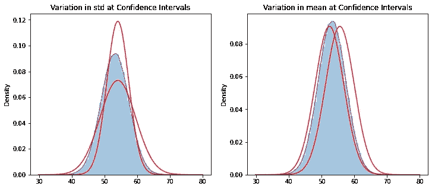

# 自举标准差

> 原文：<https://towardsdatascience.com/bootstrapping-the-standard-deviation-fb415a9d7f39?source=collection_archive---------10----------------------->

## 许多人知道但很少讲述的基于 python 的故事


由[明陈](https://unsplash.com/@minhctran?utm_source=medium&utm_medium=referral)在 [Unsplash](https://unsplash.com?utm_source=medium&utm_medium=referral) 拍摄的照片

Bootstrapping 是一种重采样方法，它允许我们从样本中推断出总体的统计数据。它也很容易执行和理解，这使得它如此织补酷。使用 bootstrap 或完全了解其潜力的从业者知道，他们可以用它来估计各种人口统计数据，但我在网上找到的几乎所有例子都只使用 bootstrap 来估计人口的平均值。我想是时候改变这种状况了。

在这篇短文中，我将回顾 bootstrap 方法以及如何在 python 中执行它。然后，我们将使用这种方法来估计总体标准差的置信区间，以减轻关于如何引导总体统计数据而不是样本均值的任何困惑。我们将做一些可视化的工作，以便更好地理解我们所学的内容，并尝试抽取更多的样本，看看这会如何影响结果。

让我们开始吧。

# 设置

如果你愿意，你可以在 [Jupyter 笔记本这里](https://github.com/benbogart/bootstrapping_the_std/blob/main/bootstrapping_the_std.ipynb)跟随。

从导入我们需要的所有包开始。

```
import pandas as pd
import numpy as np
import matplotlib.pyplot as plt
%matplotlib inline
import seaborn as sns
import scipy.stats as st
```

现在，让我们生成一个虚构的“人口”我编造了均值和标准差。如果你愿意，你可以自己编。

```
# generate a ficticious population with 1 million values
pop_mean = 53.21
pop_std = 4.23
population = np.random.normal(pop_mean, pop_std, 10**6)# plot the population
sns.distplot(population)
plt.title('Population Distribution')
```


作者图片

我们现在已经创建了一个“总体”,它有一百万个值，平均值为 52.21，标准差为 4.23。

## 抽取样本

我们希望从总体中抽取一个小样本，用于引导总体参数的近似值。实际上，我们只有样品。

```
# Draw 30 random values from the population
sample = np.random.choice(population, size=30, replace=False)
```

变量`sample`现在包含从总体中随机抽取的 30 个值。


作者图片

# bootstrap——综述

我会很快地讲到这里。如果你想更深入地了解 bootstrap 方法，可以看看我以前的文章[估计未来音乐人和非营利组织的在线活动捐赠收入——用 python 对置信区间进行 Bootstrap 估计](https://medium.com/swlh/estimating-future-online-event-donation-revenue-for-musicians-and-nonprofits-cca9dc855d1b)。

自举的所有神奇之处都是通过替换采样实现的。替换意味着当我们抽取一个样本时，我们记录下这个数字，然后将这个数字返回给源，这样它就有同样的机会被再次选中。这就是我们正在分析的产生变异的原因，以便对总体做出推断。

我们可以认为这是从一顶帽子(或者一只靴子，如果你喜欢的话)中抽取数字。

1.  数一数你帽子里的记录数
2.  从你的帽子里随机抽取一张记录
3.  记录该记录的值，并将记录放回帽子中
4.  重复上述步骤，直到记录的数值数量与帽子中记录的数值数量相同
5.  计算样本度量，如平均值或标准偏差，并记录下来
6.  重复这个过程 1000 次左右
7.  计算分位数以获得您的置信区间

让我们用`numpy`来做这个，它比从帽子里抽数字要快得多。

```
bs = np.random.choice(sample, (len(sample), 1000), replace=True)
```

现在我们有一个 30x1000 `numpy`的数组，每 1000 行代表一个新的样本。

为了推断总体平均值，我们可以取所有行的平均值，然后取这些平均值的平均值。

```
bs_means = bs.mean(axis=0)
bs_means_mean = bs_means.mean()
bs_means_mean
```

54.072626327248315

那还不错。记得人口平均数是`53.21`。

但这不是有用的部分。如果我们取样本的平均值，我们会得到相似的结果。

```
sample.mean()
```

54.12110644012915

真正的价值在于我们可以通过自举生成的置信区间。我们将返回并使用我们的`bs_means`变量，它包含 1000 个重采样样本的平均值。为了计算 95%的置信区间，我们可以取这些平均值的 0.025 和 0.975 分位数。95%的重采样样本的平均值在这两个分位数之间，这给出了我们的置信区间。

```
lower_ci = np.quantile(bs_means, 0.025)
upper_ci = np.quantile(bs_means, 0.975)lower_ci, upper_ci
```

(52.41754898532445, 55.602661654526315)

很神奇，对吧？如果从大量不同的可能人群中抽取相同的样本，这些人群中的 95/100 将具有介于 52.54 和 55.77 之间的平均值。

# 标准偏差

这是大多数 bootstrap 示例的终点，但我们想看看我们能在多大程度上重建我们的总体，所以我们还需要计算标准差。

好消息是，过程是相同的，除了我们采用每个重采样样本的标准差，而不是平均值。同样在我们以前取平均值的时候，我们现在可以计算标准差的平均值。

```
bs_stds = bs.std(axis=0)
bs_std_mean = bs_stds.mean()
bs_std_mean
```

4.398626063763372

我们可以像以前一样通过寻找分位数来计算总体标准差的置信区间。

```
lower_ci = np.quantile(bs_stds, 0.025)
upper_ci = np.quantile(bs_stds, 0.975)lower_ci, upper_ci
```

(3.3352503395296598, 5.387739215237817)

总体标准差的 95%置信区间为 3.34 至 5.39。

让我们把它画出来，以便更好地理解它的意思。

```
# plot the distributions with std at the confidence intervals
dist_low = st.norm(loc=bs_means_mean, scale=std_qtl_025)
y_low = dist_low.pdf(x)dist_high = st.norm(loc=bs_means_mean, scale=std_qtl_975)
y_high = dist_high.pdf(x)#plot
fig, (ax1, ax2) = plt.subplots(1, 2, figsize=(12, 5))plt.sca(ax1)
sns.distplot(population, ax=ax1)
plt.plot(x,y_low, color='red')
plt.plot(x,y_high, color='red')
plt.title('Variation in std at Confidence Intervals')# plot the distributions with mean at the confidence intervals
dist_low = st.norm(loc=means_qtl_025, scale=bs_std_mean)
y_low = dist_low.pdf(x)dist_high = st.norm(loc=means_qtl_975, scale=bs_std_mean)
y_high = dist_high.pdf(x)#plot
plt.sca(ax2)
sns.distplot(population)
plt.plot(x,y_low, color='red')
plt.plot(x,y_high, color='red')plt.title('Variation in mean at Confidence Intervals')
```



作者图片

第一个图显示 95/100 倍的人口分布将落在两个红色分布之间，代表标准差的上下置信区间。第二个图显示 95/100 倍的人口分布将落在两个红色分布之间，代表平均值的上下置信区间。现在我们对给定样本时可能的总体参数范围有了一个概念。

# 重采样次数

你可能还有另一个问题:如果我们重新采样 1000 次以上，我们会得到更精确的结果吗？

让我们通过重新采样 1000 万次而不是 1000 次来找出答案

```
bs_big = np.random.choice(sample, (len(sample), 10**7), replace=True)
```

计算平均值。

```
bs_means = bs_big.mean(axis=0)
bs_means_mean = bs_means.mean()
bs_means_mean
```

54.12096064254814

之前的平均值是 54.125363863656 那也差不了多少，离 53.21 的地面真相还远一点。

```
means_qtl_025 = np.quantile(bs_means, 0.025)
means_qtl_975 = np.quantile(bs_means, 0.975)means_qtl_025, means_qtl_975
```

(52.535753878990164, 55.76684250100114)

先前的值为(52.41754898532445，55.5555353651

```
bs_stds = bs_big.std(axis=0)
bs_std_mean = bs_stds.mean()
bs_std_mean
```

4.414164449356725

先前的值是 4.3986263372

```
std_qtl_025 = np.quantile(bs_stds, 0.025)
std_qtl_975 = np.quantile(bs_stds, 0.975)std_qtl_025, std_qtl_975
```

(3.3352503395296598, 5.387739215237817)

以前的值为(3.356752806683829，5.4663411850985)

似乎没有太大的区别。我们再把它画出来。

```
x = np.linspace(30, 80, 1000)# plot the distributions with std at the confidence intervals
dist_low = st.norm(loc=bs_means_mean, scale=std_qtl_025)
y_low = dist_low.pdf(x)dist_high = st.norm(loc=bs_means_mean, scale=std_qtl_975)
y_high = dist_high.pdf(x)#plot
fig, (ax1, ax2) = plt.subplots(1, 2, figsize=(12, 5))plt.sca(ax1)
sns.distplot(population, ax=ax1)
plt.plot(x,y_low, color='red')
plt.plot(x,y_high, color='red')
plt.title('Variation in std at Confidence Intervals\n10 million re-samples')# plot the distributions with mean at the confidence intervals
dist_low = st.norm(loc=means_qtl_025, scale=bs_std_mean)
y_low = dist_low.pdf(x)dist_high = st.norm(loc=means_qtl_975, scale=bs_std_mean)
y_high = dist_high.pdf(x)#plot
plt.sca(ax2)
sns.distplot(population)
plt.plot(x,y_low, color='red')
plt.plot(x,y_high, color='red')plt.title('Variation in mean at Confidence Intervals\n10 million re-samples')
```


作者图片

先前的绘图重采样 1000 次:


作者图片

我要说的是，这些结果基本上是听不出来的，当然，在我们的情况下，重采样 1000 次以上没有任何好处。

所以，这就是那个鲜为人知但却广为人知的故事:用均值和标准差来估计总体参数。