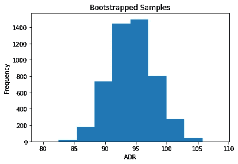
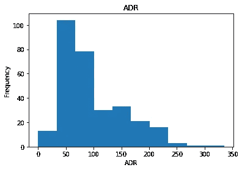
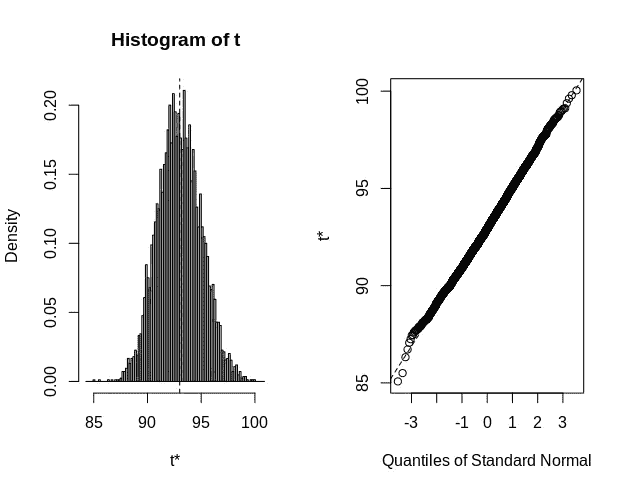

# 使用 Python 和 R

> 原文：<https://towardsdatascience.com/bootstrapping-using-python-and-r-b112bb4a969e?source=collection_archive---------4----------------------->

## 使用重复抽样估计抽样分布


来源:照片由来自 [Pixabay](https://pixabay.com/vectors/chart-statistics-data-histogram-3186078/) 的 [krzysztof-m](https://pixabay.com/users/krzysztof-m-1363864/) 拍摄

确定一个总体特征的尝试常常受到这样一个事实的限制，即我们必须依靠一个样本来确定该总体的特征。

在分析数据时，我们希望能够估计抽样分布，以便进行假设检验和计算置信区间。

试图解决这个问题的一种方法是一种叫做**自举**的方法，通过重复采样来推断更广泛人群的结果。

例如，为了确定同一人群的不同样本是否会产生相似的结果，理想的方法是获取新的数据样本。然而，鉴于这可能是不可能的，一种替代方法是从现有数据中随机取样。

对于这个示例，我们将查看一系列酒店客户的平均每日房价(ADR)的分布。具体而言，ADR 数据的子集与 bootstrapping 技术结合使用，以分析在给定较大样本量的情况下，预期的分布情况。

当使用自举产生样本时，这通过替换来完成**。这意味着可以从样品中多次选择相同的元素。**

# 使用 Python 引导

使用从 Antonio、Almeida 和 Nunes 提供的数据集中随机抽取的 300 个酒店客户 ADR 值样本，我们将生成 5000 个大小为 300 的 bootstrap 样本。

具体来说，numpy 如下用于生成 300 个替换样本，而循环的**用于一次生成 300 个样本的 5000 次迭代。**

```
my_samples = []
for _ in range(5000):
    x = np.random.choice(sample, size=300, replace=True)
    my_samples.append(x.mean())
```

以下是引导样本的直方图:



来源:Jupyter 笔记本输出

这是随机选取的 300 个原始样本的直方图:



来源:Jupyter 笔记本输出

我们可以看到原始样本是显著正偏的。但是，自举样本的直方图近似于正态分布，这符合中心极限定理的假设，即随着样本大小的增加，无论原始分布的形状如何，基本数据分布都可以近似为正态分布。

bootstrapping 的主要用途是估计总体均值的置信区间。例如，95%的置信区间意味着我们有 95%的把握均值位于特定范围内。

引导样本的置信区间如下:

```
>>> import statsmodels.stats.api as sms
>>> sms.DescrStatsW(my_samples).tconfint_mean()(94.28205060553655, 94.4777529411301)
```

根据以上所述，我们可以 95%确信真实的人口平均数在 94.28 和 94.47 之间。

# 使用 R 自举

使用 R 中的 **boot** 库，可以进行类似形式的分析。

再次假设只有 300 个样本可用:

```
adr<-sample(adr, 300)
```

使用带有替换的随机取样，产生这 300 个样本的 5，000 个重复。

```
x<-sample(adr, 300, replace = TRUE, prob = NULL)> mean_results <- boot(x, boot_mean, R = 5000)
ORDINARY NONPARAMETRIC BOOTSTRAPCall:
boot(data = x, statistic = boot_mean, R = 5000)Bootstrap Statistics :
    original      bias    std. error
t1* 93.00084 -0.02135855    2.030718
```

此外，以下是置信区间的计算:

```
> boot.ci(mean_results)
BOOTSTRAP CONFIDENCE INTERVAL CALCULATIONS
Based on 5000 bootstrap replicatesCALL : 
boot.ci(boot.out = mean_results)Intervals : 
Level      Normal              Basic         
95%   (89.04, 97.00 )   (88.98, 96.82 )Level     Percentile            BCa          
95%   (89.18, 97.02 )   (89.36, 97.32 )  
Calculations and Intervals on Original Scale
```

生成自举样本的直方图:



来源:RStudio 输出

当在 R 中运行时，我们可以看到置信区间比使用 Python 运行时获得的置信区间更宽。虽然原因尚不清楚，但分析仍然表明，所获得的样本平均值代表了总体水平，不可能是偶然获得的。

# 限制

虽然自举是从样本推断总体特征的非常有用的工具，但一个常见的错误是假设自举是解决小样本问题的方法。

正如在[交叉验证](https://stats.stackexchange.com/questions/112147/can-bootstrap-be-seen-as-a-cure-for-the-small-sample-size)中所解释的，小样本量可能更不稳定，更容易与更广泛的人群产生重大偏差。因此，人们应该确保被分析的样本足够大，以便充分捕捉群体特征。

此外，小样本量的另一个问题是，bootstrap 分布本身可能会变得更窄，这反过来会导致更窄的置信区间，从而显著偏离真实值。

# 结论

在本文中，您已经看到:

*   bootstrapping 如何允许我们使用重复抽样来估计抽样分布
*   随机抽样时替换的重要性
*   如何使用 Python 和 R 生成引导示例
*   自举的局限性以及为什么更大的样本量更好

非常感谢您的宝贵时间，非常感谢您的任何问题或反馈。你可以在 michael-grogan.com 的[找到更多我的数据科学内容。](https://www.michael-grogan.com/)

# 参考

*   [安东尼奥，阿尔梅达，努内斯(2019)。酒店预订需求数据集](https://www.sciencedirect.com/science/article/pii/S2352340918315191)
*   [交叉验证:bootstrap 能被视为小样本的“治疗方法”吗？](https://stats.stackexchange.com/questions/112147/can-bootstrap-be-seen-as-a-cure-for-the-small-sample-size)
*   [docs . scipy . org:scipy . stats . bootstrap](https://docs.scipy.org/doc/scipy/reference/generated/scipy.stats.bootstrap.html)
*   朱利安·比留:抽样分布
*   [吉姆的《统计学:统计学中的自举法介绍及实例](https://statisticsbyjim.com/hypothesis-testing/bootstrapping/)
*   [多伦多大学编码器-R:Bootstrapping 和置换测试中的重采样技术](https://uoftcoders.github.io/studyGroup/lessons/r/resampling/lesson/)

*免责声明:本文是在“原样”的基础上编写的，没有任何担保。它旨在提供数据科学概念的概述，不应被解释为专业建议。本文中的发现和解释是作者的发现和解释，不被本文中提到的任何第三方认可或隶属于任何第三方。作者与本文提及的任何第三方无任何关系。*