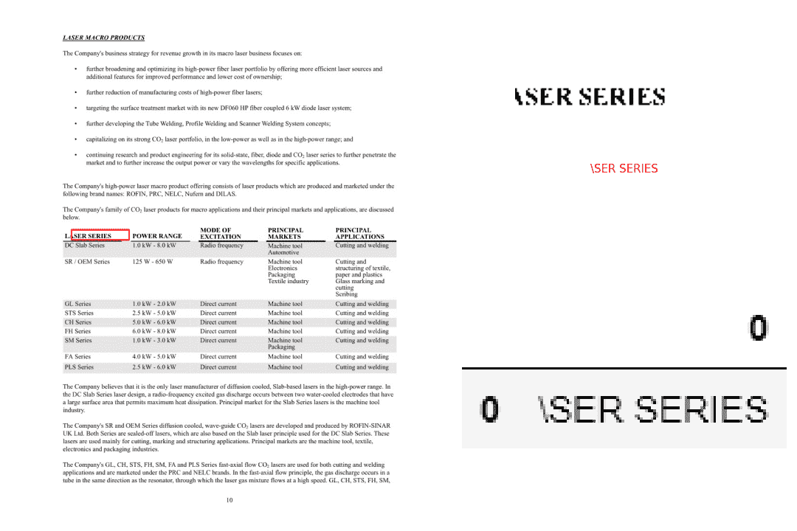
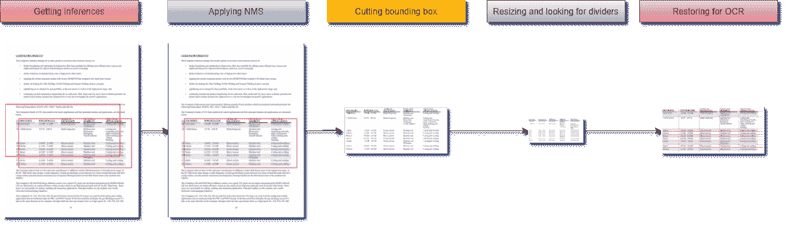

# 基于深度学习和 OpenCV 的无边界表格检测

> 原文：<https://towardsdatascience.com/borderless-tables-detection-with-deep-learning-and-opencv-ebf568580fe2?source=collection_archive---------2----------------------->

## 构建您自己的对象检测器并将图像中的半结构化数据块转换为机器可读文本的方法



作者图片

# 文档解析

文档解析是将信息转换成有价值的业务数据的第一步。这些信息通常以表格形式存储在商业文档中，或者存储在没有明显图形边界的数据块中。一个无边界的表格可能有助于简化我们人类对半结构化数据的视觉感知。从机器阅读的角度来看，这种在页面上呈现信息的方式有很多缺点，使得很难将属于假定的表格结构的数据与周围的文本上下文分开。

表格数据提取作为一项业务挑战，可能有几个特别的或启发式的基于规则的解决方案，对于布局或风格稍有不同的表，这些解决方案肯定会失败。在大规模上，应该使用更通用的方法来识别图像中的表格状结构，更具体地说，应该使用基于深度学习的对象检测方法。

# 本教程的范围:

*   基于深度学习的物体检测
*   安装和设置 **TF2 对象检测 API**
*   数据准备
*   模型配置
*   模型训练和保存
*   现实生活图像中的表格检测和细胞识别

# 基于深度学习的物体检测

著名的 CV 研究员 Adrian Rosebrock 在他的“[深度学习对象检测温和指南](http://gentle guide to deep learning object detection)”中指出:“对象检测，无论是通过深度学习还是其他计算机视觉技术来执行，都建立在图像分类的基础上，并寻求精确定位对象出现的区域”。正如他所建议的，建立自定义对象检测器的一种方法是选择任何分类器，并在此之前使用一种算法来选择和提供图像中可能包含对象的区域。在这种方法中，您可以自由决定是否使用传统的 ML 算法进行图像分类([是否使用 **CNN** 作为特征提取器](https://www.pyimagesearch.com/2019/05/27/keras-feature-extraction-on-large-datasets-with-deep-learning/))或者[训练一个简单的神经网络](https://www.pyimagesearch.com/2019/05/27/keras-feature-extraction-on-large-datasets-with-deep-learning/)来处理任意的大型数据集。尽管其效率已被证明，但这种被称为 **R-CNN** 的两阶段对象检测范式仍然依赖于繁重的计算，不适合实时应用。

上述帖子中还进一步说，“另一种方法是将预先训练好的分类网络作为多组件深度学习对象检测框架中的基础(骨干)网络(如**更快的 R-CNN** 、 **SSD** ，或 **YOLO** )。因此，您将受益于其完整的端到端可培训架构。

无论选择是什么，它都会让你进一步了解重叠边界框的问题。在下文中，我们将触及为此目的执行的非最大抑制。

同时，请参考任意新类别的对象检测器的迁移学习流程图(参见[交互视图](https://viewer.diagrams.net/?target=blank&highlight=0000ff&edit=_blank&layers=1&nav=1&title=Copy%20of%20obj_detection.html#Uhttps%3A%2F%2Fdrive.google.com%2Fuc%3Fid%3D1ej4QfW4xK1z4S1xWv0qu8NeUfktFsFiO%26export%3Ddownload)):


作者图片

由于第二种方法速度更快、更简单且更准确，它已经被广泛用于商业和科学论文中的表格结构识别。例如，您可以很容易地找到使用[**【YOLO】**](/pdfs-parsing-using-yolov3-987c85c639dc)、 [**RetinaNet**](https://djajafer.medium.com/pdf-table-extraction-with-keras-retinanet-173a13371e89) 、 [**Cascade R-CNN**](https://github.com/DevashishPrasad/CascadeTabNet) 和其他框架从 PDF 文档中提取表格数据的实现。

继续学习本教程，您将了解如何使用像 **TensorFlow (TF2)对象检测 API** 这样的工具，使用预先训练的最先进的模型轻松构建您的自定义对象检测器。

# 开始之前

请注意，这不会是对深度学习对象检测的详尽介绍，而是对如何在特定开发环境( **Anaconda/Win10** )中与 **TF2 对象检测 API** (和其他工具)交互以解决明显的业务问题(如无边界表格检测)的分阶段描述。在这篇文章的其余部分，我们将会比其他人更详细地介绍建模过程的一些方面和结果。尽管如此，在我们的实验之后，您将会找到基本的代码示例。要继续，你应该安装好 **Anaconda** 和**宇宙魔方**，下载 **protobuf** 并添加到 PATH。

# TF2 对象检测 API 的安装和设置

在您选择的路径下创建一个新文件夹，我们在下文中称之为*‘项目的根文件夹’*。从您的终端窗口逐一运行以下命令:

```
*# from <project’s root folder>
conda create -n <new environment name> \
python=3.7 \
tensorflow=2.3 \
numpy=1.17.4 \
tf_slim \
cython \
git**conda activate <new environment name>**git clone* [*https://github.com/tensorflow/models.git*](https://github.com/tensorflow/models.git)*pip install git+https://github.com/philferriere/cocoapi.git#subdirectory=PythonAPI**cd models\research* *# from <project’s root folder>\models\researchprotoc object_detection\protos\*.proto — python_out=.**copy object_detection\packages\tf2\setup.py .**python setup.py install**python object_detection\builders\model_builder_tf2_test.py**conda install imutils pdf2image beautifulsoup4 typeguard**pip install tf-image**copy object_detection\model_main_tf2.py ..\..\workspace\.**copy object_detection\exporter_main_v2.py ..\..\workspace\.**cd ..\..*
```

它将在您的本地环境中安装使用 **TF2 对象检测 API** 所需的核心和一些助手库，并负责您的训练数据集。从这一步开始，你应该能够从 **TF2 模型园**下载一个预训练模型，并且[从它](https://tensorflow-object-detection-api-tutorial.readthedocs.io/en/latest/auto_examples/index.html)得到相应预训练类的推论。

# 数据准备

我希望到目前为止你已经成功了！请记住，我们的最终目标是使用预训练模型来执行迁移学习，以检测单个“无边界”类，而该模型在初始训练时对此一无所知。如果你研究过我们的迁移学习流程图，你应该已经注意到我们整个过程的起点是一个数据集，不管有没有注释。如果你需要注释，有[吨的解决方案](https://lionbridge.ai/articles/image-annotation-tools-for-computer-vision/)可用。选择一个能给你 XML 注释的，与我们的例子兼容的。

我们拥有的注释数据越多越好(*重要:这篇文章的所有表格图片都选自开放的数据源，如*[*this*](https://github.com/DevashishPrasad/CascadeTabNet#7-datasets)*，并由作者*注释/重新注释)。但是一旦你尝试手工标注数据，你就会明白这项工作有多乏味。不幸的是，没有一个流行的用于图像增强的 python 库能够处理选定的边界框。在没有收集和注释新数据的高成本的情况下，增加初始数据集符合我们的利益。这就是一个 [**tf-image**](/tensorflow-and-image-augmentation-3610c6c243a2) 包将变得方便的情况。

上述脚本将随机转换原始图像和对象的边界框，并将新图像和相应的 XML 文件保存到磁盘。这就是我们的数据集经过三倍扩展后的样子:


作者图片

接下来的步骤将包括将数据分成训练集和测试集。基于 **TF2 对象检测 API** 的模型需要一种特殊的格式用于所有输入数据，称为 *TFRecord* 。你会在 [Github 库](https://github.com/woldemarg/borderless_tbls_detection)中找到相应的脚本来拆分和转换你的数据。

# 模型配置

在这一步，我们将创建一个标签映射文件(*)。pbtxt* )将我们的类标签(‘无边界’)链接到某个整数值。 **TF2 对象检测 API** 需要此文件用于训练和检测目的:

```
*item {
id: 1
name: ‘borderless’
}*
```

实际的模型配置发生在相应的 *pipeline.config* 文件中。你可以阅读[对模型配置](https://neptune.ai/blog/how-to-train-your-own-object-detector-using-tensorflow-object-detection-api)的介绍，并决定是手动配置文件还是通过运行 [Github 库](https://github.com/woldemarg/borderless_tbls_detection)中的脚本来配置文件。

到目前为止，您的项目的根文件夹可能如下所示:

```
📦borderless_tbls_detection
┣ 📂images
┃ ┣ 📂processed
┃ ┃ ┣ 📂all_annots
┃ ┃ ┃ ┗ 📜…XML
┃ ┃ ┗ 📂all_images
┃ ┃ ┃ ┗ 📜…jpg
┃ ┣ 📂splitted
┃ ┃ ┣ 📂test_set
┃ ┃ ┃ ┣ 📜…jpg
┃ ┃ ┃ ┗ 📜…XML
┃ ┃ ┣ 📂train_set
┃ ┃ ┃ ┣ 📜…jpg
┃ ┃ ┃ ┗ 📜…XML
┃ ┃ ┗ 📂val_set
┃ ┗ 📜xml_style.XML
┣ 📂models
┃ ┗ 📂…
┣ 📂scripts
┃ ┣ 📜…py
┣ 📂train_logs
┣ 📂workspace
┃ ┣ 📂data
┃ ┃ ┣ 📜label_map.pbtxt
┃ ┃ ┣ 📜test.csv
┃ ┃ ┣ 📜test.record
┃ ┃ ┣ 📜train.csv
┃ ┃ ┣ 📜train.record
┃ ┃ ┣ 📜val.csv
┃ ┃ ┗ 📜val.record
┃ ┣ 📂models
┃ ┃ ┗ 📂efficientdet_d1_coco17_tpu-32
┃ ┃ ┃ ┗ 📂v1
┃ ┃ ┃ ┃ ┗ 📜pipeline.config
┃ ┣ 📂pretrained_models
┃ ┃ ┗ 📂datasets
┃ ┃ ┃ ┣ 📂efficientdet_d1_coco17_tpu-32
┃ ┃ ┃ ┃ ┣ 📂checkpoint
┃ ┃ ┃ ┃ ┃ ┣ 📜checkpoint
┃ ┃ ┃ ┃ ┃ ┣ 📜ckpt-0.data-00000-of-00001
┃ ┃ ┃ ┃ ┃ ┗ 📜ckpt-0.index
┃ ┃ ┃ ┃ ┣ 📂saved_model
┃ ┃ ┃ ┃ ┃ ┣ 📂assets
┃ ┃ ┃ ┃ ┃ ┣ 📂variables
┃ ┃ ┃ ┃ ┃ ┃ ┣ 📜variables.data-00000-of-00001
┃ ┃ ┃ ┃ ┃ ┃ ┗ 📜variables.index
┃ ┃ ┃ ┃ ┃ ┗ 📜saved_model.pb
┃ ┃ ┃ ┃ ┗ 📜pipeline.config
┃ ┃ ┃ ┗ 📜efficientdet_d1_coco17_tpu-32.tar.gz
┃ ┣ 📜exporter_main_v2.py
┃ ┗ 📜model_main_tf2.py
┣ 📜config.py
┗ 📜setup.py
```

# 模型训练和保存

我们做了很多工作才来到这里，并为开始训练做好了一切准备。下面是如何做到这一点:

```
*# from <project’s root folder>
tensorboard — logdir=<logs folder>**set NUM_TRAIN_STEPS=1000**set CHECKPOINT_EVERY_N=1000**set PIPELINE_CONFIG_PATH=<path to model’s pipeline.config>**set MODEL_DIR=<logs folder>**set SAMPLE_1_OF_N_EVAL_EXAMPLES=1**set NUM_WORKERS=1**python workspace\model_main_tf2.py \
 — pipeline_config_path=%PIPELINE_CONFIG_PATH% \
 — model_dir=%MODEL_DIR% \
 — checkpoint_every_n=%CHECKPOINT_EVERY_N% \
 — num_workers=%NUM_WORKERS% \
 — num_train_steps=%NUM_TRAIN_STEPS% \
 — sample_1_of_n_eval_examples=%SAMPLE_1_OF_N_EVAL_EXAMPLES% \
 — alsologtostderr**# (optionally in parallel terminal window)
python workspace\model_main_tf2.py \
 — pipeline_config_path=%PIPELINE_CONFIG_PATH% \
 — model_dir=%MODEL_DIR% \
 — checkpoint_dir=%MODEL_DIR%*
```

现在，您可以在浏览器中监控培训过程，网址为 [http://localhost:6006](http://localhost:6006) :


作者图片

要在训练完成后导出您的模型，只需运行以下命令:

```
*# from <project’s root folder>
python workspace\exporter_main_v2.py \
 — input_type=image_tensor \
 — pipeline_config_path=%PIPELINE_CONFIG_PATH% \
 — trained_checkpoint_dir=%MODEL_DIR% \
 — output_directory=saved_models\efficientdet_d1_coco17_tpu-32*
```

# 图像中的表格检测和细胞识别

## NMS 和欠条

由于我们已经保存了新的微调模型，我们可以开始检测文档中的表格。前面我们提到了一个物体检测系统不可避免的问题——重叠包围盒。考虑到我们正在处理的无边界表格的过度分段性质，我们的模型偶尔会为单个对象输出比您预期的更多的边界框。毕竟，这是我们的目标探测器正在正确发射的标志。为了处理重叠边界框(指同一对象)的移除，我们可以使用[非最大抑制](https://www.pyimagesearch.com/2016/11/07/intersection-over-union-iou-for-object-detection/)。

неre 是我们的检测器在执行非最大值抑制前后的推断结果:


看起来我们已经成功地解决了预测重叠矩形包围物体的问题，但是我们的检测仍然达不到真实边界框。这是必然的，因为没有完美的模型。我们可以用交并比(IoU)来测量检波器的精度。作为分子，我们计算预测边界框和实际边界框之间的重叠面积。作为分母，我们计算由预测边界框和实际边界框包围的区域。IoU 得分> 0.5 通常被认为是“好”的预测[ [Rosenbrock，2016](https://www.pyimagesearch.com/2016/11/07/intersection-over-union-iou-for-object-detection/) ]。

对于我们测试集中的一些图像，我们有以下指标:


## 细胞识别和 OCR

这将是我们的三部分算法的最后步骤:在(1)表格被检测到之后，我们将(2)用 **OpenCV** 识别它的单元格(因为表格是无边界的)并将它们彻底分配到适当的行和列，以进一步进行(3)用**pytesserac**通过光学字符识别(OCR)从每个分配的单元格中提取文本。

大多数细胞识别算法都是基于表格的行结构。清晰和可检测的线条对于正确识别细胞是必要的。由于我们的表格没有空白，我们将手动重建表格网格，在经过阈值处理和调整大小的图像上搜索白色垂直和水平间隙。这种方法有点类似于这里使用的。

完成这一步后，我们可以用 **OpenCV** 找到轮廓(即我们的单元格边界)，将它们分类并分配到一个类似表格的结构中:

图表上显示了整个工作流程:



作者图片

至此，我们已经将所有的盒子和它们的值按正确的顺序排序了。剩下的工作就是获取每个基于图像的盒子，通过膨胀和腐蚀为 OCR 做准备，并让**pytesserac**识别包含的字符串:


# 最后的想法

啊，走了很长一段路！我们的自定义对象检测器可以识别文档中的半结构化信息块(也称为无边界表格),进一步将它们转换为机器可读的文本。尽管这个模型没有我们预期的那么精确。因此，我们有很大的改进空间:

*   在我们模型的配置文件中进行更改
*   与来自[模型园](https://github.com/tensorflow/models)的其他模型玩耍
*   执行更保守的数据扩充
*   尝试重新使用[模型，之前在表格数据](https://github.com/doc-analysis/TableBank/blob/master/MODEL_ZOO.md)上训练过(虽然不可用于 TF2 对象检测 API)