# 厌倦了使用条形图？

> 原文：<https://towardsdatascience.com/bored-of-using-bar-charts-74e0b088979b?source=collection_archive---------26----------------------->

## 利用条形图获得创意的 5 种方法

条形图是我在工作中展示数据见解时最常用的图表形式之一。但是我经常觉得这有点单调和重复，尤其是当你需要在同一个仪表板上显示很多 KPI 的时候。

普里西拉·杜·普里兹在 [Unsplash](https://unsplash.com?utm_source=medium&utm_medium=referral) 上的照片

这里有五种不同的变化，您可以使用条形图来显示数据。

## 1.使用圆形条

我在我最近的一部[即](https://ishagarg2010.medium.com/the-one-with-data-friends-tv-show-analysis-88e4f62f68f5)关于 F.R.I.E.N.D.S .的电视连续剧中使用了这个技巧。它的工作方式基本上是你给 tableau 提供两个度量名，然后用它们画一条线。这和[画彗星图](/how-to-make-a-comet-chart-in-tableau-b5c23e3dc58b)很像。

a.首先绘制一个普通的条形图，方法是将维拖到列架，将度量拖到行架。

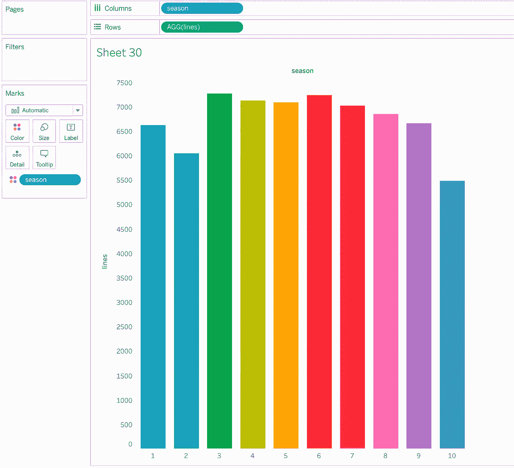

Tableau 中的普通条形图(图片由作者提供)

b.接下来，在行架上添加另一个度量值作为 min(0)。它基本上是 0 处的一个点，将作为绘制直线的第二个点。

c.现在我们需要将图表类型改为折线图。

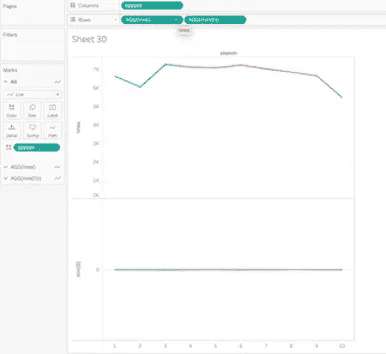

步骤 1c。作者图片

d.将测量名称添加到路径架，将测量值添加到行架，并将两个测量都移动到测量值架，如下所示。

e.现在，只需调整线条的大小，使其稍微粗一点。如果需要，调整轴。

你完了！

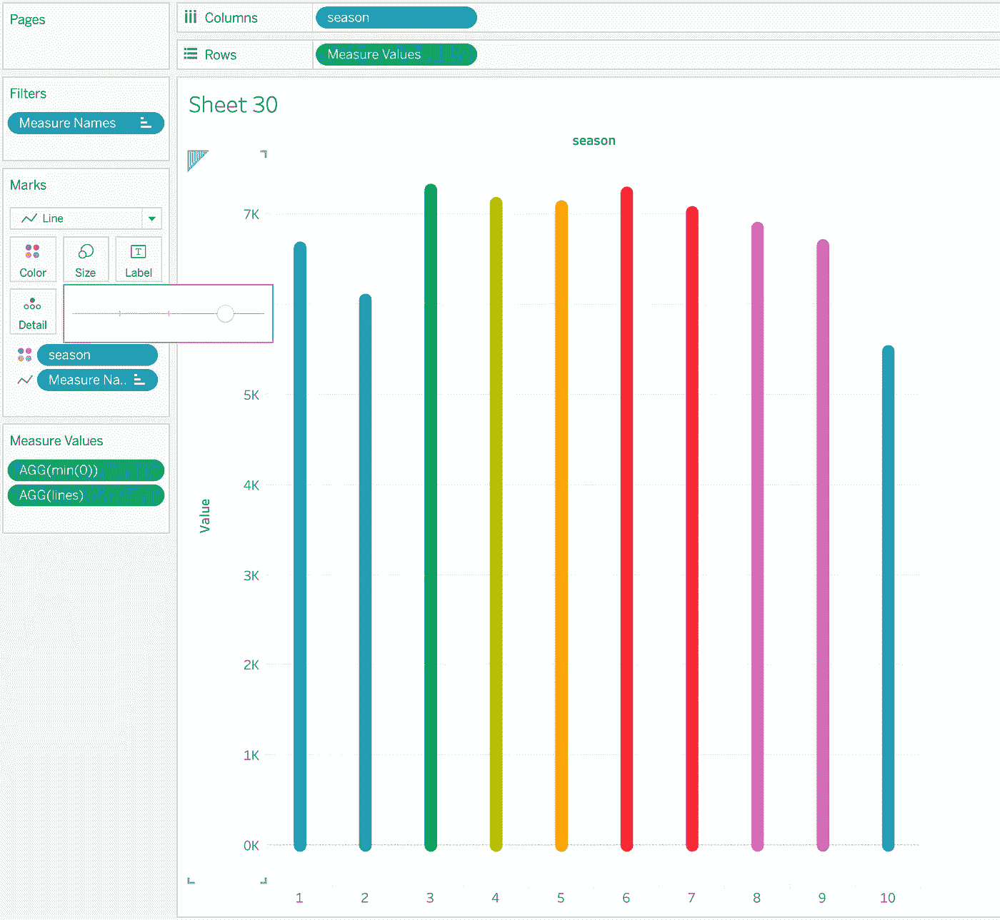

圆形条形图(图片由作者提供)

## 2.带底座的圆棒

这种图表在我之前的 F.R.I.E.N.D.S .中也使用过。它对分类维度非常有效。您也可以使用相同的技术构建堆积条形图。

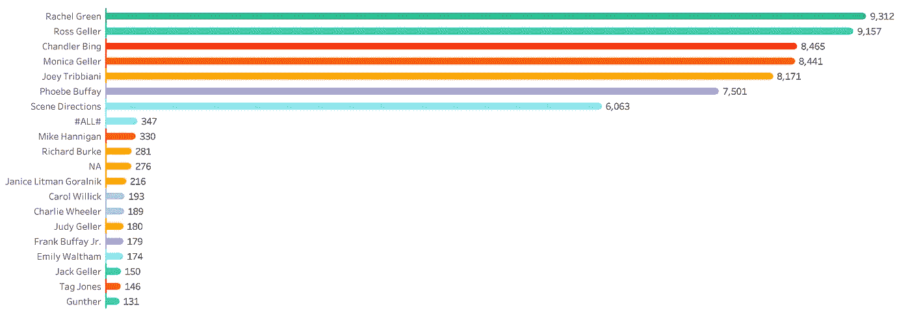

底部有甘特条形图的圆形条形图(图片由作者提供)

它与上一节的图表完全相似。得到圆形条形图后，按照以下步骤操作。

a.只需向 rows shelf 添加另一个度量值— min(0)。

b.右键单击计算并选择双轴。

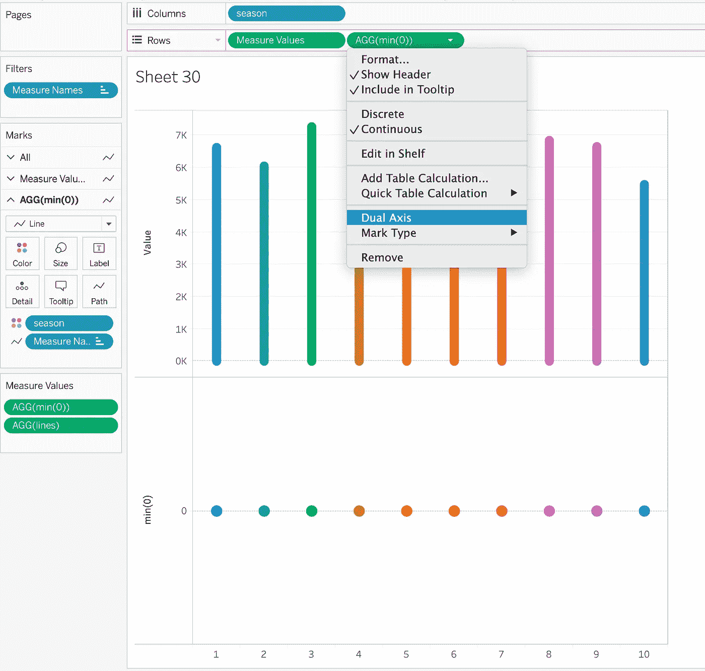

作者图片

c.接下来右键单击 Y 轴，然后单击同步轴。

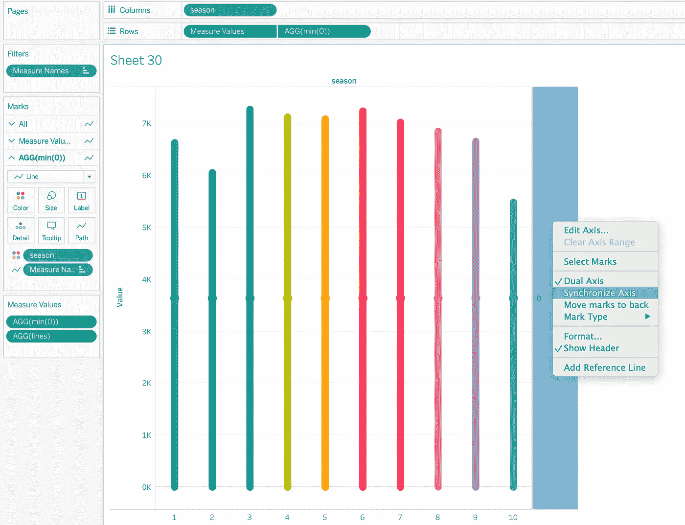

作者图片

d.现在，将第二个度量的图表类型更改为甘特图。

e.缩小条形的尺寸，你会得到带底的圆形条形图。

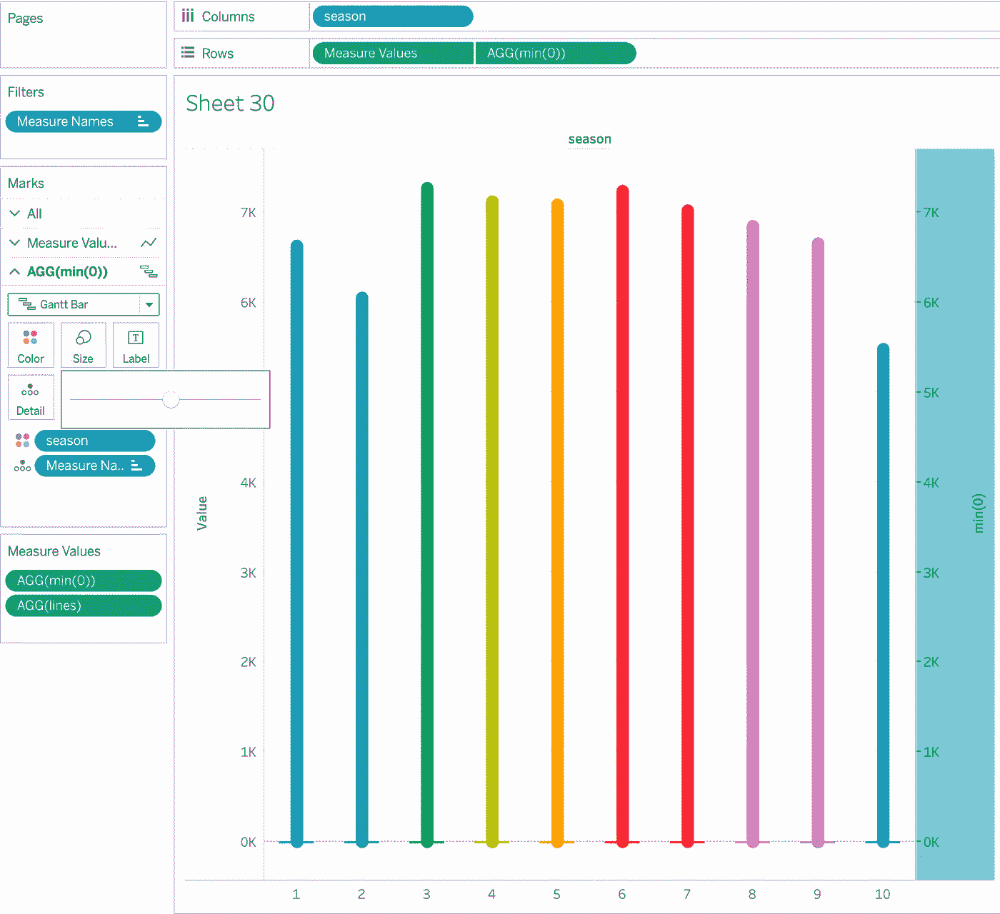

作者图片

调整轴就行了！

## 3.显示百分比份额或评级的条形图—类型 1

这种条形图在传达整体情况时非常有效。我最近在我的 viz — [我的几周生活](https://public.tableau.com/views/MyLifeinWeeks_16269782731230/MyLifeinWeeks?:language=en-GB&:display_count=n&:origin=viz_share_link)中使用了它。您可以通过三个简单的步骤来构建它。

a.将连续尺寸添加到柱架中。

b.将图表类型更改为圆形。

c.根据需要增加颜色的尺寸，并增加条形的大小。

你完了！

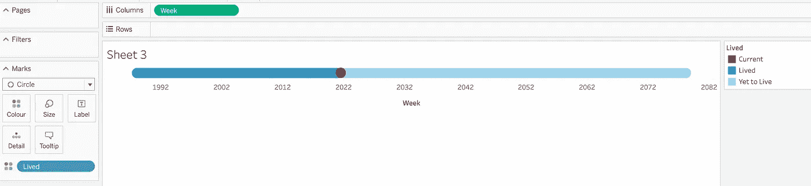

来源:我的 Viz(作者图片)

## 4.显示百分比份额或评级的条形图—类型 2

如上所述，这种类型的条形图有助于快速显示评级或百分比。它很容易建立，并遵循类似的技术。它看起来超级好，可以用在工具提示中，就像我一样。我们将使用这种技术构建一个水平条形图。

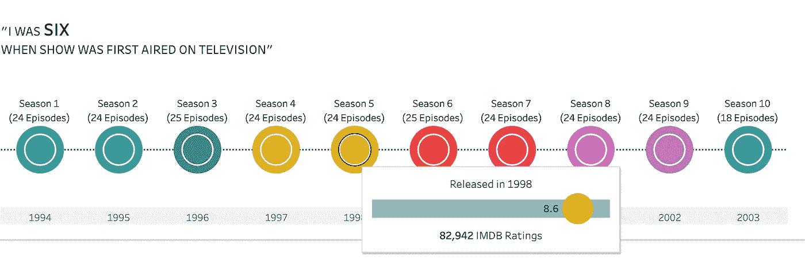

来源:[我的 Viz](https://ishagarg2010.medium.com/the-one-with-data-friends-tv-show-analysis-88e4f62f68f5)

a.您需要创建一个 min(10)的计算字段，并将其放在列架上。

b.接下来，在列架上添加评级度量值，并选择双轴。同步轴。

c.将最小(10)测量的图表类型更改为条形，并选择一种浅色填充。

d.将“评分”测量的图表类型更改为圆形，并选择较暗的颜色。

e.相应地调整尺寸。

你有它！

来源:[我的 Viz](https://public.tableau.com/views/TheonewithdataFriendsTVShowViz/Dashboard1?:language=en-GB&:display_count=n&:origin=viz_share_link)

## 5.重叠条形图

当您想要显示不同时间段之间的比较时，这些图表非常有用。例如，您的管理层希望了解不同业务部门的季度业绩。

为了构建这个，我使用了 Tableau 中的样本超市数据集。

a.选择要用来分割结果的维度。我在这个例子中使用了 segment。

b.为该特定时间范围创建两个具有度量值的计算字段。例如，我正在比较 2019 年和 2020 年的销售额。所以，我创造了 2019 年和 2020 年的销量。

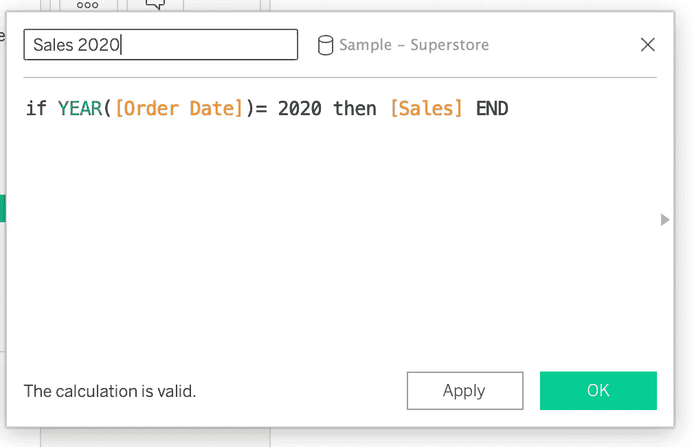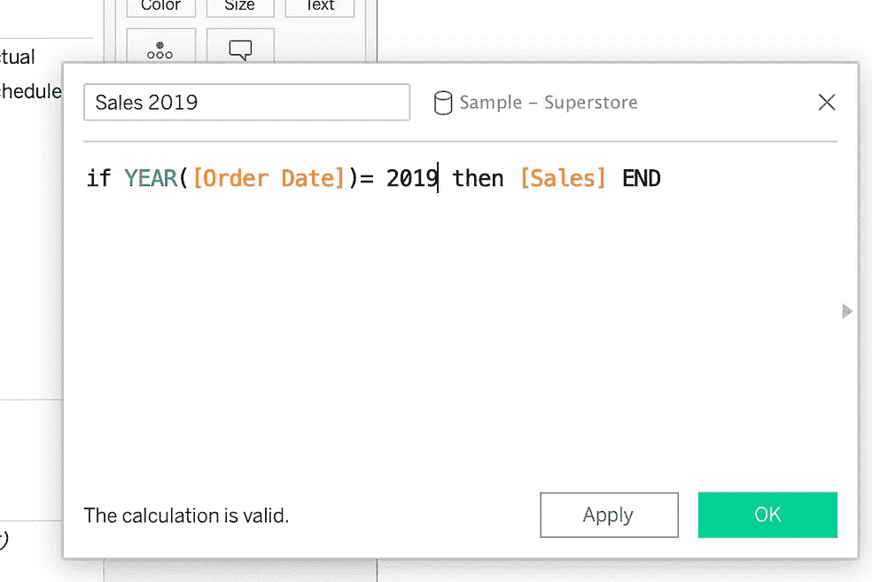

每年的销售额(图片由作者提供)

c.将这些销售字段拖到行架上，然后选择双轴。同步轴。

d.将日期字段拖到颜色卡上。在我的例子中，是年份字段。

现在，有趣的部分。

e.调整两个条形的大小。我一般会把旧的时间段的线条做得粗一点，半透明一点，把最新的时间段的线条做得粗一点，薄一点。

这是结果。

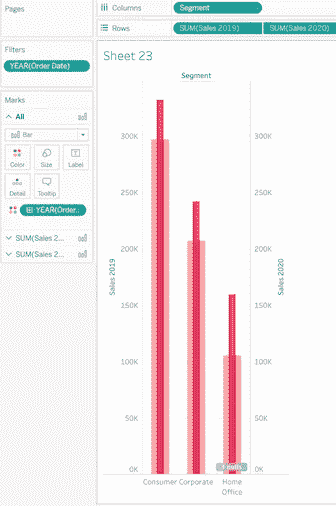

重叠条形图(图片由作者提供)

今天到此为止，各位！

我希望这些技巧和提示能像帮助我一样帮助你提高你的 viz。

感谢阅读！

*下次见……*