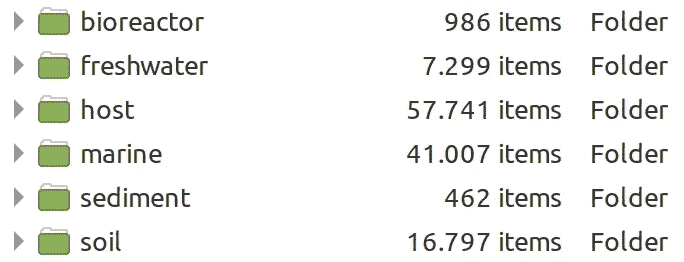
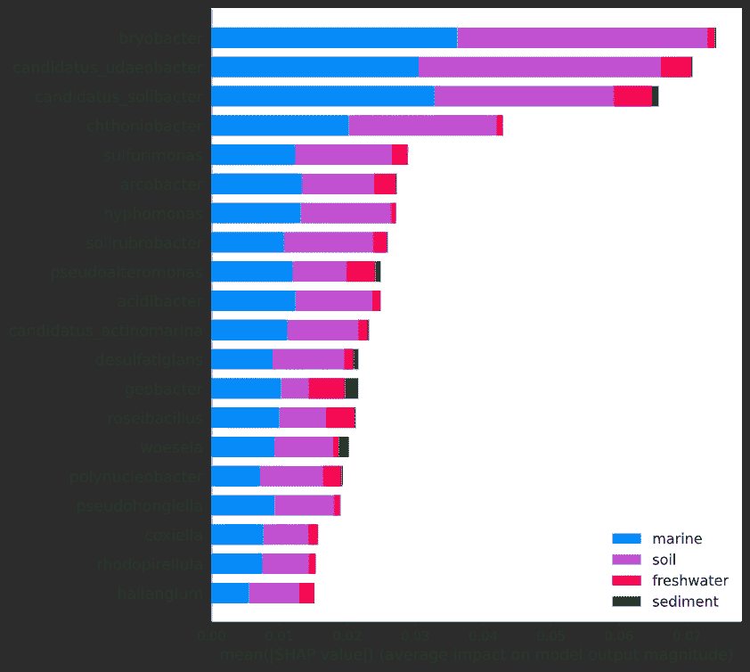
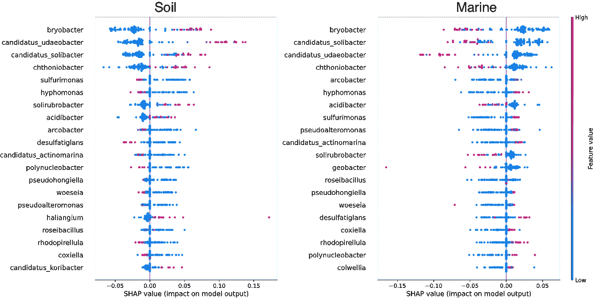
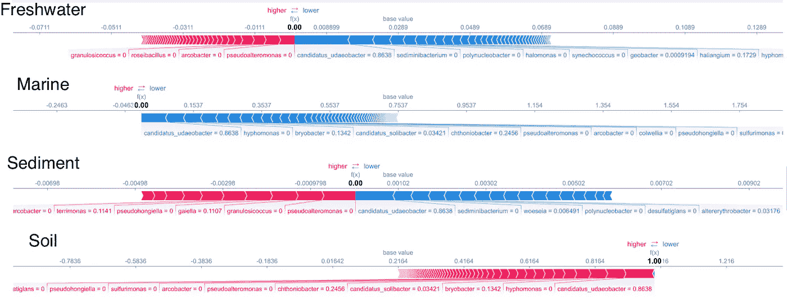
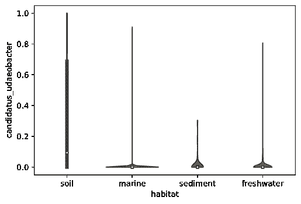

# 用于宏基因组样本分型的借用文本分析

> 原文：<https://towardsdatascience.com/borrow-text-analysis-for-metagenome-sample-typing-4cbf475259f2?source=collection_archive---------49----------------------->

## 如何使用 TF-IDF、XGBoost 和 SHAP 对元基因组进行分类和解释

> 这篇文章显示:
> 
> 1.使用 GridSearchCV 为宏基因组样本分型构建 TF-IDF 和 XGBoost 管道。
> 
> 2.使用 TF-IDF 对分类轮廓进行矢量化以进行建模。
> 
> 3.建立一个 F1 分数高的 XGBoost 模型。
> 
> 4.使用 SHAP 查看特征贡献并识别每个样本类型的不同分类群

# 介绍

自从安东尼·范·列文虎克第一次看到微生物世界，我们人类就被它迷住了。在不到 400 年的时间里，我们从无知到认识到它们在我们的健康和全球生化循环中的关键作用。据估计，在我们的身体上，[微生物的数量是人类细胞的十倍](https://www.nih.gov/news-events/news-releases/nih-human-microbiome-project-defines-normal-bacterial-makeup-body)。从生物燃料到塑料降解、生物修复和医药，我们的未来越来越依赖于它们。

即使我们仍然使用显微镜和生物化学测试来观察微生物，但仅根据它们的外观和生物化学反应，很难区分谁是谁。DNA 测序来拯救。如今，我们不仅测序单个基因组，还测序整个微生物群落，也称为宏基因组。

图一。照片由[国立癌症研究所](https://unsplash.com/@nci?utm_source=unsplash&utm_medium=referral&utm_content=creditCopyText)在 [Unsplash](https://unsplash.com/s/photos/genome?utm_source=unsplash&utm_medium=referral&utm_content=creditCopyText) 上拍摄

顾名思义，宏基因组是样本或栖息地内所有基因组的总和，无论是病毒、细菌还是真核生物。我们通过对宏基因组进行整体测序或者通过靶向 [16S 区域](https://en.wikipedia.org/wiki/16S_ribosomal_RNA)来确定宏基因组的内容。不同类型的样本包含不同的生物体，因此它们的元基因组也应该不同。相反，这意味着可以通过单独检查它们的分类特征来区分不同的样本类型。例如，现在可以通过分析患者的宏基因组来进行快速临床诊断([皮安塔多西*等人*)。2018](https://pubmed.ncbi.nlm.nih.gov/29020227/) 。事实上，元基因组也已经被用于监测藻华的不同阶段。2012 ，估算作物生产力([常*等*)。2017](https://www.frontiersin.org/articles/10.3389/fmicb.2017.00519/full) )、土壤质量([维斯特加德*等*)。2017](https://link.springer.com/article/10.1007/s00374-017-1191-3) 、[加斯陶*等人*。2019](https://www.nature.com/articles/sdata20198) 、水质([毕比*等*)。2019](https://www.nature.com/articles/s41545-019-0032-3) )等众多。

已经有一些机器学习方法用于宏基因组样本分型。一方面是来自阿斯加里*等人*的微音器。在从 16S rRNA 基因序列的浅层子采样获得的 k-mer 上使用深度神经网络(DNN)、随机森林(RF)和线性 SVM([as gari*等*)。2018](https://academic.oup.com/bioinformatics/article/34/13/i32/5045790) )。另一方面，Dhugnel *等人*。开发了 MegaR 软件包，该软件包从全宏基因组测序或 16S rRNA 测序数据中选择关于宏基因组分类概况的广义线性模型(GLM)、SVM 或 RF([Dhungel*等*)。2021](https://bmcbioinformatics.biomedcentral.com/articles/10.1186/s12859-020-03933-4) )。

在本文中，我展示了我解决这个问题的方法。我把它变成一个多类文本分类问题。如 Dhungel *等人*。，我使用宏基因组分类轮廓数据。我将简介视为文本，并使用词频-逆文档频率(TF-IDF)来突出重要的分类群，淡化那些过于世界性或过于罕见的分类群。然后 XGBoost 基于 TF-IDF 值构建模型。参数将首先通过网格搜索交叉验证进行优化。一旦模型被建立和测试，我使用 [SHAP](/interpretable-machine-learning-with-xgboost-9ec80d148d27) 来检查特征的重要性，这样我就可以知道哪个分类群代表哪个样本类型。这个项目的代码存放在我的 Github 仓库中:

 [## GitHub-dgg 32/mgni fy _ 情操

### 此报告包含“我的文章”在 Medium 中的代码(借用宏基因组样本分类的文本分析)。XGBoost…

github.com](https://github.com/dgg32/mgnify_sentiment) 

而 Jupyter 笔记本可以用 nbviewer 渲染。

 [## nbviewer 笔记本

### 看看这个 Jupyter 笔记本！

nbviewer.jupyter.org](https://nbviewer.jupyter.org/github/dgg32/mgnify_sentiment/blob/master/ebi_sentiment_multi_value.ipynb) 

# 1.从 MGnify 下载分类简介

[MGnify](https://www.ebi.ac.uk/metagenomics/) 是一个研究网站，托管了全球科学家提交的大量元基因组。它还处理序列，并为我们提供下载的 API。首先，用我的脚本下载各种栖息地的分类资料，也就是样本类型。在这个演示中，我从以下类型下载了 JSON 数据:“生物反应器”、“淡水”、“宿主”、“海洋”、“沉积物”和“土壤”。在每个 JSON 中，都有一个分类单元列表(Woeseia、Geobacter 等),包括它们的分类等级(门、纲、科、属等)以及它们在样本中的出现次数。在这个项目中，我使用属作为词汇表。

之后，我将 JSON 文件扩展成“文本”,通过重复出现的每个分类单元，例如“埃希氏菌”。少于 20 个不同属的样品被排除在分析之外。这一过程在“沉积物”类型中产生了 462 个样本，在“宿主”类型中产生了 57，741 个样本(图 2。).

图二。本项目中每种样品的数量。*图片作者。*

# 2.读取、训练-测试-分割和 GridSearchCV

我用一个 Jupyter 笔记本开始。下面是数据导入、80:20 训练-测试-分割、Sklearn 管道和网格搜索交叉验证的代码。

在这种情况下，我从“土壤”、“沉积物”、“海洋”和“淡水”中导入数据。每种类型下都有相当数量的数据。此外，我认为它们是一个很好的挑战，因为这些栖息地在生理化学上相互重叠。例如，淡水和海水都含有水，沉积物和土壤都是固体基质。因此，可能有属可以存在于四种类型中的一种以上。该模型将学习属的组成，以便将四个分开。

TF-IDF 是一种在一组文档中选择和量化特征词的方法。在许多文档中出现频率过高的单词，如“the”、“a”和“an”等停用词，会被过滤掉，因为它们不会区分文档。对于生僻字也是如此。它有效地减少了词汇量。在文本分析中，这是一种简单而有效的方法。我“借用”TF-IDF 来过滤属。通过网格搜索，我确定 min_df 为 2，max_df 为 0.7，这意味着管道将忽略出现在少于两个样本中的所有属，但也会忽略出现在超过 70%的样本中的属。

网格搜索交叉验证可能需要很长时间才能完成，因为它需要交叉验证每个超参数组合五次。参数之间的差异有时并不显著。因此，明智地使用 GridSearchCV，并密切关注手表。在我的尝试中，我得到了一组参数作为回报。最佳模型的 CV 值为 0.98。

# 3.根据测试数据运行最佳模型

是时候使用测试数据上的最佳参数运行管道并评估结果了。

我的渠道返回非常高的 F1 分数。比较预测值和实际值，似乎“沉积物”类型的召回率相对较低(0.77)，这可能是由于“沉积物”中的样本量低(总共只有 462 个)，并且模型不能完全捕捉其特征。

# 4.用 SHAP 解释特性的重要性

模型建立后，我使用 [SHAP](https://github.com/slundberg/shap) 软件包来检查模型，以便了解哪些属代表哪些栖息地类型。本质上，SHAP 展示了 XGBoost 模型中特征的重要性。但是 SHAP 值比 XGBoost 中的“feature_importances”有几个优势，包括全局和局部的可解释性、一致性和准确性(在这里阅读更多)。但是 SHAP 确实需要一些繁重的计算。一个背景数据集为 300 的 SHAP 计算需要 5 秒多的时间。因此在这个项目中，我使用了 SHAP 自己的“kmeans”方法将训练数据总结为 300 个项目。我只生成了测试数据中前 100 个样本的 SHAP 值。

计算出 SHAP 值后，让我们快速浏览一下每个属对每个样本类型的贡献(图 3。和图 4。).

图 3。每个属对每个样本类型的平均 SHAP 值。*作者图片。*

图 3。显示出*苔藓菌*、*白假丝酵母* Udaeobacter】、*“白假丝酵母* Solibacter”和*Chthoniobacter*(Chthonius:生于希腊语中的土壤，也是卡德摩斯神话中一个斯巴达的名字)是对决策贡献最大的前四个属。为了了解它们到底是如何贡献的，我生成了蜂群图来显示它们在“土壤”和“海洋”类型中的 SHAP 值分布。

图 4。“土壤”和“海洋”分类中每个属的 SHAP 值分布。*图片作者。*

图 4。揭示了每个属的细节。每个点代表前 100 个测试样本中的一个，颜色表示该样本中行亏格的 TF-IDF 值。比如第一行是关于*br iobacter*。标尺高端的红点表明*苔藓菌*中的高 TF-IDF 值更有可能进行“土壤”分类。前四名中的其他三名也是如此。但是在硫磺单胞菌*和 Hyphomonas*丰富的地方，样本不太可能来自土壤，而更有可能来自海洋。奇怪的是*盐囊菌*似乎是土壤的指示，因为前两个菌株是嗜盐的，并且是从海洋沿海地区分离出来的( [Iizuka *等人*)。1998 年](https://academic.oup.com/femsle/article/169/2/317/585954)。

我们可以用一些“局部”案例来进一步证实这些“全局”观察。例如，下图显示了为什么模型将测试样本 19 输入为“土壤”。

图 5。测试样品 19 的决策。*图片作者。*

图 5。就是所谓的武力阴谋。它显示了每个属如何增加或减少每个类型的概率。例如，“ *Candidatus* Udaeobacter”的存在增加了“土壤”分类的概率，同时降低了所有其他类型的概率。

很明显，所有前四个属都存在于测试样品 19 中。它们的存在使该模型对“土壤”分类有 100%的置信度，而对其他三种分类则没有。同样明显的是，*硫磺单胞菌*和 *Hyphomonas* 的缺失使得“海洋”分类不太可能。

让我们验证“ *Candidatus* Udaeobacter”确实更有可能出现在测试样品的土壤中:

图 6。测试样本中四种生境类型中“念珠菌属 Udaeobacter”的 TF-IDF 分布。*作者图片。*

图 6。显示了“*白念珠菌* Udaeobacter”的 TF-IDF 值在四种生境类型中的分布。该图表明，这种微生物在土壤中可达到高达 0.7 的 TF-IDF 值，而在其它土壤中低于 0.1。事实上，已知“*白假丝酵母* Udaeobacter”是一种丰富且普遍存在的土壤细菌( [Brewer *et al* )。2017](https://www.nature.com/articles/nmicrobiol2016198) 。

# 结论

上面这个简短的教程展示了我的宏基因组样本分型的文本分析方法。TF-IDF 简单而强大。它的价值有一个很容易理解的意义。与 MegaR 中许多令人困惑的数字规范化不同，TF-IDF 不仅量化，而且消除了世界性和稀有属，以便于以后的 XGBoost 建模。总的来说，TF-IDF 是一种很好的方法，可以让分类数据为建模做好准备。

XGBoost 是一个很棒的模型构建工具。它速度快，性能好。我的模型达到了 0.98 的加权平均精度。但是，本教程并不局限于 XGBoost。事实上，我鼓励你尝试 Lightgbm、Catboost 甚至神经网络。

SHAP 软件包是迈向可解释人工智能的一大步。它可以分解一个模型的决策，并突出每个栖息地类型的属指示。我们可以从文献中证实它的观察结果。在 *Haliangium* 的例子中，我们甚至可能发现一些属的新栖息地。

虽然这篇文章使用了 16S 的分类模式，但它也适用于从整个宏基因组或其他方式产生的模式。然而，这种对分类法的依赖也有其缺点。来自未知生物的序列不在此范围内，因为它们还没有分类学。此外，在某些情况下，为词汇表选择正确的分类级别也很棘手。当一些样本类型非常相似时，样本分型可能仅在物种甚至菌株的水平上起作用。例如，2011 年在德国爆发的 EHEC 是由一种 *E* 引起的。*大肠杆菌*菌株而大多数其他*大肠杆菌*。大肠杆菌是无害的，常见于我们的下肠道。在这种情况下，我们应该将词汇更改为应变级别，以便抓住差异。

现在，请尝试我的管道为您自己的宏基因组样本分型，并告诉我你对这个问题的看法。

 [## 加入媒介与我的介绍链接-黄思兴

### 作为一个媒体会员，你的会员费的一部分会给你阅读的作家，你可以完全接触到每一个故事…

dgg32.medium.com](https://dgg32.medium.com/membership)