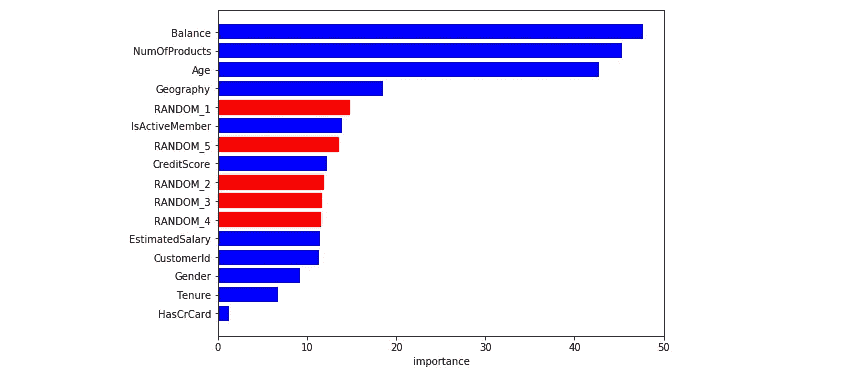
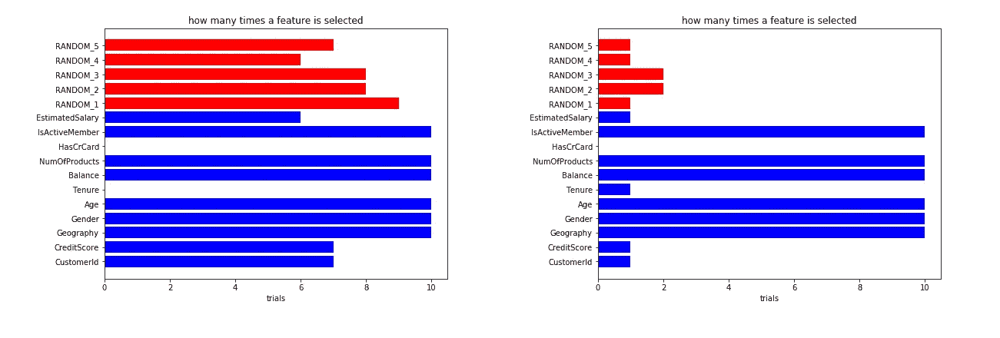
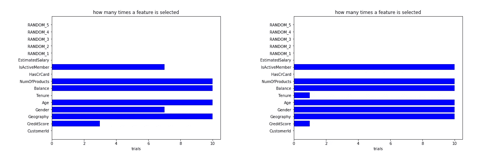

# 博鲁塔和 SHAP 为更好的功能选择

> 原文：<https://towardsdatascience.com/boruta-and-shap-for-better-feature-selection-20ea97595f4a?source=collection_archive---------9----------------------->

## 不同特征选择技术的比较及其选择

克里斯汀·塔博瑞在 [Unsplash](https://unsplash.com?utm_source=medium&utm_medium=referral) 上的照片

当我们执行监督任务时，我们面临的问题是在我们的机器学习管道中加入适当的特征选择。简单地在网上搜索，我们可以访问各种各样的关于特征选择过程的资源和内容。

总之，有不同的方法来执行特征选择。文献中最著名的是基于**过滤器的**和基于**包装器的**技术。在基于过滤器的程序中，非监督算法或统计用于查询最重要的预测值。在基于包装器的方法中，监督学习算法被迭代拟合以排除不太重要的特征。

通常，基于包装器的方法是最有效的，因为它们可以提取特征之间的相关性和依赖性。另一方面，他们显示更容易过度适应。为了避免这种缺乏并利用基于包装器的技术的优点，我们需要做的就是采用一些简单而强大的技巧。我们可以通过一点数据理解和一个*秘密成分*来实现更好的特征选择。别担心，我们不用黑魔法而是用 **SHAP 的力量**。

为了在特性选择过程中更好地利用 SHAP 的能力，我们发布了[**shap-hype tune**](https://github.com/cerlymarco/shap-hypetune):*一个 python 包，用于同时进行超参数调整和特性选择。*它允许在为梯度推进模型定制的单个管道中组合特征选择和参数调整。它支持网格搜索或随机搜索，并提供基于包装器的特征选择算法，如**递归特征消除(RFE)、递归特征添加(RFA)、**或 **Boruta** 。进一步的添加包括使用 SHAP 重要性进行特征选择，而不是传统的基于原生树的特征重要性。

在本帖中，我们将展示正确执行功能选择的实用程序。如果我们高估了梯度增强的解释能力，或者仅仅是我们没有一个总体的数据理解，这就揭示了事情并不像预期的那么简单。我们的范围是检测各种特征选择技术的表现如何，以及为什么 SHAP 的使用会有所帮助。

# 博鲁塔是什么？

每个人都知道(或者很容易理解)一个**递归特征消除**是如何工作的。它递归地适合考虑较小特征集的监督算法。其中被排除的特征是根据一些权重的大小(例如，线性模型的系数或基于树的模型的特征重要性)被认为*不太重要*的特征。

**Boruta** 和 RFE 一样，是一种基于包装器的特征选择技术。它不太为人所知，但同样强大。Boruta 背后的想法真的很简单。给定一个表格数据集，我们迭代地将监督算法(通常是基于树的模型)应用于数据的扩展版本。在每次迭代中，扩展版本由原始数据和水平附加的混洗列的副本组成。我们只维护每个迭代中的特性:

*   比最好的混洗特征具有更高的重要性；
*   比随机机会(使用二项式分布)更好。

RFE 和博鲁塔都使用监督学习算法来提供特征重要性排名。这个模型是这两种技术的核心，因为它判断每个特征的好坏。这里可能会出现问题。**决策树的标准特征重要性方法倾向于高估高频或高基数变量的重要性**。对于博鲁塔和 RFE 来说，这可能导致错误的特征选择。

# 实验

我们从 [Kaggle](https://www.kaggle.com/santoshd3/bank-customers) 收集数据集。我们选择一个银行客户数据集，试图预测客户是否很快会流失。在开始之前，**我们向数据集添加一些由简单噪声**产生的随机列。我们这样做是为了理解我们的模型是如何计算特征重要性的。我们开始拟合和调整我们的梯度推进(LGBM)。我们用不同的分裂种子重复这个过程不同的时间，以克服数据选择的随机性。平均特征重要性如下所示。

各种分裂试验的平均特征重要性[图片由作者提供]

令人惊讶的是，随机特征对我们的模型非常重要。另一个错误的假设是认为 *CustomerId* 是一个有用的预测器。这是客户的唯一标识符，被梯度推进错误地认为是重要的。

鉴于这些前提，让我们在数据上尝试一些特征选择技术。我们从 RFE 开始。我们将参数调整与特征选择过程相结合。如前所述，我们对不同的分裂种子重复整个过程，以减轻数据选择的随机性。对于每个试验，我们考虑标准的基于树的特征重要性和 SHAP 重要性来存储所选择的特征。通过这种方式，我们可以画出在试验结束时一个特征被选择了多少次。

用 RFE(左)选择一个特征的次数；用 RFE + SHAP(右)选了多少次特写[图片由作者提供]

在我们的案例中，具有标准重要性的 RFE 显得不准确。它通常选择与 *CustomerId 相关的随机预测值。* SHAP + RFE 最好不要选择无用的功能，但同时也要承认一些错误的选择。

作为最后一步，我们重复相同的程序，但是使用 Boruta。

用 Boruta 选择一个特征的次数(左)；用博鲁塔+ SHAP(右)选了多少次特征[图片由作者提供]

标准的 Boruta 在不考虑随机变量和 *CustomerId* 方面做得很好。SHAP +博鲁塔似乎也做得更好，减少了选择过程中的差异。

# 摘要

在这篇文章中，我们介绍了 RFE 和博鲁塔(来自 [**shap-hypetune**](https://github.com/cerlymarco/shap-hypetune) )这两个有价值的特性选择包装器方法。此外，我们用 SHAP 代替了特征重要性的计算。 **SHAP 帮助减轻了选择高频或高基数变量的影响**。总之，当我们有一个完整的数据理解时，RFE 可以单独使用。博鲁塔和 SHAP 可以消除对经过适当验证的选拔过程的任何疑虑。

**如果你对题目感兴趣，我建议:**

*   [**SHAP 用于特征选择和超参数调谐**](/shap-for-feature-selection-and-hyperparameter-tuning-a330ec0ea104)
*   [**递归特征选择:增加还是消除？**](/recursive-feature-selection-addition-or-elimination-755e5d86a791)
*   [T21【博鲁塔】SHAP 为时态特征选择](/boruta-shap-for-temporal-feature-selection-96a7840c7713)
*   [**漂移检测 SHAP:有效的数据漂移监控**](/shap-for-drift-detection-effective-data-shift-monitoring-c7fb9590adb0)

[**查看我的 GITHUB 回购**](https://github.com/cerlymarco/MEDIUM_NoteBook)

保持联系: [Linkedin](https://www.linkedin.com/in/marco-cerliani-b0bba714b/)