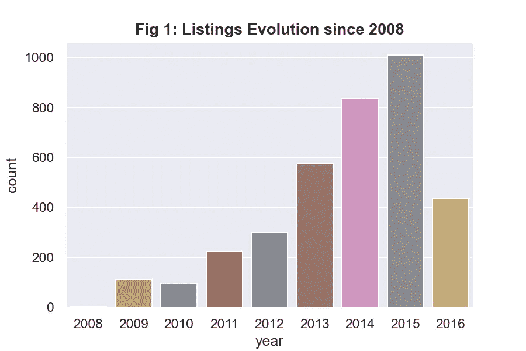
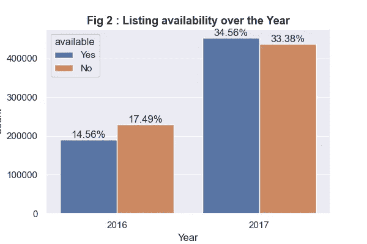
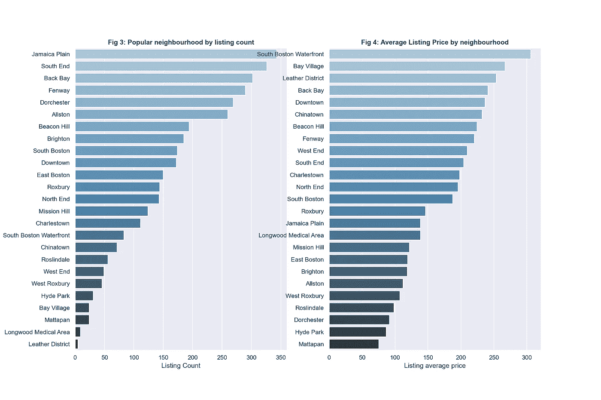
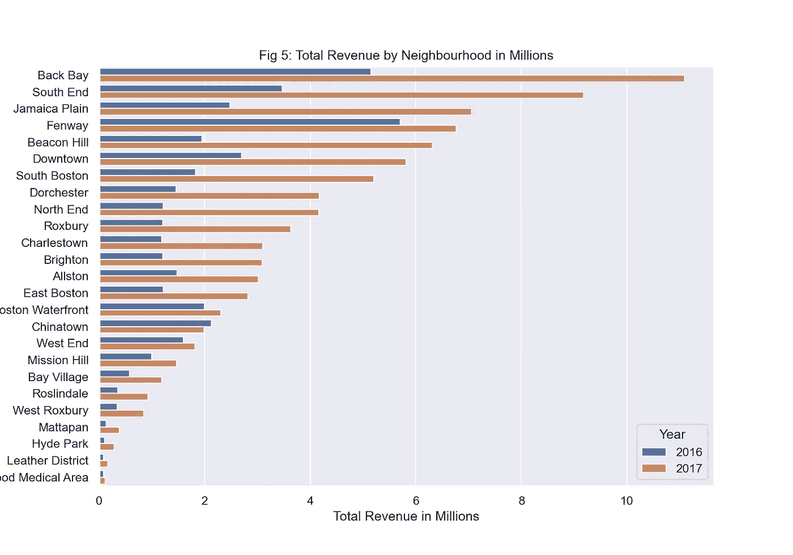
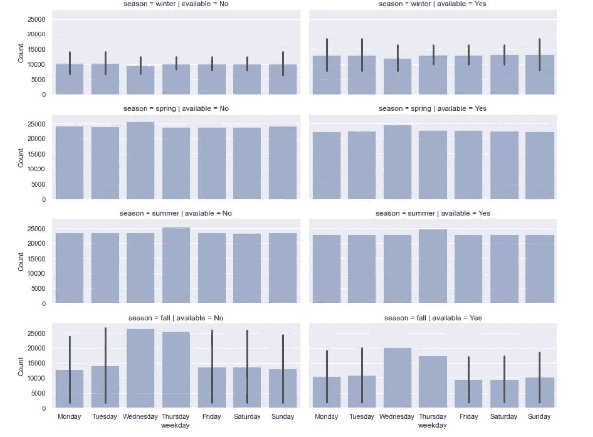
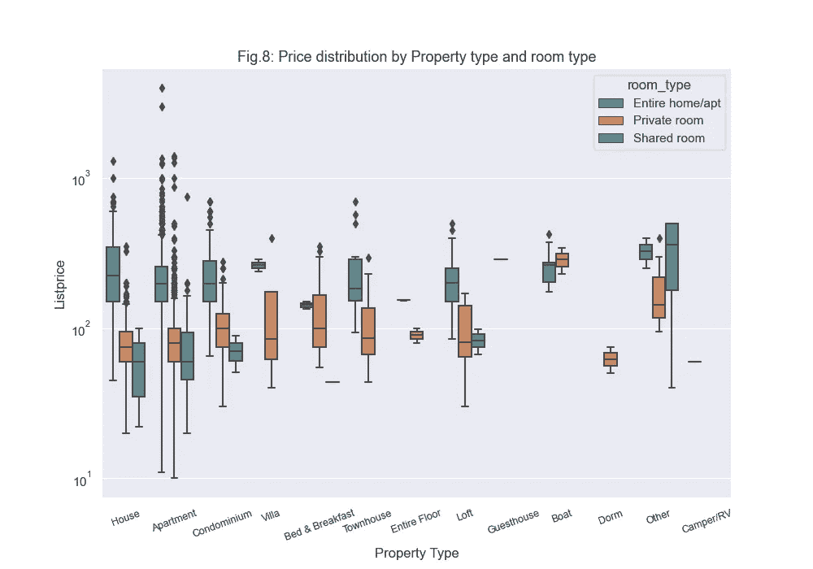
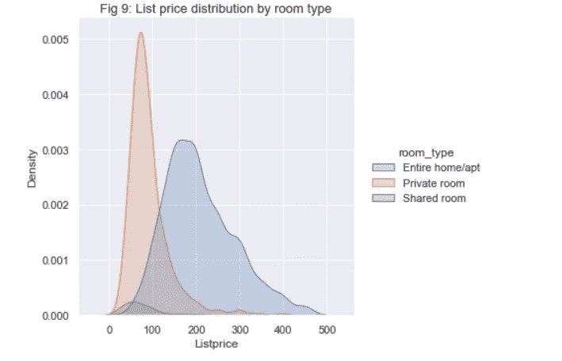
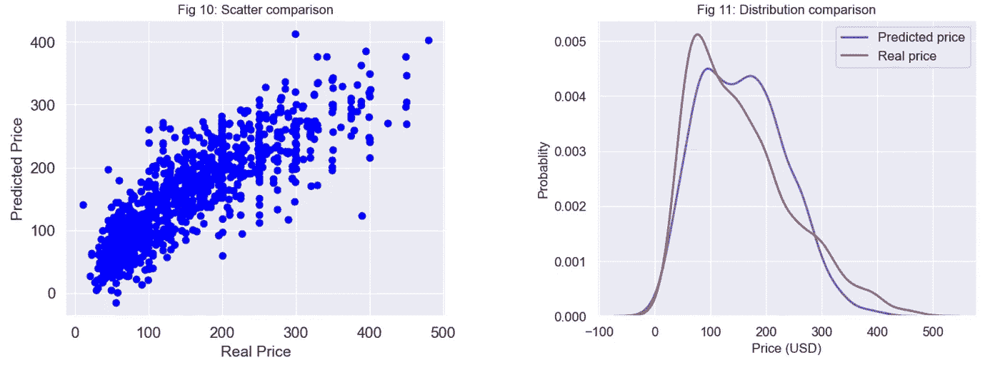

# 波士顿 Airbnb 业务分析和挂牌价格预测

> 原文：<https://towardsdatascience.com/boston-airbnb-business-analysis-and-listing-price-prediction-980d409a0482?source=collection_archive---------27----------------------->

# **简介**

答 irbnb 是一个在线市场，它安排并提供人们可以临时居住的房间或房屋。该公司只是一个连接租户和业主的经纪人，然后从每笔预订中获得佣金。无论你是主人还是客人，对业务有一个知情的决定是很重要的，并决定何时将你的房产挂牌出租，或以可承受的价格参观城市。我在这里分析了波士顿的业务是如何增长的，并提出了一个模型来预测给定上市的价格。完整的笔记本和代码可以在我的 [GitHub](https://github.com/tmbothe/AirBnB_Analysis) 上找到。


[https://unsplash.com/photos/iRKv_XiN-M](https://unsplash.com/photos/iRKv_XiN--M)

我的分析将集中在 2008 年至 2016 年收集的 Airbnb 数据。该数据集有 3585 个列表，95 个特征描述了业务的不同方面。原始数据集可以从 [Kaggle](https://www.kaggle.com/airbnb/boston) 下载。

下面描述的分析只是基于我的观察，并不是真正的专家对如何开展业务的观点。我将尝试回答以下问题:

1-波士顿的 Airbnb 业务发展如何？

2-最受欢迎的社区是什么？是什么让他们受欢迎？

3-公司最忙的时候是什么时候？

4-影响波士顿 Airbnb 价格的特征是什么？我们可以根据预测模型预测新房源的租赁价格吗？

## 第一部分:波士顿的 Airbnb 业务发展如何？



作者的情节

正如我们在上面的*图 1* 中看到的，这项业务始于 2008 年，几乎没有上市，但多年来持续增长，仅在 2015 年就达到 1000 多家上市公司。2016 年的下降只是因为数据是在年底前收集的。

我们还提供了 2016 年和 2017 年的上市信息。我们看到，从 2016 年到 2017 年，可供预订的房源数量翻了一番，如下图*图 2* 所示。



作者的情节

## 第二部分:什么是最受欢迎的社区？是什么让他们受欢迎？

数据集中有 25 个不同的社区，下面是社区的列表数量和平均价格的分布。



邻域排名-由作者绘制

就上市数量而言，我们看到*牙买加平原、南端、后湾、芬威、多切斯特、奥尔斯顿*是最受欢迎的，每个城市都有超过 250 个上市项目。*南波士顿海滨、海湾村、皮革区、后湾、市中心、唐人街*挂牌均价较高。房源较少的小区，挂牌均价似乎较高。



作者的情节

正如我们在*图 5 中看到的。*如上图，这些年来，所有社区的收入都在增长。我们还注意到，列表数量越多的社区收入越多。

## 第三部分:生意最忙的时候是什么时候？

对于计划游览这座城市的人来说，了解什么时候是最忙的季节，什么时候是最忙的日子，以便做出相应的计划是很重要的。



图 7:按季节和星期列出可用性分布——按作者绘图

正如我们在上面的*图 7* 中看到的，最繁忙的季节是春季和夏季。我们看到，一周中的所有日子都有几乎相同的趋势，但周三的预订略有增加。毫无疑问，冬季是活动最少的最慢季节，因为波士顿会变得非常寒冷并下雪。有趣的是，在秋季，周三和周四似乎比一周中的其他日子更繁忙。秋天周末其实活动比较少。

## 第三部分:波士顿 Airbnb 中影响价格的特性有哪些？我们可以根据预测模型预测新房源的租赁价格吗？

在进入建模部分之前，我们将调查价格分布，然后检查可能影响价格的缺失值和异常值的存在。



作者的情节

上图 8 显示了按物业类型和房间类型划分的价格分布。与私人房间和共享房间相比，整个房间/公寓的平均价格在所有类型的房产中都较高。

然而，我们注意到异常值的存在，这些异常值是矩形以外的点。为了保持预测的一致性，我们将去掉这些极值。准确地说，我们将删除所有大于平均值 2 个标准偏差的数据点和小于平均值 2 个标准偏差的值。去除异常值后，*图 9* 显示了不同房间类型的整体价格范围。



作者的情节

我们可以看到有少量价值低于 200 美元的共享房间。*包房和整个家/公寓*代表了生意的核心，价格在不同的区间。

## 影响价格的前 15 个数字列

以下是对标价影响较大的前 15 列:

```
['accommodates', 'cleaning_fee', 'bedrooms', 'beds',
       'host_listings_count', 'host_total_listings_count',
       'calculated_host_listings_count', 'guests_included',
       'review_scores_location', 'availability_30', 'host_acceptance_rate',
       'bathrooms', 'availability_60', 'availability_90',
       'review_scores_cleanliness']
```

## 影响价格的顶级分类列

```
['neighbourhood_cleansed',
 'property_type',
 'room_type',
 'bed_type',
 'cancellation_policy',
 'host_is_superhost',
 'instant_bookable',
 'is_location_exact',
 'require_guest_phone_verification',
 'require_guest_profile_picture']
```



作者的情节

除了上面的数字特征和分类特征之外，我们还处理了*市容*列，这将在一次性编码后向我们的数据集添加 45 列。最后，我们将用来预测价格的最终数据集有 3494 行和 89 列。

上图(*图 10 和图 11* )显示了预测价格和实际价格之间的相关性。我们看到预测价格和真实价格之间有很好的相关性。

> 预测后，R _ sqauared(这是数据与拟合回归线接近程度的统计度量。它也被称为决定系数，或多元回归的多重决定系数。)在训练数据上是 0.69，在测试数据上是 0.701。这表明我们可以很有把握地预测上市价格。

## 评估结果

我们仅通过挑选与价格密切相关的前 15 个数值变量、前 20 个分类变量就取得了上述结果。

为了改善我们的结果，我们设置了一个网格，并运行我们的算法来搜索导致最佳结果的特征集。我们发现，使用 23 个数值变量，45 个分类变量，我们在测试数据上获得了 0.704 的`*R_sqauared*`，与我们的原始结果相比，这并不是一个很大的改进。

我们已经使用上面找到的最佳特征尝试了**随机森林回归器**，并且在训练数据上获得了`*R_sqauared*` 0.95，在测试数据上获得了 0.73，这并不是比较两个分数之间方差的更好分数。

## 结论

在这篇博客中，我们分析了波士顿市的 Airbnb 数据，并回答了一些商业问题，这些问题可以让主人和客人就何时发布房源或何时游览这座城市做出明智的决定。

我们使用了一些功能来预测给定列表的标价。尽管我们的结果相当显著，但仍有改进的空间，可以处理一些栏目，如评论(来自客人的评论)、帖子的*摘要*、d *描述、邻居概述、房屋规则。*