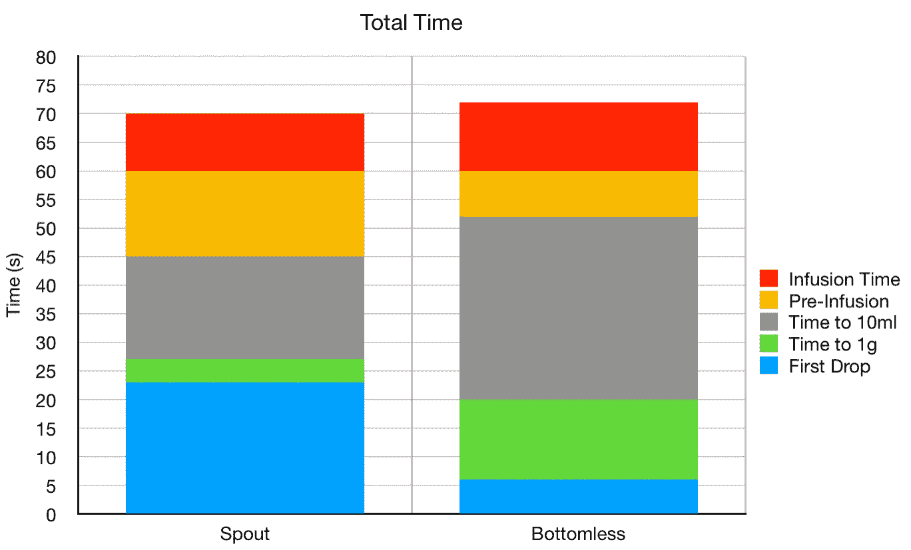

# 用于浓缩咖啡的无底 vs 喷动移动式过滤器

> 原文：<https://towardsdatascience.com/bottomless-vs-spouted-portafilter-for-espresso-dfcce8a461d5?source=collection_archive---------8----------------------->

## 咖啡数据科学

## 一个好的理由去无底的高峰

几年前我去了一家[无底 portafilter](https://medium.com/geekculture/getting-naked-making-my-portafilter-bottomless-6dfd63d54e7c) ，从此一去不返。我把所有的机器都换成了无底的 portafilter，只有一台除外；La Peppina 脱衣服更有挑战性。深不见底的 portafilter 非常需要能够实时看到浓缩咖啡的发展，所以我想给出两个镜头的比较，以显示味道和提取的差异。

这是底部的样子。

左:原金 Expresso Portafilter，右:无底与 Pesado 精密篮子。所有图片由作者提供。

每一个镜头都是在 Kim Express 上用一个 [Pesado 精密过滤器](/espresso-filter-comparison-pesado-vs-vst-18a1321e62d)篮拍摄的。咖啡是同样的烘焙，而且是在同样的韩国研磨机上研磨的。

# 喷动移动式过滤器

# 无底移动式过滤器

从冰球投篮的角度来看，差异很小:

左:喷出，右:无底

# 绩效指标

我使用两个指标来评估技术之间的差异:最终得分和咖啡萃取。

[**最终得分**](https://towardsdatascience.com/@rmckeon/coffee-data-sheet-d95fd241e7f6) 是评分卡上 7 个指标(辛辣、浓郁、糖浆、甜味、酸味、苦味和回味)的平均值。当然，这些分数是主观的，但它们符合我的口味，帮助我提高了我的拍摄水平。分数有一些变化。我的目标是保持每个指标的一致性，但有时粒度很难确定。

</coffee-solubility-in-espresso-an-initial-study-88f78a432e2c>**使用折射仪测量总溶解固体量(TDS)，该数字结合咖啡的输出重量和输入重量，用于确定提取到杯中的咖啡的百分比，称为**提取率(EY)** 。**

# **表演**

**对于口味来说，无底的 portafilter 是一个明显的赢家，对于任何想改善他们的浓缩咖啡的人来说，这是一个真正的游戏改变者。这是因为镜头的一些部分停留在移动式过滤器上，我还怀疑一个喷动的移动式过滤器可能会导致流动的一些变化。用玻璃或透明塑料过滤器来检验这种效果是很有趣的。最大的改进是甜味、酸味、苦味和回味。**

********

**就 EY 而言，它们非常相似，所以我很好奇是什么机制导致了味道的差异。**

**时差更难看出。所以我把时间量到 1g，时间量到 10ml。这些在无底的地方发生得更快，可能是因为在总时间相同的情况下，液体的移动距离更短。**

****

**无底移动式过滤器的两个优点是:**

1.  **人们可以在拍摄过程中看到结果并进行调整。**
2.  **移动式过滤器影响味道。**

**我强烈推荐那些对提升他们的咖啡体验感兴趣的人去无底咖啡吧。**

**如果你愿意，可以在 Twitter 和 YouTube 上关注我，我会在那里发布不同机器上的浓缩咖啡视频和浓缩咖啡相关的东西。你也可以在 [LinkedIn](https://www.linkedin.com/in/robert-mckeon-aloe-01581595?source=post_page---------------------------) 上找到我。也可以关注我[中](https://towardsdatascience.com/@rmckeon/follow)和[订阅](https://rmckeon.medium.com/subscribe)。**

# **[我的进一步阅读](https://rmckeon.medium.com/story-collection-splash-page-e15025710347):**

**[浓缩咖啡系列文章](https://rmckeon.medium.com/a-collection-of-espresso-articles-de8a3abf9917?postPublishedType=repub)**

**[工作和学校故事集](https://rmckeon.medium.com/a-collection-of-work-and-school-stories-6b7ca5a58318?source=your_stories_page-------------------------------------)**

**[个人故事和关注点](https://rmckeon.medium.com/personal-stories-and-concerns-51bd8b3e63e6?source=your_stories_page-------------------------------------)**

**[乐高故事启动页面](https://rmckeon.medium.com/lego-story-splash-page-b91ba4f56bc7?source=your_stories_page-------------------------------------)**

**[摄影飞溅页](https://rmckeon.medium.com/photography-splash-page-fe93297abc06?source=your_stories_page-------------------------------------)**

**[使用图像处理测量咖啡研磨颗粒分布](https://link.medium.com/9Az9gAfWXdb)**

**[改善浓缩咖啡](https://rmckeon.medium.com/improving-espresso-splash-page-576c70e64d0d?source=your_stories_page-------------------------------------)**

**[断奏生活方式概述](https://rmckeon.medium.com/a-summary-of-the-staccato-lifestyle-dd1dc6d4b861?source=your_stories_page-------------------------------------)**

**[测量咖啡研磨分布](https://rmckeon.medium.com/measuring-coffee-grind-distribution-d37a39ffc215?source=your_stories_page-------------------------------------)**

**[咖啡萃取](https://rmckeon.medium.com/coffee-extraction-splash-page-3e568df003ac?source=your_stories_page-------------------------------------)**

**[咖啡烘焙](https://rmckeon.medium.com/coffee-roasting-splash-page-780b0c3242ea?source=your_stories_page-------------------------------------)**

**[咖啡豆](https://rmckeon.medium.com/coffee-beans-splash-page-e52e1993274f?source=your_stories_page-------------------------------------)**

**[浓缩咖啡用纸质过滤器](https://rmckeon.medium.com/paper-filters-for-espresso-splash-page-f55fc553e98?source=your_stories_page-------------------------------------)**

**[浓缩咖啡篮及相关主题](https://rmckeon.medium.com/espresso-baskets-and-related-topics-splash-page-ff10f690a738?source=your_stories_page-------------------------------------)**

**[意式咖啡观点](https://rmckeon.medium.com/espresso-opinions-splash-page-5a89856d74da?source=your_stories_page-------------------------------------)**

**[透明 Portafilter 实验](https://rmckeon.medium.com/transparent-portafilter-experiments-splash-page-8fd3ae3a286d?source=your_stories_page-------------------------------------)**

**[杠杆机维护](https://rmckeon.medium.com/lever-machine-maintenance-splash-page-72c1e3102ff?source=your_stories_page-------------------------------------)**

**[咖啡评论和想法](https://rmckeon.medium.com/coffee-reviews-and-thoughts-splash-page-ca6840eb04f7?source=your_stories_page-------------------------------------)**

**[咖啡实验](https://rmckeon.medium.com/coffee-experiments-splash-page-671a77ba4d42?source=your_stories_page-------------------------------------)**