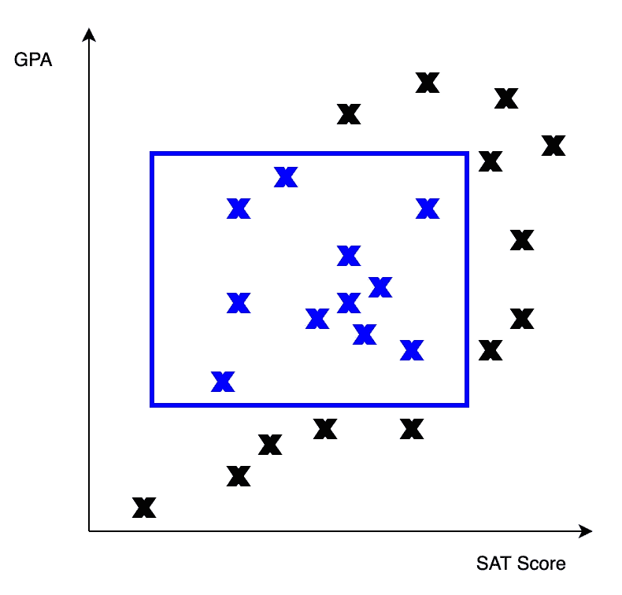
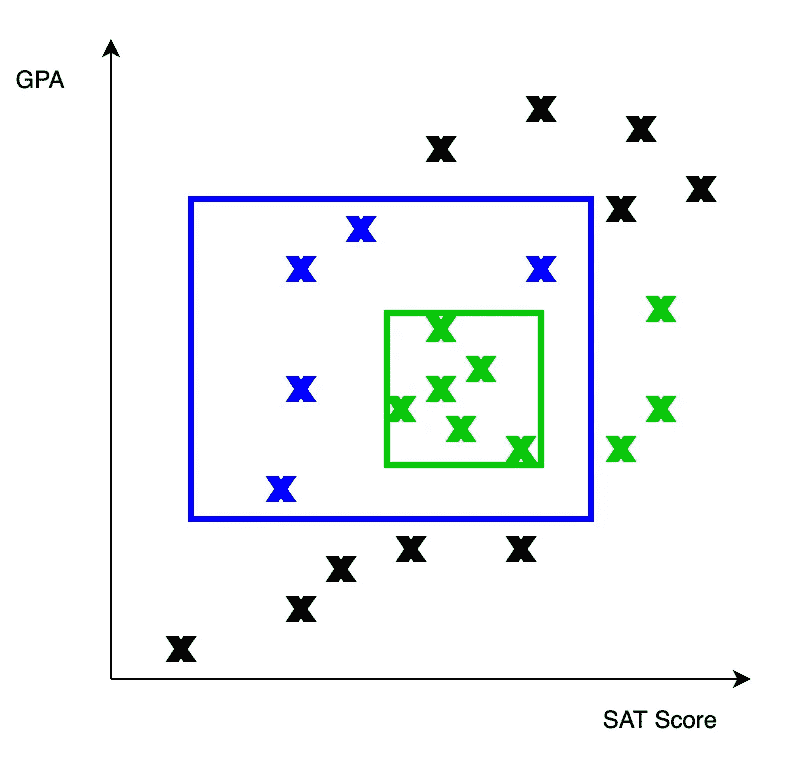
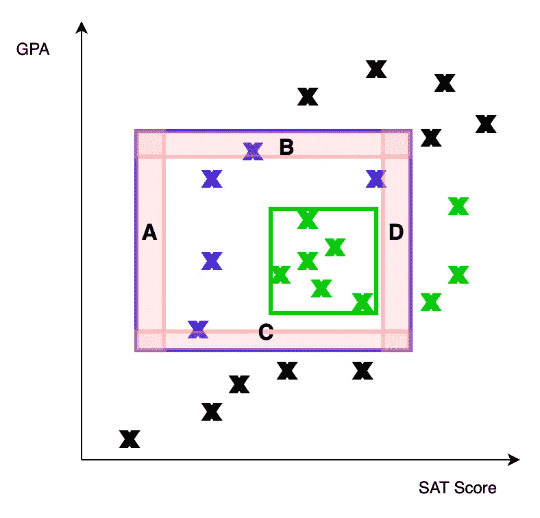
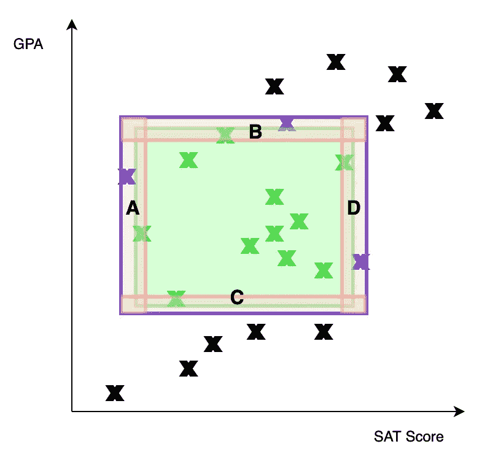

# 限制机器学习算法的样本大小

> 原文：<https://towardsdatascience.com/bounding-the-sample-size-of-a-machine-learning-algorithm-d01d4775263c?source=collection_archive---------32----------------------->

## 限制机器学习算法的样本大小非常有帮助。请继续阅读，找出方法。

米卡·鲍梅斯特在 [Unsplash](https://unsplash.com?utm_source=medium&utm_medium=referral) 上的照片

机器学习算法的一个常见问题是，我们不知道我们需要多少训练数据。解决这个问题的一个常见方法是经常使用的策略:保持训练，直到训练误差停止减小。然而，这仍然存在问题。我们怎么知道我们没有陷入局部最小值？如果训练误差有奇怪的行为，有时在训练迭代中保持平稳，但有时急剧下降，该怎么办？底线是，如果没有一种精确的方法来知道我们需要多少训练数据，那么我们是否完成了训练总是有一些不确定性。

然而，在某些问题中，实际上有可能从数学上确定我们需要多少训练数据。想法是这样的:我们有两个参数ε和 1 — δ。这些参数分别代表我们期望的测试集误差和我们期望的达到该测试集误差的概率。有了这两个参数，我们的目标是找到 m，达到这两个参数所需的最小样本数(训练数据)。例如，假设我们有ε = 0.05，δ = 0.1(所以 1 — δ = 0.9)。然后，我们的目标是找到最小数量的样本 m，这样我们的学习算法有 90%的机会在测试集上实现小于 5%的误差。

让我们来看一个具体的问题，看看这种方法是如何使用的。我们的两个自变量是 SAT 成绩和 GPA。我们的目标是用这两个变量来预测一个人是否是普通学生。我们把普通学生定义为 SAT 成绩和 GPA 都在中等水平的人。图形上，我们可以把 SAT 成绩放在 x 轴上，GPA 放在 y 轴上。所以下图中的矩形代表的是一个“一般学生”。长方形里面的每个人都是普通学生，外面的每个人都不是。我们学习算法的目标是计算出这个矩形的大小和位置。

蓝点是一般学生。黑点不是。蓝色矩形代表平均水平学生的界限。图片作者。

接下来的事情是定义我们的学习算法。我们得到了一个样本(SAT 分数，GPA)对，以及每一对是否是一个普通学生。我们的算法是这样工作的:取所有被标记为平均值的配对，然后画出适合这些配对的最小矩形。这个算法更容易用图片来表示:

绿点是我们的样本。我们的算法在样本中平均的点周围画出最小的矩形。图片作者。

现在让我们考虑一下这个算法是如何依赖于样本大小的。样本量越大，样本中代表的蓝色矩形(真实的平均学生临界值)就越多。因此，绿色矩形将覆盖更多的蓝色矩形。换句话说，样本量越大，误差越小，这是意料之中的。我们的目标是根据ε和δ明确定义这种关系。

首先，我们确定一个ε。回想一下，ε是我们希望达到的误差——我们希望误差不超过ε(更低也是可以接受的)。接下来，我们将构建一个ε可以实现的场景，并找出该场景的概率。考虑从蓝色矩形的四个边“生长”矩形。这四个新矩形的概率质量为ε/4。我们可以在图表上用 A、B、C 和 d 来表示它们。

每个红色矩形的概率质量为ε/4。图片作者。

首先，请注意，如果误差>ε，样本在至少一个矩形中一定没有点。这是因为如果样本在所有矩形中都有一个点，误差最多为ε，因为我们构建了四个矩形，使其最大组合概率质量为ε。

四个红色矩形中都有点的样本。因此，最大可能误差小于ε。图片作者。

所以 p(误差>ε) < P(sample has no point in at least 1 rectangle). There are 4 rectangles, so we have P(sample has no point in at least 1 rectangle) < P(sample has no point in A) + P(sample has no point in B) + P(sample has no point in C) + P(sample has no point in D) = 4* P(sample has no point in A) by symmetry, as we set all rectangles to have the same probability mass ε/4\. Because our sample size is m, P(sample has no point in A) = (1 — ε/4)^m. Putting it all together, we have P(Error > ε) < 4(1 — ε/4)^m. Thus, given an arbitrary error ε, if we want to upper bound the probability of that error occurring with δ, we set δ > 4(1 — ε/4)^m.剩下的就是求解 m 得到 m > ln(δ/4) / ln(1 — ε/4)。我们可以用不等式(1 — x) < e^(-x) to simplify the expression to **m > (4/ε)ln(4/δ)** 。我们已经实现了根据ε和δ限制样本大小 m 的目标。

像这样的绑定非常有用。我们可以直接计算出要达到某个误差的某个概率需要多少样本。例如，如果我们希望有 99%的概率得到 1%的更好的误差，我们需要(4/0.01)ln(4/0.01) = 2397 个训练样本。如果我们能够为所有机器学习算法计算出这样的界限，生活将会变得容易得多。不幸的是，其他机器学习算法比我们的矩形算法更复杂，因此数学分析可能很难处理。其他时候，可能会找到一个界限，但这个界限可能太高，以至于在功能上没有用。然而，我相信机器学习理论的进步最终将为大多数机器学习算法提供有用的界限。

在本文中，我们根据ε和δ推导了一个简单学习问题的样本大小界限。如果你对这个分析机器学习算法的通用框架感兴趣，可以去看看我写的关于 [PAC 学习](/what-it-means-for-something-to-be-learnable-pac-learnability-c84de9c061ad)的文章。如果你有任何问题/评论，请告诉我，感谢你的阅读！