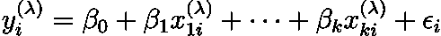

# Box-Cox 变换是我们需要的魔法

> 原文：<https://towardsdatascience.com/box-cox-transformation-is-the-magic-we-need-3d0ef9a18339?source=collection_archive---------16----------------------->

## 选择正确型号的聪明绝招

马修·施瓦茨在 [Unsplash](https://unsplash.com?utm_source=medium&utm_medium=referral) 上的照片

在进行统计分析时，我们通常希望得到正态分布的数据。这是因为事实上绝大多数的统计检验只有当我们在正态分布的数据点上使用它们时才是可解释的。

但是，如果我们的数据是非正态的，我们可能希望调查原因并执行相关的转换，以获得大致的正态分布。实现这一点的最流行的方法之一是 Box-Cox 变换。

# 什么是数据转换？

转换数据意味着对数据集的每个部分执行相同的数据操作。我们可以区分两组主要的变换:线性和非线性。

当我们的数据简单地除以或乘以某个常数，或者从我们的数据集中添加这样的常数或底物时，就会发生线性变换。因此，线性变换后，我们无法观察到数据分布的变化，我们的数据看起来不会比以前更正常。

线性模型。图片来自 https://en.wikipedia.org/wiki/Linear_regression

非线性变换可能更复杂。我们希望改变数据分布的形状，而不是基本的数学运算。它通常涉及对数、指数等的使用。其中一个例子是对数线性模型，它可以解释为简单线性模型变量的对数:

您可以在我之前的文章中找到关于这个模型的更多细节:

</when-should-we-use-the-log-linear-model-db76c405b97e>  

# 博克斯-考克斯方法

这种转变背后的故事被视为一个神话。据说，统计学家乔治·博克斯和大卫·考克斯爵士在威斯康辛州见过一次面，他们得出结论说，他们必须一起写一篇科学论文，因为他们的名字很相似，而且他们都是英国人。不管这个故事的真实性如何，最终，他们合作并在 1964 年发表的一篇论文中提出了他们的转变，并签上了他们的名字。

乔治·博克斯。图片来自[https://en.wikipedia.org/wiki/George_E._P._Box](https://en.wikipedia.org/wiki/George_E._P._Box)

Box-Cox 变换是一种非线性变换，允许我们在线性和对数线性模型之间进行选择。通过这个操作，我们可以概括我们的模型，并在必要时选择一个变量。转换公式定义如下:

λ参数通常在-5 到 5 之间变化。考虑整个范围的值，并选择最适合我们数据集的值。

例如，当我们用 1 代替λ时，我们得到:

另一方面，当我们用-1 代替λ时，我们得到:

当 lambda 等于 0 时，最困难的部分是计算，因为我们剩下一个不确定的值。函数极限看起来像这样:

我们得到不定形式。在这种情况下，采用德累斯顿法则并用λ来区分是可行的:

大卫·考克斯爵士。图片来自[https://en . Wikipedia . org/wiki/David _ Cox _(统计师)](https://en.wikipedia.org/wiki/David_Cox_(statistician))

# 我们什么时候可以使用它？

所描述的变换经常用于因变量和单个自变量的建模。在这种情况下，我们得到了 Box-Cox 模型:

> “所有的模型都是错的，但有些是有用的。”—乔治·博克斯

同样，对于等于 1 的λ，该模型可以被解释为简单的线性模型:

对于等于-1 的λ，我们获得变量倒数的线性模型:

最后，对于等于 0 的λ，我们有一个对数线性模型:

正如你可能看到的，当我们用λ参数估计 Box-Cox 模型时，我们可以假设哪种函数形式最适合我们的数据。如果我们的λ参数接近 0，我们应该使用对数线性模型。当λ接近 1 时，我们应该使用简单的线性模型，而当λ接近-1 时，最合适的模型将是处理变量反演的模型。

我们必须记住，即使 Box-Cox 模型的个别情况是线性的，一般模型也有非线性的性质。因此，在大多数统计软件中，它通常是用数字来估计的。

# 参考

[1]麦切尔斯基，耶日。 *Ekonometria。*2009 年，UW WNE

[2]https://en.m.wikipedia.org/wiki/L%27H%C3%B4pital%27s_rule

[3][https://www.statisticshowto.com/box-cox-transformation/](https://www.statisticshowto.com/box-cox-transformation/)

[https://en.wikipedia.org/wiki/Power_transform](https://en.wikipedia.org/wiki/Power_transform)