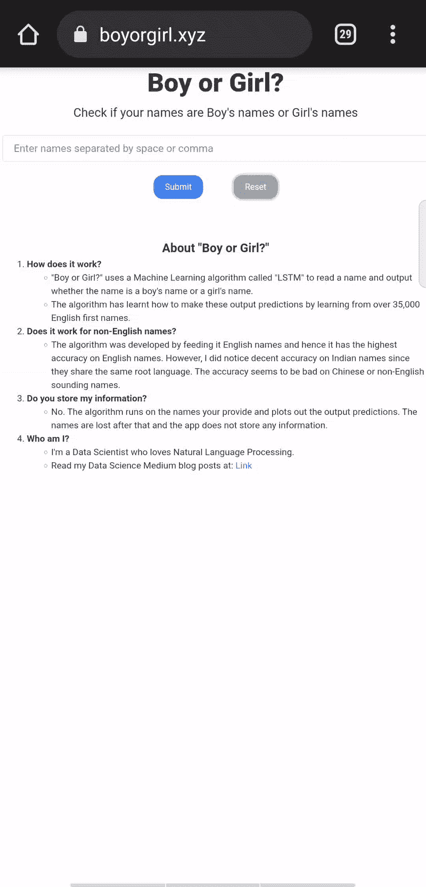
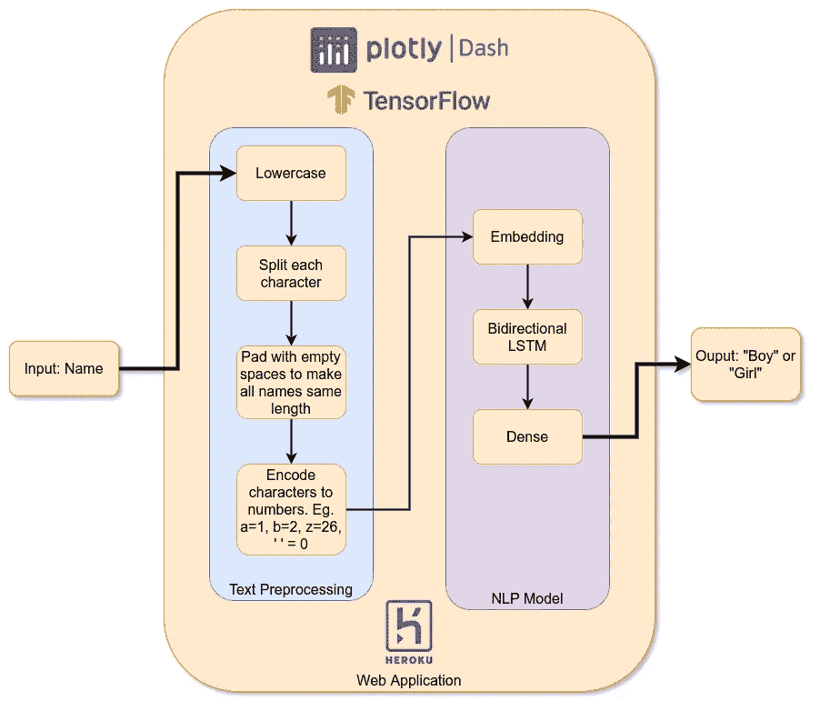
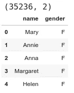
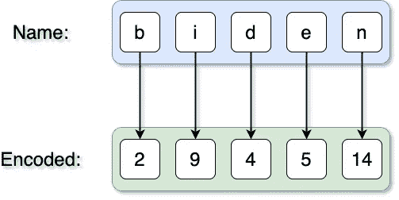
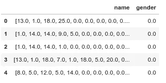
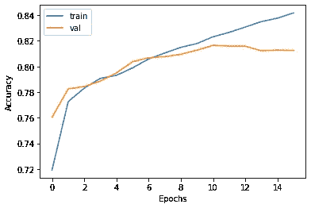
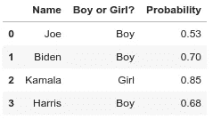

# 男孩还是女孩？一个机器学习的网络应用程序从名字中检测性别

> 原文：<https://towardsdatascience.com/boy-or-girl-a-machine-learning-web-app-to-detect-gender-from-name-16dc0331716c?source=collection_archive---------10----------------------->

## 在 Tensorflow、Plotly Dash 和 Heroku 中使用自然语言处理找出一个名字的可能性别。


照片由[戴尼斯·格雷夫里斯](https://unsplash.com/@dainisgraveris?utm_source=medium&utm_medium=referral)在 [Unsplash](https://unsplash.com?utm_source=medium&utm_medium=referral) 上拍摄

作为初为人父者，给孩子取名字是你必须做出的最有压力的决定之一。特别是对于像我这样一个数据驱动的人来说，在没有任何关于我孩子性格和偏好的数据的情况下，就必须决定一个名字，这简直是一场噩梦！

由于我的名字以“玛丽”开头，我经历了无数次人们通过电子邮件和短信称呼我为“小姐”的经历，但当我们最终见面或交谈时，才失望地意识到我实际上是一个男人😜。所以，当我和妻子为我们的小女儿取名时，我们问自己一个重要的问题:

> 人们能够识别出这个名字指的是一个女孩**而不是一个男孩**吗？****

事实证明，我们可以使用机器学习来帮助我们检查潜在的名字是否会更多地与男孩或女孩联系在一起！要查看我为此开发的应用程序，请前往[https://www . boyorgirl . XYZ](https://www.boyorgirl.xyz)。



“boyorgirl”应用的 Gif 视频。作者图片

这篇文章的其余部分将讨论技术细节，包括

1.  获得性别训练数据集的名称
2.  预处理名称，使其与机器学习(ML)模型兼容
3.  开发一个自然语言处理(NLP) ML 模型，读入一个名字并输出是男孩还是女孩的名字
4.  构建一个简单的 web 应用程序，供人们与模型进行交互
5.  在互联网上发布应用程序

# 解决方案的架构



应用程序架构。作者图片

# 获取性别培训数据集的名称

为了训练任何机器学习模型，我们需要大量的标记数据。在这种情况下，我们需要大量的姓名以及该姓名的相关性别。幸运的是，谷歌云的 Bigquery 有一个名为`USA_NAMES` [ [Link](https://console.cloud.google.com/marketplace/product/social-security-administration/us-names) 的免费开放数据集，它“包含了在美国出生的所有社会保障卡申请人的姓名。”数据集包含大约 35000 个名字和相关的性别，这对于我们的模型来说非常好。



数据集片段。作者图片

# 数据预处理

人名是文本数据，而 ML 模型只能处理数字数据。为了将我们的文本转换成数字表示，我们将执行以下步骤。



名称编码。作者图片

1.  小写的名字，因为每个字符的大小写不传达任何关于一个人的性别的信息。
2.  拆分每个字符:我们正在构建的 ML 模型的基本思想是读取名称中的字符，以识别可能表明男性或女性特征的模式。因此，我们把名字分成每个字符。
3.  用空格填充名称，直到最多 50 个字符，以确保 ML 模型看到所有名称的长度相同。
4.  将每个字符编码成一个唯一的数字，因为 ML 模型只能处理数字。在这种情况下，我们将' '(空格)编码为 0，' a '编码为 1，' b '编码为 2，依此类推。
5.  将每个性别编码成一个唯一的数字，因为 ML 模型只能处理数字。在这种情况下，我们将‘F’编码为 0，将‘M’编码为 1。



预处理后的数据集片段。作者图片

# NLP ML 模型

当我们读一个名字时，我们通过这个名字中出现的字符的顺序来识别这个名字的可能性别。例如，“斯蒂芬”很可能是一个男孩的名字，但“斯蒂芬妮”很可能是一个女孩的名字。为了模仿人类识别姓名性别的方式，我们使用`tensorflow.keras` API 构建了一个简单的双向 LSTM 模型。

## 模型架构

1.  嵌入层:将每个输入字符的编码数字“嵌入”到一个密集的 256 维向量中。选择`embedding_dim`是一个超参数，可以调整以获得所需的精度。
2.  双向 LSTM 层:从上一步中读取字符嵌入序列，并输出一个表示该序列的向量。`units`和`dropouts`的值也是超参数。
3.  最终的密集层:输出一个接近 0 的 F 值或接近 1 的 M 值，因为这是我们在预处理步骤中使用的编码。

## 训练模型

我们将使用标准的`tensorflow.keras`培训渠道，如下所示

1.  使用我们在模型架构步骤中编写的函数实例化模型。
2.  将数据分成 80%的训练和 20%的验证。
3.  一旦模型开始过度拟合，使用`EarlyStopping`回调调用`model.fit`停止训练。
4.  保存训练好的模型，以便在服务 web 应用程序时重复使用。
5.  绘制训练和验证精度图，以直观检查模型性能。



训练精度。作者图片

# Web 应用程序

既然我们已经有了训练有素的模型，我们可以创建一个 Plotly Dash [ [Link](https://dash.plotly.com/) ] web 应用程序[[https://www . boyorgirl . XYZ](https://www.boyorgirl.xyz)]来从用户那里获取输入姓名，加载模型(在应用程序启动期间只加载一次)，使用模型来预测输入姓名的性别，并在 web 应用程序上可视化结果。下面的代码片段只显示了 web 应用程序的模型推理部分。完整的 Plotly Dash web 应用程序代码，包括模型加载、文本框输入、表格输出和交互式条形图输出，可在我的 [GitHub 存储库](https://github.com/stephenleo/heroku-apps/blob/main/src/boyorgirl/serve.py)上获得。



样本推断结果。作者图片

# 在互联网上发布

最后一步是在互联网上发布我们的新应用程序，让世界各地的每个人都可以与之互动。经过一点点的研究，我决定使用 Heroku 来部署应用程序，原因如下。

1.  免费！！！
2.  简单的部署流程
3.  最大 500MB 内存对于我的小型定制型号来说已经足够了。

## 部署单一回购

Heroku 网站[ [链接](https://devcenter-staging.heroku.com/start) ]详细记录了将应用部署到 Heroku 的步骤。我做了一些定制的修改来支持我的 mono-repo 格式，我在我的 Github repo [ [链接](https://github.com/stephenleo/heroku-apps) ]中记录了这些修改。支持单一回购的主要变化有

*   添加以下构建包

```
heroku buildpacks:add -a <app> https://github.com/lstoll/heroku-buildpack-monorepo -i 1
```

*   添加以下配置

```
heroku config:set -a <app> PROCFILE=relative/path/to/app/Procfile

heroku config:set -a <app> APP_BASE=relative/path/to/app
```

## 指定工作人员的数量

***重要！我花了一些时间才发现的一个主要问题是 Heroku 默认启动两个工人。因此，如果你的应用程序的大小超过 250MB，两个工人加起来将超过 Heroku 为免费应用程序设置的 500MB 限制。由于我不希望我的应用程序的流量大到需要两个工人，所以我通过使用 Procfile 中的`-w 1`标志只指定一个工人，轻松地解决了这个问题。***

```
web: gunicorn -w 1 serve:server
```

## 设置 ping 服务

免费层 Heroku 应用程序在 30 分钟不活动后进入睡眠状态。因此，我使用了一个名为 Kaffeine [ [Link](https://kaffeine.herokuapp.com/) ]的免费 ping 服务，每 10 分钟 ping 我的应用一次。这将确保应用程序零停机时间。

随后，我从免费层升级到爱好层(主要用于我的自定义域上的免费 SSL)，确保应用程序永不休眠，因此 ping 服务不再与我的应用程序相关。

## 添加自定义域

最后，我从 name price[[Link](https://www.namecheap.com/)]购买了一个便宜的域名，并按照这里[ [Link](https://www.namecheap.com/support/knowledgebase/article.aspx/9737/2208/pointing-a-domain-to-the-heroku-app/) 的指示将该域名指向我的 Heroku 应用。

# 关于潜在偏见的免责声明

严肃地说，在使用这种方法时，我们需要记住一些限制和偏见。

1.  这个模特对现实世界中的性别概念有**零**的理解！它只是根据属于不同性别的名字的历史数据，对一个特定的名字可能属于哪个性别做出一个有根据的猜测。例如，我的名字以“Marie”开头，模型检测出这是一个女性名字(置信度约为 90%！)虽然我其实是个男的。因此，这种方法延续了我们名字中固有的偏见，解决这些偏见超出了本研究的范围。
2.  训练数据仅由二元性别(M 和 F)组成。因此，非二元性别没有得到代表。

总之，请**不要**使用这个应用程序对任何人的性别身份做出假设！

就是这样！我们很酷的 ML 应用程序可以根据名字预测性别，现在互联网上的任何人都可以与之互动！从我的测试来看，这款应用对英文名字的表现似乎非常好，对印度名字的表现也相当好，因为这些名字存在于训练数据集中。像中文名字这样的非英文名字表现很差。请你看一下，让我知道你的名字是否正确？感谢阅读！

所有代码都可以在我的 Github repo 上找到:[ [链接](https://github.com/stephenleo/heroku-apps) ]

你可以访问“男孩还是女孩？”at:[https://www . boyorgirl . XYZ](https://www.boyorgirl.xyz)