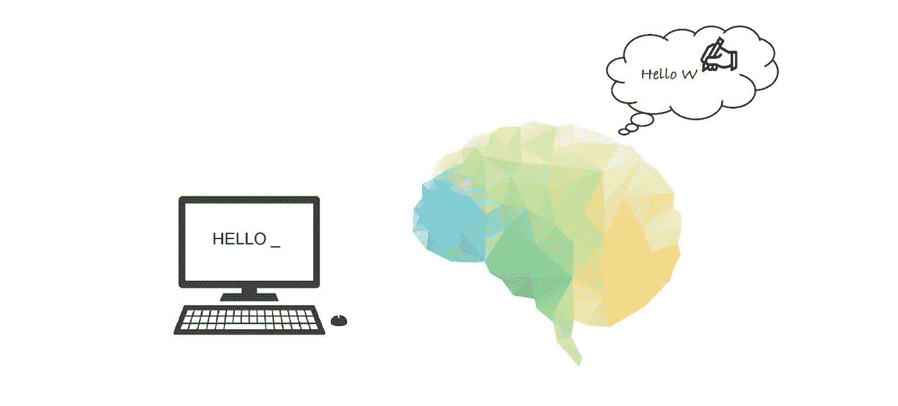
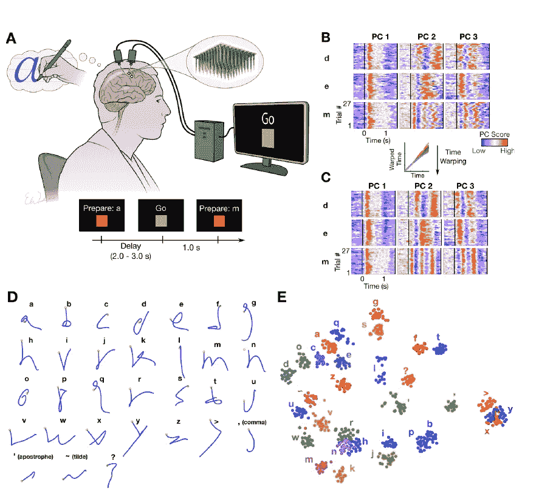
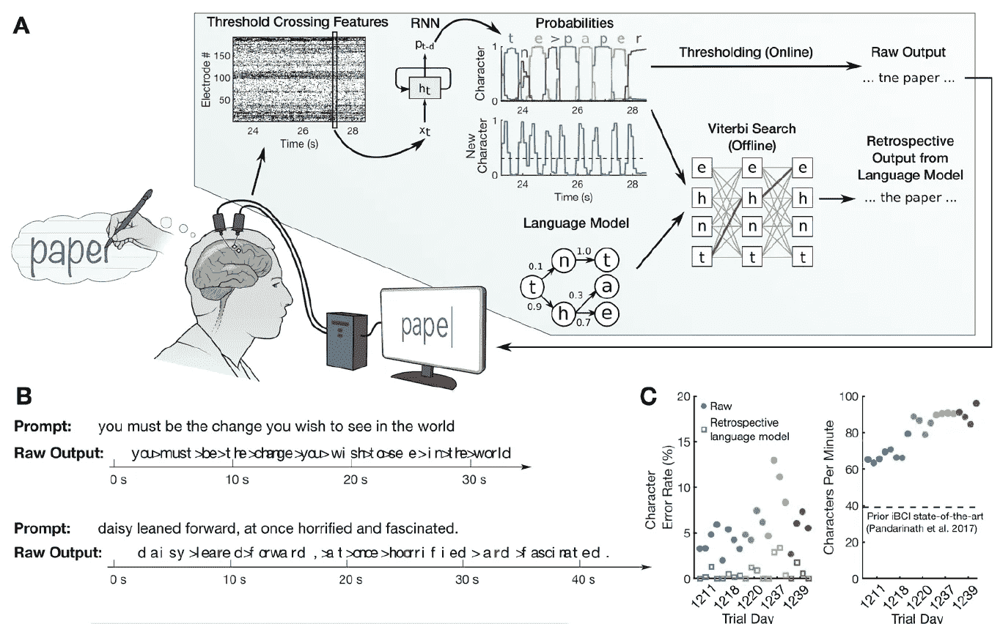

# 脑机接口将想象的笔迹解码成实时文本

> 原文：<https://towardsdatascience.com/brain-computer-interface-to-decode-imagined-handwriting-into-real-time-text-e13014186c01?source=collection_archive---------20----------------------->

## 你想知道 BCI 如何利用深度学习恢复失去行动或说话能力的人的交流吗？

通过手写进行大脑到文本的交流——作者根据[1]提供的照片

我们已经看到许多领域，如自然语言处理、计算机视觉、预测性维护、推荐系统，正在以这样或那样的方式通过深度学习进行革命。本文将讨论最近的研究，这些研究显示了深度学习在脑机接口(BCIs) 中的**潜力。BCI 不仅仅是我们通常在科幻电影中看到的未来派界面；它可以恢复失去行动或说话能力的人的交流。**

BCI 研究的主要焦点是恢复粗大运动技能，如伸手、抓握或用 2D 电脑光标点击打字[2]。然而，在最近的研究工作中，[1]的作者正在使用递归神经网络(RNN)将想象的手写运动解码为实时文本，以实现更快的通信速率。

利用这种新的大脑皮层内 BCI 解码想象笔迹的方法，研究参与者通过通用自动更正功能，实现了每分钟 90 个字符的**打字速度和 99%的准确率>。尽管该研究参与者患有高度脊髓损伤，颈部以下瘫痪，但他的打字速度与健全的智能手机打字速度相当。**

## 对想象的笔迹进行编码

首先，我们需要确定即使瘫痪多年后，运动皮层的神经活动可能足够强，对 BCI 有用。如果不是这样，那么我们就无法从想象的笔迹中解码出实时文本。因此，作为第一步，我们必须检验我们是否能通过想象笔迹从神经活动中对字符进行分类。

图 1:尝试手写的稳健神经活动编码[1]

如图 1A 所示，受试者按照电脑屏幕上的指示想象手写每个字符，就好像他的手没有瘫痪一样；参与者被要求尝试每个字符 27 次。因此，总共 31 个字符中的每一个都有 27 条轨迹。

图 1B 显示了三个示例字母的神经活动的前 3 个主成分(PCs)。基于图 1B，很明显，神经活动看起来是稳定的和可重复的，但是存在一些时间可变性(可能是由于书写速度)。图 1C 示出了在使用时间校准技术去除时间可变性之后得到的神经活动 PCs。

为了查看神经活动是否编码了笔的运动，作者们试图通过线性解码笔尖速度来重建每个字符。字母形状的可识别重建(图 1D)证实了笔尖速度在神经活动中被稳健地编码。此外，神经活动的 t-SNE 可视化(图 1E)显示，类似书写的字符具有或多或少类似的表示。

最后，使用简单的 k-最近邻分类器，[1]的作者能够以 94.1%的准确度从神经活动中**分类字符。因此，上述所有研究都证明，与笔迹相对应的神经活动足够强，对 BCI 有用。**

## 实时解码想象的笔迹

图 2:试图实时手写的神经解码[1]

现在令人兴奋的部分来了，使瘫痪的人能够通过想象手写他们想要的信息来交流。[1]的作者训练了一个 RNN，将神经活动转换成描述字符在每个时刻被书写的可能性的概率。RNN 还预测了任何新角色开始的可能性。RNN 的神经活动输入在时间上被分箱(20 毫秒箱)并且在每个电极处被平滑。如图 2A 所示，预测的概率既可以简单地设定阈值，也可以用自动更正功能广泛地处理。

为了收集 RNN 的训练数据，作者记录了参与者按照计算机显示器的指示想象完整手写句子时的神经活动。使用三天内收集的 242 个句子来训练初始模型。为了克服以下挑战，作者在自动语音识别中采用了深度学习方法[3–5]。

*   训练数据中每个字母的确切时间是未知的，这使得很难应用监督学习技术。
*   与典型的 RNN 数据集相比，该数据集的大小有限，因此很难防止过度拟合。

RNN 的表现在五天内进行评估，每天包含 7-10 个句子(不用于培训)。在解码器评估的每一天之后，当天的数据被累积添加到第二天的训练数据集中。图 2B 显示了两个示例评估轨迹，展示了 RNN 解码句子的能力(错误用红色突出显示，空格用“>”表示)。在图 2C 中显示了五天的错误率和打字速度。有了自动更正后处理，错误率大大降低了。[1]的作者还通过允许研究参与者回答开放式问题，在一个不太受限制的环境中评估了模型的性能。

用 2D 电脑光标点击打字(每分钟 40 个字符)[2]是脑皮质内 BCI 表现最好的方法。然而,[1]的作者已经表明，手写运动的解码速度可以快两倍以上，准确性水平相当。性能更好的原因是因为点对点可能比手写字母更难区分。

有趣的是看到**时变的复杂运动模式，如手写字母，从根本上比简单的点对点运动**更容易解码。看到自动语音识别深度学习方法[3–5]如何适用于这个 BCI 用例也非常鼓舞人心。

我希望这篇文章内容丰富，发人深省。谢谢:)

## 参考

[1] Francis R. Willett、Donald T. Avansino、Leigh R. Hochberg、Jaimie M. Henderson 和 Krishna V. Shenoy，[通过手写进行高性能的大脑到文本的通信](https://www.nature.com/articles/s41586-021-03506-2) (2021)

[2] Chethan Pandarinath，Paul Nuyujukian，Christine H Blabe 等人，[瘫痪患者使用皮质内脑机接口进行高性能通信](https://elifesciences.org/articles/18554) (2017)

[3] Geoffrey Hinton 等人，[用于语音识别中声学建模的深度神经网络:四个研究小组的共同观点](https://ieeexplore.ieee.org/document/6296526) (2012)

[4] Graves A .、Mohamed A .、Hinton G .，[深度递归神经网络语音识别](https://arxiv.org/abs/1303.5778) (2013)

[5]熊伟等，[微软 2017 对话式语音识别系统](https://arxiv.org/abs/1708.06073) (2017)