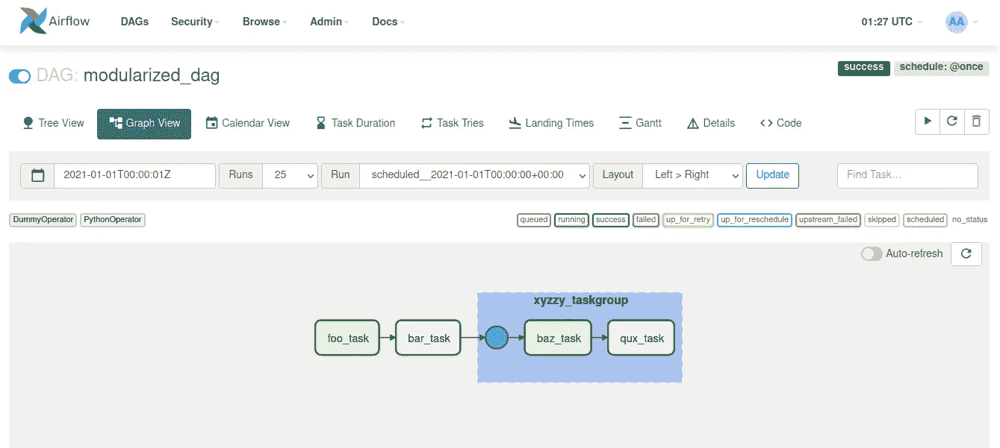
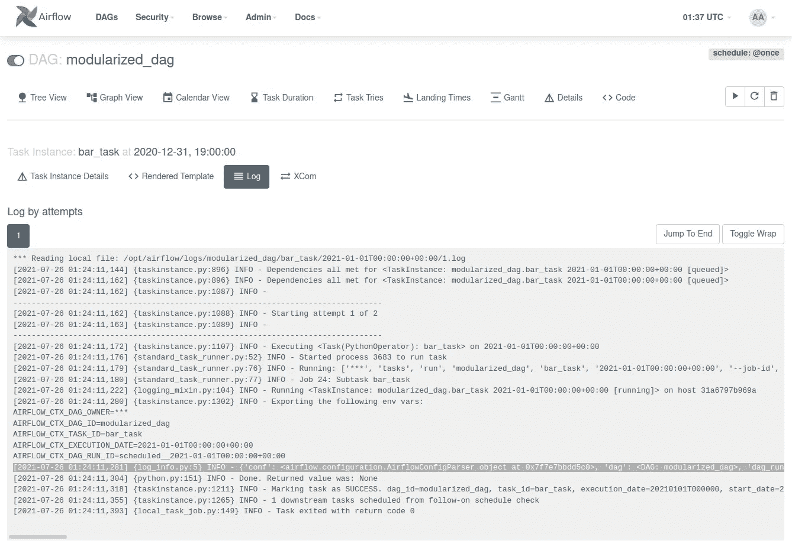
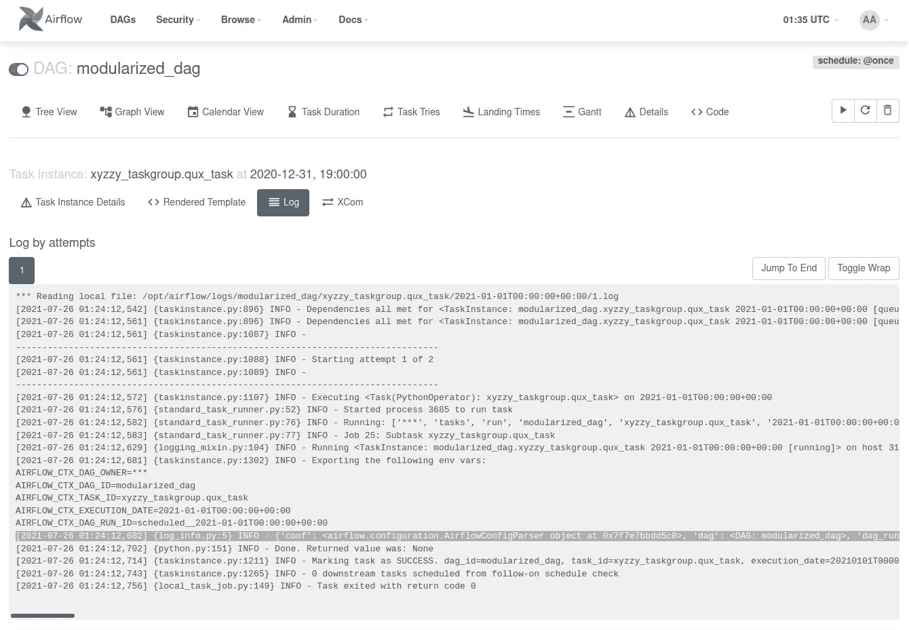

# 将一个大的气流 DAG 分解成多个文件

> 原文：<https://towardsdatascience.com/break-up-a-big-airflow-dag-into-multiple-files-5262accf6713?source=collection_archive---------6----------------------->

## 模块化你的大气流 DAG 的大块，以便于使用和维护


丹尼尔·林肯在 [Unsplash](https://unsplash.com?utm_source=medium&utm_medium=referral) 上的照片

我正在处理一个长达数百行的气流 DAG 文件。进行更改需要在文件中来回移动，在便笺簿上做笔记以确保一切正确。一旦我开始在 IDE 中打开 DAG 文件的多个视图，我知道这是一个停下来并找到一种方法将 DAG 分成更小的片段的好时机。

随着 Airflow 2 中 [TaskGroups](https://airflow.apache.org/docs/apache-airflow/stable/concepts/dags.html?highlight=taskgroup#taskgroups) 的出现，将一个大 DAG 分成几个部分在概念上和实践上都更容易了。这些部分可以重用，当然，它们更容易更新和维护。

TaskGroups 只是相关任务的 UI 分组，但是分组往往是逻辑的。任务组中的任务可以被捆绑和抽象，以便更容易地从比单个任务更大的单元构建 DAG。也就是说，任务组并不是将任务分组并将其移出 DAG 文件的唯一方式。你也可以有一个不在任务组中的逻辑任务块。后一种方法的缺点是，您失去了在 DAG 运行的 web UI 图形视图中将任务折叠到单个节点中的好处。

分解 DAG 的技巧是将 DAG 放在一个文件中，例如`modularized_dag.py`，将任务或任务组的逻辑块放在单独的文件中，每个文件一个逻辑任务块或任务组。每个文件都包含函数，每个函数都返回一个 operator 实例或一个 TaskGroup 实例。

为了快速说明，下面的`modularized_dag.py`从`foo_bar_tasks.py`引入了返回操作符的函数，从`xyzzy_taskgroup.py`引入了返回任务组的函数。在 DAG 上下文中，调用这些函数时将 DAG 对象`dag`作为参数传递，它们的返回值被分配给 task 或 TaskGroup 变量，这些变量可以被分配上下游依赖关系。

# 实运算符的简单示例

现在举一个真实的例子。让我们使用虚拟操作符和 Python 操作符来创建任务。

首先是 DAG 文件:`dags/modularized_dag.py`。它只是从`plugins/includes/foo_bar_tasks.py`导入分块任务函数，从`plugins/includes/xyzzy_taskgroup.py`导入任务组函数。它将使用 DAG 上下文创建的 DAG 传递给每个函数。

`dags/modularized_dag.py`:

```
from datetime import datetime, timedeltafrom airflow import DAG
from includes.foo_bar_tasks import build_foo_task, build_bar_task
from includes.xyzzy_taskgroup import build_xyzzy_taskgroup default_args = {
    'owner': 'airflow',
    'depends_on_past': False,
    'email_on_retry': False,
    'retries': 1,
    'retry_delay': timedelta(minutes=5),
}with DAG(
    dag_id="modularized_dag",
    schedule_interval="[@once](http://twitter.com/once)",
    start_date=datetime(2021, 1, 1),
    default_args=default_args,
) as dag: # logical chunk of tasks
    foo_task = build_foo_task(dag=dag)
    bar_task = build_bar_task(dag=dag) # taskgroup
    xyzzy_taskgroup = build_xyzzy_taskgroup(dag=dag) foo_task >> bar_task >> xyzzy_taskgroup
```

接下来是`plugins/includes/foo_bar_tasks.py`中逻辑分块的任务功能。我们的逻辑块中有几个函数，`build_foo_task`和`build_bar_task`。第一个返回伪运算符，第二个返回 Python 运算符。Python 操作符使用一个简单的导入日志记录函数`log_info`，它在下面的`plugins/includes/log_info.py`中定义。

`plugins/includes/foo_bar_tasks.py`:

```
from airflow import DAG
from airflow.operators.dummy import DummyOperator
from airflow.operators.python import PythonOperatorfrom includes.log_info import log_info def build_foo_task(dag: DAG) -> DummyOperator:
    foo_task = DummyOperator(task_id="foo_task", dag=dag) return foo_task def build_bar_task(dag: DAG) -> PythonOperator:
    bar_task = PythonOperator(
        task_id="bar_task",
        python_callable=log_info,
        dag=dag,
    ) return bar_task
```

在逻辑块任务函数之后，我们在`plugins/includes/xyzzy_taskgroup.py`中有一个 TaskGroup 函数。这个任务组包括一对任务，`baz_task`用伪操作符实现，而`qux_task`用 Python 操作符实现。像上面的 chunked tasks 文件一样，这个文件也导入了日志功能`log_info`。

`plugins/includes/xyzzy_taskgroup.py`:

```
from airflow import DAG
from airflow.operators.dummy import DummyOperator
from airflow.operators.python import PythonOperator
from airflow.utils.task_group import TaskGroupfrom includes.log_info import log_info def build_xyzzy_taskgroup(dag: DAG) -> TaskGroup:
    xyzzy_taskgroup = TaskGroup(group_id="xyzzy_taskgroup") baz_task = DummyOperator(
        task_id="baz_task",
        task_group=xyzzy_taskgroup,
        dag=dag,
    ) qux_task = PythonOperator(
        task_id="qux_task",
        task_group=xyzzy_taskgroup,
        python_callable=log_info,
        dag=dag,
    ) baz_task >> qux_task return xyzzy_taskgroup
```

最后，这里是由`foo_bar_tasks.py`和`xyzzy_taskgroup.py`导入的简单日志功能。

`plugins/includes/log_info.py`:

```
import logging def log_info(**kwargs):
    logging.info(kwargs)
```

一旦所有这些文件都准备好了，您就可以使用您的 Airflow web UI 来解包 DAG 并确保它正常工作。下面是`modularized_dag.py`的图形视图:



模块化的 DAG 非常好用！(作者供图)

我们可以检查 Python 操作符任务的日志(第一个来自逻辑分块的任务，第二个来自 xyzzy_taskgroup 内部):

`bar_task`用`log_info`功能输出高亮灰色:



从酒吧登录任务(作者提供照片)

`xyzzy_taskgroup.qux_task`用`log_info`功能输出高亮灰色:



xyzzy TaskGroup 中 qux 任务的日志(作者提供图片)

# 概观

我们已经介绍了如何通过将任务组或操作符返回函数放在独立的文件中，将一个大的 DAG 文件分解成模块化的块，现在模块化的 DAG 将从`plugins/includes`目录导入这些文件。使用 TaskGroup-returning 函数的优势在于:( 1)您可以将逻辑任务组抽象成 DAG 中的一个组件，以及(2)task group 中包含的任务将在 DAG 运行的 web UI 图形视图中折叠成单个节点。