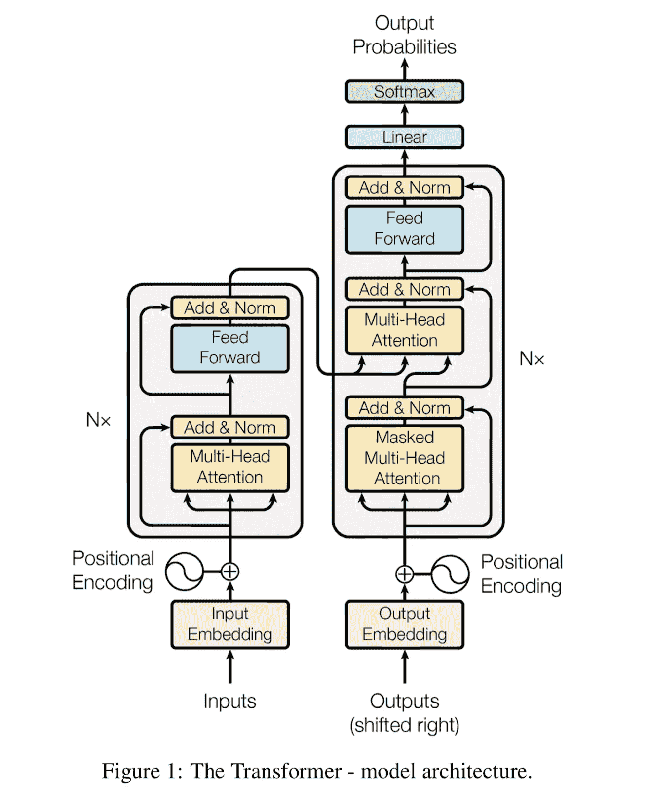
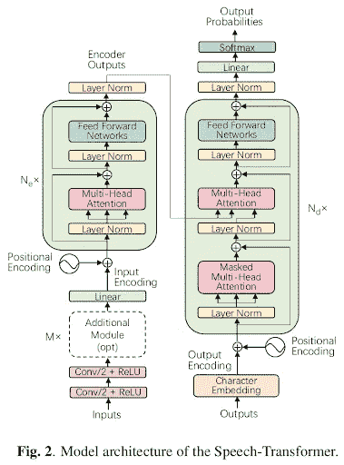
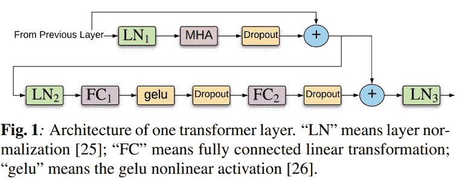
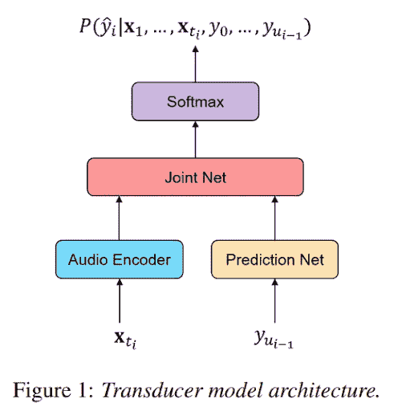
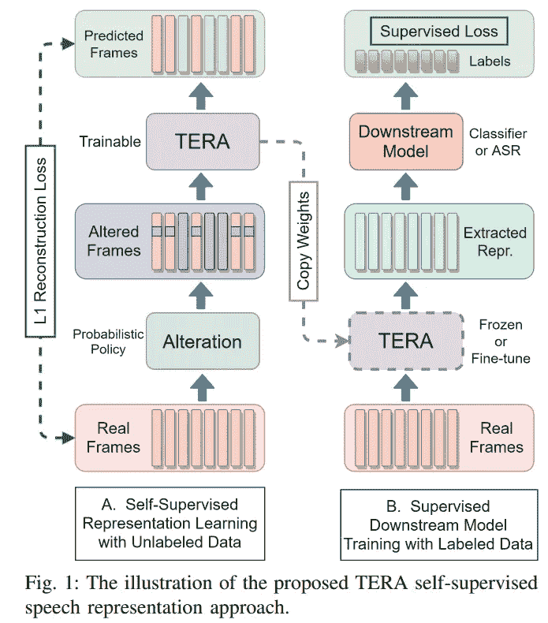
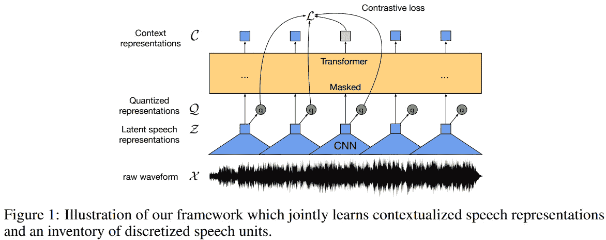
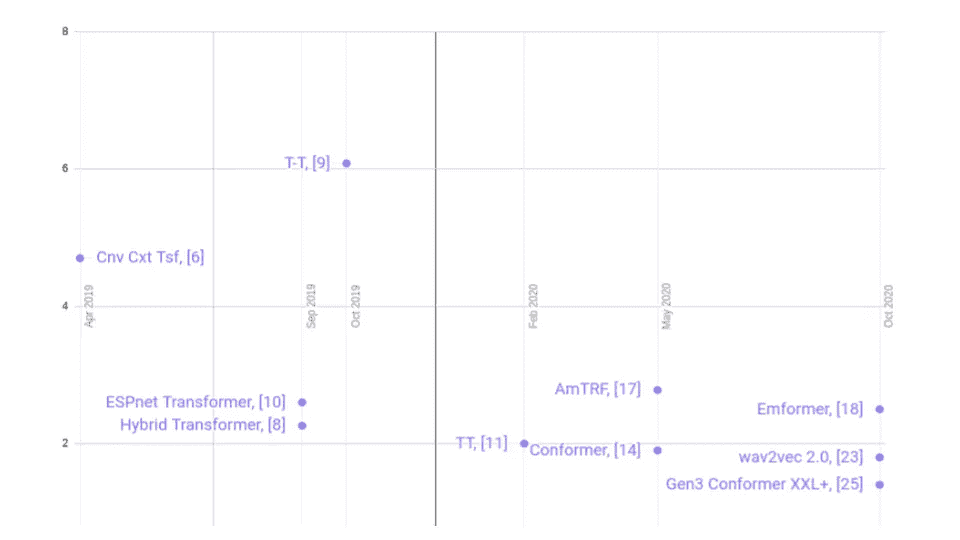
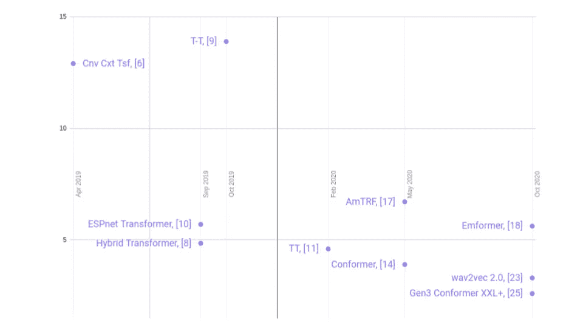

# 使用变压器实现语音识别的突破

> 原文：<https://towardsdatascience.com/breakthroughs-in-speech-recognition-achieved-with-the-use-of-transformers-6aa7c5f8cb02?source=collection_archive---------2----------------------->

## [思想和理论](https://towardsdatascience.com/tagged/thoughts-and-theory)

## 让我们来谈谈由于变形金刚而在语音识别方面出现的关键突破！

作者图片

亲爱的读者。让我们谈论一些不能不激发你的想象力的事情——让我们谈论由于变形金刚而在语音识别方面出现的关键突破。

本文概述了在语音识别中使用基于 Transformer 的体系结构时使用的主要技巧。每一个特别激动人心的想法都用粗体突出显示。在这个过程中，将会有许多链接允许您更详细地解析所描述的技术的细节。在本文的最后，您会发现基于 Transformer 的语音识别模型的基准。

**略谈语音识别**

开发人员使用语音识别为各种产品创建用户体验。智能语音人工智能助手、呼叫中心代理增强和对话式语音人工智能只是最常见的几种用途。像 Gartner 这样的分析师预计，语音到文本(STT)的使用在未来十年只会增加。

语音识别(语音到文本，STT)的任务看似简单——将语音信号转换成文本数据。

解决这个问题的方法有很多，新的突破性技术也在不断涌现。迄今为止，最成功的方法可以分为混合和端到端解决方案。

在**STT**的混合方法中，识别系统由几个组件组成，通常是声学机器学习模型、发音 ML 模型和语言 ML 模型。单独组件的训练是独立执行的，并且为推断构建解码图，在解码图中执行对最佳转录的搜索。

**端到端方法**是一个系统，其所有部分一起训练。在推理中，这样的系统通常会立即返回文本。端到端方法根据学习标准和架构类型进行分类。

有趣的是，基于变压器的解决方案不仅在混合系统和端到端系统中都有应用，而且比许多其他现代解决方案都要好！

**一点关于变形金刚**

Transformer 架构出现在 2017 年的[后续论文](https://arxiv.org/abs/1706.03762)【1】中，解决机器翻译的问题。有很棒的论文详细解释了这种架构是如何工作的——看看这两篇( [1](http://jalammar.github.io/illustrated-transformer/) )。 [2](http://peterbloem.nl/blog/transformers) 。

作者图片

后来，NLP 有了很大的发展，变压器架构得到了发展，需要解决的任务范围增加了，基于变压器的解决方案的结果越来越少。

在接管 NLP 之后，transformers 已经被引入其他机器学习领域:语音识别、语音合成和计算机视觉等等。

现在让我们进入正题。

**语音转换器**

语音识别中第一次提到变压器可以追溯到 2018 年，当时一群中国科学家发表了一篇研究论文【2】。

作者图片

架构的变化很小——卷积神经网络(CNN)层是在将特征提交给转换器的输入之前添加的。这使得**减少输入和输出序列**的尺寸差异成为可能(因为音频中的帧数明显高于文本中的标记数)，这对训练有有益的影响。

尽管结果并不令人眼花缭乱，但这项工作证实了变形金刚确实可以成功地用于语音识别！

**首次改进**

2019 年，语音转换器在不同方向有几项关键改进:

*   这篇论文的作者提出了一种将 CTC 损耗集成到语音转换器中的方法。CTC 丢失已经在语音识别中使用了很长时间，并且具有几个优点。

首先，由于允许使用空白字符进行对齐，它允许我们考虑特定音频帧与特定转录字符的对应关系。

其次，这是 Speech-Transformer 的第二个改进，它简化了将语言模型整合到学习过程中的过程。

*   **拒绝正弦位置编码(PE)** 。与长序列相关的问题在语音识别中更为严重。拒绝以不同的方式发生——在一些论文中，从绝对位置编码过渡到相对 PE(如在论文 [4】之后的[中所见)，在其他论文中——通过用池层替换 PE(如在论文](https://arxiv.org/abs/1911.00203) [5】之后的[中所见)，在第三篇论文中——用可训练卷积层替换位置编码(如在论文](https://arxiv.org/abs/1910.07204) [6]之后的[中所见)。后来的工作证实了其他技术对抗 sidusion PE 的优越性。](https://arxiv.org/abs/1904.11660)
*   变压器首次适应**流识别**。这两篇论文的作者[ [5](https://arxiv.org/abs/1910.07204) ]和[ [7](https://arxiv.org/abs/1910.11871) ]分两个阶段完成了这项工作——首先，他们调整了编码器，使其能够以块为单位接收输入信息并保留全局上下文，然后使用[单调分块注意力](https://arxiv.org/abs/1712.05382) (MoChA)技术进行在线解码。
*   **仅使用变压器的编码器模块**。对于某些系统(例如，混合方法或基于传感器的解决方案)，要求我们的声学模型完全像编码器一样工作。这项技术使得在[混合系统](https://arxiv.org/abs/1910.09799)【8】和[传感器识别系统](https://arxiv.org/abs/1910.12977)【9】中使用变压器成为可能。

在 2019 年 10 月，在一篇[研究论文](https://arxiv.org/abs/1909.06317)(【10】)中，对基于 ESPNet 框架的变压器与其他方法进行了广泛的比较，这证实了基于变压器的模型的识别质量。在 15 项任务中的 13 项中，基于 transformer 的体系结构比循环系统要好。

**使用变形金刚的混合语音识别**

在 2019 年末-2020 年初，变形金刚在混合语音识别方面取得了 SOTA 成果(如[ [8](https://arxiv.org/abs/1910.09799) ]所示)。

如前所述，混合方法的一个组成部分是声学模型，它现在使用神经网络。本文中的声学模型由几层变换器编码器组成。一个这样的层的示意图如图 3 所示。

作者图片

在这项工作中最有趣的事情，我想强调的是，作者再次证明了**可训练** **卷积(即，类 VGG)嵌入**相比正弦 PE 的优势。他们还使用**迭代损失**来提高训练深度变形金刚时的收敛性。深度变形金刚这个话题还会进一步讨论。

**变压器传感器**

更准确地说，两款 Transformer Transducer——一款来自[脸书](https://arxiv.org/abs/1910.12977)【9】，一款来自[谷歌](https://arxiv.org/abs/2002.02562)【11】出现在 2019 年底和 2020 年上半年。形式上，在脸书的工作中，它被称为变压器-传感器(由连字符分隔)。但是这两项工作的本质是相同的— **将变压器集成到 RNN 传感器架构中**。

作者图片

集成并不针对整个变压器，而**仅针对编码器**，作为 RNN-T 框架中的音频编码器。在这篇[论文](https://arxiv.org/abs/2002.02562)【11】中，预测器网络也是基于变压器的，但是层数更少——在推理过程中经常需要调用该组件，不需要更复杂的架构。

与 CTC 损失不同，RNN-T 损失允许您不仅考虑基于输入序列的概率，还考虑基于预测标签的概率。此外，transformer 传感器架构的一个优点是，这种方法更容易适应流识别，因为只使用了 Transformer 的编码器部分。

2020 年夏天，另一篇[论文](https://arxiv.org/abs/2008.05750)【12】发表，命名为 conv-变压器换能器，其中音频编码器由三个块组成，每个块包含卷积层，然后是变压器层。今年秋天，在[ [13](https://arxiv.org/abs/2010.03192) ](这是[ [11](https://arxiv.org/abs/2002.02562) ]的延续)中，作者提出了**可变上下文层**技术，该技术允许训练一个能够使用未来上下文的可变大小的模型，在推理阶段提供折衷的延迟/质量。

**本地&全球背景**

基于变压器的架构的优势之一是其高效率，同时考虑到了全球背景。在音频信号中，本地连接比全球连接起着更大的作用。2020 年夏天，发表了几部作品，引起人们对这些方面的关注，并再次将基于变压器的模型引入差距:

*   [ [14](https://arxiv.org/abs/2005.08100) 的作者提出通过在多头注意力(MHA)模块后添加**卷积模块来改变变压器模块的架构。卷积更擅长考虑局部信息，而变压器模型擅长提取全局信息。作者将最终模型命名为 **Conformer** 。同样，受[马卡龙网](https://arxiv.org/pdf/1906.02762.pdf)的启发，作者使用了**半步前馈网络**。**
*   论文 [15](https://arxiv.org/abs/2005.09137) 介绍了**弱注意抑制**技术；建议使用稀疏注意力，动态地将小于某个阈值的权重置零，以便我们使模型在整个上下文中分散较少的注意力，并且更多地关注有意义的帧。

**可流式传输的变形金刚**

如上所述，换能器方法允许系统用于流式语音识别，即，当音频实时进入系统时，处理立即发生，并且系统一准备好就返回响应。流识别是语音对话人工智能任务的先决条件。

然而，对于要进行流式传输的系统，transformer 模型本身必须能够顺序处理音频。在最初的转换器中，注意力机制查看整个输入序列。

语音识别中有以下流数据处理技术，用于基于转换器的解决方案:

*   **有时间限制的自我关注**被使用，例如在下面的[论文](https://arxiv.org/abs/2002.02562)【11】。每个变压器层都有一个有限的前瞻性上下文。这种方法的缺点是，随着层数量的增加，随着展望未来的一般环境的增加，延迟也会增加。
*   **分块处理** —思路见 [5](https://arxiv.org/abs/1910.07204) 、 [16](https://arxiv.org/abs/1912.02958) 、 [17](https://arxiv.org/abs/2005.08042) 。想法是将片段/块/组块作为输入提供给转换器。这种方法的缺点是上下文仅限于片段。为了不丢失全局上下文，可以将其作为**单独嵌入**进行传输，如[ [5](https://arxiv.org/abs/1910.07204) ]所示，或者使用具有**循环连接**的架构，其中来自先前片段的嵌入被传输到当前片段，如[ [16](https://arxiv.org/abs/1912.02958) ]所示，或者使用来自存储在存储体中的所有先前处理的片段的信息。这种方法被称为**增强记忆**，在 [17](https://arxiv.org/abs/2005.08042) 中提出。

**电磁变压器**

在接下来的研究[论文](https://arxiv.org/abs/2010.10759v3)【18】中，提出了一种适用于流识别的模型，包括混合设置和传感器系统。

Emformer 继续发展[ [17](https://arxiv.org/abs/2005.08042) ]中的观点。像它的前身一样，Emformer 使用增强内存。执行计算优化、计算缓存，不从当前层使用内存库，而是从先前的转换器层使用，并且添加了 GPU 并行化。

因此，有可能实现系统训练的显著加速和推理时间的减少。此外，由于更少的无用计算，该模型收敛得更好。

**无监督语音表示学习**

变形金刚成功应用的另一个领域是基于未标记数据构建高级音频表示，在此基础上，即使简单的模型也会产生良好的结果。

在这里我要特别说明一批作品——[mock injay](https://arxiv.org/abs/1910.12638)【19】[Speech-XLNet](https://arxiv.org/abs/1910.10387)【20】[Audio ALBERT](https://arxiv.org/abs/2005.08575)【21】[TERA](https://arxiv.org/abs/2007.06028)【22】[wav2 vec 2.0](https://arxiv.org/abs/2006.11477)【23】。

构建这种视图的一个想法是破坏频谱图(通过沿时间轴屏蔽它，如在 Mockingjay 和 Audio ALBERT 中，或者沿时间轴和频率轴屏蔽它，如在 TERA 中，或者打乱一些帧，如在 Speech-XLNet 中)，并训练模型来恢复它。那么这种模型的潜在表示可以被用作高级表示。这里的转换器充当一个模型，或者更确切地说，它的编码器加上之前和之后的附加模块。

作者图片

生成的视图可用于下游任务。此外，模型的权重可以被冻结或留给下游任务进行微调。

另一个想法是在 wav2vec 2.0 中实现的。是[VQ-wav2 vec](https://arxiv.org/abs/1910.05453)【24】的延续。

首先，使用卷积神经网络层从音频信号构建潜在表示。潜在表示被馈送到变换器的输入，并且也用于构造离散表示。变压器入口处的一些帧被屏蔽。transformer 模型被训练成通过对比损失来预测类似离散的授权。与 vq-wav2vec 不同，离散和潜在表征的学习现在一起发生(端到端)。

作者图片

在[ [25](https://arxiv.org/abs/2010.10504) ]中，作者将 wav2vec 预训练的思想与 Conformer 架构结合使用。作者使用 LibriLight 数据进行预训练，并在撰写本文时获得了 LibriSpeech 语料库上的 SOTA。

**大规模设置**

大多数科学出版物都考虑在小型的大约 1000 小时的案例上训练的模型的结果，例如 LibriSpeech。

然而，像[ [26](https://arxiv.org/abs/2005.09684) ]和[ [27](https://arxiv.org/abs/2010.14665) ]这样的研究表明，基于变压器的模型即使在大量数据上也显示出优势。

**结论**

本文研究了在语音识别中使用基于转换器的模型时遇到的技术。

当然，这里并没有体现语音识别领域所有与变形金刚相关的论文(STT 与变形金刚相关的作品数量呈指数级增长！)，但我努力为你收集了最有趣的想法。

最后—基于 LibriSpeech 变压器的模型案例的 WER 图:

作者图片

作者图片

**参考文献**

1.  A.瓦斯瓦尼等人，2017，“注意力是你所需要的一切”，[https://arxiv.org/abs/1706.03762](https://arxiv.org/abs/1706.03762)
2.  长度董等，2018“语音转换器:无递归序列到序列的语音识别模型”，[，](https://ieeexplore.ieee.org/document/8462506)
3.  南 Karita 等人，2019，“利用连接主义时间分类和语言模型集成改进基于 Transformer 的端到端语音识别”，[https://pdfs . semantic scholar . org/FFE 1/416 BCF de 82 f 567 DD 280975 bebccfeb 4892298 . pdf](https://pdfs.semanticscholar.org/ffe1/416bcfde82f567dd280975bebcfeb4892298.pdf)
4.  页（page 的缩写）周看了看周虎。，2019，“利用并行调度采样和相对位置嵌入提高语音识别的变换器泛化能力”，[https://arxiv.org/abs/1911.00203](https://arxiv.org/abs/1911.00203)
5.  E.Tsunoo 等人，2019，“带上下文块处理的变压器 ASR”，[https://arxiv.org/abs/1910.07204](https://arxiv.org/abs/1910.07204)
6.  A.Mohamed 等人，2019，“用于自动语音识别的卷积上下文的变压器”，[https://arxiv.org/abs/1904.11660](https://arxiv.org/abs/1904.11660)
7.  E.Tsunoo 等，2019，“走向在线端到端的变压器自动语音识别”，[https://arxiv.org/abs/1910.11871](https://arxiv.org/abs/1910.11871)
8.  Y.王等，2019，“基于变换器的混合语音识别声学建模”，
9.  C.叶等，2019，“变压器-换能器:带自我注意的端到端语音识别”，[https://arxiv.org/abs/1910.12977](https://arxiv.org/abs/1910.12977)
10.  南 Karita 等人，2019，“Transformer vs RNN 在语音应用中的对比研究”，【https://arxiv.org/abs/1909.06317 
11.  张等，2020，“变压器换能器:一种具有变压器编码器和 T 损失的流式语音识别模型”，【https://arxiv.org/abs/2002.02562】
12.  W.黄等，2020，《变压器换能器:低延迟、低帧率、可流式传输的端到端语音识别》，[、](https://arxiv.org/abs/2008.05750)
13.  A.Tripathi 等人，2020，“Transformer Transducer:一种统一流式和非流式语音识别的模型”，[https://arxiv.org/abs/2010.03192](https://arxiv.org/abs/2010.03192)
14.  A.Gulati 等人，2020，“Conformer:用于语音识别的卷积增强变换器”，[https://arxiv.org/abs/2005.08100](https://arxiv.org/abs/2005.08100)
15.  Y.史等，2020，“基于变压器的弱注意抑制语音识别”，
16.  Z.田等，2020，“用于端到端语音识别的同步变压器”，[，](https://arxiv.org/abs/1912.02958)
17.  C.吴等，2020，“基于流式传输器的具有增强记忆的自注意声学模型”，[，](https://arxiv.org/abs/2005.08042)
18.  Y.史等，2020，“Emformer:基于高效记忆变换器的低延迟流式语音识别声学模型”，
19.  A.T.Liu 等人，2019，“Mockingjay:深度双向变换编码器的无监督语音表示学习”，[https://arxiv.org/abs/1910.12638](https://arxiv.org/abs/1910.12638)
20.  X.宋等，2020，“Speech-XLNet:自注意网络的无监督声学模型预训练”，
21.  页（page 的缩写）迟等，2020，“音频阿尔伯特:一个用于音频表征的自我监督学习的 Lite BERT”，[，](https://arxiv.org/abs/2005.08575)
22.  A.T.Liu 等，2020，《:语音的变换编码器表示的自监督学习》，【https://arxiv.org/abs/2007.06028】
23.  A.巴耶夫斯基等人，2020，“wav2vec 2.0:语音表征的自我监督学习框架”，【https://arxiv.org/abs/2006.11477】T4
24.  A.巴耶夫斯基等人，2020“VQ-wav2 vec:离散语音表示的自我监督学习”，[https://arxiv.org/abs/1910.05453](https://arxiv.org/abs/1910.05453)
25.  Y.张等，2020，“拓展半监督学习在自动语音识别中的应用”，
26.  长度陆等，2020，“面向大规模语音识别的变形金刚探索”，
27.  Y.王等，2020，“变压器在行动:基于变压器的声学模型在大规模语音识别应用中的比较研究”，