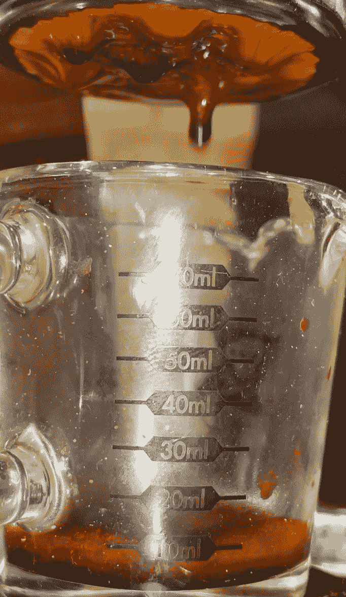
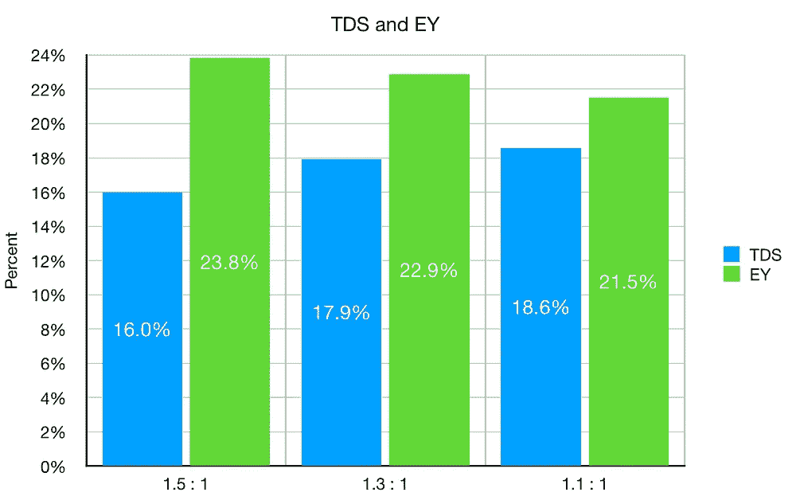

# 浓缩咖啡的冲泡比

> 原文：<https://towardsdatascience.com/brew-ratio-for-espresso-174441e1315b?source=collection_archive---------20----------------------->

## 咖啡数据科学

## 探索投入产出比

浓咖啡的酿造比例有很大的变化范围，在味道的口感和拍摄的强度上有巨大的图像。许多人坚持 2:1(输出对输入)拍摄，最近，3:1 甚至 5:1 比例的长时间慢速拍摄的想法已经普及。我个人比较喜欢 1:1 到 1.4 之间的拍摄比例。

所有图片由作者提供

对于这个简短的测试，我想展示拍摄比例的差异，并讨论对口味的影响。我认为这个变量比其他浓缩咖啡变量更个人化，因为它对口感有影响。我会具体看比率 1.5，1.3，1.1。

**鸣谢**:很多人将 brew 比率写成输入输出，但我更喜欢另一种方式，因为我更喜欢在比率冒号的左边写一个较大的比率数字。

# 照片中的镜头

为了拍摄这些照片，我使用了韩国研磨机、Kim Express 机器、VST 篮子、Pyxis 秤和自制分配器。每一次注射都是间断的，预注射时间比正常时间长(至少 30 秒)，我在注射过程中使用了压力脉冲。三个镜头只是冲泡比例不同。

我考虑制作一份意大利香肠，这样我就可以品尝到完全相同的味道，但与使用三份独立的、每份之间间隔很长时间的香肠相比，它对最初的味道、口感和回味有很大的影响，可能会被混淆。在这方面，我没有吃任何东西或喝任何东西之前，这些镜头，他们都被拉了几个小时。

在拍摄过程中的几个不同时间，每列都是不同的酿造比:

1.5 : 1 …………… 1.3 : 1 ……………… 1.1 : 1

所有三个镜头有相似的提取，这是一个很好的健全检查。他们在同一时间间隔看起来也很相似。

# 绩效指标

我使用两个指标来评估技术之间的差异:最终得分和咖啡萃取。

[**最终得分**](https://towardsdatascience.com/@rmckeon/coffee-data-sheet-d95fd241e7f6) 是记分卡 7 个指标(尖锐、浓郁、糖浆、甜味、酸味、苦味和回味)的平均值。当然，这些分数是主观的，但它们符合我的口味，帮助我提高了我的拍摄水平。分数有一些变化。我的目标是保持每个指标的一致性，但有时粒度很难确定。

**用折射仪测量总溶解固体量(TDS)，这个数字结合咖啡的输出重量和输入重量用于确定提取到杯中的咖啡的百分比，称为**提取率(EY)** 。**

# **表演**

**短距离射击味道更好。这对我来说并不奇怪，因为在 1:1 的拍摄之后，已经没有什么可提取的了。随着 TDS 的增加，口感真的改善了。太短的镜头可能会变得太酸，但我没有发现这个问题，特别是这个烤。**

********

**镜头比率**

**对于 1.5:1 的注射，预输注时间要长几秒钟，但总的来说，时间非常相似。**

****

**TCF 是时候盖上过滤器了**

**有时候我们被某个参数束缚住了，以至于很难去实验。测试比例的最佳方法是制作一份意大利香肠(使用多个杯子)，这样你就可以品尝提取物的不同部分，并将它们混合在一起。**

**我的目的不是告诉每个人拉一个特定的投篮比例(在这种情况下，一个较低的投篮比例)，而是，我的目的是鼓励实验。**

**如果你愿意，可以在 Twitter 和 YouTube 上关注我，我会在那里发布不同机器上的浓缩咖啡视频和浓缩咖啡相关的东西。你也可以在 [LinkedIn](https://www.linkedin.com/in/robert-mckeon-aloe-01581595?source=post_page---------------------------) 上找到我。也可以关注我[中](https://towardsdatascience.com/@rmckeon/follow)和[订阅](https://rmckeon.medium.com/subscribe)。**

# **[我的进一步阅读](https://rmckeon.medium.com/story-collection-splash-page-e15025710347):**

**[浓缩咖啡系列文章](https://rmckeon.medium.com/a-collection-of-espresso-articles-de8a3abf9917?postPublishedType=repub)**

**[工作和学校故事集](https://rmckeon.medium.com/a-collection-of-work-and-school-stories-6b7ca5a58318?source=your_stories_page-------------------------------------)**

**[个人故事和关注点](https://rmckeon.medium.com/personal-stories-and-concerns-51bd8b3e63e6?source=your_stories_page-------------------------------------)**

**[乐高故事启动页面](https://rmckeon.medium.com/lego-story-splash-page-b91ba4f56bc7?source=your_stories_page-------------------------------------)**

**[摄影飞溅页](https://rmckeon.medium.com/photography-splash-page-fe93297abc06?source=your_stories_page-------------------------------------)**

**[使用图像处理测量咖啡研磨颗粒分布](https://link.medium.com/9Az9gAfWXdb)**

**[改善浓缩咖啡](https://rmckeon.medium.com/improving-espresso-splash-page-576c70e64d0d?source=your_stories_page-------------------------------------)**

**[断奏生活方式概述](https://rmckeon.medium.com/a-summary-of-the-staccato-lifestyle-dd1dc6d4b861?source=your_stories_page-------------------------------------)**

**[测量咖啡研磨分布](https://rmckeon.medium.com/measuring-coffee-grind-distribution-d37a39ffc215?source=your_stories_page-------------------------------------)**

**[咖啡萃取](https://rmckeon.medium.com/coffee-extraction-splash-page-3e568df003ac?source=your_stories_page-------------------------------------)**

**[咖啡烘焙](https://rmckeon.medium.com/coffee-roasting-splash-page-780b0c3242ea?source=your_stories_page-------------------------------------)**

**[咖啡豆](https://rmckeon.medium.com/coffee-beans-splash-page-e52e1993274f?source=your_stories_page-------------------------------------)**

**[浓缩咖啡用纸质过滤器](https://rmckeon.medium.com/paper-filters-for-espresso-splash-page-f55fc553e98?source=your_stories_page-------------------------------------)**

**[浓缩咖啡篮及相关主题](https://rmckeon.medium.com/espresso-baskets-and-related-topics-splash-page-ff10f690a738?source=your_stories_page-------------------------------------)**

**[意式咖啡观点](https://rmckeon.medium.com/espresso-opinions-splash-page-5a89856d74da?source=your_stories_page-------------------------------------)**

**[透明 Portafilter 实验](https://rmckeon.medium.com/transparent-portafilter-experiments-splash-page-8fd3ae3a286d?source=your_stories_page-------------------------------------)**

**[杠杆机维修](https://rmckeon.medium.com/lever-machine-maintenance-splash-page-72c1e3102ff?source=your_stories_page-------------------------------------)**

**[咖啡评论和想法](https://rmckeon.medium.com/coffee-reviews-and-thoughts-splash-page-ca6840eb04f7?source=your_stories_page-------------------------------------)**

**[咖啡实验](https://rmckeon.medium.com/coffee-experiments-splash-page-671a77ba4d42?source=your_stories_page-------------------------------------)**